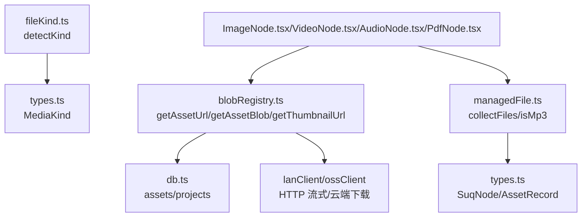
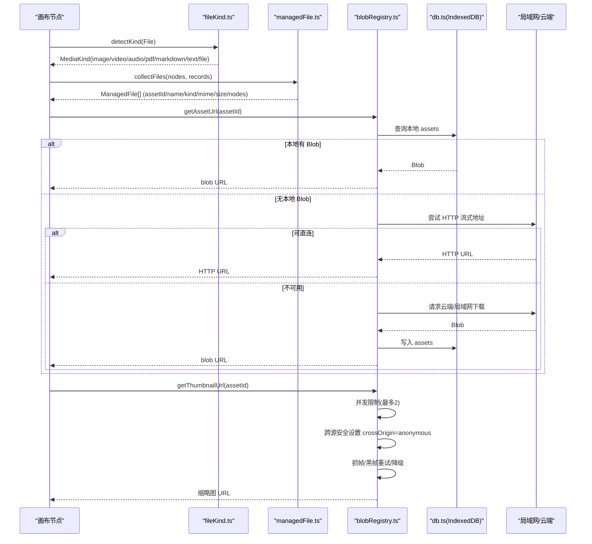
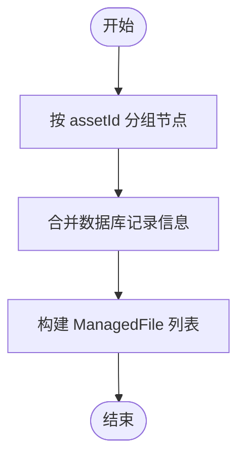
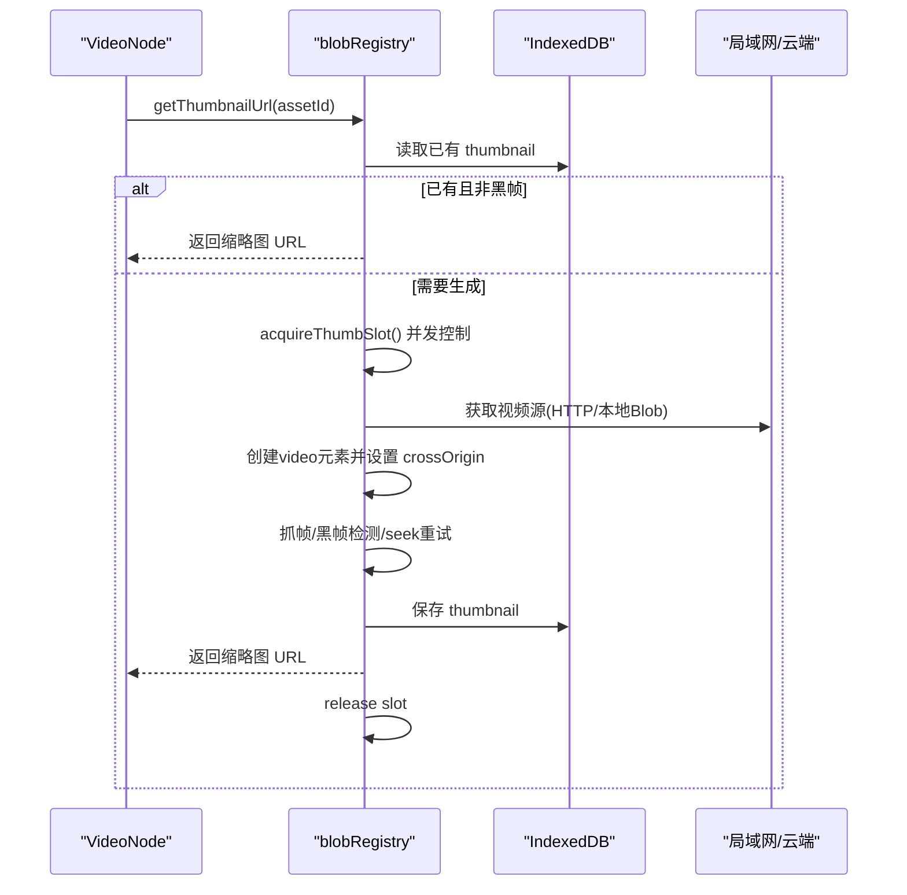
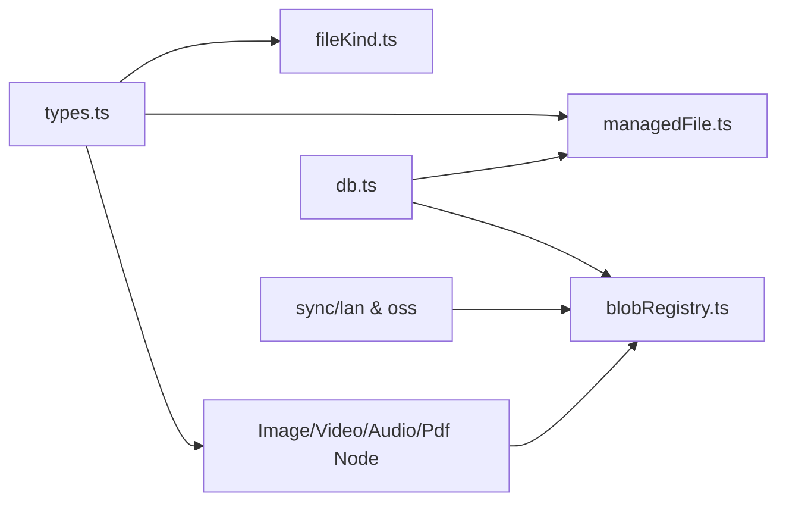

# 文件识别与类型检测

<cite>
**本文引用的文件**
- [fileKind.ts](file://src/media/fileKind.ts)
- [managedFile.ts](file://src/media/managedFile.ts)
- [blobRegistry.ts](file://src/media/blobRegistry.ts)
- [types.ts](file://src/types.ts)
- [db.ts](file://src/db/db.ts)
- [ImageNode.tsx](file://src/canvas/nodes/ImageNode.tsx)
- [VideoNode.tsx](file://src/canvas/nodes/VideoNode.tsx)
- [AudioNode.tsx](file://src/canvas/nodes/AudioNode.tsx)
- [PdfNode.tsx](file://src/canvas/nodes/PdfNode.tsx)
</cite>

## 目录
1. [简介](#简介)
2. [项目结构](#项目结构)
3. [核心组件](#核心组件)
4. [架构总览](#架构总览)
5. [详细组件分析](#详细组件分析)
6. [依赖关系分析](#依赖关系分析)
7. [性能考量](#性能考量)
8. [故障排查指南](#故障排查指南)
9. [结论](#结论)
10. [附录](#附录)

## 简介
本模块负责“文件识别与类型检测”以及“受管文件管理”，为画布中的媒体节点提供统一的资源获取、缩略图生成、生命周期管理与内存释放策略。核心能力包括：
- 基于 MIME 类型、扩展名与内容嗅探的文件类型识别
- 受管文件的聚合、引用计数与内存回收
- 多格式媒体（图片、视频、音频、文档、设计文件）的统一接入与差异化处理
- 高并发下的缩略图抓取与跨源安全策略
- 错误处理与降级机制，保障在局域网/云端/本地多种场景下稳定可用

## 项目结构
围绕文件识别与管理的关键路径如下：
- 类型定义：MediaKind 统一描述文件类别
- 文件识别：detectKind 根据 File 的 type 与 name 推断 MediaKind
- 受管文件：collectFiles 将画布节点与数据库记录聚合为 ManagedFile
- 资源访问：getAssetUrl/getAssetBlob 提供 Blob URL 或 HTTP 流式地址
- 缩略图：getThumbnailUrl 针对视频抓帧并缓存，支持并发控制与降级
- 持久化：IndexedDB 存储资产与项目数据，并提供垃圾回收

图表来源
- [fileKind.ts:3-16](file://src/media/fileKind.ts#L3-L16)
- [managedFile.ts:17-38](file://src/media/managedFile.ts#L17-L38)
- [blobRegistry.ts:84-126](file://src/media/blobRegistry.ts#L84-L126)
- [db.ts:25-33](file://src/db/db.ts#L25-L33)

章节来源
- [fileKind.ts:3-16](file://src/media/fileKind.ts#L3-L16)
- [managedFile.ts:17-38](file://src/media/managedFile.ts#L17-L38)
- [blobRegistry.ts:84-126](file://src/media/blobRegistry.ts#L84-L126)
- [db.ts:25-33](file://src/db/db.ts#L25-L33)

## 核心组件
- 文件类型检测：detectKind 通过 MIME 前缀与扩展名快速分类，优先特殊格式（如 PSD），再按 image/video/audio/text/pdf/markdown 归类，兜底为 file
- 受管文件管理：collectFiles 以 assetId 为键聚合节点，合并数据库记录信息；isMp3 用于音频播放逻辑判断
- 资源与缩略图：blobRegistry 提供 getAssetUrl/getAssetBlob/getThumbnailUrl，实现本地/云端/局域网多源拉取、并发控制、跨源安全与降级
- 类型系统：types.ts 定义 MediaKind 与节点数据结构，贯穿识别、渲染与存储

章节来源
- [fileKind.ts:3-16](file://src/media/fileKind.ts#L3-L16)
- [managedFile.ts:13-38](file://src/media/managedFile.ts#L13-L38)
- [blobRegistry.ts:12-56](file://src/media/blobRegistry.ts#L12-L56)
- [types.ts:3-14](file://src/types.ts#L3-L14)

## 架构总览
下图展示从“文件识别”到“资源获取与渲染”的整体流程，涵盖本地 IndexedDB、局域网 HTTP 流式、云端 OSS 三种来源，以及视频缩略图的并发抓取与降级策略。

图表来源
- [fileKind.ts:3-16](file://src/media/fileKind.ts#L3-L16)
- [managedFile.ts:17-38](file://src/media/managedFile.ts#L17-L38)
- [blobRegistry.ts:84-126](file://src/media/blobRegistry.ts#L84-L126)
- [blobRegistry.ts:128-239](file://src/media/blobRegistry.ts#L128-L239)
- [blobRegistry.ts:310-379](file://src/media/blobRegistry.ts#L310-L379)
- [db.ts:25-33](file://src/db/db.ts#L25-L33)

## 详细组件分析

### 文件类型检测算法（fileKind.ts）
- 输入：浏览器 File 对象
- 策略：
  - 先检查扩展名是否为 psd，若是则直接返回 psd，避免被通用 image/* 误判
  - 使用 MIME 前缀 image/video/audio 进行大类划分
  - 对 pdf、markdown、text 等文本类通过扩展名或 MIME 前缀识别
  - 无法识别时回退为 file
- 复杂度：O(1)，仅字符串操作与比较
- 准确性优化建议：
  - 对未知扩展名增加内容头字节嗅探（如 PDF 魔数、PNG/JPG/GIF/WebP 签名）
  - 对 text/csv/log 等扩展名增加首行采样解析，区分纯文本与二进制
  - 对 image/vnd.adobe.photoshop 等专用 MIME 做白名单匹配
- 错误处理：
  - 当 File.type 为空或扩展名为空时，仍可通过其他线索尽量识别
  - 无法识别时返回 file，由上层决定展示为“其他文件”卡片

章节来源
- [fileKind.ts:3-16](file://src/media/fileKind.ts#L3-L16)
- [fileKind.test.ts:8-16](file://src/media/fileKind.test.ts#L8-L16)

### 受管文件管理机制（managedFile.ts）
- 目标：将画布中多个节点关联的同一资产聚合成一个“受管文件”，便于统一管理与释放
- 关键逻辑：
  - collectFiles：遍历节点，按 assetId 分组，合并数据库记录中的 name/kind/mime/size，保留 nodes 引用
  - isMp3：用于音频播放逻辑，兼容 MIME 与扩展名两种判断
- 生命周期与引用计数：
  - 节点存在即视为引用该资产；删除节点后，若仍有其他节点引用，则不释放
  - 结合 db.gcAssets 的孤立标记与超时清理，实现长期未引用资源的自动回收
- 内存释放策略：
  - 通过 invalidateAllAssetUrls 主动释放 blob URL
  - 配合 revokeAllUrls 批量释放缓存的 URL
  - 视频缩略图抓取完成后及时释放临时 URL

图表来源
- [managedFile.ts:17-38](file://src/media/managedFile.ts#L17-L38)
- [db.ts:48-68](file://src/db/db.ts#L48-L68)

章节来源
- [managedFile.ts:13-38](file://src/media/managedFile.ts#L13-L38)
- [db.ts:48-68](file://src/db/db.ts#L48-L68)

### 资源获取与缩略图（blobRegistry.ts）
- 资源获取：
  - 优先本地 IndexedDB 的 Blob，其次局域网 HTTP 流式地址（边下边播），最后云端/局域网下载并落库
  - 对视频采用 HTTP Range 流式，避免整份下载到本地造成内存压力
- 缩略图抓取：
  - 并发上限 THUMB_MAX_CONCURRENT=2，防止多 video 同时 seek 阻塞连接池
  - 跨源安全：crossOrigin=anonymous，需服务端允许跨域
  - 黑帧检测与重试：平均亮度阈值判定，多次 seek 重试直至非黑帧
  - 降级策略：跨源失败时一次性拉取全量素材，再用同源 blob URL 重新抓帧
- 缓存与释放：
  - urlCache/thumbCache 缓存 URL，invalidate* 系列方法用于失效
  - revokeAllUrls 批量释放所有 blob URL，避免内存泄漏

图表来源
- [blobRegistry.ts:128-239](file://src/media/blobRegistry.ts#L128-L239)
- [blobRegistry.ts:310-379](file://src/media/blobRegistry.ts#L310-L379)
- [blobRegistry.ts:25-39](file://src/media/blobRegistry.ts#L25-L39)

章节来源
- [blobRegistry.ts:84-126](file://src/media/blobRegistry.ts#L84-L126)
- [blobRegistry.ts:128-239](file://src/media/blobRegistry.ts#L128-L239)
- [blobRegistry.ts:310-379](file://src/media/blobRegistry.ts#L310-L379)

### 支持的媒体格式与处理逻辑
- 图片（JPG、PNG、GIF、SVG、WebP）
  - 识别：MIME 以 image/ 开头；PSD 通过扩展名优先识别
  - 渲染：ImageNode 使用原生 img 标签加载，支持双击打开大图与下载
  - 注意：SVG 作为矢量图可直接显示；WebP 在现代浏览器原生支持
- 视频（MP4、WebM、MOV、AVI）
  - 识别：MIME 以 video/ 开头；局域网可提供 HTTP 流式地址
  - 渲染：VideoNode 仅显示封面缩略图与播放按钮，点击进入播放器页面按需拉取
  - 缩略图：并发抓取、跨源安全、黑帧重试与降级
- 音频（MP3、WAV、OGG、AAC）
  - 识别：MIME 以 audio/ 开头；isMp3 兼容扩展名判断
  - 渲染：AudioNode 显示进度与封面，支持播放/暂停与下载
- 文档（PDF、Markdown、TXT）
  - PDF：PdfNode 使用 pdfjs 渲染第一页到 canvas，支持打开完整查看器
  - Markdown/TXT：text 类型，可在文本节点或专用查看器中打开
- 设计文件（PSD）
  - 识别：扩展名 psd 优先于 image/*，确保不被误判为普通图片
  - 渲染：PsdNode 提供预览与编辑入口（具体实现位于对应节点）

章节来源
- [fileKind.ts:3-16](file://src/media/fileKind.ts#L3-L16)
- [ImageNode.tsx:15-126](file://src/canvas/nodes/ImageNode.tsx#L15-L126)
- [VideoNode.tsx:13-88](file://src/canvas/nodes/VideoNode.tsx#L13-L88)
- [AudioNode.tsx:18-126](file://src/canvas/nodes/AudioNode.tsx#L18-L126)
- [PdfNode.tsx:11-90](file://src/canvas/nodes/PdfNode.tsx#L11-L90)

### 类型系统与数据模型
- MediaKind：image/video/audio/pdf/psd/markdown/text/file/heading/sticky/shape
- SuqNodeData：包含 kind、assetId、label、mime、fileSize 等元信息
- AssetRecord：IndexedDB 中的资产记录，含 blob、thumbnail、orphanedAt 等字段

章节来源
- [types.ts:3-14](file://src/types.ts#L3-L14)
- [types.ts:66-98](file://src/types.ts#L66-L98)
- [db.ts:5-14](file://src/db/db.ts#L5-L14)

## 依赖关系分析
- fileKind.ts 依赖 types.ts 的 MediaKind
- managedFile.ts 依赖 types.ts 的 SuqNode 与 db.ts 的 AssetRecord
- blobRegistry.ts 依赖 db.ts、sync 客户端（局域网/云端）与 types.ts
- 各节点组件依赖 blobRegistry 提供的资源与缩略图接口

图表来源
- [types.ts:3-14](file://src/types.ts#L3-L14)
- [fileKind.ts:1-16](file://src/media/fileKind.ts#L1-L16)
- [managedFile.ts:1-38](file://src/media/managedFile.ts#L1-L38)
- [blobRegistry.ts:1-23](file://src/media/blobRegistry.ts#L1-L23)
- [db.ts:25-33](file://src/db/db.ts#L25-L33)

章节来源
- [types.ts:3-14](file://src/types.ts#L3-L14)
- [fileKind.ts:1-16](file://src/media/fileKind.ts#L1-L16)
- [managedFile.ts:1-38](file://src/media/managedFile.ts#L1-L38)
- [blobRegistry.ts:1-23](file://src/media/blobRegistry.ts#L1-L23)
- [db.ts:25-33](file://src/db/db.ts#L25-L33)

## 性能考量
- 缩略图并发控制：THUMB_MAX_CONCURRENT=2，避免多视频同时 seek 导致连接池耗尽
- 视频流式播放：优先使用局域网 HTTP 流式地址，减少本地存储压力
- 黑帧检测与重试：降低无效抓帧次数，提升封面质量
- 缓存策略：urlCache 与 thumbCache 减少重复请求与 URL 创建
- 内存释放：invalidate* 与 revokeAllUrls 及时释放 blob URL，防止内存泄漏
- IndexedDB 垃圾回收：gcAssets 标记并清理长期未引用资产

[本节为通用性能讨论，不直接分析具体文件]

## 故障排查指南
- 缩略图生成失败
  - 检查跨域配置：crossOrigin=anonymous，需服务端允许跨域
  - 检查视频时长与解码状态：duration>1 才触发重试；onloadedmetadata 与 onseeked 事件是否触发
  - 降级路径：HTTP 抓帧失败时，一次性拉取全量素材再用同源 blob URL 重抓
- 资源无法加载
  - 本地无 Blob 且局域网不可用时，会尝试云端下载；确认云端配置与网络连通性
  - 若资产不存在，getAssetBlob 抛出错误，需在上层捕获并提示用户
- 内存占用过高
  - 调用 invalidateAllAssetUrls 或 revokeAllUrls 释放缓存 URL
  - 检查是否有未关闭的视频元素或未释放的临时 URL
- 文件类型误判
  - 扩展名与 MIME 不一致时，优先信任扩展名（如 psd）
  - 对未知类型，可增加内容头字节嗅探提升准确率

章节来源
- [blobRegistry.ts:128-239](file://src/media/blobRegistry.ts#L128-L239)
- [blobRegistry.ts:310-379](file://src/media/blobRegistry.ts#L310-L379)
- [fileKind.ts:3-16](file://src/media/fileKind.ts#L3-L16)

## 结论
本模块通过简洁高效的文件类型检测、健壮的受管文件管理以及多源资源获取与缩略图抓取，为画布中的媒体节点提供了稳定可靠的底层支撑。未来可在内容嗅探、扩展名白名单与异常恢复方面进一步优化，以提升识别准确率与用户体验。

[本节为总结性内容，不直接分析具体文件]

## 附录
- 关键函数路径参考：
  - 文件类型检测：[detectKind:3-16](file://src/media/fileKind.ts#L3-L16)
  - 受管文件聚合：[collectFiles:17-38](file://src/media/managedFile.ts#L17-L38)
  - 资源获取：[getAssetUrl:84-105](file://src/media/blobRegistry.ts#L84-L105)、[getAssetBlob:107-126](file://src/media/blobRegistry.ts#L107-L126)
  - 缩略图抓取：[getThumbnailUrl:310-379](file://src/media/blobRegistry.ts#L310-L379)、[captureVideoThumbnailFromUrl:128-239](file://src/media/blobRegistry.ts#L128-L239)
  - 内存释放：[invalidateAllAssetUrls:53-56](file://src/media/blobRegistry.ts#L53-L56)、[revokeAllUrls:381-389](file://src/media/blobRegistry.ts#L381-L389)

[本节为索引性内容，不直接分析具体文件]