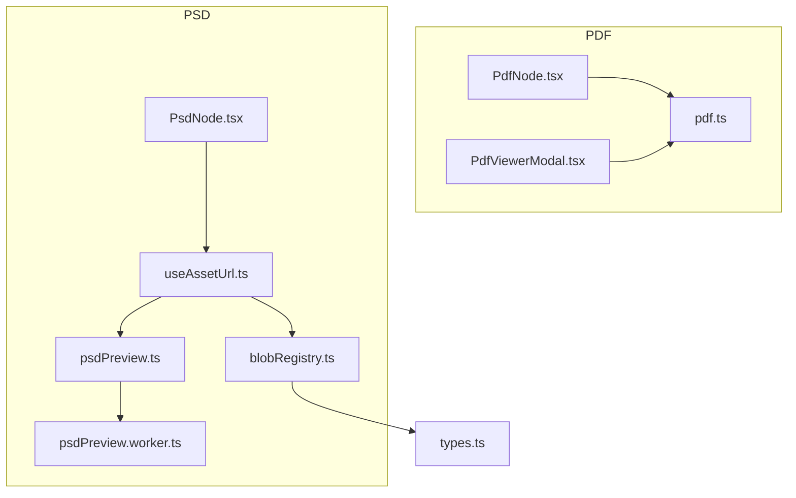
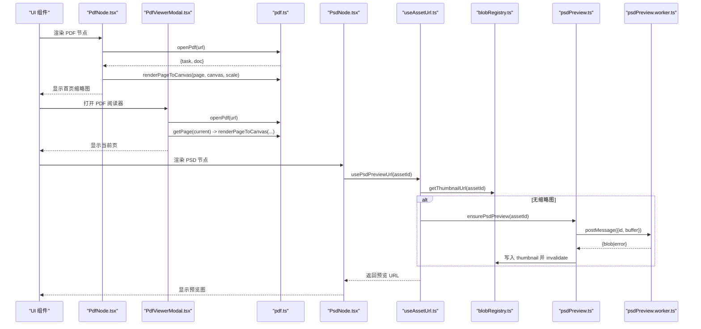
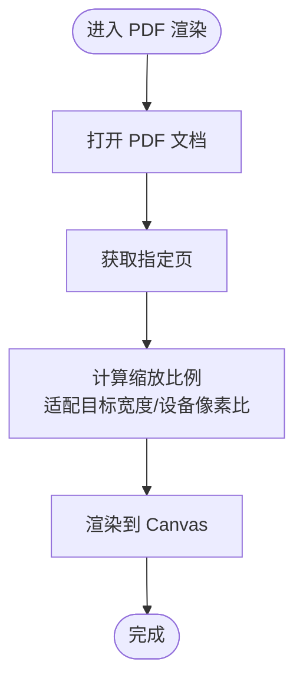
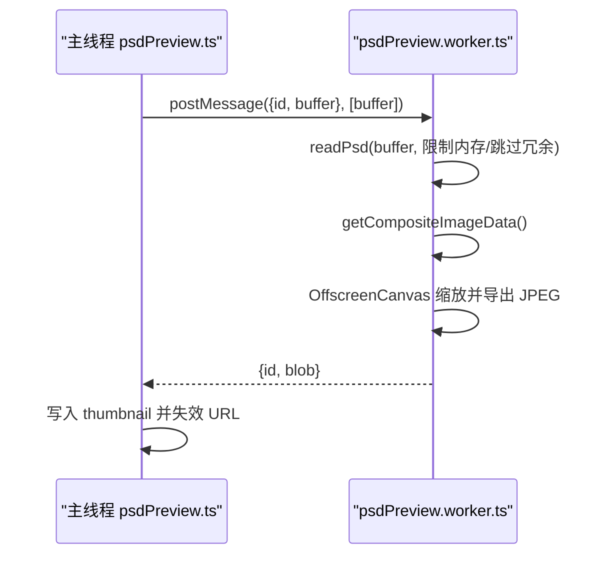
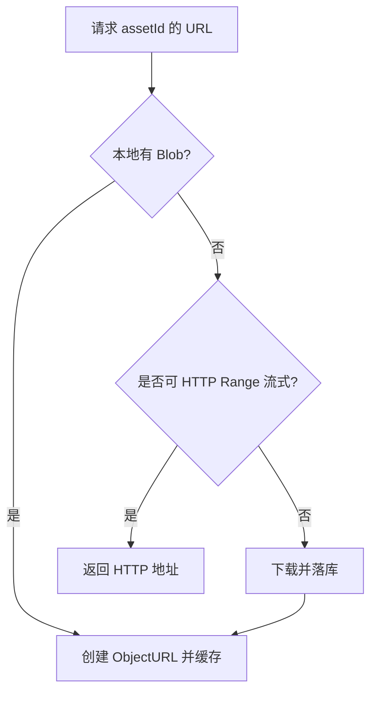
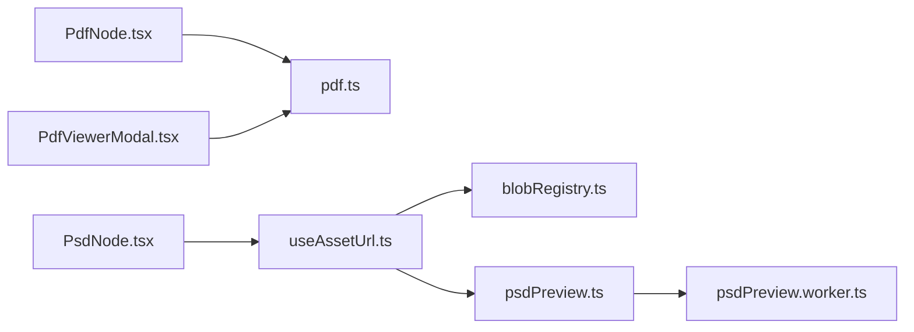

# 文档处理

<cite>
**本文引用的文件**
- [src/media/pdf.ts](file://src/media/pdf.ts)
- [src/components/PdfViewerModal.tsx](file://src/components/PdfViewerModal.tsx)
- [src/canvas/nodes/PdfNode.tsx](file://src/canvas/nodes/PdfNode.tsx)
- [src/media/psdPreview.ts](file://src/media/psdPreview.ts)
- [src/media/psdPreview.worker.ts](file://src/media/psdPreview.worker.ts)
- [src/canvas/nodes/PsdNode.tsx](file://src/canvas/nodes/PsdNode.tsx)
- [src/media/useAssetUrl.ts](file://src/media/useAssetUrl.ts)
- [src/media/blobRegistry.ts](file://src/media/blobRegistry.ts)
- [src/types.ts](file://src/types.ts)
</cite>

## 目录
1. [简介](#简介)
2. [项目结构](#项目结构)
3. [核心组件](#核心组件)
4. [架构总览](#架构总览)
5. [详细组件分析](#详细组件分析)
6. [依赖关系分析](#依赖关系分析)
7. [性能考虑](#性能考虑)
8. [故障排查指南](#故障排查指南)
9. [结论](#结论)
10. [附录：使用示例](#附录使用示例)

## 简介
本模块提供文档处理能力，重点覆盖两类文件格式：
- PDF：基于 PDF.js 的集成、页面渲染、缩放控制与完整阅读器；支持懒加载与资源释放。
- PSD：通过 Web Worker 解析 Photoshop 文件，生成预览缩略图并缓存，避免主线程阻塞。

同时提供统一的资源获取与缓存机制（本地 IndexedDB、局域网流式地址、云端 OSS），以及错误处理与兼容性策略。

## 项目结构
围绕文档处理的代码主要分布在以下位置：
- PDF 能力：媒体层封装、节点渲染、全屏阅读器
- PSD 能力：主线程队列与 Worker 通信、Worker 内解析与压缩
- 资源与缓存：统一 URL 生成、缩略图缓存、并发控制
- 类型定义：节点数据模型（含 pageCount 等）

图表来源
- [src/canvas/nodes/PdfNode.tsx:1-90](file://src/canvas/nodes/PdfNode.tsx#L1-L90)
- [src/media/pdf.ts:1-50](file://src/media/pdf.ts#L1-L50)
- [src/components/PdfViewerModal.tsx:1-146](file://src/components/PdfViewerModal.tsx#L1-L146)
- [src/canvas/nodes/PsdNode.tsx:1-125](file://src/canvas/nodes/PsdNode.tsx#L1-L125)
- [src/media/useAssetUrl.ts:1-157](file://src/media/useAssetUrl.ts#L1-L157)
- [src/media/blobRegistry.ts:1-389](file://src/media/blobRegistry.ts#L1-L389)
- [src/media/psdPreview.ts:1-62](file://src/media/psdPreview.ts#L1-L62)
- [src/media/psdPreview.worker.ts:1-82](file://src/media/psdPreview.worker.ts#L1-L82)
- [src/types.ts:1-112](file://src/types.ts#L1-L112)

章节来源
- [src/canvas/nodes/PdfNode.tsx:1-90](file://src/canvas/nodes/PdfNode.tsx#L1-L90)
- [src/components/PdfViewerModal.tsx:1-146](file://src/components/PdfViewerModal.tsx#L1-L146)
- [src/media/pdf.ts:1-50](file://src/media/pdf.ts#L1-L50)
- [src/canvas/nodes/PsdNode.tsx:1-125](file://src/canvas/nodes/PsdNode.tsx#L1-L125)
- [src/media/psdPreview.ts:1-62](file://src/media/psdPreview.ts#L1-L62)
- [src/media/psdPreview.worker.ts:1-82](file://src/media/psdPreview.worker.ts#L1-L82)
- [src/media/useAssetUrl.ts:1-157](file://src/media/useAssetUrl.ts#L1-L157)
- [src/media/blobRegistry.ts:1-389](file://src/media/blobRegistry.ts#L1-L389)
- [src/types.ts:1-112](file://src/types.ts#L1-L112)

## 核心组件
- PDF 渲染与阅读器
  - 媒体层封装：初始化 PDF.js worker、配置 cMap/标准字体/WASM 路径、打开/关闭文档、按缩放渲染到 Canvas。
  - 节点预览：在画布节点中懒加载 PDF，仅渲染第一页作为缩略图，更新页数信息。
  - 全屏阅读器：按需加载 PDF，当前页渲染，键盘翻页，关闭时释放资源。
- PSD 预览
  - 主线程：请求队列化、Worker 生命周期管理、错误传播、结果写入 IndexedDB 并刷新缩略图 URL。
  - Worker：解析 PSD、校验尺寸与位深、合成像素、缩放到预览尺寸、输出 JPEG Blob。
- 资源与缓存
  - 统一 URL：优先本地 Blob URL，其次局域网 HTTP Range 流式地址，最后回退到全量下载。
  - 缩略图缓存：内存 Map + ObjectURL 管理，支持失效与批量回收。
  - 并发控制：视频封面抓帧限制并发，避免连接池耗尽。

章节来源
- [src/media/pdf.ts:1-50](file://src/media/pdf.ts#L1-L50)
- [src/canvas/nodes/PdfNode.tsx:1-90](file://src/canvas/nodes/PdfNode.tsx#L1-L90)
- [src/components/PdfViewerModal.tsx:1-146](file://src/components/PdfViewerModal.tsx#L1-L146)
- [src/media/psdPreview.ts:1-62](file://src/media/psdPreview.ts#L1-L62)
- [src/media/psdPreview.worker.ts:1-82](file://src/media/psdPreview.worker.ts#L1-L82)
- [src/media/useAssetUrl.ts:1-157](file://src/media/useAssetUrl.ts#L1-L157)
- [src/media/blobRegistry.ts:1-389](file://src/media/blobRegistry.ts#L1-L389)

## 架构总览
下图展示了 PDF 与 PSD 从 UI 到渲染/解析的核心调用链与数据流向。

图表来源
- [src/canvas/nodes/PdfNode.tsx:1-90](file://src/canvas/nodes/PdfNode.tsx#L1-L90)
- [src/components/PdfViewerModal.tsx:1-146](file://src/components/PdfViewerModal.tsx#L1-L146)
- [src/media/pdf.ts:1-50](file://src/media/pdf.ts#L1-L50)
- [src/canvas/nodes/PsdNode.tsx:1-125](file://src/canvas/nodes/PsdNode.tsx#L1-L125)
- [src/media/useAssetUrl.ts:1-157](file://src/media/useAssetUrl.ts#L1-L157)
- [src/media/blobRegistry.ts:1-389](file://src/media/blobRegistry.ts#L1-L389)
- [src/media/psdPreview.ts:1-62](file://src/media/psdPreview.ts#L1-L62)
- [src/media/psdPreview.worker.ts:1-82](file://src/media/psdPreview.worker.ts#L1-L82)

## 详细组件分析

### PDF 模块
- 功能要点
  - 初始化 PDF.js 工作线程与资源路径（cMap、标准字体、WASM）。
  - open/close 文档句柄，确保资源释放。
  - renderPageToCanvas：根据设备像素比设置 Canvas 尺寸，计算缩放比例后渲染。
- 节点预览
  - 懒加载：仅在节点可见且 URL 就绪时加载 PDF。
  - 仅渲染第一页作为缩略图，更新节点数据中的 pageCount。
  - 清理：组件卸载或取消时释放 page 与文档句柄。
- 全屏阅读器
  - 动态导入 pdf.ts，按需加载文档与页面。
  - 当前页渲染，支持键盘左右翻页与 ESC 关闭。
  - 切换页面前清理旧页，避免内存泄漏。

图表来源
- [src/media/pdf.ts:23-49](file://src/media/pdf.ts#L23-L49)
- [src/components/PdfViewerModal.tsx:58-83](file://src/components/PdfViewerModal.tsx#L58-L83)

章节来源
- [src/media/pdf.ts:1-50](file://src/media/pdf.ts#L1-L50)
- [src/canvas/nodes/PdfNode.tsx:1-90](file://src/canvas/nodes/PdfNode.tsx#L1-L90)
- [src/components/PdfViewerModal.tsx:1-146](file://src/components/PdfViewerModal.tsx#L1-L146)

### PSD 预览模块
- 主线程职责
  - 维护唯一 Worker 实例与消息队列，保证串行处理避免过载。
  - 将 Blob 转为 ArrayBuffer 并通过 transfer 发送给 Worker。
  - 接收结果后写入 IndexedDB 的 thumbnail 字段，并失效对应 URL 以触发重新绑定。
- Worker 职责
  - 初始化 OffscreenCanvas 环境。
  - 读取 PSD，跳过不必要的数据以降低内存占用。
  - 校验尺寸与位深，合成像素，缩放到最大预览边长，输出 JPEG。
  - 错误通过消息返回，主线程统一处理。

图表来源
- [src/media/psdPreview.ts:10-60](file://src/media/psdPreview.ts#L10-L60)
- [src/media/psdPreview.worker.ts:1-82](file://src/media/psdPreview.worker.ts#L1-L82)

章节来源
- [src/media/psdPreview.ts:1-62](file://src/media/psdPreview.ts#L1-L62)
- [src/media/psdPreview.worker.ts:1-82](file://src/media/psdPreview.worker.ts#L1-L82)

### 资源与缓存
- URL 获取策略
  - 优先本地 IndexedDB 中的 Blob，创建 ObjectURL 并缓存。
  - 若为视频或可流式播放的资源，优先使用局域网 HTTP Range 地址，避免整份下载。
  - 否则回退到全量下载并落库。
- 缩略图缓存
  - 内存 Map 缓存 URL，支持单条/全部失效。
  - 对视频封面进行黑帧自检与重试，必要时拉取全量再抓帧。
  - 并发限制：最多同时抓取两个封面，防止连接池被占满。
- 资源可用性
  - 对网络传输中的资源采用指数退避式的轮询重试，避免瞬时失败。

图表来源
- [src/media/blobRegistry.ts:84-126](file://src/media/blobRegistry.ts#L84-L126)
- [src/media/blobRegistry.ts:310-379](file://src/media/blobRegistry.ts#L310-L379)
- [src/media/useAssetUrl.ts:10-44](file://src/media/useAssetUrl.ts#L10-L44)

章节来源
- [src/media/blobRegistry.ts:1-389](file://src/media/blobRegistry.ts#L1-L389)
- [src/media/useAssetUrl.ts:1-157](file://src/media/useAssetUrl.ts#L1-L157)

## 依赖关系分析
- 松耦合设计
  - PDF 与 PSD 各自独立实现，通过统一的资源接口（useAssetUrl、blobRegistry）获取源数据。
  - 节点组件只关心“是否有 URL”，不关心数据来源（本地/局域网/云端）。
- 关键依赖
  - PDF.js：用于 PDF 解析与渲染。
  - ag-psd：用于 PSD 解析与合成图像。
  - IndexedDB：持久化资产与缩略图。
  - OffscreenCanvas：在 Worker 中进行图像处理，避免主线程阻塞。
- 潜在循环依赖
  - 当前未发现循环引用；各模块职责清晰，单向依赖。

图表来源
- [src/canvas/nodes/PdfNode.tsx:1-90](file://src/canvas/nodes/PdfNode.tsx#L1-L90)
- [src/components/PdfViewerModal.tsx:1-146](file://src/components/PdfViewerModal.tsx#L1-L146)
- [src/media/pdf.ts:1-50](file://src/media/pdf.ts#L1-L50)
- [src/canvas/nodes/PsdNode.tsx:1-125](file://src/canvas/nodes/PsdNode.tsx#L1-L125)
- [src/media/useAssetUrl.ts:1-157](file://src/media/useAssetUrl.ts#L1-L157)
- [src/media/blobRegistry.ts:1-389](file://src/media/blobRegistry.ts#L1-L389)
- [src/media/psdPreview.ts:1-62](file://src/media/psdPreview.ts#L1-L62)
- [src/media/psdPreview.worker.ts:1-82](file://src/media/psdPreview.worker.ts#L1-L82)

章节来源
- [src/canvas/nodes/PdfNode.tsx:1-90](file://src/canvas/nodes/PdfNode.tsx#L1-L90)
- [src/components/PdfViewerModal.tsx:1-146](file://src/components/PdfViewerModal.tsx#L1-L146)
- [src/media/pdf.ts:1-50](file://src/media/pdf.ts#L1-L50)
- [src/canvas/nodes/PsdNode.tsx:1-125](file://src/canvas/nodes/PsdNode.tsx#L1-L125)
- [src/media/useAssetUrl.ts:1-157](file://src/media/useAssetUrl.ts#L1-L157)
- [src/media/blobRegistry.ts:1-389](file://src/media/blobRegistry.ts#L1-L389)
- [src/media/psdPreview.ts:1-62](file://src/media/psdPreview.ts#L1-L62)
- [src/media/psdPreview.worker.ts:1-82](file://src/media/psdPreview.worker.ts#L1-L82)

## 性能考虑
- 懒加载
  - PDF：仅在节点可见时加载并渲染第一页；全屏阅读器按需加载当前页。
  - PSD：首次需要时再生成缩略图，后续走缓存。
- 缓存策略
  - URL 缓存：ObjectURL 内存缓存，避免重复创建。
  - 缩略图缓存：IndexedDB + 内存 Map，支持失效与批量回收。
  - 视频封面：并发限制与黑帧检测，减少无效抓取。
- 渐进式渲染
  - PDF：根据目标宽度计算缩放，兼顾清晰度与性能。
  - PSD：限制最大文档尺寸与预览边长，降低内存压力。
- 内存管理
  - PDF：及时 cleanup 页面与 destroy 文档。
  - PSD：Worker 中限制解码内存，跳过不必要的图层数据。
- 网络优化
  - 优先 HTTP Range 流式播放，避免大文件整段下载。
  - 局域网传输中资源采用轮询重试，提升稳定性。

[本节为通用性能建议，不直接分析具体文件]

## 故障排查指南
- PDF 相关
  - 渲染失败：检查 PDF.js 资源路径（cMap、标准字体、WASM）是否正确配置。
  - 内存泄漏：确认页面 cleanup 与文档 destroy 在组件卸载时被调用。
  - 中文/特殊字符乱码：确保启用 cMap 与标准字体数据。
- PSD 相关
  - 预览失败：检查文件大小与位深限制；超大或高比特深度将被拒绝。
  - Worker 崩溃：主线程会捕获错误并清空 pending 队列，需检查输入数据合法性。
  - 缩略图未更新：确认 thumbnail 失效逻辑已触发，必要时手动刷新。
- 资源加载
  - 资源不可用：检查本地 IndexedDB、局域网连接状态与云端配置。
  - 视频封面黑图：系统会自动重试抓取；如仍失败，尝试拉取全量后再抓帧。

章节来源
- [src/media/pdf.ts:1-50](file://src/media/pdf.ts#L1-L50)
- [src/components/PdfViewerModal.tsx:24-56](file://src/components/PdfViewerModal.tsx#L24-L56)
- [src/media/psdPreview.worker.ts:41-81](file://src/media/psdPreview.worker.ts#L41-L81)
- [src/media/psdPreview.ts:10-60](file://src/media/psdPreview.ts#L10-L60)
- [src/media/blobRegistry.ts:128-239](file://src/media/blobRegistry.ts#L128-L239)
- [src/media/blobRegistry.ts:310-379](file://src/media/blobRegistry.ts#L310-L379)

## 结论
该文档处理模块以清晰的职责划分实现了 PDF 与 PSD 的高效处理：
- PDF 通过 PDF.js 提供稳定的渲染与阅读体验，结合懒加载与资源释放保障性能。
- PSD 通过 Web Worker 与严格的尺寸/内存限制，安全地生成预览缩略图。
- 统一的资源与缓存层屏蔽了数据来源差异，提升了鲁棒性与用户体验。

[本节为总结性内容，不直接分析具体文件]

## 附录：使用示例
以下为常见使用场景的步骤说明（不包含具体代码片段）：

- 在画布中展示 PDF 缩略图
  - 步骤
    - 将 PDF 资产加入项目，获得 assetId。
    - 在 PDF 节点中使用 useAssetUrl 获取 URL。
    - 组件内部懒加载 PDF，渲染第一页到 Canvas，并更新 pageCount。
  - 参考
    - [src/canvas/nodes/PdfNode.tsx:19-62](file://src/canvas/nodes/PdfNode.tsx#L19-L62)
    - [src/media/pdf.ts:23-49](file://src/media/pdf.ts#L23-L49)

- 打开 PDF 全屏阅读器
  - 步骤
    - 调用 UI 存储打开 PDF 阅读器。
    - 阅读器动态导入 PDF 模块，加载文档并渲染当前页。
    - 支持键盘翻页与关闭。
  - 参考
    - [src/components/PdfViewerModal.tsx:24-83](file://src/components/PdfViewerModal.tsx#L24-L83)

- 展示 PSD 缩略图并打开预览
  - 步骤
    - 在 PSD 节点中使用 usePsdPreviewUrl 获取预览 URL。
    - 若无缩略图，自动触发 ensurePsdPreview，通过 Worker 生成并缓存。
    - 双击节点或点击按钮打开图片查看器。
  - 参考
    - [src/canvas/nodes/PsdNode.tsx:15-38](file://src/canvas/nodes/PsdNode.tsx#L15-L38)
    - [src/media/useAssetUrl.ts:129-153](file://src/media/useAssetUrl.ts#L129-L153)
    - [src/media/psdPreview.ts:42-60](file://src/media/psdPreview.ts#L42-L60)

- 自定义 PDF 缩放与渲染
  - 步骤
    - 使用 renderPageToCanvas，传入目标 Canvas 与缩放比例。
    - 根据页面视口宽度计算合适缩放，考虑设备像素比。
  - 参考
    - [src/media/pdf.ts:35-49](file://src/media/pdf.ts#L35-L49)

- 处理 PSD 解析异常
  - 步骤
    - 捕获 Worker 返回的错误信息，提示用户格式不支持或文件过大。
    - 检查 PSD 尺寸与位深限制。
  - 参考
    - [src/media/psdPreview.worker.ts:41-63](file://src/media/psdPreview.worker.ts#L41-L63)
    - [src/media/psdPreview.ts:18-24](file://src/media/psdPreview.ts#L18-L24)