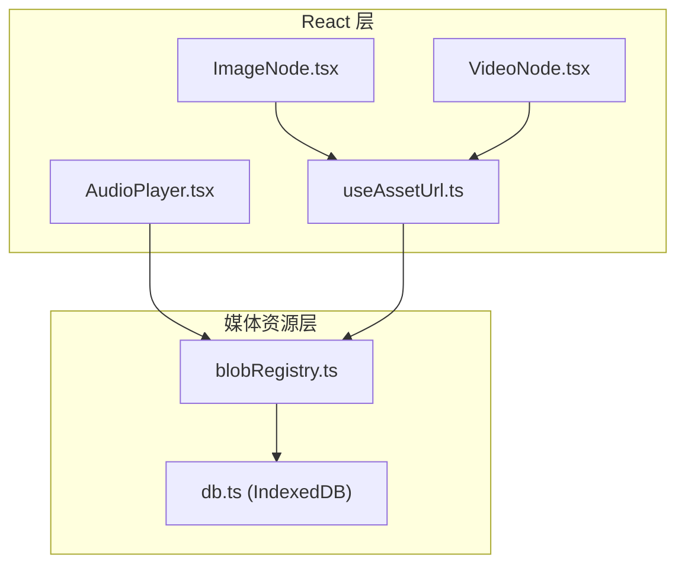
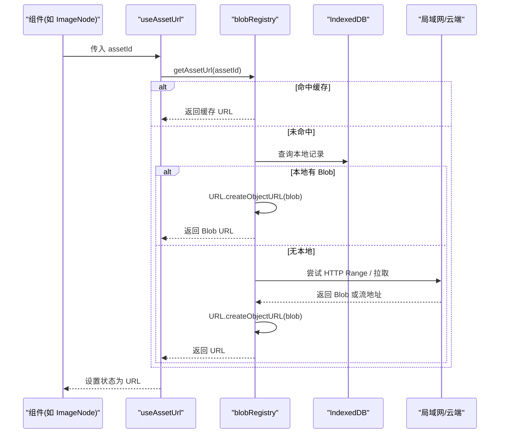
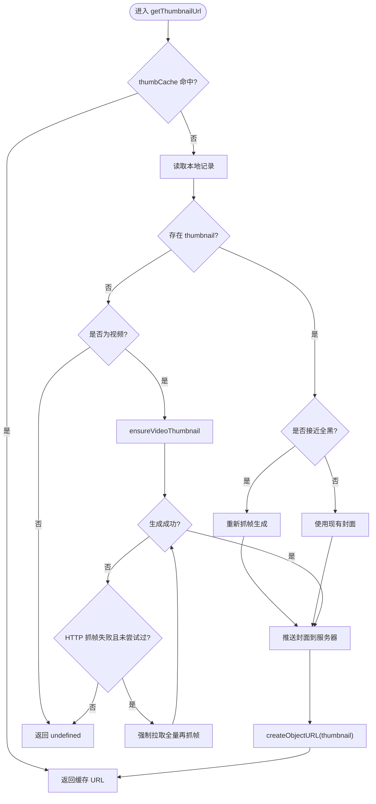
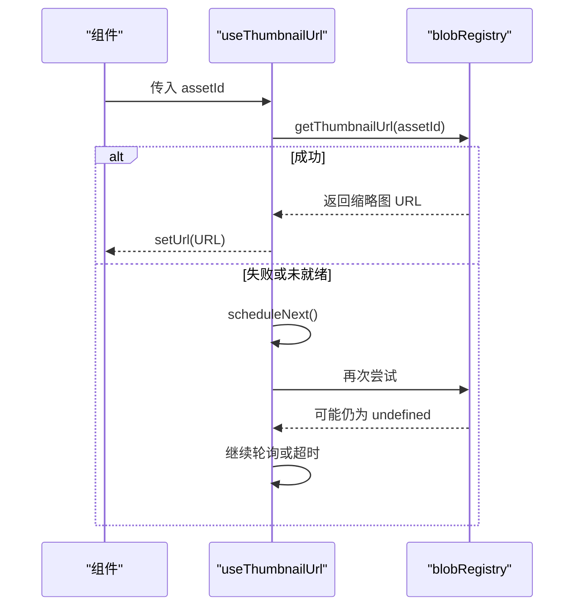
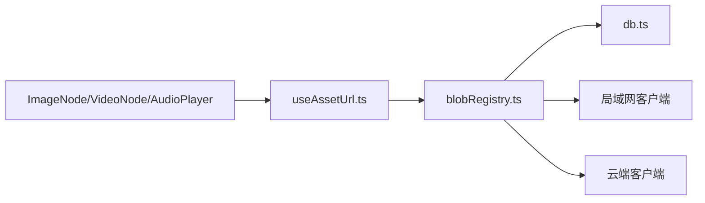

# 资源管理与URL生成

<cite>
**本文引用的文件**
- [blobRegistry.ts](file://src/media/blobRegistry.ts)
- [useAssetUrl.ts](file://src/media/useAssetUrl.ts)
- [db.ts](file://src/db/db.ts)
- [ImageNode.tsx](file://src/canvas/nodes/ImageNode.tsx)
- [VideoNode.tsx](file://src/canvas/nodes/VideoNode.tsx)
- [AudioPlayer.tsx](file://src/components/AudioPlayer.tsx)
</cite>

## 目录
1. [简介](#简介)
2. [项目结构](#项目结构)
3. [核心组件](#核心组件)
4. [架构总览](#架构总览)
5. [详细组件分析](#详细组件分析)
6. [依赖关系分析](#依赖关系分析)
7. [性能考量](#性能考量)
8. [故障排查指南](#故障排查指南)
9. [结论](#结论)
10. [附录：使用示例与监控方案](#附录使用示例与监控方案)

## 简介
本模块负责资源（图片、视频、音频等）的 URL 生成与生命周期管理，重点包括：
- 基于 Blob URL 的临时资源访问机制
- 内存泄漏防护与自动清理策略
- React Hook 封装的 URL 缓存、依赖追踪与重新计算触发条件
- 封面缩略图抓取与并发控制
- 局域网/云端资源的获取与回退策略
- 错误处理与调试建议
- 最佳实践与性能监控方案

## 项目结构
该模块由两个核心文件组成：
- blobRegistry.ts：提供资源 URL 与缩略图 URL 的获取、缓存、清理以及封面抓取逻辑
- useAssetUrl.ts：提供 React Hook，将上述能力以声明式方式暴露给组件

此外，数据持久化通过 IndexedDB（Dexie）完成；UI 层在节点与播放器中消费这些 Hook。

图表来源
- [blobRegistry.ts:1-389](file://src/media/blobRegistry.ts#L1-L389)
- [useAssetUrl.ts:1-157](file://src/media/useAssetUrl.ts#L1-L157)
- [db.ts:1-69](file://src/db/db.ts#L1-L69)
- [ImageNode.tsx:1-126](file://src/canvas/nodes/ImageNode.tsx#L1-L126)
- [VideoNode.tsx:1-88](file://src/canvas/nodes/VideoNode.tsx#L1-L88)
- [AudioPlayer.tsx:1-800](file://src/components/AudioPlayer.tsx#L1-L800)

章节来源
- [blobRegistry.ts:1-389](file://src/media/blobRegistry.ts#L1-L389)
- [useAssetUrl.ts:1-157](file://src/media/useAssetUrl.ts#L1-L157)
- [db.ts:1-69](file://src/db/db.ts#L1-L69)

## 核心组件
- Blob URL 管理机制（blobRegistry.ts）
  - 资源 URL 缓存 Map
  - 缩略图 URL 缓存 Map
  - 封面抓取并发控制（队列 + 槽位）
  - 本地/局域网/云端多级获取策略
  - 统一清理入口 revokeAllUrls
- React Hook（useAssetUrl.ts）
  - useAssetUrl：资源 URL 获取与重试
  - useThumbnailUrl：封面 URL 轮询与超时策略
  - useAssetSourceUrl：通用资源/缩略图 URL 获取
  - usePsdPreviewUrl：PSD 预览封面获取

章节来源
- [blobRegistry.ts:12-56](file://src/media/blobRegistry.ts#L12-L56)
- [blobRegistry.ts:84-126](file://src/media/blobRegistry.ts#L84-L126)
- [blobRegistry.ts:128-268](file://src/media/blobRegistry.ts#L128-L268)
- [blobRegistry.ts:310-389](file://src/media/blobRegistry.ts#L310-L389)
- [useAssetUrl.ts:10-44](file://src/media/useAssetUrl.ts#L10-L44)
- [useAssetUrl.ts:52-99](file://src/media/useAssetUrl.ts#L52-L99)
- [useAssetUrl.ts:101-127](file://src/media/useAssetUrl.ts#L101-L127)
- [useAssetUrl.ts:129-157](file://src/media/useAssetUrl.ts#L129-L157)

## 架构总览
资源 URL 的生命周期分为创建、使用、销毁三个阶段：
- 创建时机
  - 首次请求 getAssetUrl/getThumbnailUrl
  - 本地无资源时从云端或局域网拉取并落库
  - 视频封面通过抓帧生成后缓存
- 使用场景
  - 图片节点直接显示
  - 视频节点显示封面，点击打开播放器后再按需拉取完整资源
  - 音频播放器按需获取资源 URL 进行播放或下载
- 销毁时机
  - 显式失效：invalidateAssetUrl/invalidateThumbnailUrl
  - 批量清理：revokeAllUrls
  - 组件卸载不主动释放 Blob URL（由全局清理或应用级策略兜底）

图表来源
- [useAssetUrl.ts:14-44](file://src/media/useAssetUrl.ts#L14-L44)
- [blobRegistry.ts:84-105](file://src/media/blobRegistry.ts#L84-L105)
- [blobRegistry.ts:107-126](file://src/media/blobRegistry.ts#L107-L126)

章节来源
- [blobRegistry.ts:84-126](file://src/media/blobRegistry.ts#L84-L126)
- [useAssetUrl.ts:14-44](file://src/media/useAssetUrl.ts#L14-L44)

## 详细组件分析

### Blob URL 管理机制（blobRegistry.ts）
- 缓存设计
  - urlCache：按 assetId 缓存资源 URL（可能是 Blob URL 或局域网 HTTP 流地址）
  - thumbCache：按 assetId 缓存缩略图 URL（Blob URL）
- 并发与节流
  - 封面抓取限制最大并发数，避免多 video 同时 seek 导致连接池耗尽
  - 使用队列与槽位函数确保有序执行与正确释放
- 资源获取策略
  - 优先本地 IndexedDB 中的 Blob
  - 其次局域网 HTTP Range 流式地址（边下边播）
  - 最后拉取完整 Blob 并创建 Blob URL
- 封面抓取
  - 针对视频资产，通过临时 video 元素抓帧生成 JPEG 缩略图
  - 黑帧检测与多次重试，必要时回退到强制拉取全量资源再抓帧
  - 生成后推送到服务器以便其他端复用
- 清理与防泄漏
  - invalidateAssetUrl/invalidateThumbnailUrl：单条失效并释放 Blob URL
  - revokeAllUrls：批量释放所有缓存 URL 并清空缓存
  - 临时 video 对象在抓帧完成后移除 src 并 load，避免资源占用

图表来源
- [blobRegistry.ts:310-379](file://src/media/blobRegistry.ts#L310-L379)
- [blobRegistry.ts:128-268](file://src/media/blobRegistry.ts#L128-L268)

章节来源
- [blobRegistry.ts:12-56](file://src/media/blobRegistry.ts#L12-L56)
- [blobRegistry.ts:84-126](file://src/media/blobRegistry.ts#L84-L126)
- [blobRegistry.ts:128-268](file://src/media/blobRegistry.ts#L128-L268)
- [blobRegistry.ts:310-389](file://src/media/blobRegistry.ts#L310-L389)

### React Hook 实现（useAssetUrl.ts）
- useAssetUrl
  - 依赖追踪：监听 assetId 与 version 变化触发重新加载
  - 重试机制：最多重试若干次，间隔固定延迟，避免局域网传输未完成导致的瞬时失败
  - 错误提示：达到上限后通过 toast 提示用户
- useThumbnailUrl
  - 快速轮询：前若干次短间隔轮询
  - 慢速轮询：局域网连接状态下延长等待时间，避免过早放弃
  - 清理：组件卸载时停止定时器并标记 alive=false
- useAssetSourceUrl
  - 通用封装：根据 source 选择 getAssetUrl 或 getThumbnailUrl
- usePsdPreviewUrl
  - 先尝试封面，若不存在则调用 ensurePsdPreview 再生成并获取

图表来源
- [useAssetUrl.ts:52-99](file://src/media/useAssetUrl.ts#L52-L99)
- [blobRegistry.ts:310-379](file://src/media/blobRegistry.ts#L310-L379)

章节来源
- [useAssetUrl.ts:10-44](file://src/media/useAssetUrl.ts#L10-L44)
- [useAssetUrl.ts:52-99](file://src/media/useAssetUrl.ts#L52-L99)
- [useAssetUrl.ts:101-127](file://src/media/useAssetUrl.ts#L101-L127)
- [useAssetUrl.ts:129-157](file://src/media/useAssetUrl.ts#L129-L157)

### 资源引用与生命周期
- 创建时机
  - 组件挂载或依赖变化时调用 Hook
  - 资源首次获取时创建 Blob URL 或缓存 HTTP 流地址
- 使用场景
  - 图片节点直接使用 URL 渲染
  - 视频节点仅显示封面，点击播放器再按需拉取完整资源
  - 音频播放器按需获取 URL 进行播放或下载
- 销毁时机
  - 显式失效：invalidateAssetUrl/invalidateThumbnailUrl
  - 批量清理：revokeAllUrls
  - 应用级清理：建议在页面切换或退出时调用批量清理

章节来源
- [blobRegistry.ts:41-56](file://src/media/blobRegistry.ts#L41-L56)
- [blobRegistry.ts:381-389](file://src/media/blobRegistry.ts#L381-L389)
- [ImageNode.tsx:15-126](file://src/canvas/nodes/ImageNode.tsx#L15-L126)
- [VideoNode.tsx:18-88](file://src/canvas/nodes/VideoNode.tsx#L18-L88)
- [AudioPlayer.tsx:353-368](file://src/components/AudioPlayer.tsx#L353-L368)

## 依赖关系分析
- 模块耦合
  - useAssetUrl.ts 依赖 blobRegistry.ts 提供的 URL 获取能力
  - blobRegistry.ts 依赖 db.ts 进行本地存储与垃圾回收
  - UI 组件通过 Hook 间接依赖资源管理模块
- 外部集成点
  - 局域网客户端：提供 HTTP 流式地址、缩略图同步、资源请求
  - 云端客户端：提供资源下载与缩略图获取
- 潜在循环依赖
  - 当前结构清晰，未发现循环导入

图表来源
- [useAssetUrl.ts:1-6](file://src/media/useAssetUrl.ts#L1-L6)
- [blobRegistry.ts:1-10](file://src/media/blobRegistry.ts#L1-L10)
- [db.ts:25-33](file://src/db/db.ts#L25-L33)

章节来源
- [useAssetUrl.ts:1-6](file://src/media/useAssetUrl.ts#L1-L6)
- [blobRegistry.ts:1-10](file://src/media/blobRegistry.ts#L1-L10)
- [db.ts:25-33](file://src/db/db.ts#L25-L33)

## 性能考量
- 缓存命中
  - 资源 URL 与缩略图 URL 均使用 Map 缓存，减少重复创建与网络请求
- 并发控制
  - 封面抓取限制最大并发，避免浏览器连接池被占满影响播放体验
- 流式播放
  - 视频优先使用 HTTP Range 流式地址，降低内存与磁盘压力
- 重试与超时
  - 资源加载失败时有限重试；封面轮询采用快慢两阶段策略，兼顾响应与稳定性
- 内存管理
  - 临时 video 对象及时释放；Blob URL 提供失效与批量清理接口

[本节为通用指导，无需特定文件来源]

## 故障排查指南
- 常见问题
  - 资源加载失败：检查局域网连接与源端在线状态；确认重试次数与延迟配置
  - 封面抓取失败：检查跨域设置（crossOrigin）、服务器 CORS；必要时触发强制拉取全量资源
  - 内存泄漏：确认调用 invalidateAssetUrl/invalidateThumbnailUrl 或 revokeAllUrls 清理 URL
- 调试建议
  - 在关键路径添加日志：getAssetUrl、getThumbnailUrl、ensureVideoThumbnail
  - 观察 urlCache 与 thumbCache 大小，评估是否需要更激进的清理策略
  - 使用浏览器开发者工具监控 Blob URL 数量与内存占用

章节来源
- [blobRegistry.ts:128-268](file://src/media/blobRegistry.ts#L128-L268)
- [blobRegistry.ts:310-379](file://src/media/blobRegistry.ts#L310-L379)
- [blobRegistry.ts:381-389](file://src/media/blobRegistry.ts#L381-L389)
- [useAssetUrl.ts:26-35](file://src/media/useAssetUrl.ts#L26-L35)
- [useAssetUrl.ts:78-95](file://src/media/useAssetUrl.ts#L78-L95)

## 结论
本模块通过分层缓存、并发控制与多级资源获取策略，实现了稳定高效的资源 URL 管理与缩略图生成。配合 React Hook 的依赖追踪与重试机制，既保证了用户体验，又有效降低了内存与网络开销。建议在生产环境中结合应用生命周期调用批量清理接口，并持续监控缓存大小与内存占用。

[本节为总结性内容，无需特定文件来源]

## 附录：使用示例与监控方案
- 使用示例
  - 图片节点：通过 useAssetUrl 获取 URL 并渲染 img 标签
  - 视频节点：通过 useThumbnailUrl 获取封面 URL，点击打开播放器后再按需拉取完整资源
  - 音频播放器：直接调用 getAssetUrl 获取资源 URL 进行播放或下载
- 性能监控方案
  - 统计 urlCache 与 thumbCache 的大小与命中率
  - 监控封面抓取并发数与平均耗时
  - 记录资源加载失败率与重试次数
  - 定期调用 revokeAllUrls 或在应用退出时清理，防止长期运行导致内存增长

章节来源
- [ImageNode.tsx:15-126](file://src/canvas/nodes/ImageNode.tsx#L15-L126)
- [VideoNode.tsx:18-88](file://src/canvas/nodes/VideoNode.tsx#L18-L88)
- [AudioPlayer.tsx:353-368](file://src/components/AudioPlayer.tsx#L353-L368)
- [blobRegistry.ts:381-389](file://src/media/blobRegistry.ts#L381-L389)