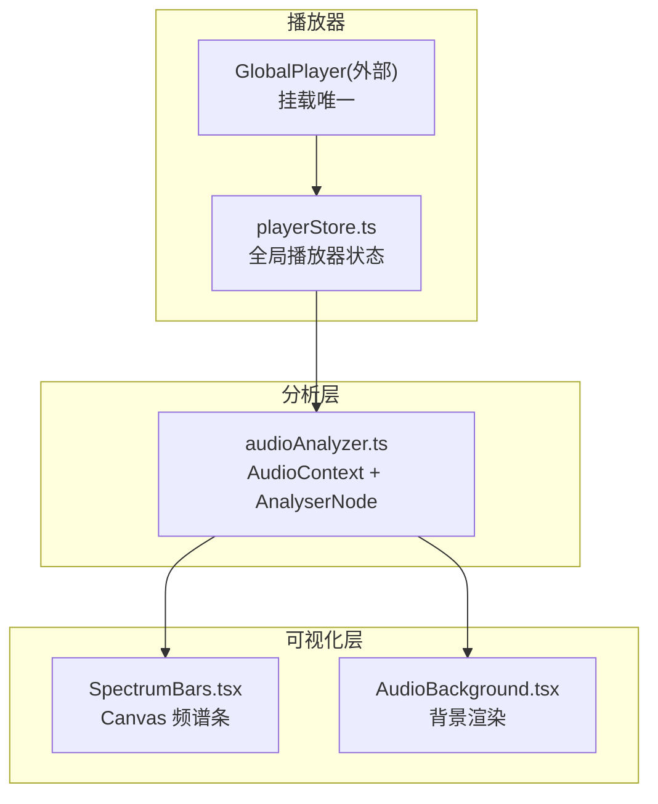
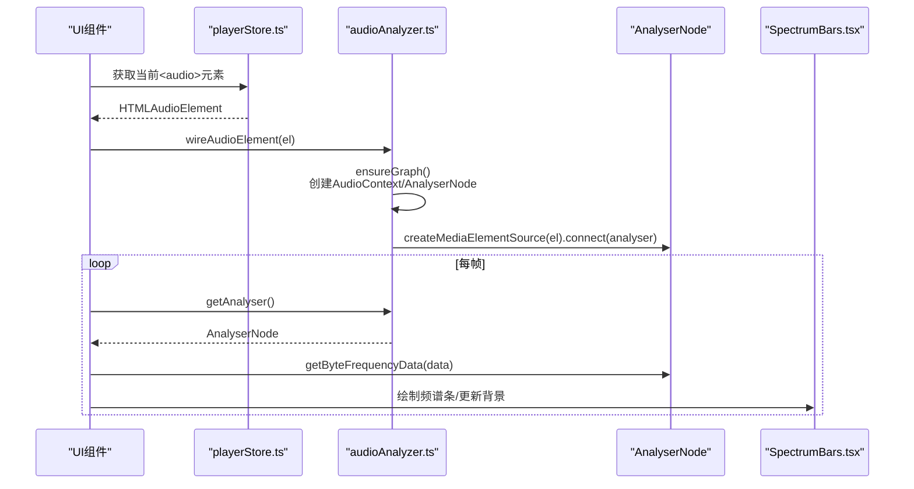
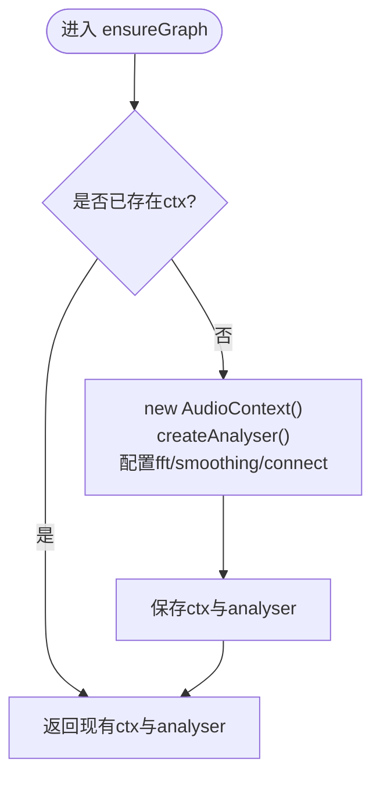
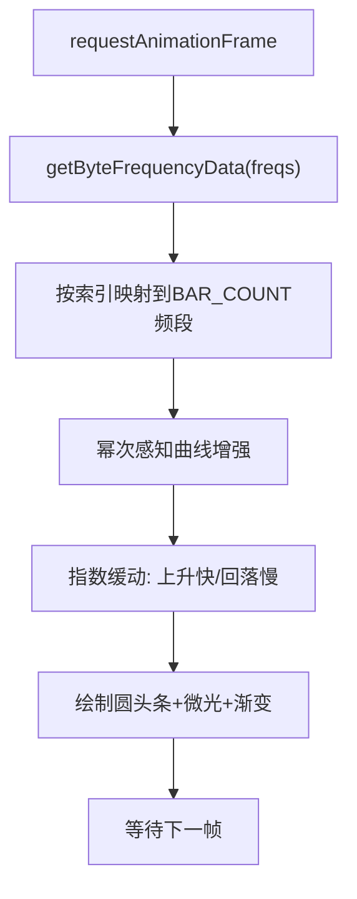
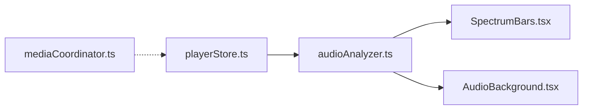
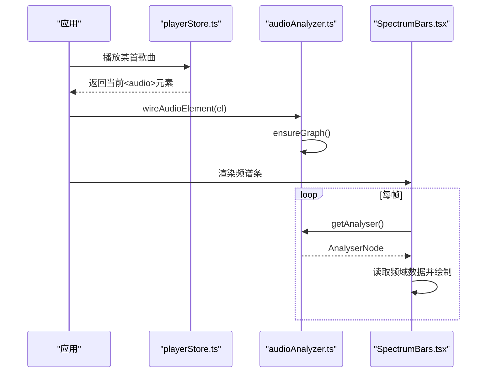

# 音频分析与可视化

<cite>
**本文引用的文件**
- [audioAnalyzer.ts](file://src/media/audioAnalyzer.ts)
- [SpectrumBars.tsx](file://src/components/SpectrumBars.tsx)
- [AudioBackground.tsx](file://src/components/AudioBackground.tsx)
- [playerStore.ts](file://src/store/playerStore.ts)
- [mediaCoordinator.ts](file://src/media/mediaCoordinator.ts)
</cite>

## 目录
1. [简介](#简介)
2. [项目结构](#项目结构)
3. [核心组件](#核心组件)
4. [架构总览](#架构总览)
5. [详细组件分析](#详细组件分析)
6. [依赖关系分析](#依赖关系分析)
7. [性能与内存优化](#性能与内存优化)
8. [故障排查指南](#故障排查指南)
9. [结论](#结论)
10. [附录：使用示例与集成方案](#附录使用示例与集成方案)

## 简介
本模块提供基于 Web Audio API 的音频分析与可视化能力，包括：
- 将当前播放的 <audio> 元素接入 AnalyserNode，获取实时频域/时域数据
- 频谱条可视化（柱状图）与沉浸式背景水波纹效果
- 音频元数据（时长、采样率、声道数等）的读取方法
- 性能优化与内存管理策略
- 完整的组件集成方案与使用示例

## 项目结构
该功能由以下关键文件协作完成：
- src/media/audioAnalyzer.ts：单例 Web Audio 分析器，负责创建 AudioContext、AnalyserNode，并将当前播放的 <audio> 元素接入分析图
- src/components/SpectrumBars.tsx：Canvas 绘制的频谱条组件，按帧读取频域数据并绘制动画
- src/components/AudioBackground.tsx：沉浸式播放器背景，支持封面切换淡入与底部压暗
- src/store/playerStore.ts：全局播放器状态与引擎控制，暴露当前播放的 <audio> 元素供可视化读取
- src/media/mediaCoordinator.ts：媒体互斥协调器，保证同一时刻仅一个音频或视频在播放

图表来源
- [playerStore.ts:52-65](file://src/store/playerStore.ts#L52-L65)
- [audioAnalyzer.ts:8-19](file://src/media/audioAnalyzer.ts#L8-L19)
- [SpectrumBars.tsx:28-31](file://src/components/SpectrumBars.tsx#L28-L31)
- [AudioBackground.tsx:46-66](file://src/components/AudioBackground.tsx#L46-L66)

章节来源
- [playerStore.ts:52-65](file://src/store/playerStore.ts#L52-L65)
- [audioAnalyzer.ts:8-19](file://src/media/audioAnalyzer.ts#L8-L19)
- [SpectrumBars.tsx:28-31](file://src/components/SpectrumBars.tsx#L28-L31)
- [AudioBackground.tsx:46-66](file://src/components/AudioBackground.tsx#L46-L66)

## 核心组件
- 音频分析器（audioAnalyzer.ts）
  - 单例模式维护 AudioContext 与 AnalyserNode
  - 将当前 <audio> 通过 MediaElementAudioSourceNode 接入分析图
  - 提供 getAnalyser() 与 getAudioLevel() 接口
- 频谱条（SpectrumBars.tsx）
  - 使用 Canvas 2D 绘制 44 根圆头条形
  - 每帧读取频域数据，应用感知曲线与缓动，实现“上升快、回落慢”的动态效果
  - 颜色随封面主色相变化，具备微光与渐变
- 背景（AudioBackground.tsx）
  - 封面 cover-fit 铺满全屏，多张封面交叉淡入
  - 底部线性渐变压暗，提升控件可读性
- 播放器状态（playerStore.ts）
  - 统一暴露当前 <audio> 元素 getPlayerAudioElement()
  - 管理播放、暂停、切歌、音量、队列等
- 媒体协调（mediaCoordinator.ts）
  - 注册/注销媒体元素，确保同类型媒体互斥播放

章节来源
- [audioAnalyzer.ts:1-59](file://src/media/audioAnalyzer.ts#L1-L59)
- [SpectrumBars.tsx:1-120](file://src/components/SpectrumBars.tsx#L1-L120)
- [AudioBackground.tsx:1-140](file://src/components/AudioBackground.tsx#L1-L140)
- [playerStore.ts:1-298](file://src/store/playerStore.ts#L1-L298)
- [mediaCoordinator.ts:1-25](file://src/media/mediaCoordinator.ts#L1-L25)

## 架构总览
Web Audio 数据流与可视化调用链如下：

图表来源
- [playerStore.ts:58-65](file://src/store/playerStore.ts#L58-L65)
- [audioAnalyzer.ts:26-47](file://src/media/audioAnalyzer.ts#L26-L47)
- [SpectrumBars.tsx:28-63](file://src/components/SpectrumBars.tsx#L28-L63)

## 详细组件分析

### 音频分析器（audioAnalyzer.ts）
- 职责
  - 懒初始化 AudioContext 与 AnalyserNode，设置 FFT 大小与平滑参数
  - 将当前 <audio> 接入分析图，避免重复连接（WeakSet）
  - 提供 AnalyserNode 访问与归一化音量级计算
- 关键点
  - fftSize=512，smoothingTimeConstant=0.5，兼顾分辨率与响应速度
  - 自动 resume() 处理浏览器自动播放策略限制
  - 异常捕获降级，确保无音频驱动时仍可运行
- 复杂度
  - getAudioLevel(): O(N)，N=frequencyBinCount（约256），每帧一次求和平均
- 错误处理
  - try/catch 包裹上下文创建与连接，失败时返回 null/0

图表来源
- [audioAnalyzer.ts:8-19](file://src/media/audioAnalyzer.ts#L8-L19)

章节来源
- [audioAnalyzer.ts:8-19](file://src/media/audioAnalyzer.ts#L8-L19)
- [audioAnalyzer.ts:26-47](file://src/media/audioAnalyzer.ts#L26-L47)
- [audioAnalyzer.ts:50-58](file://src/media/audioAnalyzer.ts#L50-L58)

### 频谱条（SpectrumBars.tsx）
- 职责
  - 监听容器尺寸变化，适配 DPR 绘制
  - 每帧从 AnalyserNode 获取频域数据，映射到 44 根条形
  - 应用感知曲线与指数缓动，实现自然律动
  - 根据封面主色相动态着色，带微光与渐变
- 算法要点
  - 频域采样：Uint8Array(node.frequencyBinCount)，取前 72% 频段以突出中低频
  - 感知曲线：对幅度进行幂次变换增强可见度
  - 缓动：目标值大于当前值时使用较快系数，回落较慢，形成“呼吸感”
  - 基线：静音/暂停时保留最低高度，保持视觉连续性
- 性能
  - 使用 ResizeObserver 避免频繁重排
  - 限制 DPR 最大为 2，降低高分屏开销
  - 仅在 playing 且 analyser 可用时分配频域数组

图表来源
- [SpectrumBars.tsx:53-106](file://src/components/SpectrumBars.tsx#L53-L106)

章节来源
- [SpectrumBars.tsx:28-112](file://src/components/SpectrumBars.tsx#L28-L112)

### 背景（AudioBackground.tsx）
- 职责
  - 封面 cover-fit 铺满全屏，支持多张封面交叉淡入
  - 底部线性渐变压暗，提升控件可读性
- 关键点
  - 仅在封面变化或淡入中或尺寸变化时重绘，静态零开销
  - 淡入过渡时间固定，避免频繁计算
- 与音频联动
  - 不直接依赖 AnalyserNode，但可与 getAudioLevel() 结合实现水波纹振幅

章节来源
- [AudioBackground.tsx:46-136](file://src/components/AudioBackground.tsx#L46-L136)

### 播放器状态（playerStore.ts）
- 职责
  - 统一管理全局唯一 <audio> 元素，对外暴露 getPlayerAudioElement()
  - 管理播放、暂停、跳转、音量、队列、模式等
- 与可视化集成
  - SpectrumBars 通过 getPlayerAudioElement() 获取当前播放元素并接入分析器
  - 其他可视化组件可复用该元素进行频域/时域分析

章节来源
- [playerStore.ts:52-65](file://src/store/playerStore.ts#L52-L65)
- [playerStore.ts:163-298](file://src/store/playerStore.ts#L163-L298)

### 媒体协调（mediaCoordinator.ts）
- 职责
  - 注册/注销媒体元素，保证同类型媒体互斥播放
- 作用
  - 避免多个音频同时播放导致资源竞争与分析数据混乱

章节来源
- [mediaCoordinator.ts:1-25](file://src/media/mediaCoordinator.ts#L1-L25)

## 依赖关系分析
- 耦合与内聚
  - audioAnalyzer.ts 与 playerStore.ts 通过全局 <audio> 元素松耦合
  - SpectrumBars.tsx 依赖 audioAnalyzer.ts 提供的 AnalyserNode
  - AudioBackground.tsx 独立于分析器，可单独使用
- 外部依赖
  - Web Audio API（AudioContext、AnalyserNode、MediaElementAudioSourceNode）
  - Canvas 2D API
- 循环依赖
  - 无直接循环依赖；通过 store 与模块导出解耦

图表来源
- [playerStore.ts:58-65](file://src/store/playerStore.ts#L58-L65)
- [audioAnalyzer.ts:26-47](file://src/media/audioAnalyzer.ts#L26-L47)
- [SpectrumBars.tsx:28-31](file://src/components/SpectrumBars.tsx#L28-L31)
- [AudioBackground.tsx:46-66](file://src/components/AudioBackground.tsx#L46-L66)
- [mediaCoordinator.ts:23-24](file://src/media/mediaCoordinator.ts#L23-L24)

章节来源
- [playerStore.ts:58-65](file://src/store/playerStore.ts#L58-L65)
- [audioAnalyzer.ts:26-47](file://src/media/audioAnalyzer.ts#L26-L47)
- [SpectrumBars.tsx:28-31](file://src/components/SpectrumBars.tsx#L28-L31)
- [AudioBackground.tsx:46-66](file://src/components/AudioBackground.tsx#L46-L66)
- [mediaCoordinator.ts:23-24](file://src/media/mediaCoordinator.ts#L23-L24)

## 性能与内存优化
- 分析器配置
  - fftSize=512：平衡频率分辨率与计算量
  - smoothingTimeConstant=0.5：提高响应灵敏度，减少抖动
- 渲染优化
  - 限制 DPR 最大为 2，避免高分屏过度绘制
  - 仅在必要时分配频域数组（playing && node）
  - 使用 ResizeObserver 替代窗口 resize 事件，减少重绘
- 动画优化
  - 指数缓动减少高频突变，降低 CPU 波动
  - 背景仅在变化时重绘，静态帧零开销
- 内存管理
  - WeakSet 记录已接线的 <audio> 元素，避免重复连接
  - requestAnimationFrame 与 cancelAnimationFrame 成对管理
  - 组件卸载时断开 ResizeObserver 与取消动画帧
- 建议
  - 在低端设备上可降低 BAR_COUNT 或 fftSize
  - 批量更新 DOM/CSS 属性，避免逐帧样式写入
  - 使用 OffscreenCanvas（如支持）进一步降低主线程压力

[本节为通用指导，不直接分析具体文件]

## 故障排查指南
- 无法获取 AnalyserNode
  - 检查 ensureGraph() 是否被调用，确认浏览器支持 Web Audio API
  - 若环境不支持，组件会静默降级，不影响基础 UI
- 频谱条无响应
  - 确认 getPlayerAudioElement() 返回有效 <audio> 元素
  - 确认 wireAudioElement() 已成功连接 source 到 analyser
  - 检查 playing 状态与节点可用性
- 音频无声或中断
  - 检查 mediaCoordinator 是否暂停了其他媒体
  - 确认播放器未处于 muted 或 volume=0
- 内存泄漏
  - 确保组件卸载时取消 requestAnimationFrame 与 observer
  - 避免在全局持有大量引用

章节来源
- [audioAnalyzer.ts:26-47](file://src/media/audioAnalyzer.ts#L26-L47)
- [SpectrumBars.tsx:108-112](file://src/components/SpectrumBars.tsx#L108-L112)
- [mediaCoordinator.ts:7-20](file://src/media/mediaCoordinator.ts#L7-L20)

## 结论
本模块通过单例分析器与 React 组件协作，实现了低开销、高响应的音频分析与可视化。频谱条与背景分别承担不同视觉需求，播放器状态集中管理媒体生命周期，整体架构清晰、扩展性强。配合合理的性能优化与错误降级策略，可在多种设备与浏览器环境下稳定运行。

[本节为总结，不直接分析具体文件]

## 附录：使用示例与集成方案

### 音频分析使用示例
- 接入当前播放元素
  - 在组件挂载时调用 wireAudioElement(getPlayerAudioElement())
  - 每帧通过 getAnalyser() 获取 AnalyserNode 并读取频域数据
- 读取归一化音量
  - 使用 getAudioLevel() 获取 0..1 的音量级，用于水波纹或其他动效
- 示例路径参考
  - 接入与读取：[SpectrumBars.tsx:28-63](file://src/components/SpectrumBars.tsx#L28-L63)
  - 音量级计算：[audioAnalyzer.ts:50-58](file://src/media/audioAnalyzer.ts#L50-L58)

### 可视化组件集成方案
- 频谱条集成
  - 传入 playing 与 hue，组件内部自动处理 Canvas 绘制与动画
  - 示例路径参考：[SpectrumBars.tsx:12-112](file://src/components/SpectrumBars.tsx#L12-L112)
- 背景集成
  - 传入 coverUrl、hue、tintRgb，组件负责封面铺满与淡入
  - 示例路径参考：[AudioBackground.tsx:30-136](file://src/components/AudioBackground.tsx#L30-L136)

### 音频元数据提取方法
- 时长、当前时间、总时长
  - 通过 <audio>.duration、<audio>.currentTime 获取
  - 示例路径参考：[playerStore.ts:218-235](file://src/store/playerStore.ts#L218-L235)
- 采样率、声道数
  - 使用 AudioContext.sampleRate 获取采样率
  - 使用 AudioBuffer.getChannelData() 或 MediaElementAudioSourceNode 相关属性推断声道数（需先解码或缓冲）
  - 注意：对于 MediaElement 源，通常通过后续解码或离线分析获取精确声道信息
- 示例路径参考
  - 时间控制：[playerStore.ts:218-235](file://src/store/playerStore.ts#L218-L235)
  - 采样率：[audioAnalyzer.ts:8-19](file://src/media/audioAnalyzer.ts#L8-L19)

### 完整流程时序

图表来源
- [playerStore.ts:174-209](file://src/store/playerStore.ts#L174-L209)
- [audioAnalyzer.ts:26-47](file://src/media/audioAnalyzer.ts#L26-L47)
- [SpectrumBars.tsx:28-63](file://src/components/SpectrumBars.tsx#L28-L63)