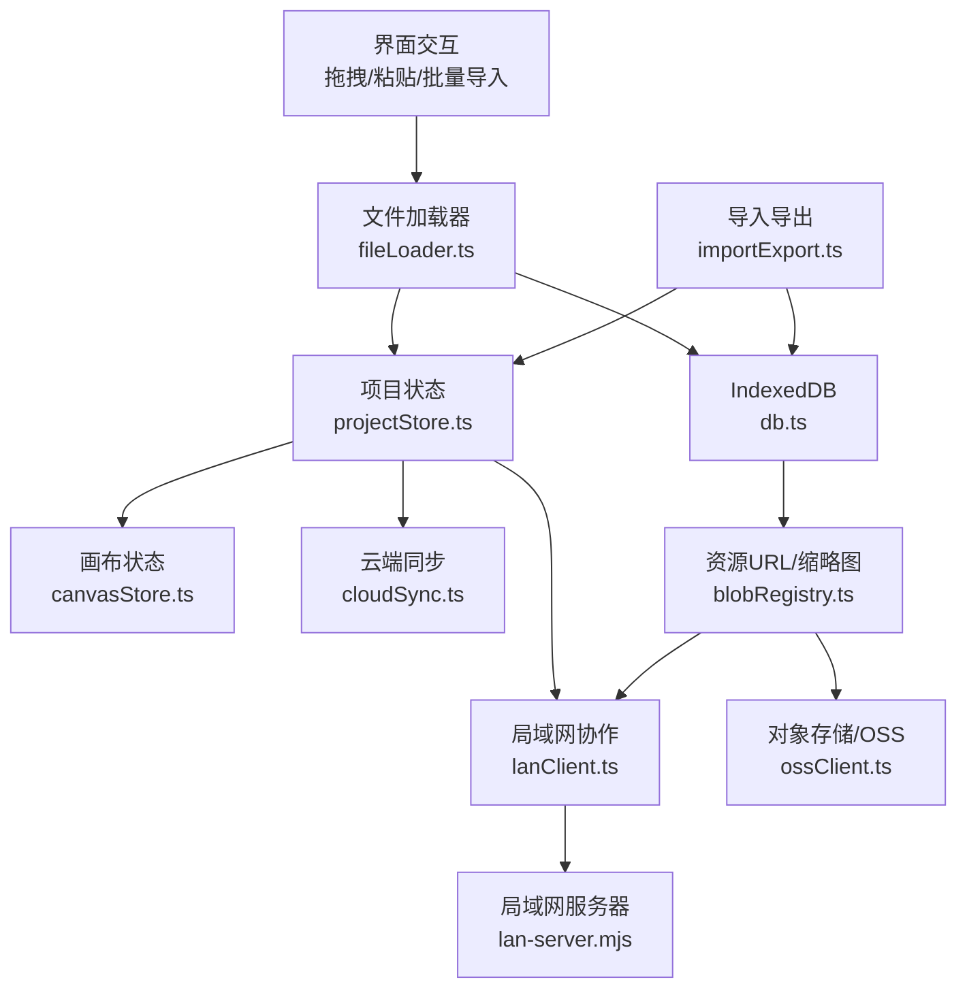
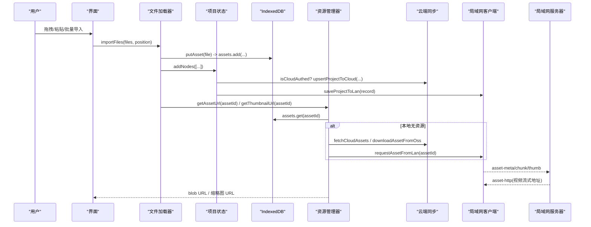
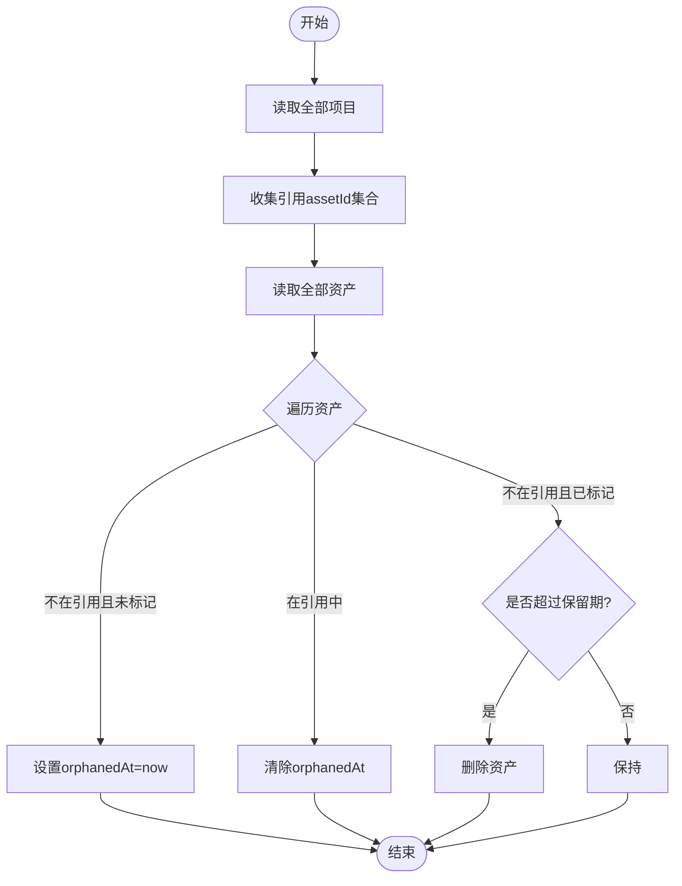
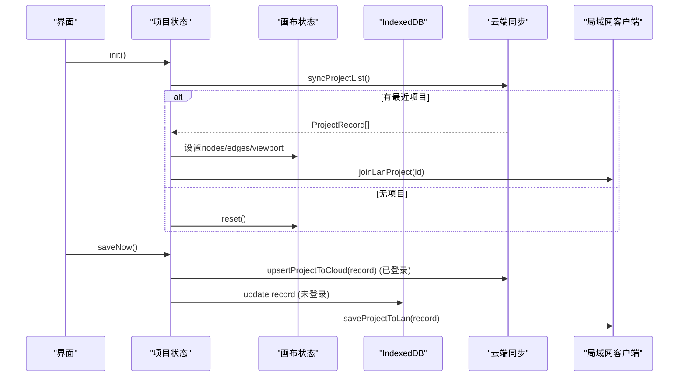
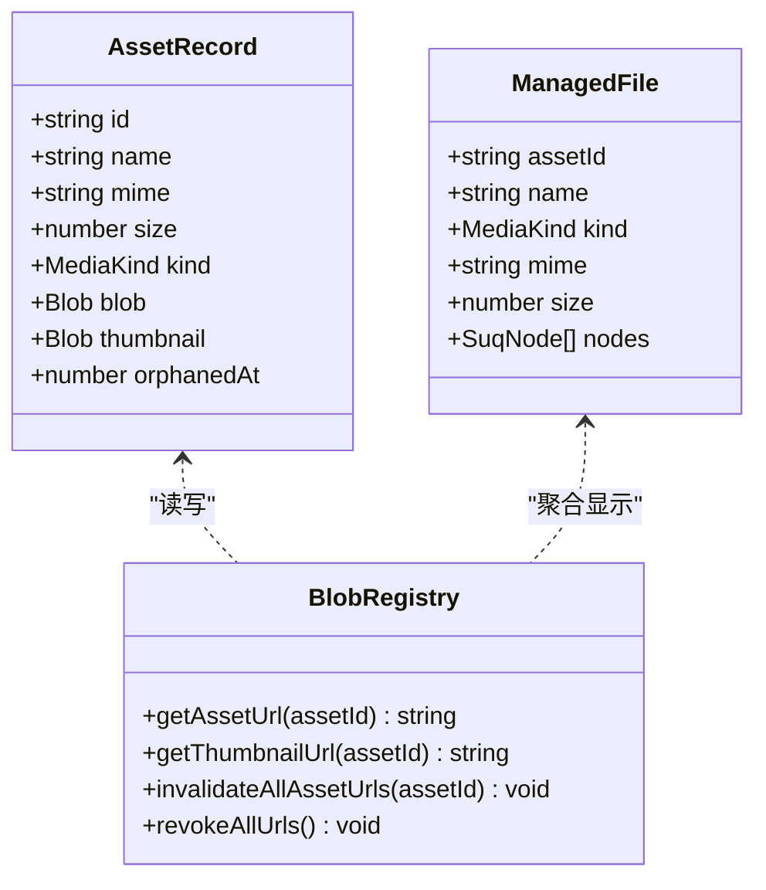
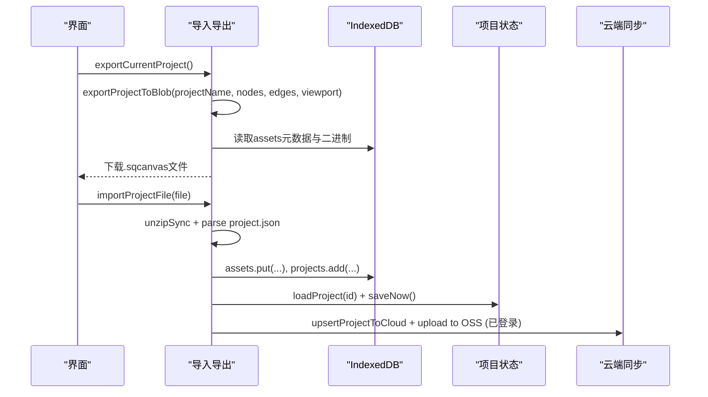
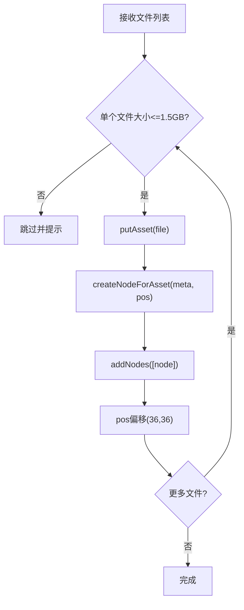
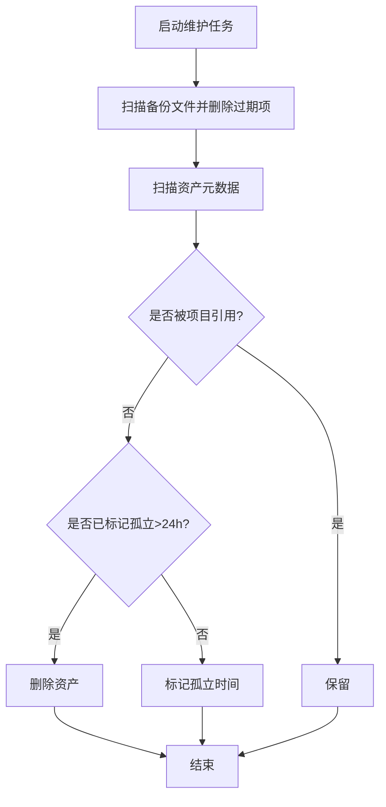
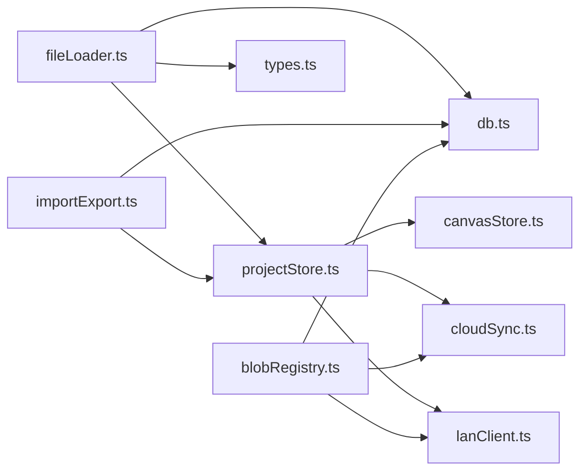

# 数据持久化

<cite>
**本文引用的文件**
- [src/db/db.ts](file://src/db/db.ts)
- [src/io/importExport.ts](file://src/io/importExport.ts)
- [src/io/fileLoader.ts](file://src/io/fileLoader.ts)
- [src/store/projectStore.ts](file://src/store/projectStore.ts)
- [src/media/blobRegistry.ts](file://src/media/blobRegistry.ts)
- [src/sync/cloudSync.ts](file://src/sync/cloudSync.ts)
- [src/sync/lanClient.ts](file://src/sync/lanClient.ts)
- [server/lan-server.mjs](file://server/lan-server.mjs)
- [src/types.ts](file://src/types.ts)
</cite>

## 目录
1. [简介](#简介)
2. [项目结构](#项目结构)
3. [核心组件](#核心组件)
4. [架构总览](#架构总览)
5. [详细组件分析](#详细组件分析)
6. [依赖关系分析](#依赖关系分析)
7. [性能考虑](#性能考虑)
8. [故障排查指南](#故障排查指南)
9. [结论](#结论)
10. [附录](#附录)

## 简介
本文件系统性梳理 SuQCanvas 的数据持久化体系，覆盖 IndexedDB 数据库设计、素材管理、项目存储与历史、导入导出（JSON 格式）、文件加载机制（拖拽/剪贴板/批量）、数据版本管理与迁移策略、垃圾回收与资源清理、备份恢复最佳实践，以及大数据量场景下的性能优化建议。目标是帮助开发者快速理解并高效扩展该系统的持久化能力。

## 项目结构
SuQCanvas 的持久化相关代码主要分布在以下模块：
- 数据库层：基于 Dexie 封装 IndexedDB，定义资产与项目表结构、索引与基础操作。
- 导入导出：将项目图结构与关联素材打包为 .sqcanvas（ZIP + JSON），支持导入还原。
- 文件加载：统一处理拖拽、剪贴板、批量导入等场景，生成节点并写入 IndexedDB。
- 状态与存储：项目状态管理、自动保存、云端/局域网同步。
- 媒体资源：Blob URL 缓存、缩略图生成、OSS/局域网拉取与回源。
- 协同与备份：局域网协作、项目备份列表与恢复、服务端维护任务。

图表来源
- [src/db/db.ts:25-33](file://src/db/db.ts#L25-L33)
- [src/io/importExport.ts:35-78](file://src/io/importExport.ts#L35-L78)
- [src/io/fileLoader.ts:77-117](file://src/io/fileLoader.ts#L77-L117)
- [src/store/projectStore.ts:196-228](file://src/store/projectStore.ts#L196-L228)
- [src/media/blobRegistry.ts:84-126](file://src/media/blobRegistry.ts#L84-L126)
- [src/sync/cloudSync.ts:148-165](file://src/sync/cloudSync.ts#L148-L165)
- [src/sync/lanClient.ts:254-362](file://src/sync/lanClient.ts#L254-L362)
- [server/lan-server.mjs:107-146](file://server/lan-server.mjs#L107-L146)

章节来源
- [src/db/db.ts:25-33](file://src/db/db.ts#L25-L33)
- [src/io/importExport.ts:35-78](file://src/io/importExport.ts#L35-L78)
- [src/io/fileLoader.ts:77-117](file://src/io/fileLoader.ts#L77-L117)
- [src/store/projectStore.ts:196-228](file://src/store/projectStore.ts#L196-L228)
- [src/media/blobRegistry.ts:84-126](file://src/media/blobRegistry.ts#L84-L126)
- [src/sync/cloudSync.ts:148-165](file://src/sync/cloudSync.ts#L148-L165)
- [src/sync/lanClient.ts:254-362](file://src/sync/lanClient.ts#L254-L362)
- [server/lan-server.mjs:107-146](file://server/lan-server.mjs#L107-L146)

## 核心组件
- 数据库抽象（Dexie）：定义 assets 与 projects 两张实体表，提供增删改查、索引与垃圾回收接口。
- 项目存储与自动保存：根据登录态选择本地或云端存储；变更防抖后落库；支持重命名、新建、加载。
- 素材管理：统一 putAsset/updateAssetText，生成缩略图，推送至局域网/OSS，提供 Blob URL 与缩略图 URL 获取。
- 导入导出：导出为 .sqcanvas（ZIP+JSON），包含 project.json 与 assets/*；导入时校验格式与版本，合并素材与项目。
- 文件加载：支持拖拽、剪贴板、批量导入，限制单文件大小，创建对应节点并插入画布。
- 协同与备份：局域网实时同步画布与素材，服务端维护备份过期与素材 GC。

章节来源
- [src/db/db.ts:5-33](file://src/db/db.ts#L5-L33)
- [src/store/projectStore.ts:69-228](file://src/store/projectStore.ts#L69-L228)
- [src/io/fileLoader.ts:77-117](file://src/io/fileLoader.ts#L77-L117)
- [src/io/importExport.ts:35-203](file://src/io/importExport.ts#L35-L203)
- [src/media/blobRegistry.ts:84-126](file://src/media/blobRegistry.ts#L84-L126)
- [src/sync/lanClient.ts:254-362](file://src/sync/lanClient.ts#L254-L362)
- [server/lan-server.mjs:107-146](file://server/lan-server.mjs#L107-L146)

## 架构总览
下图展示从用户操作到数据落盘与同步的完整链路，涵盖本地 IndexedDB、云端 Supabase、对象存储 OSS 与局域网协作。

图表来源
- [src/io/fileLoader.ts:77-117](file://src/io/fileLoader.ts#L77-L117)
- [src/store/projectStore.ts:196-228](file://src/store/projectStore.ts#L196-L228)
- [src/media/blobRegistry.ts:84-126](file://src/media/blobRegistry.ts#L84-L126)
- [src/sync/cloudSync.ts:148-165](file://src/sync/cloudSync.ts#L148-L165)
- [src/sync/lanClient.ts:254-362](file://src/sync/lanClient.ts#L254-L362)
- [server/lan-server.mjs:107-146](file://server/lan-server.mjs#L107-L146)

## 详细组件分析

### IndexedDB 设计与使用
- 表结构
  - assets：id、kind、name 索引；记录 id、name、mime、size、kind、blob、thumbnail、orphanedAt。
  - projects：id、updatedAt 索引；记录 id、name、createdAt、updatedAt、graph(nodes/edges)、viewport。
- 初始化与版本
  - 通过 Dexie version(1).stores 声明表与索引；当前固定 v1，未实现向后迁移逻辑。
- 持久化存储请求
  - 调用 navigator.storage.persist() 尝试申请持久化存储配额。
- 垃圾回收
  - gcAssets：遍历所有项目，收集被引用的 assetId（节点 data.assetId 与 coverAssetId），标记孤立资产时间戳，超过保留期删除。

图表来源
- [src/db/db.ts:46-68](file://src/db/db.ts#L46-L68)

章节来源
- [src/db/db.ts:5-33](file://src/db/db.ts#L5-L33)
- [src/db/db.ts:35-44](file://src/db/db.ts#L35-L44)
- [src/db/db.ts:46-68](file://src/db/db.ts#L46-L68)

### 项目存储与自动保存
- 登录态策略
  - 已登录：项目仅存云端（Supabase），本地不重复写；未登录：仅本地 IndexedDB。
- 自动保存
  - 订阅画布状态变化，防抖 500ms 后触发 saveNow；保存时按登录态选择云端或本地更新。
- 新建/重命名/加载
  - newProject：生成记录，云端 or 本地写入，加入局域网房间并广播。
  - renameProject：云端 or 本地更新名称，局域网广播。
  - loadProject：优先云端 or 本地读取，清空历史并载入画布。

图表来源
- [src/store/projectStore.ts:81-117](file://src/store/projectStore.ts#L81-L117)
- [src/store/projectStore.ts:196-228](file://src/store/projectStore.ts#L196-L228)
- [src/sync/cloudSync.ts:148-165](file://src/sync/cloudSync.ts#L148-L165)

章节来源
- [src/store/projectStore.ts:69-228](file://src/store/projectStore.ts#L69-L228)
- [src/sync/cloudSync.ts:148-165](file://src/sync/cloudSync.ts#L148-L165)

### 素材管理与资源访问
- 素材入库
  - putAsset：检测类型、生成缩略图（视频/PSD），写入 IndexedDB，推送局域网与 OSS，返回元信息。
  - updateAssetText：更新文本类素材内容，同步局域网与 OSS。
- 资源 URL 与缩略图
  - getAssetUrl：优先本地 Blob URL；若本地缺失，尝试局域网 HTTP Range 流式地址；否则拉取 OSS/局域网并缓存。
  - getThumbnailUrl：优先局域网同步封面；其次本地缩略图；视频若无封面则抓帧生成并缓存；失败时一次性回退到全量下载再抓帧。
- 并发控制与内存管理
  - 缩略图抓取并发上限（默认2），避免阻塞播放；URL 缓存与失效机制；会话结束时统一释放 URL。

图表来源
- [src/db/db.ts:5-14](file://src/db/db.ts#L5-L14)
- [src/media/blobRegistry.ts:84-126](file://src/media/blobRegistry.ts#L84-L126)
- [src/media/blobRegistry.ts:310-388](file://src/media/blobRegistry.ts#L310-L388)
- [src/media/managedFile.ts:4-39](file://src/media/managedFile.ts#L4-L39)

章节来源
- [src/io/fileLoader.ts:77-117](file://src/io/fileLoader.ts#L77-L117)
- [src/media/blobRegistry.ts:84-126](file://src/media/blobRegistry.ts#L84-L126)
- [src/media/blobRegistry.ts:310-388](file://src/media/blobRegistry.ts#L310-L388)
- [src/media/managedFile.ts:4-39](file://src/media/managedFile.ts#L4-L39)

### 导入导出功能（JSON 格式）
- 导出
  - exportProjectToBlob：收集项目中引用的素材，打包为 ZIP，包含 project.json（format/version/project/viewport/nodes/edges/assets）与 assets/*.bin/.thumb。
  - 下载：生成 Blob 并通过 a 标签触发下载，文件名含项目名。
- 导入
  - importProjectFile：解压 ZIP，校验 format/version，解析 project.json；导入 assets 到 IndexedDB（去重），新建项目记录并加载；已登录时同步到云端与 OSS。
- 版本兼容
  - 当前 FORMAT='sqcanvas'，VERSION=1；导入时拒绝高于当前版本的文件。

图表来源
- [src/io/importExport.ts:35-78](file://src/io/importExport.ts#L35-L78)
- [src/io/importExport.ts:111-203](file://src/io/importExport.ts#L111-L203)

章节来源
- [src/io/importExport.ts:35-78](file://src/io/importExport.ts#L35-L78)
- [src/io/importExport.ts:111-203](file://src/io/importExport.ts#L111-L203)

### 文件加载机制（拖拽/剪贴板/批量）
- 入口
  - importFiles：接收 File[] 与初始位置，逐个处理；请求持久化存储；限制单文件大小（1.5GB）。
  - putAsset：检测类型、生成缩略图、写入 IndexedDB、推送局域网与 OSS。
  - createNodeForAsset：根据 MediaKind 创建对应节点，设置尺寸与数据。
- 其他节点创建
  - createTextNode/createHeadingNode/createStickyNode/createShapeNode：用于快速添加非媒体节点。

图表来源
- [src/io/fileLoader.ts:186-205](file://src/io/fileLoader.ts#L186-L205)
- [src/io/fileLoader.ts:77-117](file://src/io/fileLoader.ts#L77-L117)
- [src/io/fileLoader.ts:165-182](file://src/io/fileLoader.ts#L165-L182)

章节来源
- [src/io/fileLoader.ts:77-117](file://src/io/fileLoader.ts#L77-L117)
- [src/io/fileLoader.ts:165-182](file://src/io/fileLoader.ts#L165-L182)
- [src/io/fileLoader.ts:186-205](file://src/io/fileLoader.ts#L186-L205)

### 数据版本管理与迁移策略
- 导出格式版本
  - 固定 VERSION=1；导入时严格检查 json.version <= VERSION，防止高版本文件无法解析。
- 数据库版本
  - 当前 Dexie 版本为 1，未实现迁移钩子；如需升级表结构，需新增 db.version(n).stores 并编写迁移逻辑。
- 云端项目字段兼容
  - cloudSync 中 fromCloud/toCloud 对 created_at/updated_at 做时间转换，保证本地与云端时间一致性。

章节来源
- [src/io/importExport.ts:13-14](file://src/io/importExport.ts#L13-L14)
- [src/io/importExport.ts:123-131](file://src/io/importExport.ts#L123-L131)
- [src/db/db.ts:30-33](file://src/db/db.ts#L30-L33)
- [src/sync/cloudSync.ts:79-99](file://src/sync/cloudSync.ts#L79-L99)

### 垃圾回收机制与资源清理
- 前端 GC
  - gcAssets：依据项目引用情况标记孤立资产，超过 24 小时删除；同时清理 orphanedAt 标记。
- 资源 URL 清理
  - revokeAllUrls：释放所有缓存的 blob URL 与缩略图 URL，避免内存泄漏。
- 服务端维护
  - runMaintenance：定期清理过期备份文件；扫描资产元数据，删除未被引用且超时的资产。

图表来源
- [server/lan-server.mjs:107-146](file://server/lan-server.mjs#L107-L146)
- [src/db/db.ts:46-68](file://src/db/db.ts#L46-L68)
- [src/media/blobRegistry.ts:381-388](file://src/media/blobRegistry.ts#L381-L388)

章节来源
- [src/db/db.ts:46-68](file://src/db/db.ts#L46-L68)
- [src/media/blobRegistry.ts:381-388](file://src/media/blobRegistry.ts#L381-L388)
- [server/lan-server.mjs:107-146](file://server/lan-server.mjs#L107-L146)

### 数据备份与恢复最佳实践
- 本地导出
  - 使用 exportCurrentProject 导出 .sqcanvas，作为离线备份与分享载体。
- 局域网备份
  - 主机侧维护备份列表；客户端可请求备份列表并恢复指定项目（需权限校验）。
- 云端同步
  - 已登录状态下，项目与素材元数据同步至 Supabase，便于跨设备访问。
- 恢复流程
  - 通过 restoreProjectFromLan 发起恢复请求，服务端校验权限与有效期，成功后下发项目数据并刷新本地状态。

章节来源
- [src/io/importExport.ts:96-109](file://src/io/importExport.ts#L96-L109)
- [src/sync/lanClient.ts:847-880](file://src/sync/lanClient.ts#L847-L880)
- [server/lan-server.mjs:763-801](file://server/lan-server.mjs#L763-L801)
- [src/sync/cloudSync.ts:121-137](file://src/sync/cloudSync.ts#L121-L137)

### 性能优化与大数据量处理
- 大文件导入限制
  - 单文件最大 1.5GB，避免内存溢出与浏览器卡顿。
- 视频流式播放
  - 局域网可提供 HTTP Range 地址，播放器直接边下边播，减少整份下载与 IndexedDB 压力。
- 缩略图抓取并发控制
  - 限制并发数（默认2），避免多 video 同时 seek 导致连接池耗尽。
- URL 缓存与失效
  - 本地 Blob URL 与缩略图 URL 缓存，必要时失效释放，降低重复计算与内存占用。
- 自动保存防抖
  - 500ms 防抖减少频繁写入；云端/局域网增量同步，降低网络开销。
- 素材分片传输
  - 局域网采用分片 base64 传输，避免拼接整个大字符串造成双倍内存。

章节来源
- [src/io/fileLoader.ts:184-205](file://src/io/fileLoader.ts#L184-L205)
- [src/media/blobRegistry.ts:20-39](file://src/media/blobRegistry.ts#L20-L39)
- [src/media/blobRegistry.ts:84-126](file://src/media/blobRegistry.ts#L84-L126)
- [src/store/projectStore.ts:36-67](file://src/store/projectStore.ts#L36-L67)
- [src/sync/lanClient.ts:10-12](file://src/sync/lanClient.ts#L10-L12)

## 依赖关系分析
- 模块耦合
  - fileLoader 依赖 db、types、store、sync；importExport 依赖 db、store、sync、utils。
  - projectStore 依赖 canvasStore、authStore、cloudSync、lanClient。
  - blobRegistry 依赖 db、cloudSync、lanClient、ossClient。
- 外部依赖
  - Dexie（IndexedDB 封装）、fflate（ZIP 压缩）、@xyflow/react（画布类型）、Supabase（云端）、OSS（对象存储）。
- 潜在循环依赖
  - 通过动态 import 与事件驱动避免强耦合（如 projectStore 在收到局域网项目数据时动态引入 useProjectStore）。

图表来源
- [src/io/fileLoader.ts:1-19](file://src/io/fileLoader.ts#L1-L19)
- [src/io/importExport.ts:1-11](file://src/io/importExport.ts#L1-L11)
- [src/store/projectStore.ts:1-17](file://src/store/projectStore.ts#L1-L17)
- [src/media/blobRegistry.ts:1-10](file://src/media/blobRegistry.ts#L1-L10)

章节来源
- [src/io/fileLoader.ts:1-19](file://src/io/fileLoader.ts#L1-L19)
- [src/io/importExport.ts:1-11](file://src/io/importExport.ts#L1-L11)
- [src/store/projectStore.ts:1-17](file://src/store/projectStore.ts#L1-L17)
- [src/media/blobRegistry.ts:1-10](file://src/media/blobRegistry.ts#L1-L10)

## 性能考虑
- 大文件与内存
  - 限制单文件大小；视频优先走 HTTP Range 流式；缩略图抓取限并发；及时释放 URL。
- 网络与存储
  - 自动保存防抖；云端/局域网增量同步；分片传输避免大字符串拼接。
- 渲染与交互
  - 画布变更合并广播；视口变化低频同步；活动通知合并避免刷屏。

[本节为通用性能指导，无需特定文件来源]

## 故障排查指南
- 导入失败
  - 检查 .sqcanvas 是否为有效 ZIP 与包含 project.json；确认版本兼容。
- 打开项目失败
  - 检查云端/本地是否存在该项目；查看错误日志与 toast 提示。
- 素材加载失败
  - 确认本地 IndexedDB 是否有记录；检查局域网/OSS 配置与权限；查看缩略图抓取是否因跨域失败。
- 自动保存失败
  - 检查网络状态与云端 API；查看保存状态标志与错误提示。
- 局域网协作异常
  - 检查 WebSocket 连接状态；确认中继地址与反向代理配置；查看断线重连与超时处理。

章节来源
- [src/io/importExport.ts:111-131](file://src/io/importExport.ts#L111-L131)
- [src/store/projectStore.ts:119-147](file://src/store/projectStore.ts#L119-L147)
- [src/media/blobRegistry.ts:310-388](file://src/media/blobRegistry.ts#L310-L388)
- [src/sync/lanClient.ts:254-362](file://src/sync/lanClient.ts#L254-L362)

## 结论
SuQCanvas 的数据持久化体系以 IndexedDB 为核心，结合云端与局域网实现多端协同与备份恢复。通过严格的导入导出格式、完善的素材管理与资源访问机制、合理的垃圾回收与性能优化策略，系统在保证可用性的同时兼顾了大数据量场景下的稳定性与效率。未来可在数据库版本迁移、更细粒度的权限控制与异步任务调度方面持续演进。

[本节为总结性内容，无需特定文件来源]

## 附录
- 关键类型参考
  - MediaKind、SuqNodeData、SuqEdgeData 等定义位于 types.ts，用于统一描述媒体类型与节点/边数据结构。
- 常用接口路径
  - 数据库：src/db/db.ts
  - 导入导出：src/io/importExport.ts
  - 文件加载：src/io/fileLoader.ts
  - 项目状态：src/store/projectStore.ts
  - 资源管理：src/media/blobRegistry.ts
  - 云端同步：src/sync/cloudSync.ts
  - 局域网协作：src/sync/lanClient.ts
  - 服务端维护：server/lan-server.mjs

章节来源
- [src/types.ts:3-112](file://src/types.ts#L3-L112)