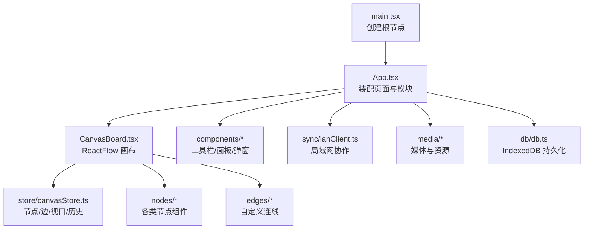
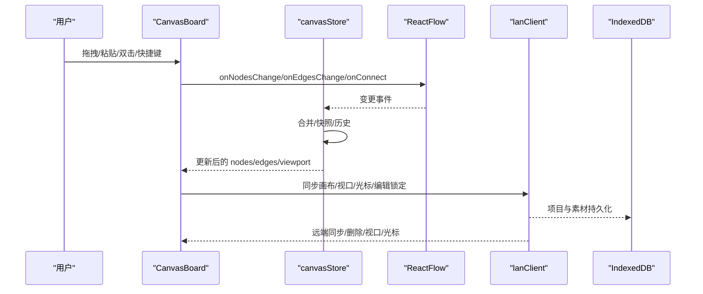
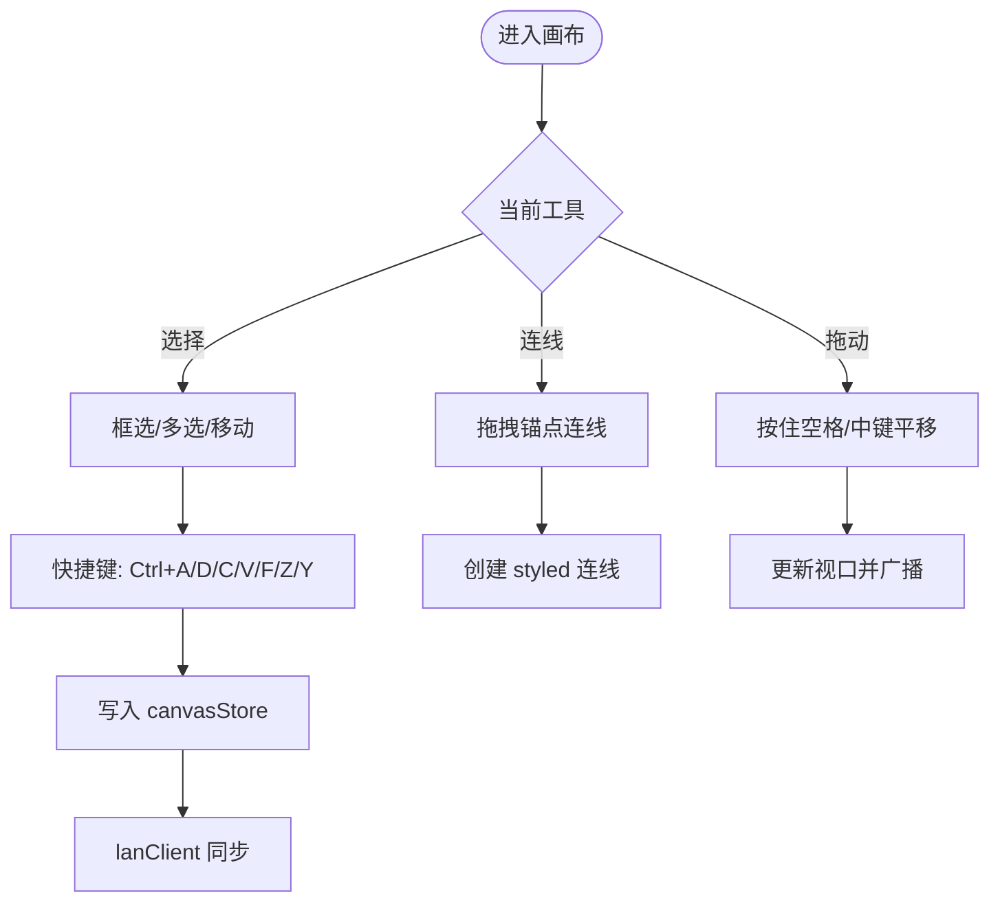
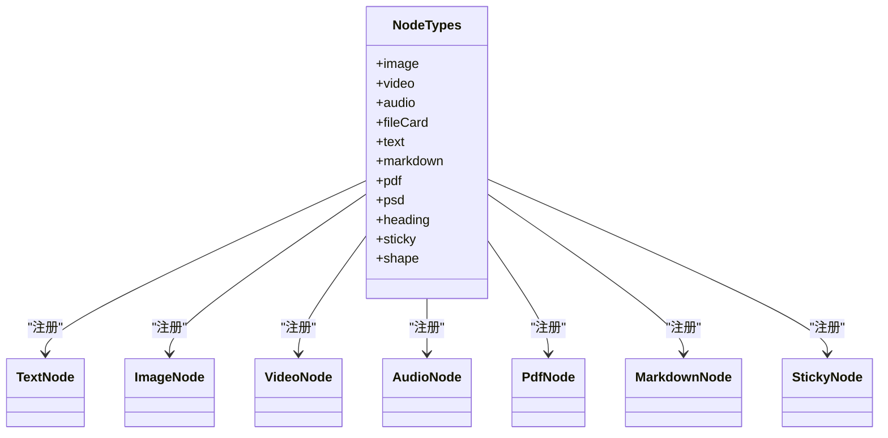
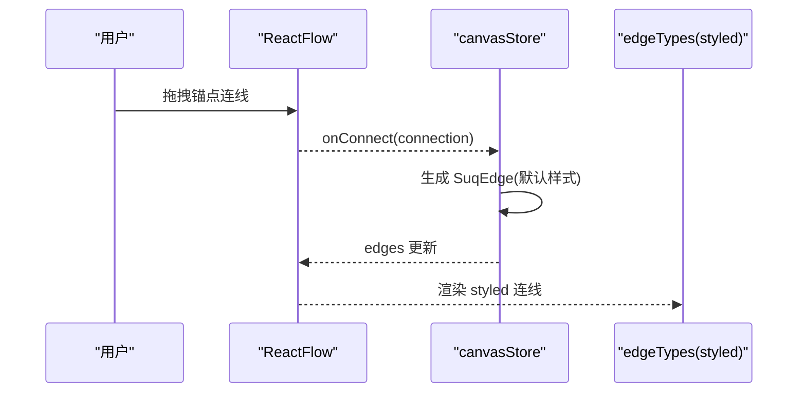
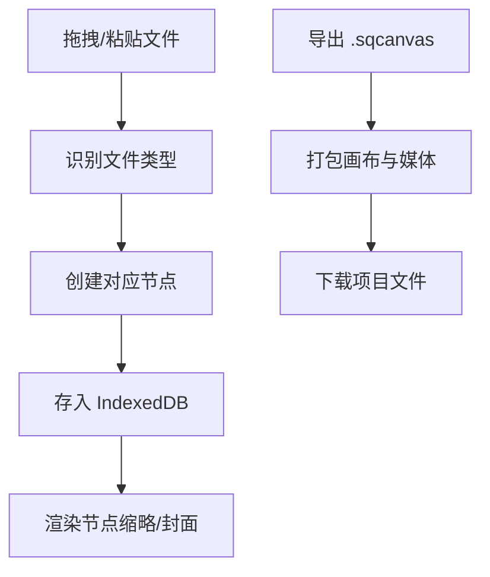
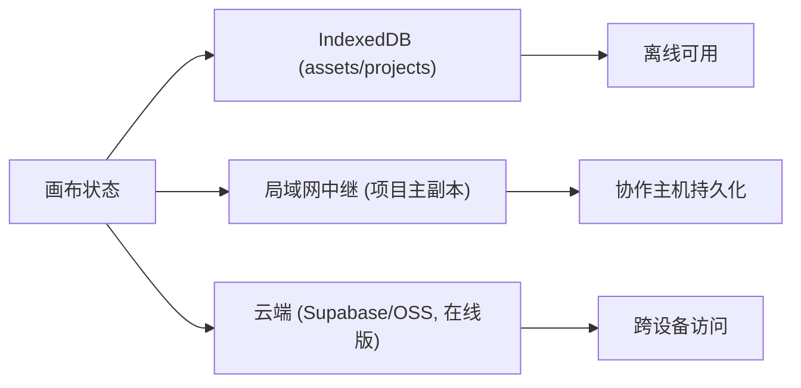
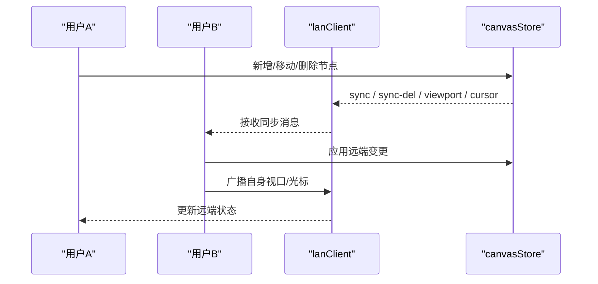
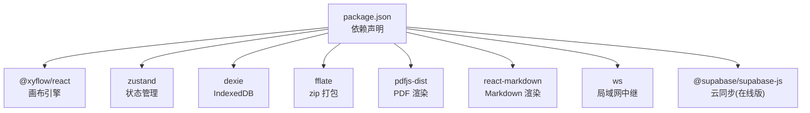

# 核心功能

<cite>
**本文引用的文件**
- [README.md](file://README.md)
- [package.json](file://package.json)
- [src/main.tsx](file://src/main.tsx)
- [src/App.tsx](file://src/App.tsx)
- [src/canvas/CanvasBoard.tsx](file://src/canvas/CanvasBoard.tsx)
- [src/store/canvasStore.ts](file://src/store/canvasStore.ts)
- [src/canvas/nodes/nodeTypes.ts](file://src/canvas/nodes/nodeTypes.ts)
- [src/canvas/nodes/TextNode.tsx](file://src/canvas/nodes/TextNode.tsx)
- [src/canvas/nodes/ImageNode.tsx](file://src/canvas/nodes/ImageNode.tsx)
- [src/canvas/nodes/VideoNode.tsx](file://src/canvas/nodes/VideoNode.tsx)
- [src/canvas/nodes/AudioNode.tsx](file://src/canvas/nodes/AudioNode.tsx)
- [src/canvas/nodes/PdfNode.tsx](file://src/canvas/nodes/PdfNode.tsx)
- [src/canvas/nodes/MarkdownNode.tsx](file://src/canvas/nodes/MarkdownNode.tsx)
- [src/canvas/nodes/StickyNode.tsx](file://src/canvas/nodes/StickyNode.tsx)
- [src/canvas/edges/edgeTypes.ts](file://src/canvas/edges/edgeTypes.ts)
- [src/sync/lanClient.ts](file://src/sync/lanClient.ts)
</cite>

## 目录
1. [简介](#简介)
2. [项目结构](#项目结构)
3. [核心组件](#核心组件)
4. [架构总览](#架构总览)
5. [详细组件分析](#详细组件分析)
6. [依赖关系分析](#依赖关系分析)
7. [性能考量](#性能考量)
8. [故障排查指南](#故障排查指南)
9. [结论](#结论)
10. [附录](#附录)

## 简介
SuQCanvas 是一款基于浏览器的无限画布应用，支持将图片、视频、音频、PDF、Markdown、文本等媒体与内容元素拖入同一张画布，通过连线组织关系，并自动保存在本地。它提供缩放、平移、选择、框选、快捷键操作、主题切换、导入导出、局域网多人协作等功能，适合知识整理、多媒体编排与团队协作场景。

## 项目结构
- 入口与装配：React 根节点渲染 App，App 中集成工具栏、画布、查看器弹窗、播放器、全局状态与通知等。
- 画布层：基于 React Flow（@xyflow/react）实现无限画布，封装节点类型、连线样式、拖放粘贴、快捷键、视口同步等。
- 数据与状态：Zustand 管理画布状态（节点、边、视口、撤销重做、对齐、层级）、项目与 UI 状态。
- 媒体处理：Blob URL 注册表、缩略图/封面生成、PDF 渲染、PSD 预览、播放列表解析等。
- 持久化与同步：IndexedDB（Dexie）本地存储；局域网 WebSocket 中继进行实时协作、素材分片传输、视口与光标同步。
- 构建与脚本：Vite 构建，区分在线版与局域网版；提供打包、局域网启动、防火墙放行等脚本。

**图表来源**
- [src/main.tsx:1-6](file://src/main.tsx#L1-L6)
- [src/App.tsx:1-74](file://src/App.tsx#L1-L74)
- [src/canvas/CanvasBoard.tsx:1-459](file://src/canvas/CanvasBoard.tsx#L1-L459)
- [src/store/canvasStore.ts:1-399](file://src/store/canvasStore.ts#L1-L399)
- [src/sync/lanClient.ts:1-800](file://src/sync/lanClient.ts#L1-L800)

**章节来源**
- [README.md:1-181](file://README.md#L1-L181)
- [package.json:1-52](file://package.json#L1-L52)
- [src/main.tsx:1-6](file://src/main.tsx#L1-L6)
- [src/App.tsx:1-74](file://src/App.tsx#L1-L74)

## 核心组件
- 画布容器 CanvasBoard：承载 ReactFlow，负责拖拽导入、粘贴图片、双击空白新建文本、快捷键（全选/复制/粘贴/适应视图/工具切换）、视口同步、局域网光标与编辑锁定、空画布引导、迷你地图与背景网格。
- 节点系统 nodeTypes：集中注册图像、视频、音频、文件卡片、文本、Markdown、PDF、PSD、标题、便签、形状等节点类型。
- 连线系统 edgeTypes：统一使用 styled 自定义连线，支持线型、路径、箭头、颜色与粗细等样式。
- 状态管理 canvasStore：维护节点、边、视口、撤销/重做历史、复制粘贴、对齐、层级、资产清理等。
- 局域网协作 lanClient：WebSocket 连接、房间级同步、删除传播、视口广播、光标同步、编辑锁定、素材分片传输、HTTP Range 流式拉取、断线重连与自动恢复。

**章节来源**
- [src/canvas/CanvasBoard.tsx:1-459](file://src/canvas/CanvasBoard.tsx#L1-L459)
- [src/canvas/nodes/nodeTypes.ts:1-27](file://src/canvas/nodes/nodeTypes.ts#L1-L27)
- [src/canvas/edges/edgeTypes.ts:1-7](file://src/canvas/edges/edgeTypes.ts#L1-L7)
- [src/store/canvasStore.ts:1-399](file://src/store/canvasStore.ts#L1-L399)
- [src/sync/lanClient.ts:1-800](file://src/sync/lanClient.ts#L1-L800)

## 架构总览
下图展示了从用户交互到状态更新、再到局域网同步与持久化的整体流程。

**图表来源**
- [src/canvas/CanvasBoard.tsx:1-459](file://src/canvas/CanvasBoard.tsx#L1-L459)
- [src/store/canvasStore.ts:1-399](file://src/store/canvasStore.ts#L1-L399)
- [src/sync/lanClient.ts:1-800](file://src/sync/lanClient.ts#L1-L800)

## 详细组件分析

### 无限画布：缩放、平移、选择与快捷键
- 缩放与平移：ReactFlow 原生滚轮缩放、捏合缩放、中键拖动平移；最小/最大缩放限制；F 键适应视图。
- 选择与框选：选择模式 Partial，支持多选；Ctrl+A 全选；Delete/Backspace 删除选中。
- 移动与连线：工具切换 V/C/H；空格临时平移；连线时连接半径自适应；禁止自连。
- 拖拽与粘贴：支持拖入文件到画布；剪贴板图片直接粘贴；空画布提示引导。
- 键盘快捷键：撤销/重做（Ctrl+Z/Y）、复制（Ctrl+C）、粘贴（Ctrl+V）、复制选中（Ctrl+D）。
- 局域网协同：鼠标位置广播、编辑锁定（他人编辑时禁用拖拽/调整尺寸）、跟随视口。

**图表来源**
- [src/canvas/CanvasBoard.tsx:1-459](file://src/canvas/CanvasBoard.tsx#L1-L459)
- [src/store/canvasStore.ts:1-399](file://src/store/canvasStore.ts#L1-L399)
- [src/sync/lanClient.ts:1-800](file://src/sync/lanClient.ts#L1-L800)

**章节来源**
- [src/canvas/CanvasBoard.tsx:1-459](file://src/canvas/CanvasBoard.tsx#L1-L459)
- [README.md:1-181](file://README.md#L1-L181)

### 节点类型与功能
- 文本节点：双击编辑，支持多行文本、垂直对齐、样式；可命名歌单并通过连线触发播放。
- 图片节点：自动适配尺寸，支持打开大图与下载；加载占位与淡入过渡；局域网编辑锁定。
- 视频节点：仅显示封面与播放按钮，点击打开全屏播放器；按缩略图尺寸自适应节点大小。
- 音频节点：内嵌播放控制与进度展示；支持下载；双击进入专用播放器页，沿连线顺序播放。
- PDF 节点：懒加载 pdfjs，首帧渲染为缩略图；支持查看完整文档与翻页。
- Markdown 节点：即时渲染，支持打开全文查看与下载；大文件限制与错误提示。
- 便签节点：彩色背景，双击编辑，支持文本样式与对齐。
- 其他：标题节点、形状节点、文件卡片节点用于通用文件展示。

**图表来源**
- [src/canvas/nodes/nodeTypes.ts:1-27](file://src/canvas/nodes/nodeTypes.ts#L1-L27)
- [src/canvas/nodes/TextNode.tsx:1-107](file://src/canvas/nodes/TextNode.tsx#L1-L107)
- [src/canvas/nodes/ImageNode.tsx:1-126](file://src/canvas/nodes/ImageNode.tsx#L1-L126)
- [src/canvas/nodes/VideoNode.tsx:1-88](file://src/canvas/nodes/VideoNode.tsx#L1-L88)
- [src/canvas/nodes/AudioNode.tsx:1-126](file://src/canvas/nodes/AudioNode.tsx#L1-L126)
- [src/canvas/nodes/PdfNode.tsx:1-90](file://src/canvas/nodes/PdfNode.tsx#L1-L90)
- [src/canvas/nodes/MarkdownNode.tsx:1-105](file://src/canvas/nodes/MarkdownNode.tsx#L1-L105)
- [src/canvas/nodes/StickyNode.tsx:1-85](file://src/canvas/nodes/StickyNode.tsx#L1-L85)

**章节来源**
- [src/canvas/nodes/nodeTypes.ts:1-27](file://src/canvas/nodes/nodeTypes.ts#L1-L27)
- [src/canvas/nodes/TextNode.tsx:1-107](file://src/canvas/nodes/TextNode.tsx#L1-L107)
- [src/canvas/nodes/ImageNode.tsx:1-126](file://src/canvas/nodes/ImageNode.tsx#L1-L126)
- [src/canvas/nodes/VideoNode.tsx:1-88](file://src/canvas/nodes/VideoNode.tsx#L1-L88)
- [src/canvas/nodes/AudioNode.tsx:1-126](file://src/canvas/nodes/AudioNode.tsx#L1-L126)
- [src/canvas/nodes/PdfNode.tsx:1-90](file://src/canvas/nodes/PdfNode.tsx#L1-L90)
- [src/canvas/nodes/MarkdownNode.tsx:1-105](file://src/canvas/nodes/MarkdownNode.tsx#L1-L105)
- [src/canvas/nodes/StickyNode.tsx:1-85](file://src/canvas/nodes/StickyNode.tsx#L1-L85)

### 连线系统：工作原理与自定义实现
- 连线创建：ReactFlow 的 onConnect 在 canvasStore 中生成默认样式的 styled 连线，包含线型、路径、箭头、颜色与粗细等元数据。
- 自定义连线：通过 edgeTypes 注册 styled 连线类型，统一渲染逻辑与样式。
- 批量编辑：选中连线后可在右侧面板统一修改样式（由 Inspector 驱动，具体样式字段见类型定义）。
- 防误连：禁止源与目标相同；连接半径根据工具动态调整。

**图表来源**
- [src/canvas/CanvasBoard.tsx:1-459](file://src/canvas/CanvasBoard.tsx#L1-L459)
- [src/store/canvasStore.ts:1-399](file://src/store/canvasStore.ts#L1-L399)
- [src/canvas/edges/edgeTypes.ts:1-7](file://src/canvas/edges/edgeTypes.ts#L1-L7)

**章节来源**
- [src/store/canvasStore.ts:146-158](file://src/store/canvasStore.ts#L146-L158)
- [src/canvas/edges/edgeTypes.ts:1-7](file://src/canvas/edges/edgeTypes.ts#L1-L7)
- [src/canvas/CanvasBoard.tsx:336-379](file://src/canvas/CanvasBoard.tsx#L336-L379)

### 媒体导入导出：识别与处理
- 导入：支持拖拽与粘贴图片；文件识别与分类由 fileLoader 完成；不同格式对应不同节点类型。
- 导出：一键导出 .sqcanvas 项目文件（zip 打包画布与原始媒体），可在任意浏览器导入还原。
- 媒体资源：以 Blob 形式存储在 IndexedDB；通过 useAssetUrl 获取安全 URL；视频封面按需抓取；音频封面与播放列表解析。
- 文件格式：图片（PNG/JPG/GIF/WebP/SVG）、视频（MP4/WebM/MOV）、音频（MP3/WAV/OGG）、PDF、Markdown、PSD 等。

**图表来源**
- [src/canvas/CanvasBoard.tsx:210-334](file://src/canvas/CanvasBoard.tsx#L210-L334)
- [README.md:21-27](file://README.md#L21-L27)

**章节来源**
- [README.md:21-27](file://README.md#L21-L27)
- [src/canvas/CanvasBoard.tsx:210-334](file://src/canvas/CanvasBoard.tsx#L210-L334)

### 数据持久化机制：本地存储与云端同步
- 本地持久化：所有媒体以 Blob 存入 IndexedDB（Dexie），画布状态与视口自动保存；支持多项目管理与恢复。
- 云端同步（在线版）：通过 Supabase 与 OSS 进行账号登录、云同步与媒体存储（由构建模式决定）。
- 局域网持久化：项目主副本保存在运行中继服务的设备；删除项目保留 24 小时备份；未引用素材同样保留后清理。

**图表来源**
- [README.md:21-27](file://README.md#L21-L27)
- [README.md:76-94](file://README.md#L76-L94)
- [src/sync/lanClient.ts:454-492](file://src/sync/lanClient.ts#L454-L492)

**章节来源**
- [README.md:21-27](file://README.md#L21-L27)
- [README.md:76-94](file://README.md#L76-L94)
- [src/sync/lanClient.ts:454-492](file://src/sync/lanClient.ts#L454-L492)

### 局域网协作：多人实时编辑、光标同步与冲突解决
- 连接与会话：首次填写中继地址与协作名称；支持 HTTPS 反向代理；自动重连与断线恢复。
- 房间级同步：加入项目后，仅在该房间内同步画布、视口与素材；不同项目互不干扰。
- 画布同步：增量同步与并集合并；显式删除消息（sync-del）避免“复活”；墓碑机制防止晚到旧快照覆盖。
- 视口与光标：广播视口变化，支持跟随他人视口；广播鼠标位置，显示远程光标。
- 编辑锁定：当某用户在编辑某节点时，其他人无法移动或调整该节点；编辑结束释放锁定。
- 活动记录：合并批量操作的活动通知，避免刷屏。
- 素材传输：分片传输与空闲超时；支持 HTTP Range 流式拉取（视频）；封面随资产一起传输。

**图表来源**
- [src/sync/lanClient.ts:527-642](file://src/sync/lanClient.ts#L527-L642)
- [src/sync/lanClient.ts:655-756](file://src/sync/lanClient.ts#L655-L756)
- [src/canvas/CanvasBoard.tsx:88-102](file://src/canvas/CanvasBoard.tsx#L88-L102)

**章节来源**
- [src/sync/lanClient.ts:1-800](file://src/sync/lanClient.ts#L1-L800)
- [src/canvas/CanvasBoard.tsx:88-102](file://src/canvas/CanvasBoard.tsx#L88-L102)

### 使用示例与最佳实践
- 快速上手
  - 拖入图片或视频到画布，自动生成对应节点；双击空白处新建文本。
  - 使用 V/C/H 切换选择/连线/拖动工具；空格临时平移。
  - 滚轮缩放、中键拖动平移；F 键适应视图。
- 高效协作
  - 首次输入中继地址与协作名称；加入项目房间后开始协作。
  - 关注活动记录了解他人操作；避免同时编辑同一节点。
  - 大文件优先使用 HTTP Range 流式拉取（视频），减少带宽占用。
- 媒体管理
  - 音频节点双击进入播放器页，沿连线顺序连续播放。
  - PDF 节点首帧渲染，点击查看全部；Markdown 节点支持全文查看与下载。
  - 图片节点支持打开大图与下载；视频节点仅封面展示，点击播放。
- 数据保护
  - 定期导出 .sqcanvas 项目文件备份；局域网环境建议备份 server/data/。
  - 利用撤销/重做（Ctrl+Z/Y）快速回退误操作。

[无具体代码片段，参考上方各节“章节来源”中的文件路径]

## 依赖关系分析
- 框架与引擎：React + TypeScript + Vite；画布引擎 @xyflow/react。
- 状态与存储：Zustand 状态管理；Dexie 操作 IndexedDB；fflate 用于 zip 打包导出。
- 媒体与渲染：pdfjs-dist 渲染 PDF；react-markdown 渲染 Markdown；ag-psd 支持 PSD 预览。
- 网络与协作：ws 作为局域网中继依赖；Supabase/OSS 用于在线版云同步。
- 样式与工具：Tailwind CSS v4；oxlint 静态检查；vitest 测试。

**图表来源**
- [package.json:22-35](file://package.json#L22-L35)

**章节来源**
- [package.json:1-52](file://package.json#L1-L52)

## 性能考量
- 懒加载与按需渲染：PDF 首帧渲染、Markdown 内容截取、视频仅封面展示，降低初始负载。
- 视口与同步节流：画布同步与视口广播采用定时器合并，减少高频消息。
- 素材分片传输：大文件分片发送，空闲超时判定失败，支持断点续传与 HTTP Range 流式拉取。
- 内存优化：分片直接存解码字节，避免拼接整个 base64；封面缓存与去重推送。
- 节点尺寸自适应：图片与视频根据自然尺寸与最大宽高限制自动适配，避免过大节点影响性能。

[本节为通用指导，无需特定文件来源]

## 故障排查指南
- 连接问题
  - 检查中继地址是否合法（ws/wss），HTTPS 页面需使用 wss。
  - 确认反向代理配置正确（Nginx 转发 /lan-ws）。
  - 断线后会自动重试；若失败，检查防火墙与端口开放。
- 素材加载失败
  - 视频封面跨域：确保 /SuQCanvas/assets/ 被反代到中继。
  - 大文件传输中断：等待空闲超时或重新请求；查看活动记录定位问题。
- 协作冲突
  - 编辑锁定时无法移动/调整节点；等待对方结束编辑。
  - 删除后“复活”：检查 sync-del 是否到达；确认墓碑窗口期。
- 导出导入
  - 导出失败：检查浏览器权限与磁盘空间。
  - 导入异常：确认 .sqcanvas 文件完整性与版本兼容。

**章节来源**
- [src/sync/lanClient.ts:19-57](file://src/sync/lanClient.ts#L19-L57)
- [src/sync/lanClient.ts:119-152](file://src/sync/lanClient.ts#L119-L152)
- [src/sync/lanClient.ts:578-598](file://src/sync/lanClient.ts#L578-L598)
- [README.md:98-122](file://README.md#L98-L122)

## 结论
SuQCanvas 以 React Flow 为基础，构建了功能完备的无限画布系统，涵盖丰富的节点类型、灵活的连线系统、完善的媒体处理能力与强大的局域网协作能力。通过本地 IndexedDB 与可选云端同步，保障数据安全与可用性；借助节流、懒加载与分片传输等策略，兼顾性能与体验。对于需要可视化编排与团队协作的场景，SuQCanvas 提供了开箱即用的解决方案。

[本节为总结性内容，无需特定文件来源]

## 附录
- 快捷键速查：左键拖动空白框选、中键拖动平移、滚轮缩放、双击空白新建文本、Ctrl+A 全选、Ctrl+D 复制、Ctrl+V 粘贴图片、F 适应视图、Delete/Backspace 删除。
- 构建与部署：在线版与局域网版分别构建；局域网版需启动中继服务并配置反向代理；Windows 首次启动需放行防火墙。
- 数据备份：建议定期备份 server/data/ 目录；本地可使用导出 .sqcanvas 文件迁移。

[本节为补充信息，无需特定文件来源]