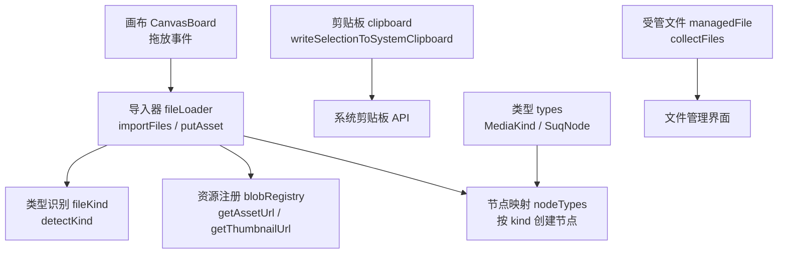
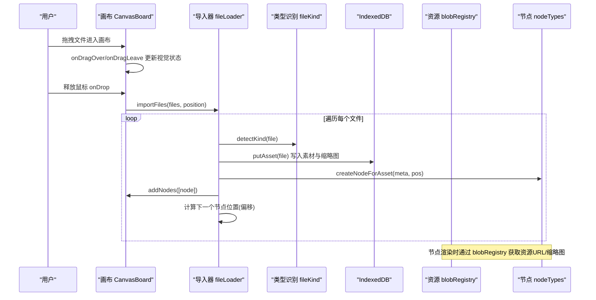
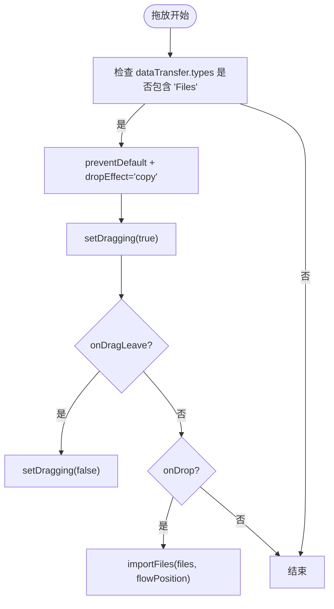
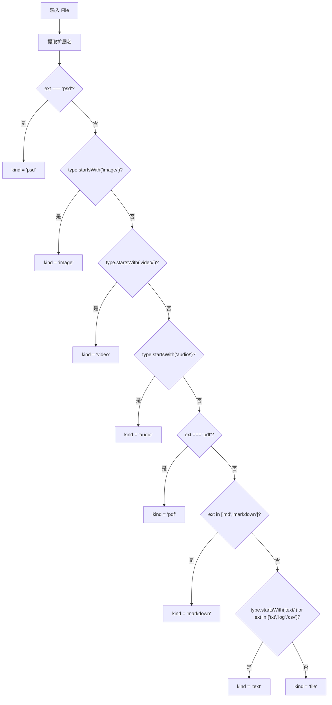
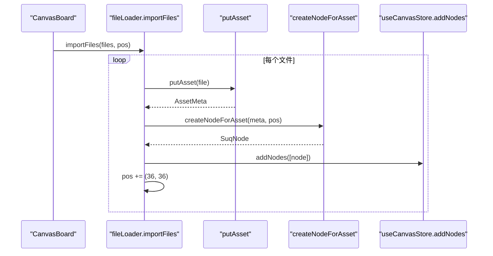
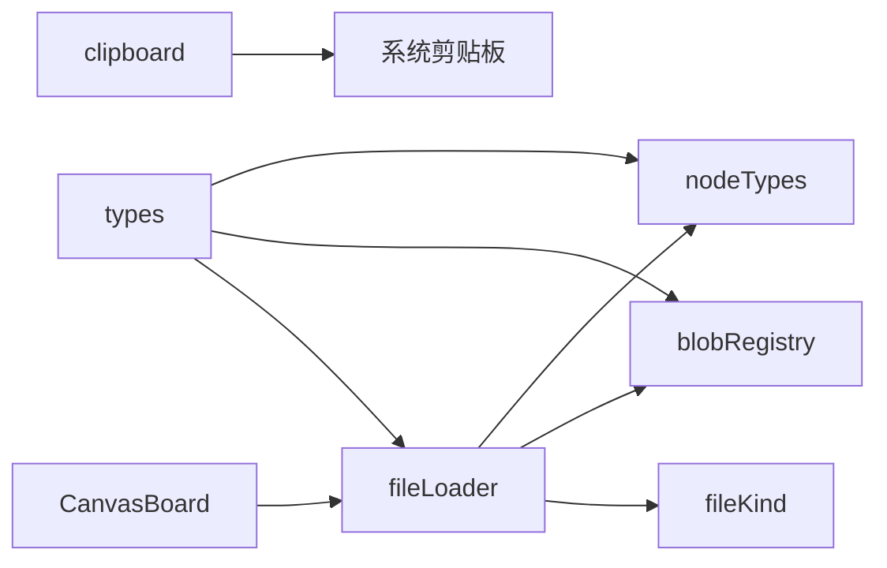

# 文件拖放系统

<cite>
**本文引用的文件**
- [CanvasBoard.tsx](file://src/canvas/CanvasBoard.tsx)
- [fileLoader.ts](file://src/io/fileLoader.ts)
- [fileKind.ts](file://src/media/fileKind.ts)
- [blobRegistry.ts](file://src/media/blobRegistry.ts)
- [clipboard.ts](file://src/canvas/clipboard.ts)
- [nodeTypes.ts](file://src/canvas/nodes/nodeTypes.ts)
- [types.ts](file://src/types.ts)
- [managedFile.ts](file://src/media/managedFile.ts)
</cite>

## 目录
1. [简介](#简介)
2. [项目结构](#项目结构)
3. [核心组件](#核心组件)
4. [架构总览](#架构总览)
5. [详细组件分析](#详细组件分析)
6. [依赖关系分析](#依赖关系分析)
7. [性能考虑](#性能考虑)
8. [故障排查指南](#故障排查指南)
9. [结论](#结论)

## 简介
本文件为 SuQCanvas 的“文件拖放系统”提供完整技术文档，覆盖以下方面：
- 拖放区域的检测与视觉反馈
- 支持的文件类型及自动识别分类
- 文件导入到画布的解析、节点创建与位置计算
- 错误处理与异常恢复机制
- 剪贴板粘贴文件的支持
- 性能优化建议与用户体验改进方案

## 项目结构
SuQCanvas 将文件拖放能力拆分为多个职责清晰的模块：
- 画布层：监听拖放事件并触发导入流程
- 资源层：文件识别、存储、缩略图生成与 URL 管理
- 节点层：根据文件类型创建对应节点并渲染
- 剪贴板：复制/粘贴图片与文本内容
- 类型与工具：统一的类型定义与辅助函数

图表来源
- [CanvasBoard.tsx:210-232](file://src/canvas/CanvasBoard.tsx#L210-L232)
- [fileLoader.ts:77-205](file://src/io/fileLoader.ts#L77-L205)
- [fileKind.ts:3-16](file://src/media/fileKind.ts#L3-L16)
- [blobRegistry.ts:84-126](file://src/media/blobRegistry.ts#L84-L126)
- [nodeTypes.ts:14-26](file://src/canvas/nodes/nodeTypes.ts#L14-L26)
- [clipboard.ts:114-131](file://src/canvas/clipboard.ts#L114-L131)
- [types.ts:3-14](file://src/types.ts#L3-L14)
- [managedFile.ts:17-38](file://src/media/managedFile.ts#L17-L38)

章节来源
- [CanvasBoard.tsx:210-232](file://src/canvas/CanvasBoard.tsx#L210-L232)
- [fileLoader.ts:77-205](file://src/io/fileLoader.ts#L77-L205)
- [fileKind.ts:3-16](file://src/media/fileKind.ts#L3-L16)
- [blobRegistry.ts:84-126](file://src/media/blobRegistry.ts#L84-L126)
- [nodeTypes.ts:14-26](file://src/canvas/nodes/nodeTypes.ts#L14-L26)
- [clipboard.ts:114-131](file://src/canvas/clipboard.ts#L114-L131)
- [types.ts:3-14](file://src/types.ts#L3-L14)
- [managedFile.ts:17-38](file://src/media/managedFile.ts#L17-L38)

## 核心组件
- 拖放入口（CanvasBoard）
  - 在画布容器上监听 onDragOver、onDragLeave、onDrop，完成拖放区域检测与状态切换。
  - 将 drop 坐标转换为画布坐标系后调用 importFiles。
- 文件导入（fileLoader）
  - 统一入口 importFiles：校验大小、持久化存储请求、逐个 putAsset、创建节点、偏移排列。
  - putAsset：识别类型、生成缩略图（视频/PSD）、写入 IndexedDB、同步到局域网/OSS。
  - createNodeForAsset：根据 MediaKind 映射到节点类型，设置默认尺寸与数据字段。
- 类型识别（fileKind）
  - detectKind：基于 MIME 与扩展名判断 image/video/audio/pdf/markdown/text/psd/file。
- 资源与 URL（blobRegistry）
  - getAssetUrl/getAssetBlob：本地优先、HTTP 流式回退、云端拉取、局域网传输等待。
  - getThumbnailUrl：视频封面抓帧、并发控制、黑帧自检与重抓、缓存与失效。
- 节点类型（nodeTypes）
  - 将 MediaKind 映射到具体 React Flow 节点组件（image/video/audio/pdf/psd/markdown/text/fileCard/heading/sticky/shape）。
- 剪贴板（clipboard）
  - writeSelectionToSystemClipboard：单个图片/PSD 复制为 PNG，否则复制文本；兼容降级策略。

章节来源
- [CanvasBoard.tsx:210-232](file://src/canvas/CanvasBoard.tsx#L210-L232)
- [fileLoader.ts:77-205](file://src/io/fileLoader.ts#L77-L205)
- [fileKind.ts:3-16](file://src/media/fileKind.ts#L3-L16)
- [blobRegistry.ts:84-126](file://src/media/blobRegistry.ts#L84-L126)
- [nodeTypes.ts:14-26](file://src/canvas/nodes/nodeTypes.ts#L14-L26)
- [clipboard.ts:114-131](file://src/canvas/clipboard.ts#L114-L131)

## 架构总览
下图展示了从用户拖放到节点落地的完整调用链路与关键决策点。

图表来源
- [CanvasBoard.tsx:210-232](file://src/canvas/CanvasBoard.tsx#L210-L232)
- [fileLoader.ts:77-205](file://src/io/fileLoader.ts#L77-L205)
- [fileKind.ts:3-16](file://src/media/fileKind.ts#L3-L16)
- [blobRegistry.ts:84-126](file://src/media/blobRegistry.ts#L84-L126)
- [nodeTypes.ts:14-26](file://src/canvas/nodes/nodeTypes.ts#L14-L26)

## 详细组件分析

### 拖放区域检测与视觉反馈
- 拖放进入：onDragOver 中检查 dataTransfer.types 包含 Files，阻止默认行为并设置 dropEffect='copy'，同时设置 dragging=true 以启用高亮样式。
- 离开区域：onDragLeave 判断相关目标是否仍在当前元素内，若否则重置 dragging=false。
- 放置：onDrop 读取 files，转换为画布坐标后调用 importFiles，并重置 dragging。

图表来源
- [CanvasBoard.tsx:210-232](file://src/canvas/CanvasBoard.tsx#L210-L232)

章节来源
- [CanvasBoard.tsx:210-232](file://src/canvas/CanvasBoard.tsx#L210-L232)

### 文件类型支持与自动识别
- 支持的媒体与文档类型：
  - 图片：image/*（含 PSD）
  - 视频：video/*
  - 音频：audio/*
  - PDF：application/pdf
  - Markdown：text/markdown 或 .md/.markdown
  - 文本：text/* 或 txt/log/csv
  - 其他：未匹配到的通用文件
- 识别逻辑：
  - 优先扩展名（如 psd），其次 MIME 前缀（image/video/audio/text），最后兜底为 file。

图表来源
- [fileKind.ts:3-16](file://src/media/fileKind.ts#L3-L16)

章节来源
- [fileKind.ts:3-16](file://src/media/fileKind.ts#L3-L16)

### 文件导入到画布：解析、节点创建与位置计算
- 入口 importFiles：
  - 请求持久化存储（避免 IndexedDB 容量限制）
  - 对每个文件执行 putAsset -> createNodeForAsset -> addNodes
  - 节点位置按固定步长偏移，形成瀑布式布局
- putAsset：
  - 识别类型、生成缩略图（视频/PSD）
  - 写入 IndexedDB 并构建 AssetMeta
  - 异步推送到局域网与 OSS（失败不影响主流程）
- createNodeForAsset：
  - 依据 MediaKind 选择节点类型与默认尺寸
  - 填充 kind、assetId、label、fileSize、mime、borderColor 等字段

图表来源
- [fileLoader.ts:77-205](file://src/io/fileLoader.ts#L77-L205)

章节来源
- [fileLoader.ts:77-205](file://src/io/fileLoader.ts#L77-L205)

### 节点渲染与资源加载
- 节点类型映射：MediaKind 到具体节点组件（image/video/audio/pdf/psd/markdown/text/fileCard/heading/sticky/shape）。
- 资源 URL 获取：
  - 优先本地 Blob URL
  - 视频可使用局域网 HTTP Range 流式地址（边下边播）
  - 缺失时从云端下载或等待局域网传输
- 缩略图：
  - 视频：抓帧生成 JPEG，并发上限控制，黑帧检测与重试
  - PSD：生成预览图
  - 缓存与失效：urlCache/thumbCache 管理，必要时撤销 URL 释放内存

章节来源
- [nodeTypes.ts:14-26](file://src/canvas/nodes/nodeTypes.ts#L14-L26)
- [blobRegistry.ts:84-126](file://src/media/blobRegistry.ts#L84-L126)
- [blobRegistry.ts:310-379](file://src/media/blobRegistry.ts#L310-L379)

### 剪贴板粘贴文件支持
- 复制：
  - 单个图片/PSD 节点：尝试导出 PNG 写入系统剪贴板
  - 其他节点：提取文本行写入系统剪贴板
  - 兼容降级：现代 Clipboard API 失败时回退到 execCommand
- 粘贴：
  - 浏览器原生粘贴由操作系统/应用驱动，SuQCanvas 侧主要实现“复制到系统剪贴板”，以便在其他应用中粘贴图片或文本。

章节来源
- [clipboard.ts:114-131](file://src/canvas/clipboard.ts#L114-L131)
- [clipboard.ts:46-107](file://src/canvas/clipboard.ts#L46-L107)

### 错误处理与异常恢复
- 文件大小限制：超过阈值跳过并提示
- 缩略图生成失败：
  - 视频：捕获异常并忽略，继续导入
  - PSD：生成失败时提示仍可下载原文件
- 网络与同步：
  - 局域网/OSS 推送失败仅记录日志并提示，不阻塞导入
- 资源获取：
  - 本地无资源时尝试云端下载或局域网传输等待
  - 视频封面抓帧失败时进行多次重试与回退策略

章节来源
- [fileLoader.ts:184-205](file://src/io/fileLoader.ts#L184-L205)
- [fileLoader.ts:20-89](file://src/io/fileLoader.ts#L20-L89)
- [blobRegistry.ts:128-239](file://src/media/blobRegistry.ts#L128-L239)
- [blobRegistry.ts:310-379](file://src/media/blobRegistry.ts#L310-L379)

## 依赖关系分析
- 松耦合设计：
  - 拖放事件与导入逻辑解耦，便于替换或扩展
  - 类型识别独立于导入流程，可复用
  - 资源管理与节点渲染通过 assetId 关联，降低耦合
- 关键依赖链：
  - CanvasBoard -> fileLoader -> fileKind -> blobRegistry -> nodeTypes
  - clipboard -> 系统剪贴板 API
  - types 贯穿各模块，保证数据结构一致

图表来源
- [CanvasBoard.tsx:210-232](file://src/canvas/CanvasBoard.tsx#L210-L232)
- [fileLoader.ts:77-205](file://src/io/fileLoader.ts#L77-L205)
- [fileKind.ts:3-16](file://src/media/fileKind.ts#L3-L16)
- [blobRegistry.ts:84-126](file://src/media/blobRegistry.ts#L84-L126)
- [nodeTypes.ts:14-26](file://src/canvas/nodes/nodeTypes.ts#L14-L26)
- [clipboard.ts:114-131](file://src/canvas/clipboard.ts#L114-L131)
- [types.ts:3-14](file://src/types.ts#L3-L14)

## 性能考虑
- 缩略图生成并发控制：
  - 限制同时抓帧数量，避免占满浏览器连接池导致播放卡顿
- 懒加载与缓存：
  - 资源 URL 与缩略图缓存，减少重复 IO
  - 视频优先使用 HTTP Range 流式地址，避免整文件下载到内存
- 大文件保护：
  - 单文件大小限制，防止内存溢出
- 内存管理：
  - 及时撤销不再使用的 Blob URL，避免泄漏
- 建议优化：
  - 批量导入时合并状态更新，减少重绘
  - 对超大图片/视频进行前端压缩或分片加载
  - 增加进度反馈与取消机制，提升交互体验

[本节为通用性能指导，无需特定文件引用]

## 故障排查指南
- 拖放无响应
  - 检查 onDragOver 是否正确阻止默认行为并设置 dropEffect
  - 确认 dataTransfer.types 包含 Files
- 文件未显示或节点空白
  - 查看 getAssetUrl/getAssetBlob 是否成功返回资源
  - 检查局域网/OSS 配置与权限
- 视频封面为黑屏
  - 检查抓帧逻辑与跨域设置（crossOrigin）
  - 观察是否命中黑帧检测并重试
- 剪贴板复制失败
  - 确认浏览器支持 ClipboardItem
  - 回退到 execCommand 是否成功

章节来源
- [CanvasBoard.tsx:210-232](file://src/canvas/CanvasBoard.tsx#L210-L232)
- [blobRegistry.ts:128-239](file://src/media/blobRegistry.ts#L128-L239)
- [clipboard.ts:90-107](file://src/canvas/clipboard.ts#L90-L107)

## 结论
SuQCanvas 的文件拖放系统通过清晰的分层设计与完善的错误恢复机制，实现了从拖放到节点渲染的端到端流程。其核心优势包括：
- 多格式支持：图片、视频、音频、PDF、Markdown、文本与通用文件
- 智能识别：基于 MIME 与扩展名的可靠分类
- 高效渲染：资源缓存、流式加载与并发控制
- 健壮性：多层异常处理与降级策略
- 易用性：直观的拖放反馈与剪贴板集成

建议在后续迭代中持续优化大文件处理、增强进度反馈，并完善跨平台兼容性测试，以提升整体用户体验。