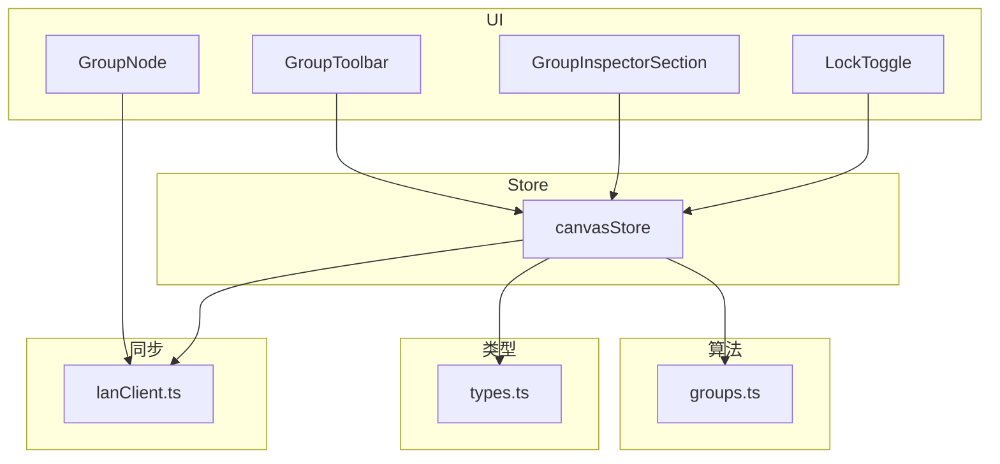
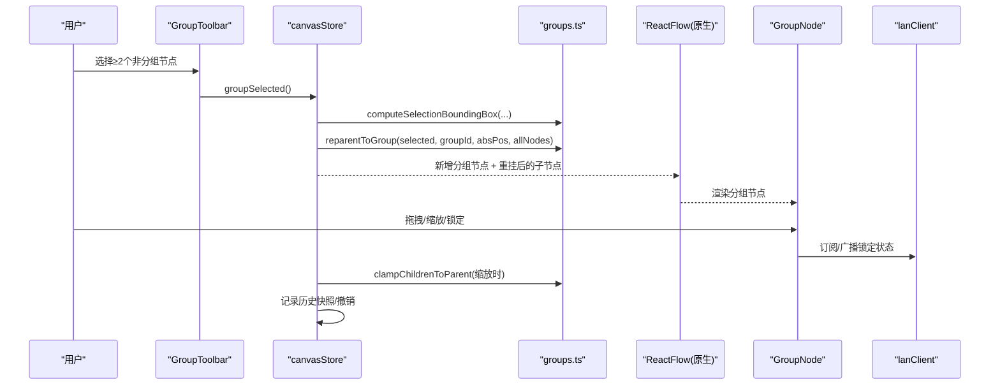
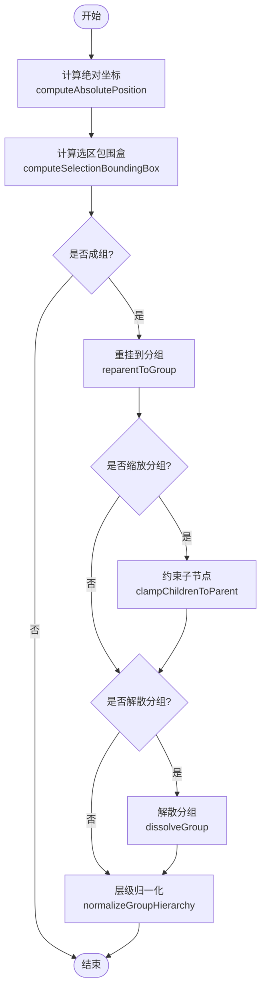
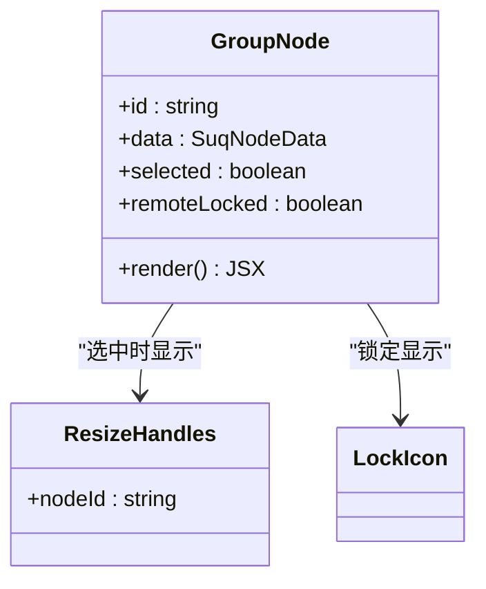
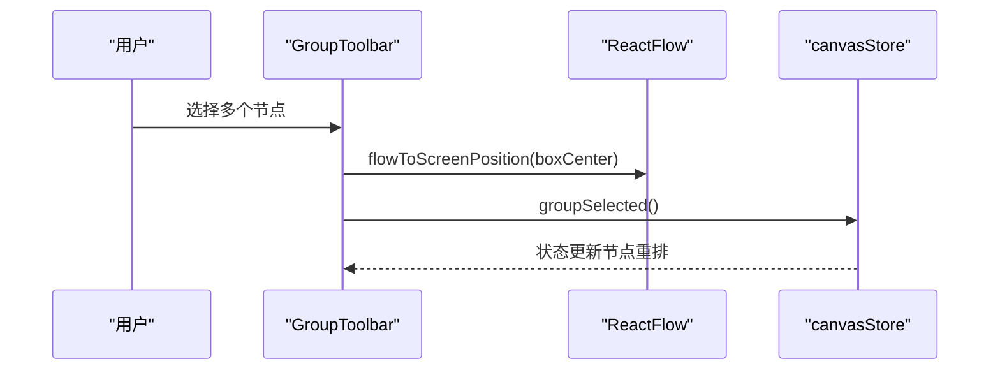
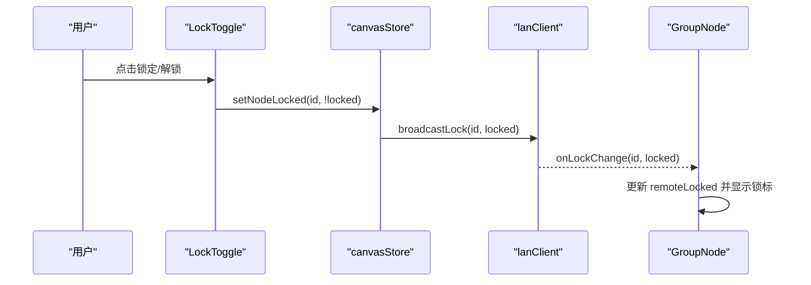
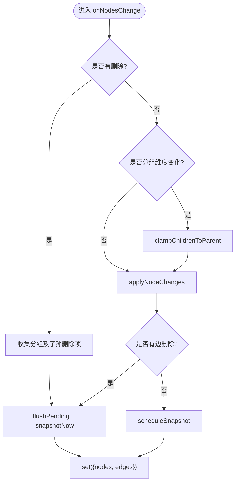
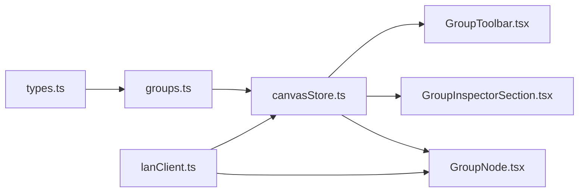

# 画布分组系统

<cite>
**本文引用的文件**
- [src/canvas/groups.ts](file://src/canvas/groups.ts)
- [src/canvas/nodes/GroupNode.tsx](file://src/canvas/nodes/GroupNode.tsx)
- [src/components/GroupInspectorSection.tsx](file://src/components/GroupInspectorSection.tsx)
- [src/components/GroupToolbar.tsx](file://src/components/GroupToolbar.tsx)
- [src/store/canvasStore.ts](file://src/store/canvasStore.ts)
- [src/types.ts](file://src/types.ts)
- [src/components/LockToggle.tsx](file://src/components/LockToggle.tsx)
- [src/sync/lanClient.ts](file://src/sync/lanClient.ts)
- [src/canvas/groups.test.ts](file://src/canvas/groups.test.ts)
</cite>

## 目录
1. [简介](#简介)
2. [项目结构](#项目结构)
3. [核心组件](#核心组件)
4. [架构总览](#架构总览)
5. [详细组件分析](#详细组件分析)
6. [依赖关系分析](#依赖关系分析)
7. [性能考量](#性能考量)
8. [故障排查指南](#故障排查指南)
9. [结论](#结论)
10. [附录](#附录)

## 简介
本仓库实现了一个基于 React Flow 的“画布分组系统”。它允许用户将多个节点组合为一个可拖拽、可缩放、可锁定的分组容器，支持嵌套分组、解散分组、按选区成组、子节点约束在父框内、以及局域网锁定状态广播等能力。系统通过纯函数计算绝对坐标与层级归一化，结合 Zustand store 管理状态变更与撤销历史，并在 UI 层提供分组工具栏、检查器面板与分组节点渲染。

## 项目结构
围绕分组能力的核心文件分布如下：
- 分组算法与数据操作：src/canvas/groups.ts
- 分组节点渲染：src/canvas/nodes/GroupNode.tsx
- 分组相关 UI：src/components/GroupToolbar.tsx、src/components/GroupInspectorSection.tsx、src/components/LockToggle.tsx
- 状态管理与业务逻辑：src/store/canvasStore.ts
- 类型定义（含分组字段）：src/types.ts
- 局域网锁定同步：src/sync/lanClient.ts
- 单元测试覆盖：src/canvas/groups.test.ts

图表来源
- [src/components/GroupToolbar.tsx:1-39](file://src/components/GroupToolbar.tsx#L1-L39)
- [src/components/GroupInspectorSection.tsx:1-70](file://src/components/GroupInspectorSection.tsx#L1-L70)
- [src/components/LockToggle.tsx:1-20](file://src/components/LockToggle.tsx#L1-L20)
- [src/canvas/nodes/GroupNode.tsx:1-54](file://src/canvas/nodes/GroupNode.tsx#L1-L54)
- [src/store/canvasStore.ts:1-547](file://src/store/canvasStore.ts#L1-L547)
- [src/canvas/groups.ts:1-205](file://src/canvas/groups.ts#L1-L205)
- [src/types.ts:66-130](file://src/types.ts#L66-L130)
- [src/sync/lanClient.ts:1-200](file://src/sync/lanClient.ts#L1-L200)

章节来源
- [src/canvas/groups.ts:1-205](file://src/canvas/groups.ts#L1-L205)
- [src/store/canvasStore.ts:1-547](file://src/store/canvasStore.ts#L1-L547)
- [src/types.ts:66-130](file://src/types.ts#L66-L130)

## 核心组件
- 分组算法模块（groups.ts）
  - 提供绝对坐标计算、后代收集、选区包围盒、重挂到分组、解散分组、子节点约束、层级归一化等纯函数。
- 分组节点渲染（GroupNode.tsx）
  - 渲染半透明背景、标题栏、锁标；选中时显示缩放手柄；订阅局域网锁定事件即时反馈。
- 分组工具栏（GroupToolbar.tsx）
  - 当选择≥2个非分组节点且处于选择工具时，在选区顶部中央显示“组合”按钮，点击调用 store 的 groupSelected。
- 分组检查器（GroupInspectorSection.tsx）
  - 提供分组名称编辑、尺寸只读展示、锁定开关、解散分组入口。
- 锁定开关（LockToggle.tsx）
  - 切换节点 locked 状态并触发 store 更新与局域网广播。
- Store（canvasStore.ts）
  - 维护 nodes/edges/viewport/history，处理 onNodesChange/onEdgesChange/onConnect，实现成组、解散、删除分组及子孙、对齐、复制粘贴、撤销/重做、锁定等。

章节来源
- [src/canvas/groups.ts:1-205](file://src/canvas/groups.ts#L1-L205)
- [src/canvas/nodes/GroupNode.tsx:1-54](file://src/canvas/nodes/GroupNode.tsx#L1-L54)
- [src/components/GroupToolbar.tsx:1-39](file://src/components/GroupToolbar.tsx#L1-L39)
- [src/components/GroupInspectorSection.tsx:1-70](file://src/components/GroupInspectorSection.tsx#L1-L70)
- [src/components/LockToggle.tsx:1-20](file://src/components/LockToggle.tsx#L1-L20)
- [src/store/canvasStore.ts:1-547](file://src/store/canvasStore.ts#L1-L547)

## 架构总览
分组系统的整体交互流程如下：
- 用户在画布上多选节点后，GroupToolbar 计算选区包围盒并定位“组合”按钮。
- 点击“组合”触发 canvasStore.groupSelected，创建分组节点并将选中节点重挂为子节点。
- 分组节点由 GroupNode 渲染，支持拖拽移动、缩放（子节点被约束在父框内）、锁定。
- 在 Inspector 中可对分组进行命名、查看尺寸、锁定/解锁、解散分组。
- 锁定状态通过 lanClient 广播，其他客户端实时显示锁标。

图表来源
- [src/components/GroupToolbar.tsx:1-39](file://src/components/GroupToolbar.tsx#L1-L39)
- [src/store/canvasStore.ts:464-509](file://src/store/canvasStore.ts#L464-L509)
- [src/canvas/groups.ts:71-116](file://src/canvas/groups.ts#L71-L116)
- [src/canvas/nodes/GroupNode.tsx:1-54](file://src/canvas/nodes/GroupNode.tsx#L1-L54)
- [src/sync/lanClient.ts:1-200](file://src/sync/lanClient.ts#L1-L200)

## 详细组件分析

### 分组算法（groups.ts）
- 绝对坐标计算
  - 沿祖先链累加 position，支持多层嵌套；对缺失父级或环保护有防御逻辑。
- 后代收集与直接子节点
  - collectDescendantIds 返回扁平后代集合；getDirectChildIds 仅一层。
- 选区包围盒
  - computeSelectionBoundingBox 基于绝对坐标计算选中节点的矩形范围，用于工具栏定位。
- 重挂到分组
  - reparentToGroup 将节点转为相对新分组的坐标，设置 parentId 与 extent:'parent'。
- 解散分组
  - dissolveGroup 把直接子节点重新指向 newParentId（可为顶层），保持绝对坐标不变。
- 子节点约束
  - clampChildrenToParent 在分组缩放后将 extent:'parent' 的子节点位置限制在父框内。
- 层级归一化
  - normalizeGroupHierarchy 保证父先于子排序，并将孤儿降级为顶层，避免渲染异常。

图表来源
- [src/canvas/groups.ts:33-116](file://src/canvas/groups.ts#L33-L116)
- [src/canvas/groups.ts:147-205](file://src/canvas/groups.ts#L147-L205)

章节来源
- [src/canvas/groups.ts:1-205](file://src/canvas/groups.ts#L1-L205)
- [src/canvas/groups.test.ts:1-192](file://src/canvas/groups.test.ts#L1-L192)

### 分组节点渲染（GroupNode.tsx）
- 视觉：半透明背景、虚线边框、顶部标题栏显示分组名与锁标。
- 交互：选中时显示 ResizeHandles；锁定状态下隐藏手柄并不可拖动。
- 同步：订阅局域网锁定事件，远端锁定立即显示锁标。

图表来源
- [src/canvas/nodes/GroupNode.tsx:1-54](file://src/canvas/nodes/GroupNode.tsx#L1-L54)

章节来源
- [src/canvas/nodes/GroupNode.tsx:1-54](file://src/canvas/nodes/GroupNode.tsx#L1-L54)

### 分组工具栏（GroupToolbar.tsx）
- 条件显示：仅在“选择”工具且选中≥2个非分组节点时出现。
- 定位：使用 flowToScreenPosition 将选区包围盒中心映射到屏幕坐标，置于选区上方。
- 行为：点击调用 store.groupSelected 完成成组。

图表来源
- [src/components/GroupToolbar.tsx:1-39](file://src/components/GroupToolbar.tsx#L1-L39)
- [src/store/canvasStore.ts:464-509](file://src/store/canvasStore.ts#L464-L509)

章节来源
- [src/components/GroupToolbar.tsx:1-39](file://src/components/GroupToolbar.tsx#L1-L39)

### 分组检查器（GroupInspectorSection.tsx）
- 功能：分组名称输入、尺寸只读展示、锁定开关、解散分组。
- 联动：名称修改通过 updateNodeData 持久化；解散调用 dissolveGroup。

章节来源
- [src/components/GroupInspectorSection.tsx:1-70](file://src/components/GroupInspectorSection.tsx#L1-L70)

### 锁定机制（LockToggle.tsx + GroupNode.tsx + lanClient.ts）
- 本地：LockToggle 调用 setNodeLocked 更新节点 data.locked 与 draggable。
- 远端：GroupNode 订阅 onLockChange，收到广播后立即显示锁标。
- 广播：setNodeLocked 内部尝试 broadcastLock，失败则忽略异常。

图表来源
- [src/components/LockToggle.tsx:1-20](file://src/components/LockToggle.tsx#L1-L20)
- [src/store/canvasStore.ts:530-545](file://src/store/canvasStore.ts#L530-L545)
- [src/canvas/nodes/GroupNode.tsx:17-24](file://src/canvas/nodes/GroupNode.tsx#L17-L24)
- [src/sync/lanClient.ts:1-200](file://src/sync/lanClient.ts#L1-L200)

章节来源
- [src/components/LockToggle.tsx:1-20](file://src/components/LockToggle.tsx#L1-L20)
- [src/store/canvasStore.ts:530-545](file://src/store/canvasStore.ts#L530-L545)
- [src/canvas/nodes/GroupNode.tsx:17-24](file://src/canvas/nodes/GroupNode.tsx#L17-L24)

### Store 中的分组逻辑（canvasStore.ts）
- 成组：groupSelected 计算选区包围盒，创建分组节点，重挂选中节点，保留嵌套祖先信息。
- 解散：dissolveGroup 将直接子节点重指到新父级（可为顶层），保持绝对坐标。
- 删除分组及子孙：deleteGroupWithDescendants 移除分组及其全部后代，清理相关连线。
- 缩放约束：onNodesChange 中检测分组维度变化，调用 clampChildrenToParent 防止溢出。
- 历史与撤销：snapshotNow/scheduleSnapshot 合并多次变更，支持 undo/redo。

图表来源
- [src/store/canvasStore.ts:152-201](file://src/store/canvasStore.ts#L152-L201)
- [src/store/canvasStore.ts:464-509](file://src/store/canvasStore.ts#L464-L509)
- [src/store/canvasStore.ts:510-523](file://src/store/canvasStore.ts#L510-L523)

章节来源
- [src/store/canvasStore.ts:152-201](file://src/store/canvasStore.ts#L152-L201)
- [src/store/canvasStore.ts:464-509](file://src/store/canvasStore.ts#L464-L509)
- [src/store/canvasStore.ts:510-523](file://src/store/canvasStore.ts#L510-L523)

## 依赖关系分析
- 类型依赖
  - groups.ts 依赖 types.ts 中的 SuqNode 类型，确保节点数据结构一致。
- Store 依赖
  - canvasStore.ts 依赖 groups.ts 的纯函数进行状态转换，依赖 lanClient.ts 进行锁定广播。
- UI 依赖
  - GroupToolbar.tsx 依赖 canvasStore.ts 的 groupSelected 与 groups.ts 的 computeSelectionBoundingBox。
  - GroupInspectorSection.tsx 依赖 canvasStore.ts 的 updateNodeData 与 dissolveGroup。
  - GroupNode.tsx 依赖 lanClient.ts 的 onLockChange 以响应远端锁定。

图表来源
- [src/types.ts:66-130](file://src/types.ts#L66-L130)
- [src/canvas/groups.ts:1-205](file://src/canvas/groups.ts#L1-L205)
- [src/store/canvasStore.ts:1-547](file://src/store/canvasStore.ts#L1-L547)
- [src/components/GroupToolbar.tsx:1-39](file://src/components/GroupToolbar.tsx#L1-L39)
- [src/components/GroupInspectorSection.tsx:1-70](file://src/components/GroupInspectorSection.tsx#L1-L70)
- [src/canvas/nodes/GroupNode.tsx:1-54](file://src/canvas/nodes/GroupNode.tsx#L1-L54)
- [src/sync/lanClient.ts:1-200](file://src/sync/lanClient.ts#L1-L200)

章节来源
- [src/types.ts:66-130](file://src/types.ts#L66-L130)
- [src/canvas/groups.ts:1-205](file://src/canvas/groups.ts#L1-L205)
- [src/store/canvasStore.ts:1-547](file://src/store/canvasStore.ts#L1-L547)

## 性能考量
- 绝对坐标计算
  - computeAbsolutePosition 沿祖先链遍历，最坏情况 O(d)，d 为深度；通过 guard 防止环导致无限循环。
- 后代收集
  - collectDescendantIds 递归遍历子树，时间复杂度 O(n)，n 为子树节点数。
- 选区包围盒
  - computeSelectionBoundingBox 遍历选中节点集合，时间复杂度 O(k)。
- 重挂与解散
  - reparentToGroup 与 dissolveGroup 均基于 Map 查找，时间复杂度 O(n)。
- 子节点约束
  - clampChildrenToParent 仅处理 extent:'parent' 的直接子节点，时间复杂度 O(m)。
- Store 历史
  - 使用防抖与批量快照减少历史记录写入频率，降低渲染压力。

[本节为通用性能讨论，不直接分析具体代码行]

## 故障排查指南
- 分组后子节点位移异常
  - 检查是否正确传入完整节点表给 reparentToGroup，以便 computeAbsolutePosition 能沿祖先链计算绝对坐标。
  - 参考路径：[src/store/canvasStore.ts:493-499](file://src/store/canvasStore.ts#L493-L499)、[src/canvas/groups.ts:100-116](file://src/canvas/groups.ts#L100-L116)
- 分组缩放后子节点溢出
  - 确认 onNodesChange 中对分组维度变化的处理，确保 clampChildrenToParent 被调用。
  - 参考路径：[src/store/canvasStore.ts:173-186](file://src/store/canvasStore.ts#L173-L186)、[src/canvas/groups.ts:151-166](file://src/canvas/groups.ts#L151-L166)
- 解散分组后连线丢失
  - 解散仅重指直接子节点，连线随节点存在而保留；若删除分组及子孙会清理相关连线。
  - 参考路径：[src/store/canvasStore.ts:501-523](file://src/store/canvasStore.ts#L501-L523)
- 锁定状态不同步
  - 检查 setNodeLocked 是否成功调用 broadcastLock，以及 GroupNode 是否订阅 onLockChange。
  - 参考路径：[src/store/canvasStore.ts:530-545](file://src/store/canvasStore.ts#L530-L545)、[src/canvas/nodes/GroupNode.tsx:17-24](file://src/canvas/nodes/GroupNode.tsx#L17-L24)
- 导入后层级错乱
  - 使用 normalizeGroupHierarchy 进行父先于子排序，并将孤儿降级为顶层。
  - 参考路径：[src/canvas/groups.ts:186-205](file://src/canvas/groups.ts#L186-L205)

章节来源
- [src/store/canvasStore.ts:173-186](file://src/store/canvasStore.ts#L173-L186)
- [src/store/canvasStore.ts:493-523](file://src/store/canvasStore.ts#L493-L523)
- [src/canvas/groups.ts:100-116](file://src/canvas/groups.ts#L100-L116)
- [src/canvas/groups.ts:151-166](file://src/canvas/groups.ts#L151-L166)
- [src/canvas/groups.ts:186-205](file://src/canvas/groups.ts#L186-L205)
- [src/canvas/nodes/GroupNode.tsx:17-24](file://src/canvas/nodes/GroupNode.tsx#L17-L24)

## 结论
该分组系统以纯函数为核心，结合 React Flow 的原生分组能力与 Zustand 的状态管理，实现了稳定可靠的分组、缩放约束、锁定同步与层级归一化。通过清晰的职责划分与完善的测试覆盖，系统在复杂嵌套场景下仍能保持正确的坐标与层级关系。未来可扩展更多分组样式与交互能力，同时保持现有算法的稳定性和性能。

[本节为总结性内容，不直接分析具体代码行]

## 附录
- 类型扩展
  - SuqNodeData 增加 isGroup、groupName、locked、groupColor、groupPadding 等字段，用于分组能力。
  - 参考路径：[src/types.ts:110-121](file://src/types.ts#L110-L121)
- 测试用例
  - groups.test.ts 覆盖了绝对坐标、后代收集、包围盒、重挂、解散、约束、层级归一化等关键路径。
  - 参考路径：[src/canvas/groups.test.ts:1-192](file://src/canvas/groups.test.ts#L1-L192)

章节来源
- [src/types.ts:110-121](file://src/types.ts#L110-L121)
- [src/canvas/groups.test.ts:1-192](file://src/canvas/groups.test.ts#L1-L192)