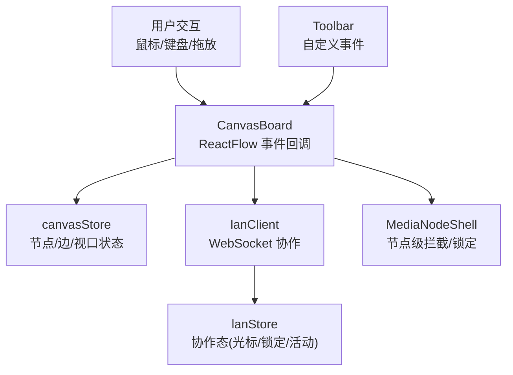
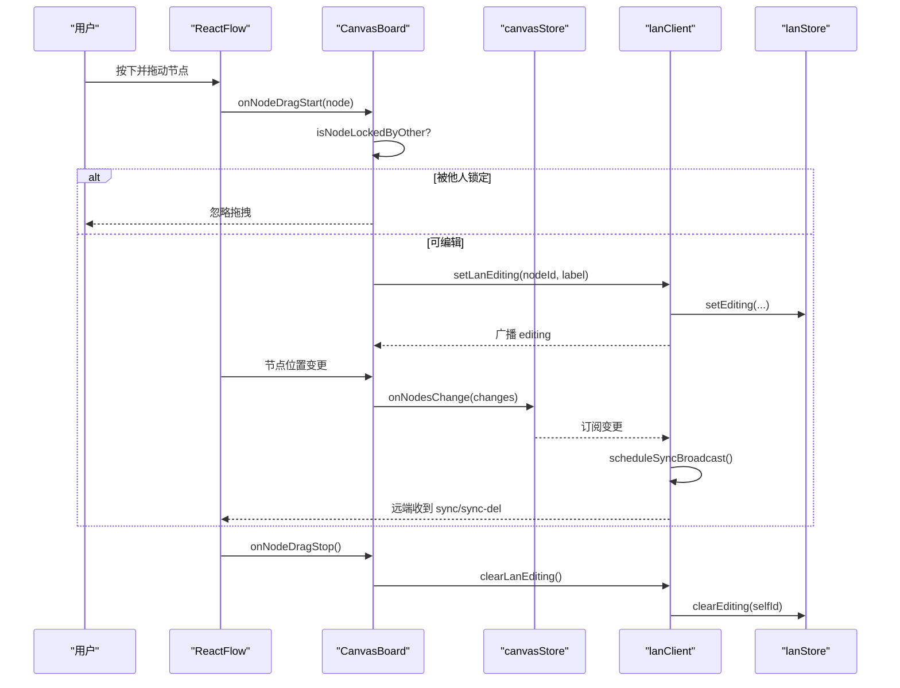
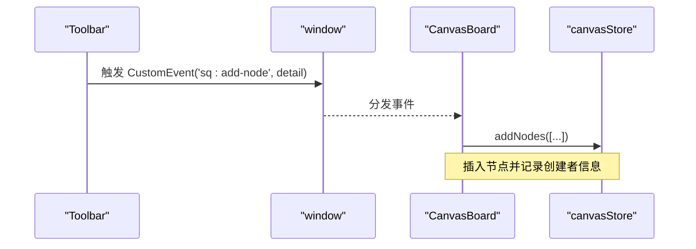
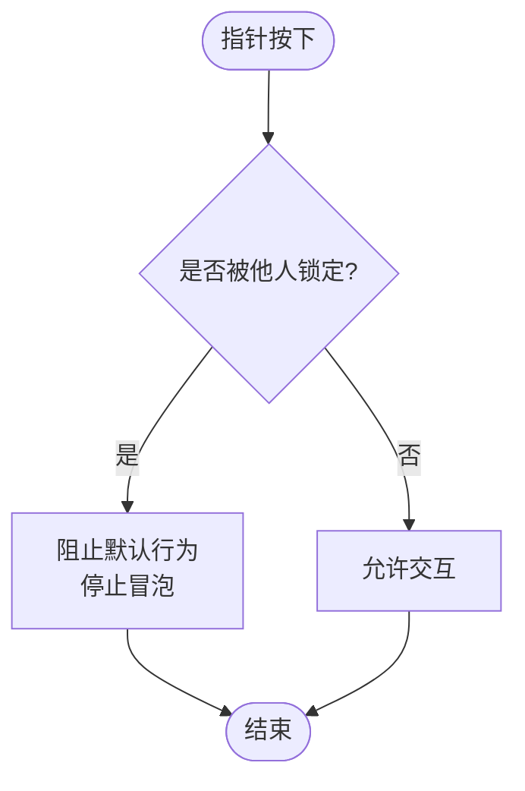
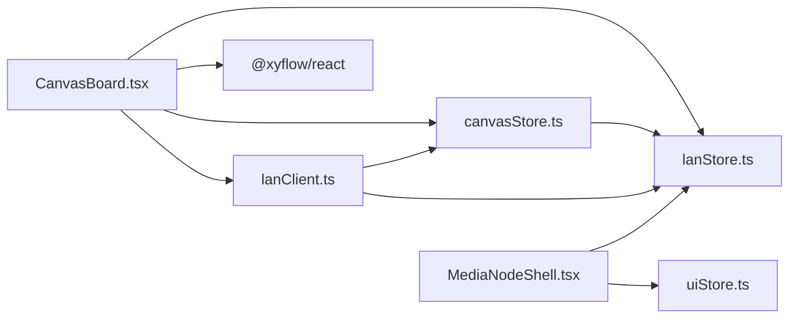

# 事件处理

<cite>
**本文引用的文件**
- [CanvasBoard.tsx](file://src/canvas/CanvasBoard.tsx)
- [canvasStore.ts](file://src/store/canvasStore.ts)
- [lanStore.ts](file://src/store/lanStore.ts)
- [lanClient.ts](file://src/sync/lanClient.ts)
- [MediaNodeShell.tsx](file://src/canvas/nodes/MediaNodeShell.tsx)
- [Toolbar.tsx](file://src/components/Toolbar.tsx)
</cite>

## 目录
1. [简介](#简介)
2. [项目结构](#项目结构)
3. [核心组件](#核心组件)
4. [架构总览](#架构总览)
5. [详细组件分析](#详细组件分析)
6. [依赖关系分析](#依赖关系分析)
7. [性能考虑](#性能考虑)
8. [故障排查指南](#故障排查指南)
9. [结论](#结论)

## 简介
本文件系统化梳理 SuQCanvas 画布的事件处理体系，覆盖节点拖拽、鼠标移动、双击、拖放、键盘快捷键、自定义事件（添加节点、视图控制、聚焦节点）等。文档从用户交互到状态更新的完整链路出发，解释事件过滤与权限控制（协作锁定）、协作环境下的事件协调机制，并总结性能优化技巧与调试方法。

## 项目结构
画布事件处理围绕 ReactFlow 容器、画布状态管理、局域网协作与工具栏触发点展开：
- 画布容器：ReactFlow 提供原生事件回调（拖拽、双击、拖放、鼠标移动等），在 CanvasBoard 中集中接入。
- 状态管理：canvasStore 负责节点/边变更、撤销重做、视口同步；lanStore 维护协作态（光标、编辑锁定、活动日志）。
- 协作通信：lanClient 通过 WebSocket 广播/接收画布变更、视口、光标、编辑锁定、删除消息等。
- 工具栏：Toolbar 通过自定义事件向画布注入元素或控制视图。

图表来源
- [CanvasBoard.tsx:336-374](file://src/canvas/CanvasBoard.tsx#L336-L374)
- [canvasStore.ts:126-158](file://src/store/canvasStore.ts#L126-L158)
- [lanClient.ts:718-756](file://src/sync/lanClient.ts#L718-L756)
- [lanStore.ts:91-160](file://src/store/lanStore.ts#L91-L160)
- [MediaNodeShell.tsx:53-67](file://src/canvas/nodes/MediaNodeShell.tsx#L53-L67)

章节来源
- [CanvasBoard.tsx:336-374](file://src/canvas/CanvasBoard.tsx#L336-L374)
- [canvasStore.ts:126-158](file://src/store/canvasStore.ts#L126-L158)
- [lanClient.ts:718-756](file://src/sync/lanClient.ts#L718-L756)
- [lanStore.ts:91-160](file://src/store/lanStore.ts#L91-L160)
- [MediaNodeShell.tsx:53-67](file://src/canvas/nodes/MediaNodeShell.tsx#L53-L67)

## 核心组件
- CanvasBoard：ReactFlow 的宿主，绑定 onNodeDragStart/onNodeDragStop、onMouseMove、onPaneDoubleClick、onDragOver/onDrop、键盘事件、自定义事件监听。
- canvasStore：统一处理节点/边变更、连接、复制粘贴、对齐、层级、撤销/重做、视口更新，并通过防抖合并历史快照。
- lanClient：订阅 canvasStore 变化，批量广播 sync/sync-del/viewport/activity；处理远端消息（合并节点/边、删除、视口跟随、光标、编辑锁定）。
- lanStore：维护协作态（cursors/editing/activities/remoteViewport），供 UI 渲染协作光标与锁定提示。
- MediaNodeShell：节点壳层，根据协作锁定阻止交互，并在连线模式下暴露边缘热区。
- Toolbar：通过 dispatchAddNode/dispatchView 派发窗口级自定义事件，驱动画布插入元素与视图控制。

章节来源
- [CanvasBoard.tsx:76-86](file://src/canvas/CanvasBoard.tsx#L76-L86)
- [canvasStore.ts:126-158](file://src/store/canvasStore.ts#L126-L158)
- [lanClient.ts:655-756](file://src/sync/lanClient.ts#L655-L756)
- [lanStore.ts:91-160](file://src/store/lanStore.ts#L91-L160)
- [MediaNodeShell.tsx:44-67](file://src/canvas/nodes/MediaNodeShell.tsx#L44-L67)
- [Toolbar.tsx:86-92](file://src/components/Toolbar.tsx#L86-L92)

## 架构总览
下图展示一次“拖拽节点”的端到端流程：用户交互 → ReactFlow 回调 → 协作锁定检查 → 本地状态更新 → 协作广播 → 远端应用。

图表来源
- [CanvasBoard.tsx:76-86](file://src/canvas/CanvasBoard.tsx#L76-L86)
- [lanClient.ts:793-800](file://src/sync/lanClient.ts#L793-L800)
- [lanClient.ts:655-756](file://src/sync/lanClient.ts#L655-L756)
- [canvasStore.ts:126-158](file://src/store/canvasStore.ts#L126-L158)

## 详细组件分析

### 节点拖拽事件（onNodeDragStart / onNodeDragStop）
- 开始拖拽时：
  - 若节点被其他协作者锁定，直接忽略。
  - 否则标记当前用户正在编辑该节点，广播 editing 消息，使远端显示锁定提示。
- 结束拖拽时：
  - 清除编辑锁定，释放远端锁定。

关键点
- 锁定判断来自协作态（lanStore.editing），仅当 userId !== selfId 时才视为锁定。
- 拖拽期间，节点变更经 canvasStore 应用，并由 lanClient 批量同步。

章节来源
- [CanvasBoard.tsx:76-82](file://src/canvas/CanvasBoard.tsx#L76-L82)
- [lanClient.ts:793-800](file://src/sync/lanClient.ts#L793-L800)
- [lanStore.ts:134-141](file://src/store/lanStore.ts#L134-L141)

### 鼠标移动事件（onMouseMove）
- 将屏幕坐标转换为 Flow 坐标后，发送光标位置给协作方。
- 协作端在 lanStore.cursors 中更新，UI 渲染远程光标。

章节来源
- [CanvasBoard.tsx:83-86](file://src/canvas/CanvasBoard.tsx#L83-L86)
- [lanClient.ts:788-791](file://src/sync/lanClient.ts#L788-L791)
- [CanvasBoard.tsx:395-413](file://src/canvas/CanvasBoard.tsx#L395-L413)

### 双击事件（onPaneDoubleClick）
- 仅在空白区域（非节点）双击时，于中心位置新增文本节点。
- 用于快速创建内容。

章节来源
- [CanvasBoard.tsx:234-242](file://src/canvas/CanvasBoard.tsx#L234-L242)

### 拖放事件（onDragOver / onDragLeave / onDrop）
- onDragOver：检测 Files 类型，设置 dropEffect 为 copy，并进入拖入高亮态。
- onDragLeave：离开目标区域时退出高亮。
- onDrop：读取文件列表，按放置位置导入媒体资源。

章节来源
- [CanvasBoard.tsx:210-232](file://src/canvas/CanvasBoard.tsx#L210-L232)

### 键盘事件与快捷键
- Ctrl/Cmd + Z/Y：撤销/重做。
- Ctrl/Cmd + D：复制选中节点。
- Ctrl/Cmd + C/V：复制/粘贴剪贴板内容。
- Ctrl/Cmd + A：全选节点。
- F：适应视图。
- V/C/H：切换选择/连线/拖动工具。
- 空格：临时平移模式。

章节来源
- [CanvasBoard.tsx:104-193](file://src/canvas/CanvasBoard.tsx#L104-L193)

### 自定义事件注册与处理
- sq:add-node：由 Toolbar 触发，CanvasBoard 监听后在画布中心插入标题/便签/形状/文本节点。
- sq:view：视图控制事件，支持 fit/zoom-in/zoom-out/reset。
- sq:focus-node：聚焦指定节点，计算其尺寸并居中缩放至合适级别。

图表来源
- [Toolbar.tsx:86-92](file://src/components/Toolbar.tsx#L86-L92)
- [CanvasBoard.tsx:244-305](file://src/canvas/CanvasBoard.tsx#L244-L305)

章节来源
- [Toolbar.tsx:86-92](file://src/components/Toolbar.tsx#L86-L92)
- [CanvasBoard.tsx:244-305](file://src/canvas/CanvasBoard.tsx#L244-L305)

### 协作锁定与事件过滤
- 节点级：MediaNodeShell 在 onPointerDownCapture 阶段，若检测到 lock（他人正在编辑），则 preventDefault 并 stopPropagation，阻断后续交互。
- 画布级：handleNodesChange 会过滤掉对锁定节点的变更，避免被修改。
- 视图级：focus-node 事件在锁定节点上不会执行选中操作。

图表来源
- [MediaNodeShell.tsx:61-67](file://src/canvas/nodes/MediaNodeShell.tsx#L61-L67)
- [CanvasBoard.tsx:66-75](file://src/canvas/CanvasBoard.tsx#L66-L75)
- [CanvasBoard.tsx:276-296](file://src/canvas/CanvasBoard.tsx#L276-L296)

章节来源
- [MediaNodeShell.tsx:61-67](file://src/canvas/nodes/MediaNodeShell.tsx#L61-L67)
- [CanvasBoard.tsx:66-75](file://src/canvas/CanvasBoard.tsx#L66-L75)
- [CanvasBoard.tsx:276-296](file://src/canvas/CanvasBoard.tsx#L276-L296)

### 协作环境下的事件协调
- 画布变更：canvasStore 变更触发 lanClient 的 scheduleSyncBroadcast，合并节点/边后以 sync 消息广播。
- 删除传播：显式使用 sync-del 消息，配合墓碑机制防止晚到旧快照复活已删除项。
- 视口同步：scheduleViewportBroadcast 定期广播 viewport，支持跟随他人视口。
- 活动日志：批量合并 create/delete/move/edit/change 等操作，减少通知噪音。

章节来源
- [lanClient.ts:655-756](file://src/sync/lanClient.ts#L655-L756)
- [lanClient.ts:578-598](file://src/sync/lanClient.ts#L578-L598)
- [CanvasBoard.tsx:94-102](file://src/canvas/CanvasBoard.tsx#L94-L102)

## 依赖关系分析
- CanvasBoard 依赖：
  - @xyflow/react：ReactFlow 组件与 API。
  - store/canvasStore：节点/边/视口状态与变更。
  - store/lanStore：协作态（光标/锁定/活动）。
  - sync/lanClient：协作通信与广播。
  - io/fileLoader：导入/创建节点。
- canvasStore 依赖：
  - @xyflow/react：applyNodeChanges/applyEdgeChanges。
  - store/lanStore：插入元数据（创建者信息）。
- lanClient 依赖：
  - store/canvasStore：订阅变更，触发广播。
  - store/lanStore：协作状态读写。
  - db/db：持久化项目与素材。
- MediaNodeShell 依赖：
  - store/uiStore：工具模式（连线模式）。
  - store/lanStore：协作锁定状态。

图表来源
- [CanvasBoard.tsx:1-36](file://src/canvas/CanvasBoard.tsx#L1-L36)
- [canvasStore.ts:1-6](file://src/store/canvasStore.ts#L1-L6)
- [lanClient.ts:1-9](file://src/sync/lanClient.ts#L1-L9)
- [MediaNodeShell.tsx:1-12](file://src/canvas/nodes/MediaNodeShell.tsx#L1-L12)

章节来源
- [CanvasBoard.tsx:1-36](file://src/canvas/CanvasBoard.tsx#L1-L36)
- [canvasStore.ts:1-6](file://src/store/canvasStore.ts#L1-L6)
- [lanClient.ts:1-9](file://src/sync/lanClient.ts#L1-L9)
- [MediaNodeShell.tsx:1-12](file://src/canvas/nodes/MediaNodeShell.tsx#L1-L12)

## 性能考虑
- 历史快照防抖：canvasStore 使用 scheduleSnapshot/fushPending，合并高频变更，降低撤销栈写入频率。
- 协作广播节流：lanClient 对 sync/viewport/activity 使用定时器合并，减少网络开销。
- 删除合并：pendingDeletes 聚合多次删除，批量发送 sync-del。
- 事件冒泡控制：
  - 节点内按钮/控件使用 stopPropagation 避免误触画布双击。
  - 协作锁定时在捕获阶段阻止事件，避免穿透到子元素。
- 错误捕获策略：
  - 协作消息解析失败时静默丢弃，避免崩溃。
  - 连接异常时自动重试与降级提示。
- 调试建议：
  - 观察 lanStore.activities 了解最近操作。
  - 通过浏览器控制台查看 window 自定义事件（sq:add-node/sq/view/sq:focus-node）。
  - 在 ReactFlow 开发者面板中检查 nodes/edges 变更序列。

章节来源
- [canvasStore.ts:66-107](file://src/store/canvasStore.ts#L66-L107)
- [lanClient.ts:96-117](file://src/sync/lanClient.ts#L96-L117)
- [lanClient.ts:655-756](file://src/sync/lanClient.ts#L655-L756)
- [AudioNode.tsx:101-117](file://src/canvas/nodes/AudioNode.tsx#L101-L117)
- [lanClient.ts:352-360](file://src/sync/lanClient.ts#L352-L360)

## 故障排查指南
- 节点无法拖拽：
  - 检查协作锁定：lanStore.editing 中是否存在他人对该节点的锁定。
  - 确认 handleNodesChange 未过滤该节点变更。
- 双击无效：
  - 确认点击目标不是节点（closest('.react-flow__node')）。
- 拖放不生效：
  - 检查 onDragOver 是否识别 Files 类型，onDrop 是否正确读取 dataTransfer.files。
- 协作不同步：
  - 查看 lanClient 的 scheduleSyncBroadcast 是否触发。
  - 检查 sync-del 是否发送，墓碑是否清理。
- 视图控制事件无效：
  - 确认 Toolbar 正确派发 sq:view 事件，CanvasBoard 已监听。
- 性能卡顿：
  - 关注 historyTimer/syncTimer/vpTimer 是否频繁触发。
  - 检查大量节点/边变更是否被合理合并。

章节来源
- [CanvasBoard.tsx:66-86](file://src/canvas/CanvasBoard.tsx#L66-L86)
- [CanvasBoard.tsx:234-242](file://src/canvas/CanvasBoard.tsx#L234-L242)
- [CanvasBoard.tsx:210-232](file://src/canvas/CanvasBoard.tsx#L210-L232)
- [lanClient.ts:655-756](file://src/sync/lanClient.ts#L655-L756)
- [CanvasBoard.tsx:244-305](file://src/canvas/CanvasBoard.tsx#L244-L305)

## 结论
SuQCanvas 的事件处理系统以 ReactFlow 为核心，结合 zustand 状态管理与 WebSocket 协作，实现了从用户交互到多端一致的状态更新。通过协作锁定、事件过滤、批量广播与防抖策略，系统在多人协作场景下具备良好的一致性与性能表现。借助自定义事件与工具栏集成，画布扩展性强，便于按需添加新能力。