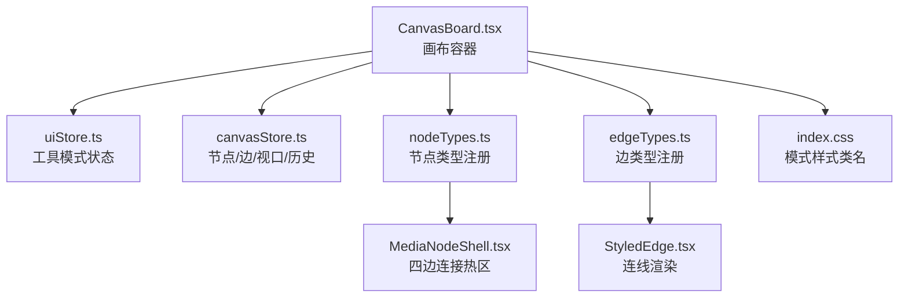
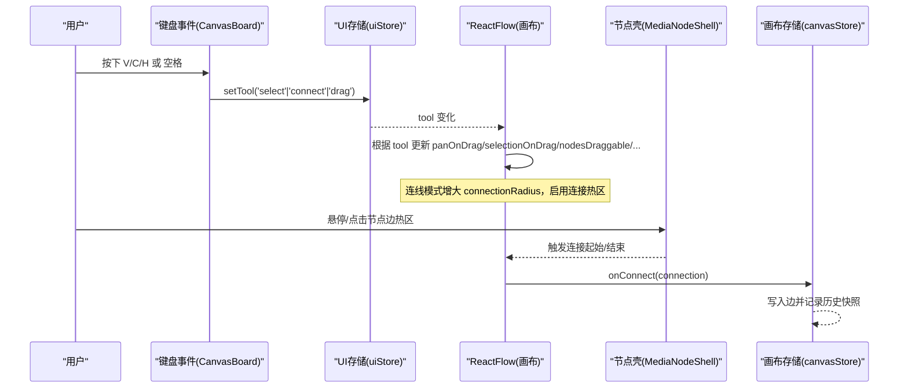
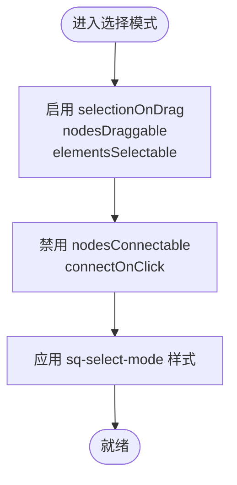
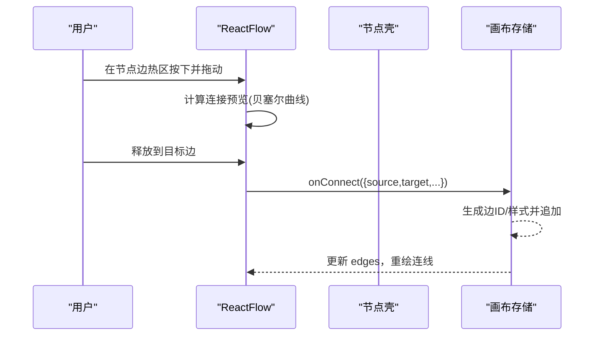
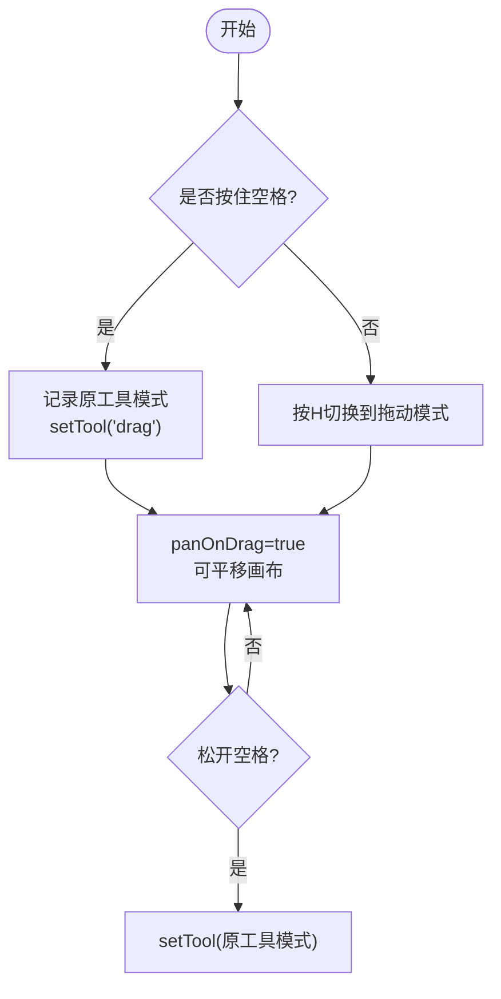
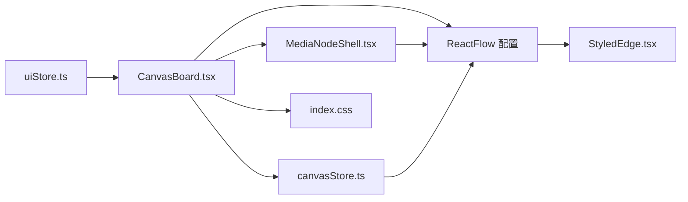

# 工具模式

<cite>
**本文引用的文件**
- [CanvasBoard.tsx](file://src/canvas/CanvasBoard.tsx)
- [uiStore.ts](file://src/store/uiStore.ts)
- [canvasStore.ts](file://src/store/canvasStore.ts)
- [types.ts](file://src/types.ts)
- [nodeTypes.ts](file://src/canvas/nodes/nodeTypes.ts)
- [edgeTypes.ts](file://src/canvas/edges/edgeTypes.ts)
- [MediaNodeShell.tsx](file://src/canvas/nodes/MediaNodeShell.tsx)
- [StyledEdge.tsx](file://src/canvas/edges/StyledEdge.tsx)
- [index.css](file://src/index.css)
</cite>

## 目录
1. [简介](#简介)
2. [项目结构](#项目结构)
3. [核心组件](#核心组件)
4. [架构总览](#架构总览)
5. [详细组件分析](#详细组件分析)
6. [依赖关系分析](#依赖关系分析)
7. [性能考量](#性能考量)
8. [故障排查指南](#故障排查指南)
9. [结论](#结论)
10. [附录](#附录)

## 简介
本文件系统化说明 SuQCanvas 的工具模式系统，覆盖三种核心工具模式的实现与交互：选择模式（V）、连线模式（C）、拖动模式（H）。文档重点包括：
- 各模式的行为特征与画布行为联动（节点可拖拽、元素可选择、连接可创建等）
- 快捷键切换与空格键临时平移的交互逻辑
- 连接点高亮与连接创建流程
- 扩展自定义工具模式的最佳实践

## 项目结构
SuQCanvas 将工具模式状态集中在 UI 存储中，由画布容器根据当前模式动态配置 ReactFlow 的行为。节点与边类型通过模块聚合注册到 ReactFlow。样式类名用于在视觉上反馈当前模式（如十字光标、连接手柄放大等）。

**图表来源**
- [CanvasBoard.tsx:336-379](file://src/canvas/CanvasBoard.tsx#L336-L379)
- [uiStore.ts:3-4,43-44:3-4](file://src/store/uiStore.ts#L3-L4)
- [canvasStore.ts:118-158](file://src/store/canvasStore.ts#L118-L158)
- [nodeTypes.ts:14-26](file://src/canvas/nodes/nodeTypes.ts#L14-L26)
- [edgeTypes.ts:4-6](file://src/canvas/edges/edgeTypes.ts#L4-L6)
- [MediaNodeShell.tsx:68-105](file://src/canvas/nodes/MediaNodeShell.tsx#L68-L105)
- [StyledEdge.tsx:11-129](file://src/canvas/edges/StyledEdge.tsx#L11-L129)
- [index.css:160-216](file://src/index.css#L160-L216)

**章节来源**
- [CanvasBoard.tsx:336-379](file://src/canvas/CanvasBoard.tsx#L336-L379)
- [uiStore.ts:3-4,43-44:3-4](file://src/store/uiStore.ts#L3-L4)
- [nodeTypes.ts:14-26](file://src/canvas/nodes/nodeTypes.ts#L14-L26)
- [edgeTypes.ts:4-6](file://src/canvas/edges/edgeTypes.ts#L4-L6)
- [index.css:160-216](file://src/index.css#L160-L216)

## 核心组件
- 工具模式状态：定义并维护当前工具模式（select/connect/drag），提供 setTool 方法。
- 画布容器：监听键盘事件切换工具模式；根据 tool 动态设置 ReactFlow 的 panOnDrag、selectionOnDrag、nodesDraggable、elementsSelectable、nodesConnectable、connectOnClick、connectionRadius 等属性。
- 节点壳层：在 MediaNodeShell 中为每个节点的四边注册“连接热区”Handle，仅在连线模式下启用连接能力，并在模式切换时刷新节点内部测量以适配热区。
- 边渲染：StyledEdge 负责连线的绘制、箭头、虚线样式及选中态高亮。
- 类型定义：统一节点/边数据结构与默认边样式。

**章节来源**
- [uiStore.ts:3-4,43-44:3-4](file://src/store/uiStore.ts#L3-L4)
- [CanvasBoard.tsx:152-193](file://src/canvas/CanvasBoard.tsx#L152-L193)
- [CanvasBoard.tsx:336-379](file://src/canvas/CanvasBoard.tsx#L336-L379)
- [MediaNodeShell.tsx:48-51,68-105:48-51](file://src/canvas/nodes/MediaNodeShell.tsx#L48-L51)
- [StyledEdge.tsx:11-129](file://src/canvas/edges/StyledEdge.tsx#L11-L129)
- [types.ts:46-64,100-107:46-64](file://src/types.ts#L46-L64)

## 架构总览
工具模式驱动画布行为的整体流程如下：
- 用户按下 V/C/H 或按住空格键，触发工具模式切换或临时平移。
- CanvasBoard 根据 tool 值更新 ReactFlow 的配置项，从而改变节点拖拽、元素选择、连接创建等行为。
- 节点壳层在连线模式下暴露四边连接热区，便于快速从任意边发起连接。
- 连接建立后，canvasStore 记录新边并写入历史快照。

**图表来源**
- [CanvasBoard.tsx:152-193](file://src/canvas/CanvasBoard.tsx#L152-L193)
- [CanvasBoard.tsx:336-379](file://src/canvas/CanvasBoard.tsx#L336-L379)
- [MediaNodeShell.tsx:68-105](file://src/canvas/nodes/MediaNodeShell.tsx#L68-L105)
- [canvasStore.ts:146-158](file://src/store/canvasStore.ts#L146-L158)

## 详细组件分析

### 选择模式（V）
- 行为特征
  - selectionOnDrag 开启，支持框选多个节点。
  - nodesDraggable 开启，允许拖拽节点调整位置。
  - elementsSelectable 开启，允许选择元素。
  - nodesConnectable/connectOnClick 关闭，避免误触连接。
  - 视觉：节点可被选中，显示边框高亮；鼠标指针恢复默认。
- 快捷键
  - 按 V 切换到选择模式。
- 相关实现要点
  - 键盘事件监听与 setTool('select')。
  - ReactFlow 配置项根据 tool 动态切换。
  - 样式类 sq-select-mode 控制光标与选中态。

**图表来源**
- [CanvasBoard.tsx:152-193](file://src/canvas/CanvasBoard.tsx#L152-L193)
- [CanvasBoard.tsx:336-379](file://src/canvas/CanvasBoard.tsx#L336-L379)
- [index.css:160-171](file://src/index.css#L160-L171)

**章节来源**
- [CanvasBoard.tsx:152-193](file://src/canvas/CanvasBoard.tsx#L152-L193)
- [CanvasBoard.tsx:336-379](file://src/canvas/CanvasBoard.tsx#L336-L379)
- [index.css:160-171](file://src/index.css#L160-L171)

### 连线模式（C）
- 行为特征
  - connectionRadius 增大，提升连接命中容错。
  - nodesConnectable/connectOnClick 开启，允许创建连接。
  - 节点壳层在四条边注册连接热区 Handle，仅在该模式下 isConnectable 生效。
  - 视觉：十字光标，连接手柄放大并常驻可见，悬停/选中时进一步强调。
- 快捷键
  - 按 C 切换到连线模式。
- 连接创建流程
  - 用户在节点边热区按下并拖动，ReactFlow 生成连接预览线。
  - 释放到目标节点边时，触发 onConnect，canvasStore 写入新边并记录历史。

**图表来源**
- [CanvasBoard.tsx:336-379](file://src/canvas/CanvasBoard.tsx#L336-L379)
- [MediaNodeShell.tsx:68-105](file://src/canvas/nodes/MediaNodeShell.tsx#L68-L105)
- [canvasStore.ts:146-158](file://src/store/canvasStore.ts#L146-L158)
- [StyledEdge.tsx:11-129](file://src/canvas/edges/StyledEdge.tsx#L11-L129)

**章节来源**
- [CanvasBoard.tsx:336-379](file://src/canvas/CanvasBoard.tsx#L336-L379)
- [MediaNodeShell.tsx:68-105](file://src/canvas/nodes/MediaNodeShell.tsx#L68-L105)
- [canvasStore.ts:146-158](file://src/store/canvasStore.ts#L146-L158)
- [index.css:200-216](file://src/index.css#L200-L216)

### 拖动模式（H）
- 行为特征
  - panOnDrag 设置为 true，启用画布平移。
  - elementsSelectable 关闭，禁止选择元素。
  - nodesConnectable/connectOnClick 关闭，禁止创建连接。
  - 适合在大画布上快速平移浏览。
- 快捷键
  - 按 H 切换到拖动模式。
- 空格键临时平移
  - 按住空格键时，临时将工具切换为拖动模式；松开空格键恢复之前的工具模式。
  - 使用 tempPanRef 保存并按需还原工具模式。

**图表来源**
- [CanvasBoard.tsx:152-193](file://src/canvas/CanvasBoard.tsx#L152-L193)
- [CanvasBoard.tsx:336-379](file://src/canvas/CanvasBoard.tsx#L336-L379)

**章节来源**
- [CanvasBoard.tsx:152-193](file://src/canvas/CanvasBoard.tsx#L152-L193)
- [CanvasBoard.tsx:336-379](file://src/canvas/CanvasBoard.tsx#L336-L379)

### 工具模式与画布行为的关联
- 节点可拖拽性：nodesDraggable 仅在 select 模式开启。
- 元素可选择性：elementsSelectable 在 drag 模式关闭，其他模式开启。
- 连接可创建性：nodesConnectable/connectOnClick 在 drag 模式关闭，其他模式开启；connect 模式额外增大 connectionRadius。
- 连接点高亮：MediaNodeShell 在 connect 模式下启用四边连接热区，并通过 CSS 放大手柄与常驻显示。
- 样式反馈：sq-select-mode/sq-connect-mode/sq-drag-mode 分别控制光标与交互反馈。

**章节来源**
- [CanvasBoard.tsx:336-379](file://src/canvas/CanvasBoard.tsx#L336-L379)
- [MediaNodeShell.tsx:48-51,68-105:48-51](file://src/canvas/nodes/MediaNodeShell.tsx#L48-L51)
- [index.css:160-216](file://src/index.css#L160-L216)

## 依赖关系分析
- uiStore 提供工具模式状态与 setter，被 CanvasBoard 订阅与调用。
- CanvasBoard 读取 tool 并配置 ReactFlow，同时处理键盘事件与拖放导入。
- MediaNodeShell 依赖 tool 决定是否启用连接热区，并在模式切换时刷新节点内部测量。
- canvasStore 接收 onConnect 并持久化边数据，维护历史快照。
- StyledEdge 依据边数据渲染不同路径与箭头样式。
- types 统一节点/边结构与默认边样式。

**图表来源**
- [uiStore.ts:3-4,43-44:3-4](file://src/store/uiStore.ts#L3-L4)
- [CanvasBoard.tsx:152-193,336-379:152-193](file://src/canvas/CanvasBoard.tsx#L152-L193)
- [MediaNodeShell.tsx:48-51,68-105:48-51](file://src/canvas/nodes/MediaNodeShell.tsx#L48-L51)
- [canvasStore.ts:146-158](file://src/store/canvasStore.ts#L146-L158)
- [StyledEdge.tsx:11-129](file://src/canvas/edges/StyledEdge.tsx#L11-L129)
- [index.css:160-216](file://src/index.css#L160-L216)

**章节来源**
- [uiStore.ts:3-4,43-44:3-4](file://src/store/uiStore.ts#L3-L4)
- [CanvasBoard.tsx:152-193,336-379:152-193](file://src/canvas/CanvasBoard.tsx#L152-L193)
- [MediaNodeShell.tsx:48-51,68-105:48-51](file://src/canvas/nodes/MediaNodeShell.tsx#L48-L51)
- [canvasStore.ts:146-158](file://src/store/canvasStore.ts#L146-L158)
- [StyledEdge.tsx:11-129](file://src/canvas/edges/StyledEdge.tsx#L11-L129)
- [index.css:160-216](file://src/index.css#L160-L216)

## 性能考量
- 模式切换时，MediaNodeShell 会调用 updateNodeInternals 重新测量节点内部尺寸，确保连接热区正确布局。频繁切换可能带来一定开销，建议批量操作后再切换模式。
- 连线模式增大 connectionRadius 有助于提高命中率，但也会扩大命中区域，注意与复杂场景下的交互冲突。
- 历史记录采用防抖合并快照，减少重复写入；删除操作立即落盘，保证撤销/重做的准确性。

[本节为通用指导，不直接分析具体文件]

## 故障排查指南
- 无法框选或拖拽节点
  - 检查当前是否为拖动模式（H），该模式下 elementsSelectable 关闭且 panOnDrag 开启。
  - 确认未处于内容编辑态（输入框/文本域），键盘事件会被忽略。
- 无法创建连接
  - 确认当前为连线模式（C），且节点四边连接热区已启用。
  - 检查 isValidConnection 是否阻止了自连接（源=目标）。
- 连接点不可见或未生效
  - 确认样式类 sq-connect-mode 已应用，连接手柄大小与透明度已调整。
  - 模式切换后，MediaNodeShell 会刷新节点内部测量，若仍异常，尝试切换一次模式。
- 空格键临时平移无效
  - 检查是否在输入框中导致事件被拦截；确认 tempPanRef 是否正确保存与恢复原工具模式。

**章节来源**
- [CanvasBoard.tsx:152-193](file://src/canvas/CanvasBoard.tsx#L152-L193)
- [CanvasBoard.tsx:336-379](file://src/canvas/CanvasBoard.tsx#L336-L379)
- [MediaNodeShell.tsx:48-51,68-105:48-51](file://src/canvas/nodes/MediaNodeShell.tsx#L48-L51)
- [index.css:200-216](file://src/index.css#L200-L216)

## 结论
SuQCanvas 的工具模式系统通过集中式状态与 ReactFlow 配置项的动态绑定，实现了选择、连线、拖动三种模式的无缝切换与强一致的交互体验。借助节点四边连接热区与样式反馈，连线效率显著提升。基于此架构，扩展新的工具模式只需新增状态、键盘映射与 ReactFlow 配置项即可。

[本节为总结，不直接分析具体文件]

## 附录

### 快捷键与交互速查
- V：选择模式（框选、拖拽节点）
- C：连线模式（连接点高亮、创建连接）
- H：拖动模式（平移画布）
- 空格：临时切换为拖动模式，松开恢复原模式

**章节来源**
- [CanvasBoard.tsx:152-193](file://src/canvas/CanvasBoard.tsx#L152-L193)

### 自定义工具模式开发指南
- 在 uiStore 中扩展 ToolMode 联合类型与状态字段，并提供 setTool 方法。
- 在 CanvasBoard 中：
  - 添加键盘事件监听，将新快捷键映射到 setTool。
  - 根据新 tool 值设置 ReactFlow 的相关属性（如 panOnDrag、selectionOnDrag、nodesDraggable、elementsSelectable、nodesConnectable、connectOnClick、connectionRadius 等）。
  - 如需视觉反馈，新增对应的 CSS 类名（参考 sq-select-mode/sq-connect-mode/sq-drag-mode）。
- 在节点壳层（MediaNodeShell）中：
  - 若新模式涉及连接热区，复用现有 Handle 逻辑，通过 isConnectable/isConnectableStart/isConnectableEnd 控制。
  - 在模式切换时确保 updateNodeInternals 被调用以刷新测量。
- 在边渲染（StyledEdge）中：
  - 如需新模式下的特殊连线样式，可在边数据中扩展 style 字段并适配渲染逻辑。

**章节来源**
- [uiStore.ts:3-4,43-44:3-4](file://src/store/uiStore.ts#L3-L4)
- [CanvasBoard.tsx:152-193,336-379:152-193](file://src/canvas/CanvasBoard.tsx#L152-L193)
- [MediaNodeShell.tsx:48-51,68-105:48-51](file://src/canvas/nodes/MediaNodeShell.tsx#L48-L51)
- [StyledEdge.tsx:11-129](file://src/canvas/edges/StyledEdge.tsx#L11-L129)
- [index.css:160-216](file://src/index.css#L160-L216)