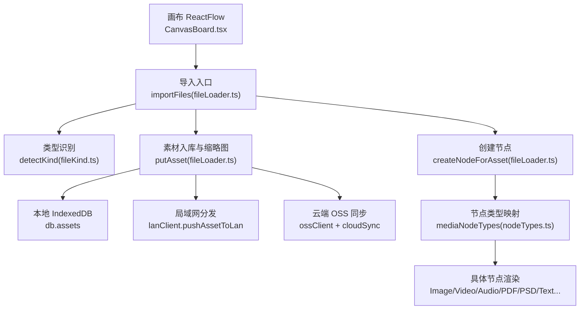
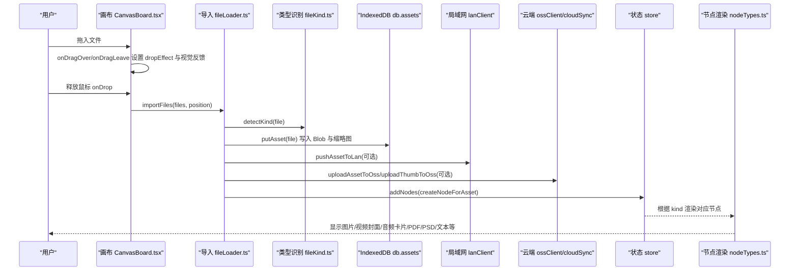
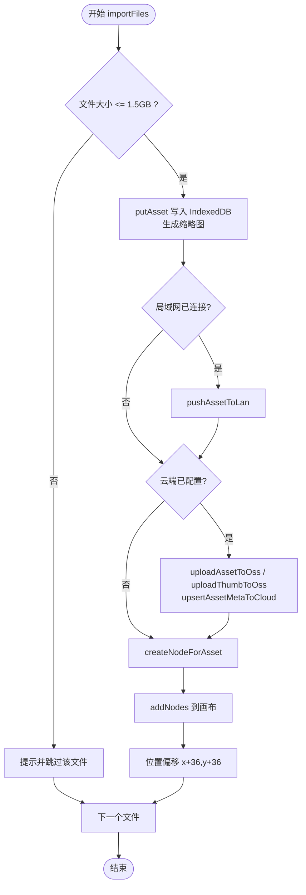
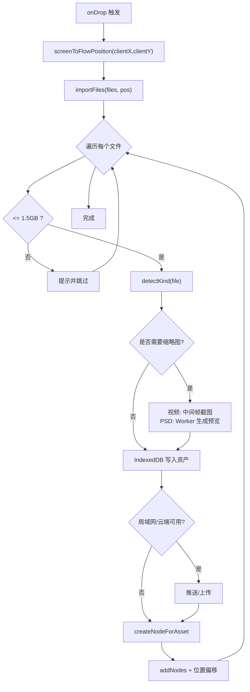
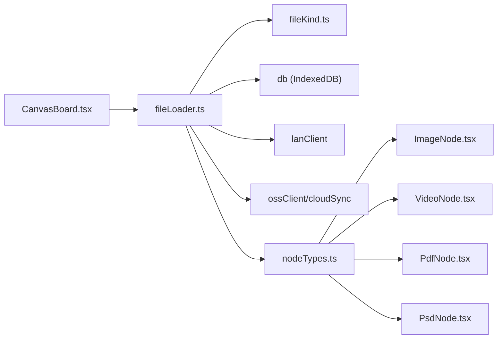

# 文件拖放

<cite>
**本文引用的文件**
- [CanvasBoard.tsx](file://src/canvas/CanvasBoard.tsx)
- [fileLoader.ts](file://src/io/fileLoader.ts)
- [fileKind.ts](file://src/media/fileKind.ts)
- [nodeTypes.ts](file://src/canvas/nodes/nodeTypes.ts)
- [ImageNode.tsx](file://src/canvas/nodes/ImageNode.tsx)
- [VideoNode.tsx](file://src/canvas/nodes/VideoNode.tsx)
- [PdfNode.tsx](file://src/canvas/nodes/PdfNode.tsx)
- [psdPreview.ts](file://src/media/psdPreview.ts)
- [pdf.ts](file://src/media/pdf.ts)
- [FileManagerModal.tsx](file://src/components/FileManagerModal.tsx)
</cite>

## 目录
1. [简介](#简介)
2. [项目结构](#项目结构)
3. [核心组件](#核心组件)
4. [架构总览](#架构总览)
5. [详细组件分析](#详细组件分析)
6. [依赖关系分析](#依赖关系分析)
7. [性能考虑](#性能考虑)
8. [故障排查指南](#故障排查指南)
9. [结论](#结论)
10. [附录](#附录)

## 简介
本章节面向 SuQCanvas 的“文件拖放”能力，系统性说明从拖放区域检测、文件类型识别与校验、放置位置计算，到文件导入、节点创建、预览生成与渲染的完整流程。文档同时覆盖支持的媒体类型（图片、视频、音频、PDF、PSD、文本/Markdown、通用文件）及对应处理方式，并提供性能优化建议、测试方法与常见问题解决方案。

## 项目结构
与文件拖放直接相关的代码主要分布在以下模块：
- 画布层：接收并处理拖放事件，计算落点坐标，触发导入流程
- 导入层：统一入口，负责持久化、缩略图生成、云端/局域网同步、节点创建
- 媒体类型识别：根据 MIME 与扩展名判定资源种类
- 节点渲染：按资源种类渲染不同节点（图片、视频、音频、PDF、PSD、文本等）
- 工具与辅助：PSD 预览生成、PDF 渲染、文件管理等

图表来源
- [CanvasBoard.tsx:210-232](file://src/canvas/CanvasBoard.tsx#L210-L232)
- [fileLoader.ts:186-205](file://src/io/fileLoader.ts#L186-L205)
- [fileKind.ts:3-16](file://src/media/fileKind.ts#L3-L16)
- [nodeTypes.ts:14-26](file://src/canvas/nodes/nodeTypes.ts#L14-L26)

章节来源
- [CanvasBoard.tsx:210-232](file://src/canvas/CanvasBoard.tsx#L210-L232)
- [fileLoader.ts:186-205](file://src/io/fileLoader.ts#L186-L205)
- [fileKind.ts:3-16](file://src/media/fileKind.ts#L3-L16)
- [nodeTypes.ts:14-26](file://src/canvas/nodes/nodeTypes.ts#L14-L26)

## 核心组件
- 拖放事件处理：在画布上监听 onDragOver/onDragLeave/onDrop，设置 dropEffect、进入态样式与提示文字，并在 drop 时计算屏幕坐标到 Flow 坐标的落点，调用 importFiles
- 文件导入管线：统一入口 importFiles 负责大小限制、持久化 putAsset、缩略图生成、同步、节点创建与布局偏移
- 类型识别：detectKind 基于 MIME 与扩展名判断资源种类，优先识别 PSD
- 节点渲染：通过 mediaNodeTypes 将 kind 映射到具体节点组件，各节点按需加载资源或仅展示缩略图

章节来源
- [CanvasBoard.tsx:210-232](file://src/canvas/CanvasBoard.tsx#L210-L232)
- [fileLoader.ts:77-117](file://src/io/fileLoader.ts#L77-L117)
- [fileLoader.ts:186-205](file://src/io/fileLoader.ts#L186-L205)
- [fileKind.ts:3-16](file://src/media/fileKind.ts#L3-L16)
- [nodeTypes.ts:14-26](file://src/canvas/nodes/nodeTypes.ts#L14-L26)

## 架构总览
下图展示了从用户拖拽文件到画布，到最终节点渲染的端到端时序。

图表来源
- [CanvasBoard.tsx:210-232](file://src/canvas/CanvasBoard.tsx#L210-L232)
- [fileLoader.ts:77-117](file://src/io/fileLoader.ts#L77-L117)
- [fileLoader.ts:186-205](file://src/io/fileLoader.ts#L186-L205)
- [fileKind.ts:3-16](file://src/media/fileKind.ts#L3-L16)
- [nodeTypes.ts:14-26](file://src/canvas/nodes/nodeTypes.ts#L14-L26)

## 详细组件分析

### 拖放区域检测与视觉反馈
- 区域检测：onDragOver 中检查 dataTransfer.types 是否包含 Files，若包含则阻止默认行为、设置 dropEffect=copy 并开启 dragging 状态
- 离开检测：onDragLeave 仅在离开当前容器时关闭 dragging 状态，避免误判
- 视觉反馈：当 dragging 为真时，在画布上层叠加半透明遮罩与虚线边框，并显示“松开鼠标，将文件放置到画布”的提示文字；同时给根容器添加 sq-drag-active 类以配合全局样式
- 放置位置计算：onDrop 使用 screenToFlowPosition 将鼠标屏幕坐标转换为 Flow 坐标系中的位置，再传入 importFiles

章节来源
- [CanvasBoard.tsx:210-232](file://src/canvas/CanvasBoard.tsx#L210-L232)
- [CanvasBoard.tsx:369-379](file://src/canvas/CanvasBoard.tsx#L369-L379)
- [CanvasBoard.tsx:414-420](file://src/canvas/CanvasBoard.tsx#L414-L420)

### 文件类型验证与分类
- 类型识别策略：优先匹配 PSD（即使其 MIME 可能被浏览器识别为 image），其次按 MIME 前缀区分 image/video/audio，再按扩展名识别 pdf、markdown、text，其余归为 file
- 用途：决定后续缩略图生成策略、节点类型与默认尺寸

章节来源
- [fileKind.ts:3-16](file://src/media/fileKind.ts#L3-L16)

### 放置位置计算与节点布局
- 坐标转换：screenToFlowPosition 将屏幕坐标转为 Flow 坐标，确保节点出现在用户释放的位置
- 多文件布局：每成功导入一个文件，节点位置沿 x+36、y+36 偏移，避免重叠

章节来源
- [CanvasBoard.tsx:222-232](file://src/canvas/CanvasBoard.tsx#L222-L232)
- [fileLoader.ts:186-205](file://src/io/fileLoader.ts#L186-L205)

### 文件导入流程（从拖放到节点创建）
- 大小限制：超过 1.5GB 的文件会被跳过并提示
- 素材入库：putAsset 将文件写入 IndexedDB，并根据类型生成缩略图（视频取中间帧、PSD 通过 Worker 生成预览）
- 同步：连接局域网时推送素材；配置了云端时上传主文件与缩略图并更新元数据
- 节点创建：createNodeForAsset 根据 kind 选择默认宽高与节点类型，加入画布

图表来源
- [fileLoader.ts:186-205](file://src/io/fileLoader.ts#L186-L205)
- [fileLoader.ts:77-117](file://src/io/fileLoader.ts#L77-L117)

章节来源
- [fileLoader.ts:186-205](file://src/io/fileLoader.ts#L186-L205)
- [fileLoader.ts:77-117](file://src/io/fileLoader.ts#L77-L117)

### 支持的媒体类型与处理方式
- 图片（image/*）：节点内直接加载原图，自动根据自然尺寸适配节点宽高，支持打开大图查看与下载
- 视频（video/*）：不直接在节点内播放，仅显示由首帧生成的缩略图与播放按钮；点击后跳转播放器页面按需拉取完整视频
- 音频（audio/*）：以音频卡片形式呈现，提供播放控制
- PDF：节点内使用 PDF.js 渲染第一页至 Canvas，支持缩放与全屏查看
- PSD：通过 Web Worker 解析并生成预览图，失败时保留原文件可下载
- Markdown/文本（md/markdown/txt/log/csv）：以文本节点或专用 Markdown 节点编辑与展示
- 其他文件：以“文件卡片”形式展示，提供下载

章节来源
- [fileKind.ts:3-16](file://src/media/fileKind.ts#L3-L16)
- [ImageNode.tsx:15-126](file://src/canvas/nodes/ImageNode.tsx#L15-L126)
- [VideoNode.tsx:13-88](file://src/canvas/nodes/VideoNode.tsx#L13-L88)
- [PdfNode.tsx:1-25](file://src/canvas/nodes/PdfNode.tsx#L1-L25)
- [psdPreview.ts:42-60](file://src/media/psdPreview.ts#L42-L60)
- [FileManagerModal.tsx:21-39](file://src/components/FileManagerModal.tsx#L21-L39)

### 拖放状态的视觉反馈
- 拖入激活：叠加半透明背景、虚线边框与居中提示文字，提升可发现性
- 模式切换：根据工具模式（选择/连线/拖动）改变光标与交互行为，不影响拖放逻辑
- 空画布提示：首次进入时给出“拖入图片/视频/音频/PDF/文档文件”的引导文案

章节来源
- [CanvasBoard.tsx:414-420](file://src/canvas/CanvasBoard.tsx#L414-L420)
- [CanvasBoard.tsx:425-444](file://src/canvas/CanvasBoard.tsx#L425-L444)

### 关键流程图（算法级）

图表来源
- [CanvasBoard.tsx:222-232](file://src/canvas/CanvasBoard.tsx#L222-L232)
- [fileLoader.ts:186-205](file://src/io/fileLoader.ts#L186-L205)
- [fileLoader.ts:77-117](file://src/io/fileLoader.ts#L77-L117)
- [fileKind.ts:3-16](file://src/media/fileKind.ts#L3-L16)

## 依赖关系分析
- CanvasBoard.tsx 依赖 fileLoader.ts 的 importFiles、createTextNode 等能力
- fileLoader.ts 依赖 fileKind.ts 进行类型识别，依赖 db、lanClient、ossClient、cloudSync 进行存储与同步
- nodeTypes.ts 将 kind 映射到具体节点组件，实现渲染解耦
- 媒体渲染组件（Image/Video/PDF/PSD）各自管理资源加载与交互

图表来源
- [CanvasBoard.tsx:210-232](file://src/canvas/CanvasBoard.tsx#L210-L232)
- [fileLoader.ts:186-205](file://src/io/fileLoader.ts#L186-L205)
- [nodeTypes.ts:14-26](file://src/canvas/nodes/nodeTypes.ts#L14-L26)

章节来源
- [CanvasBoard.tsx:210-232](file://src/canvas/CanvasBoard.tsx#L210-L232)
- [fileLoader.ts:186-205](file://src/io/fileLoader.ts#L186-L205)
- [nodeTypes.ts:14-26](file://src/canvas/nodes/nodeTypes.ts#L14-L26)

## 性能考虑
- 大文件限制：超过 1.5GB 的文件直接跳过，避免内存与存储压力
- 缩略图策略：
  - 视频：仅生成一帧缩略图，节点内不加载完整视频，减少带宽与内存占用
  - PSD：通过 Web Worker 异步解析，避免阻塞主线程；失败时降级为可下载原文件
  - 图片：节点内按需加载，并按最大宽高限制自适应尺寸，避免过大渲染
- 懒加载与按需拉取：视频、PDF 等资源在需要时再加载，降低初始负载
- 并发与队列：PSD 预览使用队列串行执行，避免过多 Worker 任务导致卡顿
- 存储与缓存：所有媒体以 Blob 存入 IndexedDB，离线可用；缩略图 URL 失效机制保证一致性

章节来源
- [fileLoader.ts:184-205](file://src/io/fileLoader.ts#L184-L205)
- [fileLoader.ts:20-59](file://src/io/fileLoader.ts#L20-L59)
- [psdPreview.ts:10-47](file://src/media/psdPreview.ts#L10-L47)
- [VideoNode.tsx:13-88](file://src/canvas/nodes/VideoNode.tsx#L13-L88)
- [ImageNode.tsx:15-126](file://src/canvas/nodes/ImageNode.tsx#L15-L126)
- [PdfNode.tsx:1-25](file://src/canvas/nodes/PdfNode.tsx#L1-L25)

## 故障排查指南
- 拖放无响应
  - 确认 onDragOver 中已阻止默认行为并设置 dropEffect
  - 检查 dataTransfer.types 是否包含 Files
  - 确认 onDrop 已绑定且未被其他元素拦截
- 文件未出现或节点空白
  - 检查文件是否超过大小限制
  - 查看 IndexedDB 是否成功写入资产记录
  - 对于视频/PSD，确认缩略图生成是否成功
- 缩略图生成失败
  - 视频：检查视频元数据与 seeked 事件是否正常触发
  - PSD：Worker 报错会清空 pending 请求并重建 Worker，关注控制台错误
- 云端/局域网同步失败
  - 检查网络与鉴权状态，失败不会阻断本地导入，但会提示错误
- 性能问题
  - 大量图片同时加载可能导致卡顿，建议在批量导入时分批或延迟加载
  - 大视频/大 PDF 尽量使用缩略图与懒加载，避免一次性加载

章节来源
- [CanvasBoard.tsx:210-232](file://src/canvas/CanvasBoard.tsx#L210-L232)
- [fileLoader.ts:20-59](file://src/io/fileLoader.ts#L20-L59)
- [psdPreview.ts:10-47](file://src/media/psdPreview.ts#L10-L47)
- [fileLoader.ts:186-205](file://src/io/fileLoader.ts#L186-L205)

## 结论
SuQCanvas 的文件拖放功能以清晰的职责分层实现了从事件捕获、类型识别、持久化、缩略图生成到节点渲染的完整链路。通过严格的文件大小限制、缩略图策略与懒加载机制，在保证用户体验的同时兼顾了性能与稳定性。针对常见问题的排查路径明确，便于快速定位与修复。

## 附录

### 拖放功能测试方法
- 基础用例
  - 拖入单张图片/视频/音频/PDF/PSD/文本文件，验证节点是否正确创建与渲染
  - 拖入多个文件，验证节点依次偏移且不重叠
  - 拖入超大文件（>1.5GB），验证被跳过并提示
- 视觉反馈
  - 拖入时是否显示虚线边框与提示文字
  - 离开画布后提示是否消失
- 缩略图与预览
  - 视频：节点显示封面并可点击播放
  - PSD：能生成预览，失败仍可下载原文件
  - PDF：节点内可渲染第一页
- 同步与存储
  - 局域网/云端开启时，验证素材是否推送/上传
  - 刷新页面后，资产与节点是否恢复
- 边界情况
  - 非受支持类型应作为“文件卡片”展示
  - 粘贴剪贴板中的文件也应能导入（与拖放共用 importFiles）

章节来源
- [CanvasBoard.tsx:210-232](file://src/canvas/CanvasBoard.tsx#L210-L232)
- [fileLoader.ts:186-205](file://src/io/fileLoader.ts#L186-L205)
- [fileKind.ts:3-16](file://src/media/fileKind.ts#L3-L16)

### 常见问题速查
- 拖放无效：检查 onDragOver/onDrop 绑定与 preventDefault
- 节点不显示：检查 IndexedDB 写入与缩略图生成
- 视频无法播放：确认点击播放按钮跳转到播放器页面
- PSD 预览失败：查看 Worker 日志，必要时重试或降级为下载原文件

章节来源
- [CanvasBoard.tsx:210-232](file://src/canvas/CanvasBoard.tsx#L210-L232)
- [fileLoader.ts:20-59](file://src/io/fileLoader.ts#L20-L59)
- [psdPreview.ts:10-47](file://src/media/psdPreview.ts#L10-L47)