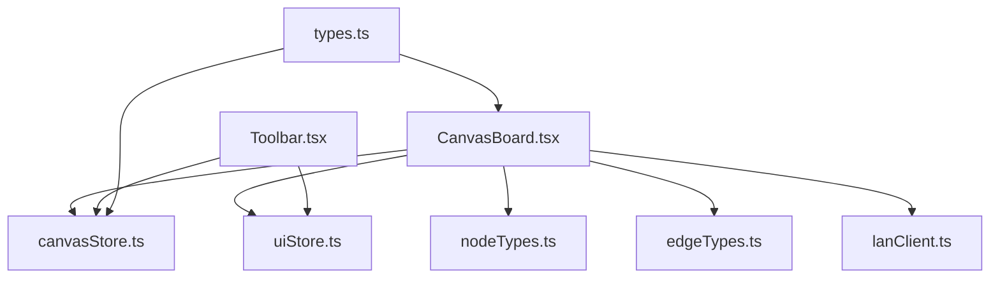
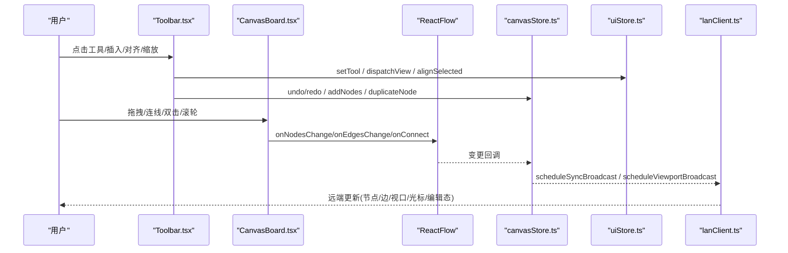
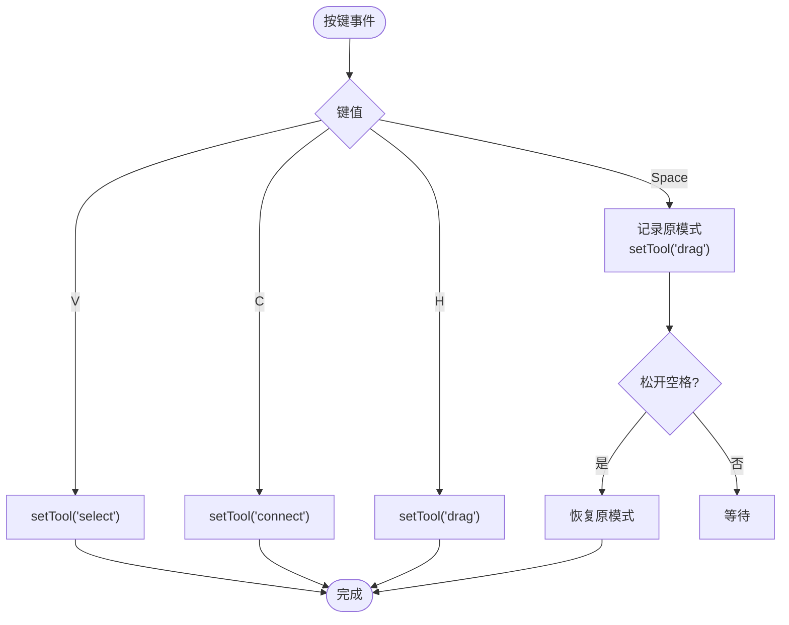
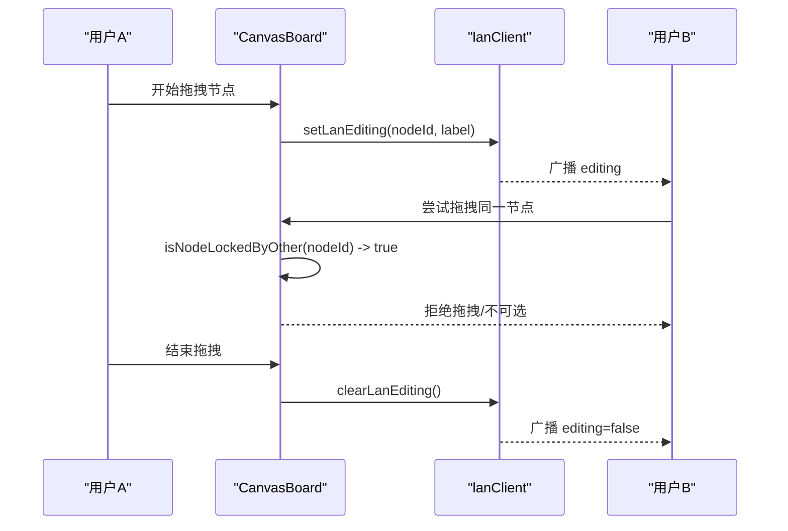
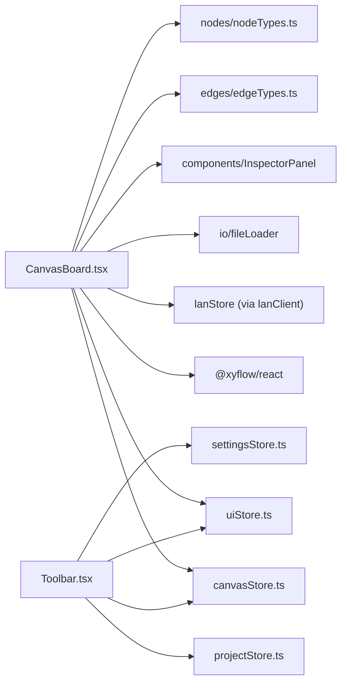

# 画布核心功能

<cite>
**本文引用的文件**
- [CanvasBoard.tsx](file://src/canvas/CanvasBoard.tsx)
- [canvasStore.ts](file://src/store/canvasStore.ts)
- [uiStore.ts](file://src/store/uiStore.ts)
- [types.ts](file://src/types.ts)
- [nodeTypes.ts](file://src/canvas/nodes/nodeTypes.ts)
- [edgeTypes.ts](file://src/canvas/edges/edgeTypes.ts)
- [Toolbar.tsx](file://src/components/Toolbar.tsx)
- [lanClient.ts](file://src/sync/lanClient.ts)
</cite>

## 目录
1. [简介](#简介)
2. [项目结构](#项目结构)
3. [核心组件](#核心组件)
4. [架构总览](#架构总览)
5. [详细组件分析](#详细组件分析)
6. [依赖关系分析](#依赖关系分析)
7. [性能考量](#性能考量)
8. [故障排查指南](#故障排查指南)
9. [结论](#结论)
10. [附录](#附录)

## 简介
本章节面向 SuQCanvas 的画布核心能力，围绕基于 ReactFlow 的无限画布实现，系统说明缩放、平移、选择等基础操作；详述画布初始化配置（最小/最大缩放、默认视口、背景样式）；解释事件处理机制（节点拖拽、连线创建、视图操作）；梳理工具模式切换逻辑（选择、连线、拖动）与快捷键支持；介绍协作锁定机制，防止其他协作者修改正在编辑的节点；并提供扩展最佳实践与性能优化建议。

## 项目结构
SuQCanvas 将画布渲染与交互集中在 CanvasBoard 中，状态管理通过 zustand store（canvasStore、uiStore、lanStore 等）解耦，节点与边类型在 nodes 与 edges 目录下注册，协作与同步由 lanClient 负责。

图表来源
- [CanvasBoard.tsx:1-459](file://src/canvas/CanvasBoard.tsx#L1-L459)
- [canvasStore.ts:1-399](file://src/store/canvasStore.ts#L1-L399)
- [uiStore.ts:1-121](file://src/store/uiStore.ts#L1-L121)
- [nodeTypes.ts:1-27](file://src/canvas/nodes/nodeTypes.ts#L1-L27)
- [edgeTypes.ts:1-7](file://src/canvas/edges/edgeTypes.ts#L1-L7)
- [Toolbar.tsx:1-403](file://src/components/Toolbar.tsx#L1-L403)
- [types.ts:1-112](file://src/types.ts#L1-L112)
- [lanClient.ts:1-800](file://src/sync/lanClient.ts#L1-L800)

章节来源
- [CanvasBoard.tsx:1-459](file://src/canvas/CanvasBoard.tsx#L1-L459)
- [canvasStore.ts:1-399](file://src/store/canvasStore.ts#L1-L399)
- [uiStore.ts:1-121](file://src/store/uiStore.ts#L1-L121)
- [nodeTypes.ts:1-27](file://src/canvas/nodes/nodeTypes.ts#L1-L27)
- [edgeTypes.ts:1-7](file://src/canvas/edges/edgeTypes.ts#L1-L7)
- [Toolbar.tsx:1-403](file://src/components/Toolbar.tsx#L1-L403)
- [types.ts:1-112](file://src/types.ts#L1-L112)
- [lanClient.ts:1-800](file://src/sync/lanClient.ts#L1-L800)

## 核心组件
- 画布容器：CanvasBoard 集成 ReactFlow，提供缩放、平移、选择、拖拽、连线、导入导出、快捷键、主题、小地图、光标共享等能力。
- 状态管理：
  - canvasStore：节点/边变更、连接、复制粘贴、对齐、撤销重做、视口、层级等。
  - uiStore：工具模式（select/connect/drag）、导入队列、查看器开关、主题等。
  - lanStore：局域网协作状态（用户、光标、编辑态、远端视口）。
- 节点与边类型：mediaNodeTypes、styledEdgeTypes 集中注册。
- 工具栏：Toolbar 提供插入元素、工具切换、对齐、缩放、主题切换、导出等功能。
- 协作同步：lanClient 负责 WebSocket 通信、数据合并、删除传播、视口广播、光标与编辑态同步。

章节来源
- [CanvasBoard.tsx:1-459](file://src/canvas/CanvasBoard.tsx#L1-L459)
- [canvasStore.ts:1-399](file://src/store/canvasStore.ts#L1-L399)
- [uiStore.ts:1-121](file://src/store/uiStore.ts#L1-L121)
- [nodeTypes.ts:1-27](file://src/canvas/nodes/nodeTypes.ts#L1-L27)
- [edgeTypes.ts:1-7](file://src/canvas/edges/edgeTypes.ts#L1-L7)
- [Toolbar.tsx:1-403](file://src/components/Toolbar.tsx#L1-L403)
- [lanClient.ts:1-800](file://src/sync/lanClient.ts#L1-L800)

## 架构总览
下图展示了画布核心流程：UI 层（CanvasBoard、Toolbar）通过 store 驱动数据变化，ReactFlow 负责渲染与交互；协作层通过 lanClient 同步节点、边、视口、光标与编辑态。

图表来源
- [CanvasBoard.tsx:1-459](file://src/canvas/CanvasBoard.tsx#L1-L459)
- [canvasStore.ts:1-399](file://src/store/canvasStore.ts#L1-L399)
- [uiStore.ts:1-121](file://src/store/uiStore.ts#L1-L121)
- [Toolbar.tsx:1-403](file://src/components/Toolbar.tsx#L1-L403)
- [lanClient.ts:1-800](file://src/sync/lanClient.ts#L1-L800)

## 详细组件分析

### 画布初始化与配置
- 缩放范围：最小缩放 0.05，最大缩放 8。
- 默认视口：初始 x=0, y=0, zoom=1；项目切换时根据 store 中的 viewport 设置到 ReactFlow。
- 背景样式：点阵背景，间距与颜色随主题切换。
- 连线样式：贝塞尔曲线，默认描边与宽度来自统一类型定义。
- 选择模式：Partial（多选）。
- 缩放行为：滚轮缩放、捏合缩放启用，双击不缩放。
- 拖拽与选择：根据工具模式动态控制 panOnDrag、selectionOnDrag、nodesDraggable、elementsSelectable、nodesConnectable、connectOnClick。
- 连接半径：连线模式下增大连接吸附半径，便于远距离连接。
- 小地图与控件：底部右侧控件与小地图，支持可拖拽与缩放，节点颜色跟随主题。

章节来源
- [CanvasBoard.tsx:38-40](file://src/canvas/CanvasBoard.tsx#L38-L40)
- [CanvasBoard.tsx:337-379](file://src/canvas/CanvasBoard.tsx#L337-L379)
- [types.ts:58-64](file://src/types.ts#L58-L64)

### 事件处理机制
- 节点拖拽：
  - 开始拖拽：若节点被他人锁定则阻止；否则标记当前用户正在编辑该节点并广播编辑态。
  - 结束拖拽：清除编辑态广播。
  - 变更过滤：对 locked 节点忽略其变更，避免冲突。
- 连线创建：
  - 通过 onConnect 生成边，附带默认样式；支持 isValidConnection 禁止自连。
- 视图操作：
  - 移动结束：记录视口到 store，用于持久化与协作广播。
  - 双击空白：添加文本节点。
  - 键盘快捷键：F 适应视图；Ctrl/Cmd+Z/Y 撤销/重做；Ctrl/Cmd+D 复制；Ctrl/Cmd+C/V 复制粘贴；Ctrl/Cmd+A 全选。
- 文件导入：
  - 拖放与剪贴板粘贴：解析文件并导入到画布指定位置。
- 鼠标移动：
  - 计算流坐标并发送光标位置给局域网协作方。

章节来源
- [CanvasBoard.tsx:66-86](file://src/canvas/CanvasBoard.tsx#L66-L86)
- [CanvasBoard.tsx:113-150](file://src/canvas/CanvasBoard.tsx#L113-L150)
- [CanvasBoard.tsx:210-232](file://src/canvas/CanvasBoard.tsx#L210-L232)
- [CanvasBoard.tsx:234-242](file://src/canvas/CanvasBoard.tsx#L234-L242)
- [CanvasBoard.tsx:347-372](file://src/canvas/CanvasBoard.tsx#L347-L372)
- [canvasStore.ts:146-158](file://src/store/canvasStore.ts#L146-L158)

### 工具模式切换与快捷键
- 工具模式：select（选择）、connect（连线）、drag（拖动）。
- 快捷键：
  - V：切换到选择模式。
  - C：切换到连线模式。
  - H：切换到拖动模式。
  - 空格：临时进入拖动模式以平移画布，松开恢复原模式。
- 工具栏按钮：点击切换工具模式，高亮当前模式。

图表来源
- [CanvasBoard.tsx:152-193](file://src/canvas/CanvasBoard.tsx#L152-L193)
- [Toolbar.tsx:80-84](file://src/components/Toolbar.tsx#L80-L84)

章节来源
- [CanvasBoard.tsx:152-193](file://src/canvas/CanvasBoard.tsx#L152-L193)
- [Toolbar.tsx:287-304](file://src/components/Toolbar.tsx#L287-L304)

### 锁定机制（防协作冲突）
- 锁定来源：当某用户在编辑某个节点时，会广播 editing 消息；其他用户收到后将该节点加入 lockedNodeIds。
- 表现：
  - 被锁定的节点 draggable/selectable 设为 false，无法被其他用户拖拽或选中。
  - 节点变更回调中过滤掉被锁定节点的变更，避免覆盖。
  - 拖拽开始时检查是否被锁定，阻止拖拽并立即广播编辑态。
- 协作清理：拖拽结束或编辑停止时清除编辑态广播。

图表来源
- [CanvasBoard.tsx:62-82](file://src/canvas/CanvasBoard.tsx#L62-L82)
- [lanClient.ts:793-800](file://src/sync/lanClient.ts#L793-L800)

章节来源
- [CanvasBoard.tsx:62-82](file://src/canvas/CanvasBoard.tsx#L62-L82)
- [lanClient.ts:793-800](file://src/sync/lanClient.ts#L793-L800)

### 节点与边的类型注册
- 节点类型：图像、视频、音频、文件卡片、文本、Markdown、PDF、PSD、标题、便签、形状等，统一在 mediaNodeTypes 中注册。
- 边类型：自定义 styled 边，使用 StyledEdge 渲染，默认样式来自 types 定义。

章节来源
- [nodeTypes.ts:14-26](file://src/canvas/nodes/nodeTypes.ts#L14-L26)
- [edgeTypes.ts:4-6](file://src/canvas/edges/edgeTypes.ts#L4-L6)
- [types.ts:58-64](file://src/types.ts#L58-L64)

### 历史与撤销重做
- 历史记录：维护 past/future 栈，限制长度；变更时通过防抖快照合并，删除操作立即落盘快照。
- 撤销/重做：支持 Ctrl/Cmd+Z/Y 快捷键，以及工具栏按钮。
- 对齐与层级：支持多节点对齐（左/右/居中/顶/底/水平分布/垂直分布），以及层级调整（前移/后移/置顶/置底）。

章节来源
- [canvasStore.ts:25-92](file://src/store/canvasStore.ts#L25-L92)
- [canvasStore.ts:126-145](file://src/store/canvasStore.ts#L126-L145)
- [canvasStore.ts:247-274](file://src/store/canvasStore.ts#L247-L274)
- [canvasStore.ts:290-361](file://src/store/canvasStore.ts#L290-L361)
- [canvasStore.ts:362-391](file://src/store/canvasStore.ts#L362-L391)

### 视图与协作广播
- 视口同步：本地视口变化通过节流广播到局域网；远端视口到达时平滑过渡到本地视图。
- 活动通知：新增/删除/移动/编辑等操作聚合为活动消息，避免刷屏。
- 删除传播：显式 sync-del 消息配合墓碑机制，确保删除一致性与晚到快照安全。

章节来源
- [CanvasBoard.tsx:94-102](file://src/canvas/CanvasBoard.tsx#L94-L102)
- [lanClient.ts:655-716](file://src/sync/lanClient.ts#L655-L716)
- [lanClient.ts:718-756](file://src/sync/lanClient.ts#L718-L756)
- [lanClient.ts:100-117](file://src/sync/lanClient.ts#L100-L117)

## 依赖关系分析
- CanvasBoard 依赖：
  - @xyflow/react：ReactFlow 核心 API 与类型。
  - store：canvasStore、uiStore、settingsStore、projectStore、lanStore。
  - io/fileLoader：导入文件与创建节点。
  - sync/lanClient：协作锁定、光标、编辑态。
  - components/InspectorPanel：属性面板。
- 节点/边类型：
  - nodeTypes：集中注册媒体类节点。
  - edgeTypes：注册 styled 边。
- Toolbar：
  - 依赖 uiStore 的工具模式与导入队列。
  - 依赖 canvasStore 的对齐、撤销重做、视口缩放。
  - 依赖 projectStore 的项目名与保存状态。
  - 依赖 settingsStore 的主题切换。

图表来源
- [CanvasBoard.tsx:1-36](file://src/canvas/CanvasBoard.tsx#L1-L36)
- [nodeTypes.ts:1-27](file://src/canvas/nodes/nodeTypes.ts#L1-L27)
- [edgeTypes.ts:1-7](file://src/canvas/edges/edgeTypes.ts#L1-L7)
- [Toolbar.tsx:1-12](file://src/components/Toolbar.tsx#L1-L12)

章节来源
- [CanvasBoard.tsx:1-36](file://src/canvas/CanvasBoard.tsx#L1-L36)
- [Toolbar.tsx:1-12](file://src/components/Toolbar.tsx#L1-L12)

## 性能考量
- 历史快照防抖：批量变更合并为一次快照，减少存储与广播压力。
- 协作广播节流：节点/边/视口变更采用节流，降低网络负载。
- 删除合并：删除操作批量合并为一条 sync-del，提升一致性效率。
- 大文件传输：分片传输与空闲超时，避免内存峰值与误判失败。
- 选择与锁定：锁定节点不参与变更与交互，减少无效计算。
- 渲染优化：按需注册节点/边类型，避免无关组件加载。

[本节为通用性能建议，未直接分析具体代码行]

## 故障排查指南
- 无法拖拽节点：
  - 检查是否被其他用户锁定（isNodeLockedByOther）。
  - 确认工具模式是否为 select。
- 连线失败：
  - 检查 connectOnClick/nodesConnectable 是否受 drag 模式影响。
  - 确认 source/target 不同（isValidConnection）。
- 快捷键无效：
  - 确认输入焦点不在输入框/文本域/可编辑元素。
  - 检查 Ctrl/Cmd 组合键是否正确触发。
- 协作不同步：
  - 检查 WebSocket 连接状态与房间项目 ID。
  - 查看活动通知与删除消息是否到达。
- 视口异常：
  - 检查 onMoveEnd 是否调用 setViewport。
  - 确认远端视口订阅与 rfSetViewport 动画参数。

章节来源
- [CanvasBoard.tsx:66-82](file://src/canvas/CanvasBoard.tsx#L66-L82)
- [CanvasBoard.tsx:347-372](file://src/canvas/CanvasBoard.tsx#L347-L372)
- [CanvasBoard.tsx:113-150](file://src/canvas/CanvasBoard.tsx#L113-L150)
- [lanClient.ts:718-756](file://src/sync/lanClient.ts#L718-L756)

## 结论
SuQCanvas 的画布核心以 ReactFlow 为基础，结合 zustand 状态管理与局域网协作，提供了完善的无限画布体验：灵活的缩放与平移、强大的选择与连线、丰富的工具模式与快捷键、健壮的锁定机制与协作同步。通过合理的性能优化与扩展点设计，可在保持流畅交互的同时支撑多人协作与复杂内容编辑。

[本节为总结性内容，无需引用具体文件]

## 附录
- 常用快捷键速查：
  - V：选择模式
  - C：连线模式
  - H：拖动模式
  - 空格：临时平移
  - F：适应视图
  - Ctrl/Cmd+Z/Y：撤销/重做
  - Ctrl/Cmd+D：复制
  - Ctrl/Cmd+C/V：复制/粘贴
  - Ctrl/Cmd+A：全选
- 工具模式对画布行为的影响：
  - select：允许选择与拖拽节点，禁用画布平移。
  - connect：允许连线，禁用节点拖拽与画布平移。
  - drag：允许画布平移，禁用选择与连线。

章节来源
- [CanvasBoard.tsx:152-193](file://src/canvas/CanvasBoard.tsx#L152-L193)
- [CanvasBoard.tsx:356-363](file://src/canvas/CanvasBoard.tsx#L356-L363)
- [Toolbar.tsx:80-84](file://src/components/Toolbar.tsx#L80-L84)