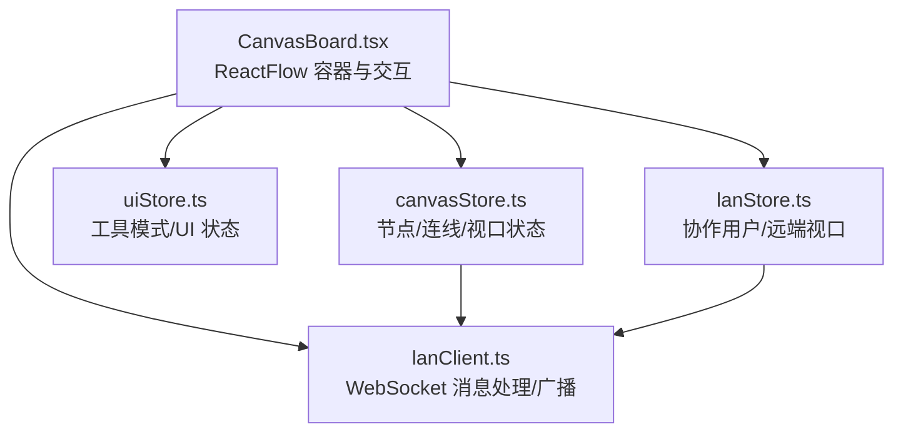
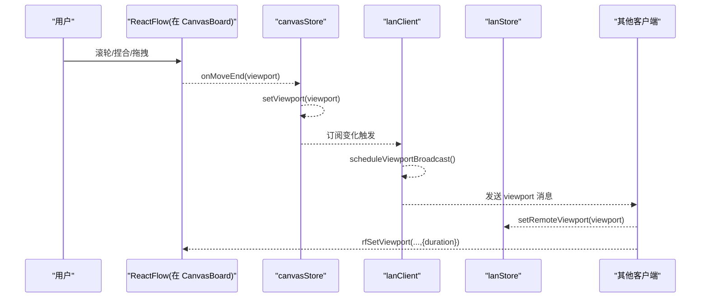
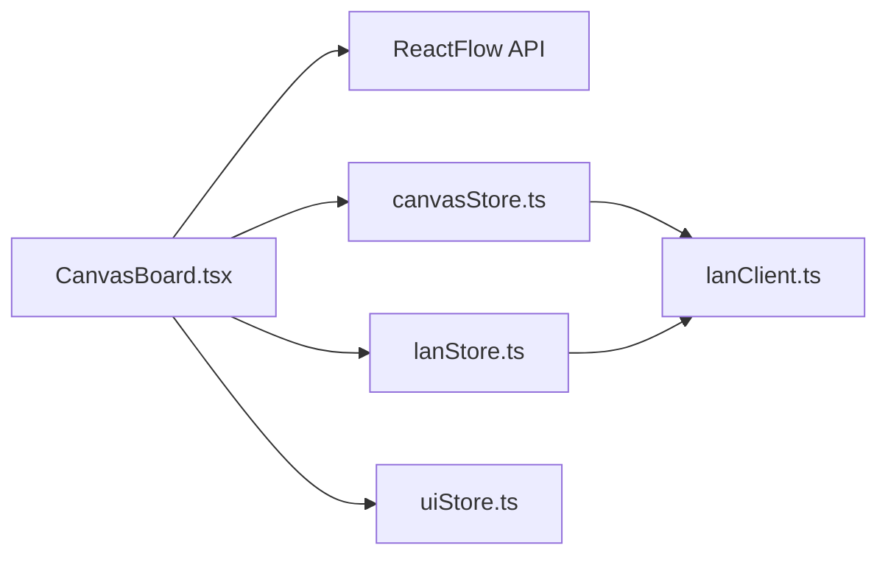
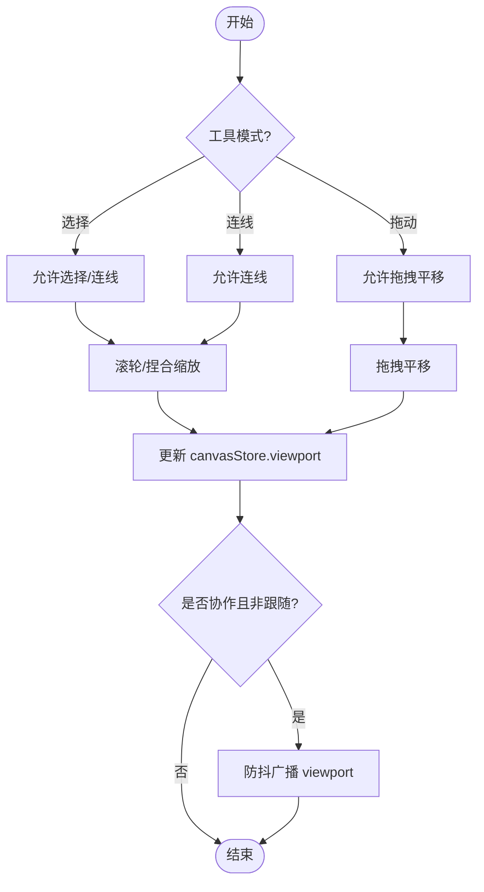

# 视图操作

<cite>
**本文引用的文件**
- [CanvasBoard.tsx](file://src/canvas/CanvasBoard.tsx)
- [canvasStore.ts](file://src/store/canvasStore.ts)
- [lanStore.ts](file://src/store/lanStore.ts)
- [lanClient.ts](file://src/sync/lanClient.ts)
- [uiStore.ts](file://src/store/uiStore.ts)
</cite>

## 目录
1. [简介](#简介)
2. [项目结构](#项目结构)
3. [核心组件](#核心组件)
4. [架构总览](#架构总览)
5. [详细组件分析](#详细组件分析)
6. [依赖关系分析](#依赖关系分析)
7. [性能考虑](#性能考虑)
8. [故障排查指南](#故障排查指南)
9. [结论](#结论)
10. [附录](#附录)

## 简介
本章节面向 SuQCanvas 的画布视图操作能力，围绕基于 ReactFlow 的无限画布进行系统性说明。内容涵盖：
- 缩放、平移、视口管理等核心能力
- 最小/最大缩放比例配置（MIN_ZOOM: 0.05, MAX_ZOOM: 8）与默认视口
- 滚轮缩放、捏合缩放、拖拽平移等交互机制
- 视图状态同步：本地保存与局域网视图同步
- 快捷键支持（F 键适配视图）与自定义视图控制器
- 性能优化建议与最佳实践

## 项目结构
SuQCanvas 将画布视图相关逻辑分布在以下位置：
- 视图容器与交互：CanvasBoard.tsx
- 视图状态与变更：canvasStore.ts
- 局域网协作与视图同步：lanStore.ts、lanClient.ts
- 工具模式与 UI 状态：uiStore.ts

图表来源
- [CanvasBoard.tsx:336-379](file://src/canvas/CanvasBoard.tsx#L336-L379)
- [canvasStore.ts:118-124](file://src/store/canvasStore.ts#L118-L124)
- [lanStore.ts:91-103](file://src/store/lanStore.ts#L91-L103)
- [lanClient.ts:718-756](file://src/sync/lanClient.ts#L718-L756)

章节来源
- [CanvasBoard.tsx:336-379](file://src/canvas/CanvasBoard.tsx#L336-L379)
- [canvasStore.ts:118-124](file://src/store/canvasStore.ts#L118-L124)
- [lanStore.ts:91-103](file://src/store/lanStore.ts#L91-L103)
- [lanClient.ts:718-756](file://src/sync/lanClient.ts#L718-L756)

## 核心组件
- 画布容器与交互层：负责 ReactFlow 实例化、缩放/平移开关、快捷键、事件绑定、视口更新与局域网跟随。
- 状态管理层：集中管理节点、连线、视口、撤销/重做历史，并提供 setViewport 等方法。
- 局域网协作层：维护连接、用户列表、远端光标/编辑态、远端视口，并负责视口与画布的实时同步。
- UI 状态层：管理工具模式（选择/连线/拖动）、临时平移等。

章节来源
- [CanvasBoard.tsx:38-39](file://src/canvas/CanvasBoard.tsx#L38-L39)
- [CanvasBoard.tsx:351-368](file://src/canvas/CanvasBoard.tsx#L351-L368)
- [canvasStore.ts:33-59](file://src/store/canvasStore.ts#L33-L59)
- [lanStore.ts:53-89](file://src/store/lanStore.ts#L53-L89)
- [lanClient.ts:718-756](file://src/sync/lanClient.ts#L718-L756)
- [uiStore.ts:18-45](file://src/store/uiStore.ts#L18-L45)

## 架构总览
下图展示了视图操作的端到端流程：用户在 CanvasBoard 中触发缩放/平移等操作，ReactFlow 回调更新 canvasStore 中的 viewport；若开启局域网协作，lanClient 会按防抖策略广播当前视口；其他客户端收到后通过 lanStore 更新 remoteViewport，再由 CanvasBoard 应用动画过渡到该视口。

图表来源
- [CanvasBoard.tsx:351-368](file://src/canvas/CanvasBoard.tsx#L351-L368)
- [canvasStore.ts:392-394](file://src/store/canvasStore.ts#L392-L394)
- [lanClient.ts:701-716](file://src/sync/lanClient.ts#L701-L716)
- [CanvasBoard.tsx:94-102](file://src/canvas/CanvasBoard.tsx#L94-L102)

## 详细组件分析

### 画布容器与交互（CanvasBoard.tsx）
- 缩放范围与默认视口
  - 最小/最大缩放：MIN_ZOOM=0.05，MAX_ZOOM=8
  - 默认视口：{ x: 0, y: 0, zoom: 1 }
- 交互开关
  - 滚轮缩放：zoomOnScroll
  - 捏合缩放：zoomOnPinch
  - 双击缩放：关闭（zoomOnDoubleClick=false），避免误触
  - 拖拽平移：根据工具模式切换 panOnDrag
- 快捷键
  - F：调用 fitView（带 padding 与 duration）
  - V/C/H：切换选择/连线/拖动工具
  - 空格：临时进入拖动模式以平移画布
- 视口同步
  - 项目切换时，使用 rfSetViewport({ duration: 0 }) 立即对齐本地存储的 viewport
  - 监听局域网远端视口变化，使用 rfSetViewport({ duration: 150 }) 平滑过渡
- 外部控制
  - 监听窗口事件 sq:view，响应 fit/zoom-in/zoom-out/reset 等动作
  - 监听 sq:focus-node，聚焦节点并居中显示

章节来源
- [CanvasBoard.tsx:38-39](file://src/canvas/CanvasBoard.tsx#L38-L39)
- [CanvasBoard.tsx:144-150](file://src/canvas/CanvasBoard.tsx#L144-L150)
- [CanvasBoard.tsx:152-193](file://src/canvas/CanvasBoard.tsx#L152-L193)
- [CanvasBoard.tsx:88-102](file://src/canvas/CanvasBoard.tsx#L88-L102)
- [CanvasBoard.tsx:263-305](file://src/canvas/CanvasBoard.tsx#L263-L305)
- [CanvasBoard.tsx:336-379](file://src/canvas/CanvasBoard.tsx#L336-L379)

### 视图状态管理（canvasStore.ts）
- 视口状态
  - 初始值：{ x: 0, y: 0, zoom: 1 }
  - 提供 setViewport(viewport) 方法供 ReactFlow 回调写入
- 变更合并与历史
  - 节点/连线变更通过 applyNodeChanges/applyEdgeChanges 合并
  - 删除操作立即落盘快照，其余操作防抖合并，限制历史长度
- 重置
  - reset() 清空节点、连线、视口与剪贴板

章节来源
- [canvasStore.ts:33-59](file://src/store/canvasStore.ts#L33-L59)
- [canvasStore.ts:118-124](file://src/store/canvasStore.ts#L118-L124)
- [canvasStore.ts:126-145](file://src/store/canvasStore.ts#L126-L145)
- [canvasStore.ts:392-397](file://src/store/canvasStore.ts#L392-L397)

### 局域网协作与视图同步（lanStore.ts + lanClient.ts）
- 远端视口
  - lanStore.remoteViewport 用于承载远端视口数据
  - 当 followId 不为空且来自被跟随者时，才接受其视口
- 广播策略
  - 监听 canvasStore 的 viewport 变化，scheduleViewportBroadcast() 以 100ms 防抖广播
  - 跟随他人时不广播自身视口
- 接收与渲染
  - 收到 viewport 消息后，设置 lanStore.remoteViewport
  - CanvasBoard 订阅 remoteViewport 变化，使用 150ms 动画过渡到远端视口
- 项目级隔离
  - 仅对 activeProjectId 一致的房间广播/接收视口

章节来源
- [lanStore.ts:53-89](file://src/store/lanStore.ts#L53-L89)
- [lanStore.ts:91-103](file://src/store/lanStore.ts#L91-L103)
- [lanClient.ts:599-605](file://src/sync/lanClient.ts#L599-L605)
- [lanClient.ts:701-716](file://src/sync/lanClient.ts#L701-L716)
- [CanvasBoard.tsx:94-102](file://src/canvas/CanvasBoard.tsx#L94-L102)

### 工具模式与临时平移（uiStore.ts）
- 工具模式
  - select/connect/drag 三种模式影响节点可拖拽、连线、元素可选等
- 临时平移
  - 按住空格临时切换到 drag 模式，松开恢复原工具
- 与 ReactFlow 联动
  - panOnDrag 根据 tool 动态切换为 true 或 [1]（仅中键平移）

章节来源
- [uiStore.ts:18-45](file://src/store/uiStore.ts#L18-L45)
- [CanvasBoard.tsx:152-193](file://src/canvas/CanvasBoard.tsx#L152-L193)
- [CanvasBoard.tsx:351-368](file://src/canvas/CanvasBoard.tsx#L351-L368)

## 依赖关系分析
- CanvasBoard 依赖 ReactFlow 提供的缩放/平移 API（zoomIn/zoomOut/setCenter/fitView/getZoom）
- CanvasBoard 通过 useCanvasStore 读写 nodes/edges/viewport，并通过 onMoveEnd 回写
- CanvasBoard 通过 useLanStore 订阅 remoteViewport，驱动平滑过渡
- lanClient 订阅 canvasStore 的变化，按项目隔离广播视口与画布数据
- uiStore 提供工具模式，影响 ReactFlow 的行为开关

图表来源
- [CanvasBoard.tsx:336-379](file://src/canvas/CanvasBoard.tsx#L336-L379)
- [canvasStore.ts:118-124](file://src/store/canvasStore.ts#L118-L124)
- [lanStore.ts:91-103](file://src/store/lanStore.ts#L91-L103)
- [lanClient.ts:718-756](file://src/sync/lanClient.ts#L718-L756)
- [uiStore.ts:18-45](file://src/store/uiStore.ts#L18-L45)

章节来源
- [CanvasBoard.tsx:336-379](file://src/canvas/CanvasBoard.tsx#L336-L379)
- [canvasStore.ts:118-124](file://src/store/canvasStore.ts#L118-L124)
- [lanStore.ts:91-103](file://src/store/lanStore.ts#L91-L103)
- [lanClient.ts:718-756](file://src/sync/lanClient.ts#L718-L756)
- [uiStore.ts:18-45](file://src/store/uiStore.ts#L18-L45)

## 性能考虑
- 缩放与平移
  - 启用 zoomOnScroll 与 zoomOnPinch，禁用 zoomOnDoubleClick 减少误操作
  - 使用 panOnDrag=[1] 仅在按住鼠标中键时平移，避免与选择/连线冲突
- 动画与过渡
  - 本地初始化视口时使用 duration: 0 避免闪烁
  - 局域网远端视口过渡使用 150ms 平衡流畅性与延迟感知
- 广播节流
  - 视口广播采用 100ms 防抖，降低网络压力
  - 画布数据变更采用 150ms 防抖合并，减少重复传输
- 历史与快照
  - 删除操作立即落盘快照，其余操作防抖合并，限制历史长度，降低内存占用
- 建议
  - 在大画布场景下，优先使用中键平移，减少选择/连线带来的重绘
  - 合理设置 MIN_ZOOM/MAX_ZOOM，避免极端缩放导致渲染压力
  - 多人协作时，关注 followId 行为，避免不必要的视口覆盖

[本节为通用性能建议，不直接分析具体代码行]

## 故障排查指南
- 无法缩放或缩放异常
  - 检查 minZoom/maxZoom 是否被正确传入 ReactFlow
  - 确认 zoomOnScroll/zoomOnPinch 已启用
- 键盘 F 键无效
  - 确保未处于输入框/可编辑区域（isTypingTarget 判断）
  - 确认未同时按下 Ctrl/Meta/Alt
- 局域网视图不同步
  - 确认双方处于同一 activeProjectId
  - 检查 followId 是否导致只读跟随
  - 查看 lanStore.remoteViewport 是否更新
- 视口跳变或卡顿
  - 检查是否在频繁设置视口（如循环中多次调用）
  - 适当增大过渡 duration 或降低广播频率

章节来源
- [CanvasBoard.tsx:144-150](file://src/canvas/CanvasBoard.tsx#L144-L150)
- [CanvasBoard.tsx:94-102](file://src/canvas/CanvasBoard.tsx#L94-L102)
- [lanClient.ts:701-716](file://src/sync/lanClient.ts#L701-L716)
- [lanClient.ts:599-605](file://src/sync/lanClient.ts#L599-L605)

## 结论
SuQCanvas 的视图操作以 ReactFlow 为核心，结合 zustand 状态管理与 WebSocket 局域网协作，实现了稳定、流畅且可扩展的无限画布体验。通过合理的缩放范围、默认视口、动画过渡与防抖策略，兼顾了交互友好性与性能表现。配合快捷键与外部控制器，能够满足复杂工作流下的多场景需求。

[本节为总结性内容，不直接分析具体代码行]

## 附录

### 关键配置速查
- 缩放范围：MIN_ZOOM=0.05，MAX_ZOOM=8
- 默认视口：{ x: 0, y: 0, zoom: 1 }
- 交互开关：zoomOnScroll=true，zoomOnPinch=true，zoomOnDoubleClick=false
- 平移模式：panOnDrag={tool==='drag'?true:[1]}
- 快捷键：F 适配视图；V/C/H 切换工具；空格临时平移

章节来源
- [CanvasBoard.tsx:38-39](file://src/canvas/CanvasBoard.tsx#L38-L39)
- [CanvasBoard.tsx:351-368](file://src/canvas/CanvasBoard.tsx#L351-L368)
- [CanvasBoard.tsx:144-193](file://src/canvas/CanvasBoard.tsx#L144-L193)

### 视图操作流程图（算法与决策）

图表来源
- [CanvasBoard.tsx:351-368](file://src/canvas/CanvasBoard.tsx#L351-L368)
- [canvasStore.ts:392-394](file://src/store/canvasStore.ts#L392-L394)
- [lanClient.ts:701-716](file://src/sync/lanClient.ts#L701-L716)