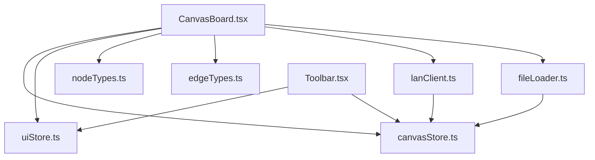
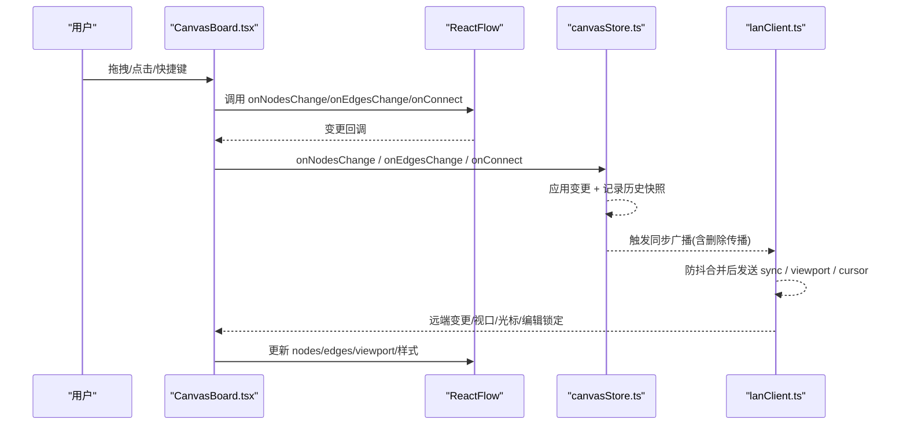
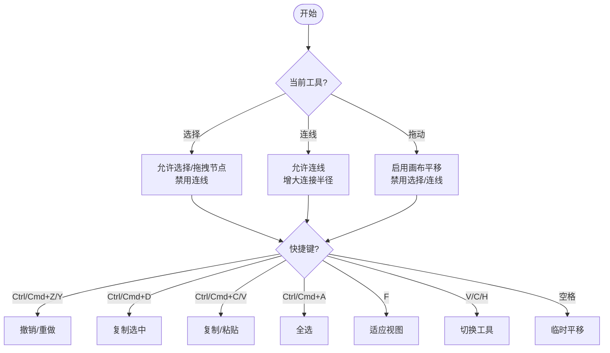
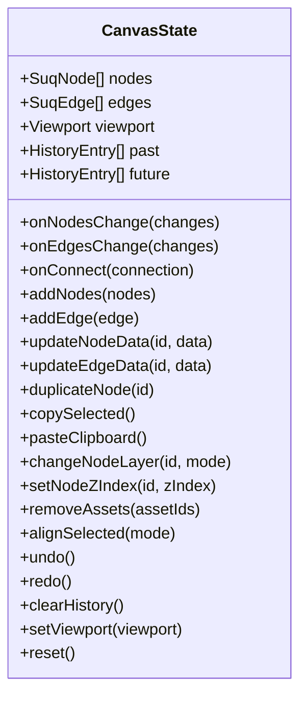
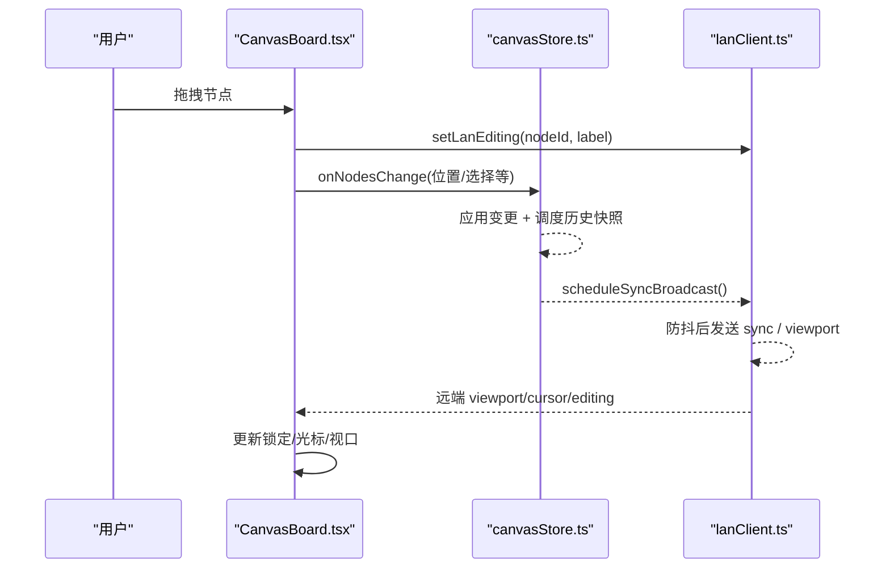
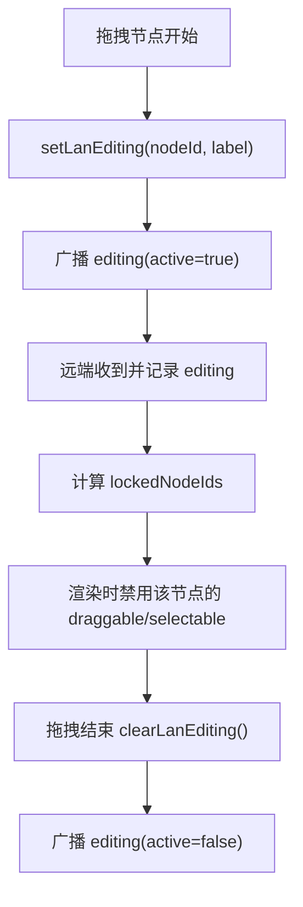
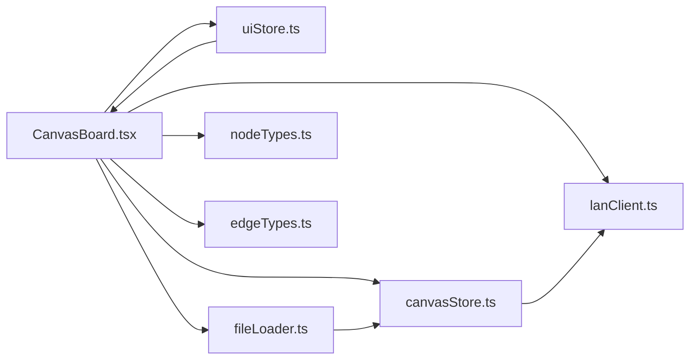

# 画布编辑系统

<cite>
**本文引用的文件**
- [CanvasBoard.tsx](file://src/canvas/CanvasBoard.tsx)
- [canvasStore.ts](file://src/store/canvasStore.ts)
- [uiStore.ts](file://src/store/uiStore.ts)
- [edgeTypes.ts](file://src/canvas/edges/edgeTypes.ts)
- [nodeTypes.ts](file://src/canvas/nodes/nodeTypes.ts)
- [types.ts](file://src/types.ts)
- [Toolbar.tsx](file://src/components/Toolbar.tsx)
- [lanClient.ts](file://src/sync/lanClient.ts)
- [fileLoader.ts](file://src/io/fileLoader.ts)
</cite>

## 目录
1. [简介](#简介)
2. [项目结构](#项目结构)
3. [核心组件](#核心组件)
4. [架构总览](#架构总览)
5. [详细组件分析](#详细组件分析)
6. [依赖关系分析](#依赖关系分析)
7. [性能考量](#性能考量)
8. [故障排查指南](#故障排查指南)
9. [结论](#结论)
10. [附录](#附录)

## 简介
本文件系统基于 ReactFlow 实现 SuQCanvas 的无限画布编辑能力，提供缩放、平移、选择、连线、拖拽等核心交互；通过 Zustand 集中管理节点、边与视口状态，并支持撤销/重做、对齐与分布、复制粘贴等编辑能力。同时集成局域网协作（WebSocket），实现多人实时光标、编辑锁定、视图同步与素材分发。文档将深入说明事件处理机制、状态管理、工具模式切换、快捷键、锁定机制以及扩展与优化建议。

## 项目结构
- 画布容器与交互：位于 src/canvas/CanvasBoard.tsx，封装 ReactFlow 实例、事件绑定、工具模式联动、快捷键、拖放导入、视口同步与协作渲染。
- 状态管理：src/store/canvasStore.ts 负责节点/边/视口与历史栈；src/store/uiStore.ts 管理 UI 工具模式与弹窗等；src/store/lanStore.ts 由协作模块使用。
- 节点与边类型：src/canvas/nodes/nodeTypes.ts 注册媒体节点类型；src/canvas/edges/edgeTypes.ts 注册自定义边样式；src/types.ts 定义统一的数据模型。
- 工具栏与操作入口：src/components/Toolbar.tsx 提供插入、工具切换、对齐、缩放、主题等入口。
- 协作与同步：src/sync/lanClient.ts 负责 WebSocket 连接、消息路由、画布同步、视口广播、编辑锁定、活动通知与素材传输。
- 文件导入与节点创建：src/io/fileLoader.ts 负责文件解析、缩略图生成、本地存储、云端/OSS 同步与局域网分发，并创建对应节点。

图表来源
- [CanvasBoard.tsx:1-459](file://src/canvas/CanvasBoard.tsx#L1-L459)
- [canvasStore.ts:1-399](file://src/store/canvasStore.ts#L1-L399)
- [uiStore.ts:1-121](file://src/store/uiStore.ts#L1-L121)
- [nodeTypes.ts:1-27](file://src/canvas/nodes/nodeTypes.ts#L1-L27)
- [edgeTypes.ts:1-7](file://src/canvas/edges/edgeTypes.ts#L1-L7)
- [lanClient.ts:1-800](file://src/sync/lanClient.ts#L1-L800)
- [fileLoader.ts:1-297](file://src/io/fileLoader.ts#L1-L297)

章节来源
- [CanvasBoard.tsx:1-459](file://src/canvas/CanvasBoard.tsx#L1-L459)
- [canvasStore.ts:1-399](file://src/store/canvasStore.ts#L1-L399)
- [uiStore.ts:1-121](file://src/store/uiStore.ts#L1-L121)
- [nodeTypes.ts:1-27](file://src/canvas/nodes/nodeTypes.ts#L1-L27)
- [edgeTypes.ts:1-7](file://src/canvas/edges/edgeTypes.ts#L1-L7)
- [Toolbar.tsx:1-403](file://src/components/Toolbar.tsx#L1-L403)
- [lanClient.ts:1-800](file://src/sync/lanClient.ts#L1-L800)
- [fileLoader.ts:1-297](file://src/io/fileLoader.ts#L1-L297)

## 核心组件
- 画布容器 CanvasBoard：承载 ReactFlow，配置缩放范围、选择模式、连线行为、拖拽与双击添加文本、拖放导入、键盘快捷键、协作光标与锁定、视口同步。
- 画布状态 canvasStore：维护 nodes、edges、viewport、历史栈（past/future）、剪贴板、对齐/层级、撤销/重做、视口设置与重置。
- UI 状态 uiStore：维护工具模式（select/connect/drag）、导入队列、各类查看器开关、主题与页面导航等。
- 协作 lanClient：WebSocket 连接、消息分发、画布增量同步、删除传播、视口广播、编辑锁定、活动日志、素材分片传输与 HTTP 流式回退。
- 文件导入 fileLoader：识别文件类型、生成缩略图、持久化到 IndexedDB、上传至 OSS/云端、局域网分发，并创建对应节点。

章节来源
- [CanvasBoard.tsx:1-459](file://src/canvas/CanvasBoard.tsx#L1-L459)
- [canvasStore.ts:1-399](file://src/store/canvasStore.ts#L1-L399)
- [uiStore.ts:1-121](file://src/store/uiStore.ts#L1-L121)
- [lanClient.ts:1-800](file://src/sync/lanClient.ts#L1-L800)
- [fileLoader.ts:1-297](file://src/io/fileLoader.ts#L1-L297)

## 架构总览
画布以 ReactFlow 为渲染与交互引擎，Zustand store 作为单一数据源。CanvasBoard 订阅 store 变化并驱动 ReactFlow 属性；所有用户操作通过 store 方法更新状态，触发撤销/重做与协作广播。协作层通过 WebSocket 将变更、视口、光标与编辑锁定广播给同房间成员，并接收远端变更合并到本地。

图表来源
- [CanvasBoard.tsx:66-102](file://src/canvas/CanvasBoard.tsx#L66-L102)
- [canvasStore.ts:126-158](file://src/store/canvasStore.ts#L126-L158)
- [lanClient.ts:655-756](file://src/sync/lanClient.ts#L655-L756)

## 详细组件分析

### 画布容器 CanvasBoard
- 缩放与平移：通过 minZoom/maxZoom、zoomOnScroll/zoomOnPinch、onMoveEnd 同步视口到 store；支持 fitView、zoomIn/zoomOut、setCenter。
- 选择与连线：selectionMode=Partial，nodesDraggable/elementsSelectable/nodesConnectable/connectOnClick 根据工具模式动态控制；connectionRadius 在连线模式下增大以提升易用性。
- 节点拖拽与锁定：onNodeDragStart/Stop 上报编辑状态；lockedNodeIds 来自协作编辑锁定，过滤不可拖拽/选择的节点。
- 视图同步：监听远端 remoteViewport 并平滑过渡到本地；初始时从 store 恢复视口。
- 快捷键：Ctrl/Cmd+Z/Y 撤销/重做；Ctrl/Cmd+D 复制选中；Ctrl/Cmd+C/V 复制粘贴；Ctrl/Cmd+A 全选；F 适应视图；V/C/H 切换工具；空格临时进入拖动模式。
- 拖放导入：onDragOver/Leave/Drop 检测 Files 并调用 importFiles；paste 事件也支持直接粘贴文件。
- 事件总线：监听 sq:add-node/sq:view/sq:focus-node 响应外部命令（如 Toolbar 触发的插入与视图操作）。

图表来源
- [CanvasBoard.tsx:113-193](file://src/canvas/CanvasBoard.tsx#L113-L193)
- [CanvasBoard.tsx:337-379](file://src/canvas/CanvasBoard.tsx#L337-L379)

章节来源
- [CanvasBoard.tsx:1-459](file://src/canvas/CanvasBoard.tsx#L1-L459)

### 状态管理 canvasStore
- 数据结构：nodes(SuqNode[])、edges(SuqEdge[])、viewport(Viewport)、past/future（历史栈）、clipboard。
- 变更处理：applyNodeChanges/applyEdgeChanges 应用 ReactFlow 变更；删除操作立即落盘历史，其他变更防抖合并后入栈。
- 连接创建：onConnect 生成默认样式的边并加入 edges。
- 节点/边增删改：addNodes/addEdge/updateNodeData/updateEdgeData/duplicateNode/removeAssets 均记录历史。
- 对齐与分布：alignSelected 支持左/中/右/顶/中/底对齐及水平/垂直分布。
- 层级：changeNodeLayer/setNodeZIndex 调整节点 zIndex。
- 撤销/重做：undo/redo 在 past/future 间移动；clearHistory 清空历史。
- 视口：setViewport 保存当前视口，供初始化或协作同步使用。

图表来源
- [canvasStore.ts:25-59](file://src/store/canvasStore.ts#L25-L59)
- [canvasStore.ts:118-399](file://src/store/canvasStore.ts#L118-L399)

章节来源
- [canvasStore.ts:1-399](file://src/store/canvasStore.ts#L1-L399)

### 工具模式与快捷键
- 工具模式：select/connect/drag，存储在 uiStore.tool，CanvasBoard 根据 tool 控制 ReactFlow 的行为（选择、连线、平移）。
- 快捷键：
  - V：选择模式
  - C：连线模式
  - H：拖动模式
  - 空格：临时切换到拖动模式，松开恢复原模式
  - Ctrl/Cmd+Z/Y：撤销/重做
  - Ctrl/Cmd+D：复制选中
  - Ctrl/Cmd+C/V：复制/粘贴
  - Ctrl/Cmd+A：全选
  - F：适应视图
- 工具栏按钮：Toolbar 提供工具切换、插入元素、对齐、缩放、主题切换等入口，并通过 window 事件与 CanvasBoard 通信。

章节来源
- [uiStore.ts:1-121](file://src/store/uiStore.ts#L1-L121)
- [CanvasBoard.tsx:152-193](file://src/canvas/CanvasBoard.tsx#L152-L193)
- [Toolbar.tsx:80-84](file://src/components/Toolbar.tsx#L80-L84)
- [Toolbar.tsx:287-304](file://src/components/Toolbar.tsx#L287-L304)
- [Toolbar.tsx:353-371](file://src/components/Toolbar.tsx#L353-L371)

### 事件处理机制
- 节点拖拽：onNodeDragStart 上报编辑锁定；onNodeDragStop 释放锁定；被他人锁定的节点不可拖拽/选择。
- 连线创建：onConnect 生成边；isValidConnection 禁止自连；connectionLineStyle 使用默认样式。
- 视图操作：onMoveEnd 同步视口；onPaneDoubleClick 添加文本节点；fitView/zoomIn/zoomOut/setCenter 由 Toolbar 或快捷键触发。
- 拖放与粘贴：onDragOver/Leave/Drop 处理文件拖放；window paste 监听文件粘贴；importFiles 创建节点并偏移位置。
- 协作事件：sendLanCursor 上报鼠标坐标；setLanEditing/clearLanEditing 上报编辑锁定；lanClient 接收远端变更、视口、光标与删除消息并合并到本地。

图表来源
- [CanvasBoard.tsx:76-86](file://src/canvas/CanvasBoard.tsx#L76-L86)
- [CanvasBoard.tsx:337-379](file://src/canvas/CanvasBoard.tsx#L337-L379)
- [canvasStore.ts:126-158](file://src/store/canvasStore.ts#L126-L158)
- [lanClient.ts:655-756](file://src/sync/lanClient.ts#L655-L756)

章节来源
- [CanvasBoard.tsx:66-102](file://src/canvas/CanvasBoard.tsx#L66-L102)
- [CanvasBoard.tsx:210-334](file://src/canvas/CanvasBoard.tsx#L210-L334)
- [lanClient.ts:718-756](file://src/sync/lanClient.ts#L718-L756)

### 数据模型与类型
- 节点数据 SuqNodeData：包含 kind、assetId、文本/标签、尺寸、颜色、对齐、字体、创建信息等。
- 边数据 SuqEdgeData：包含 style（线型、路径、箭头、描边）与可选 order。
- 默认边样式 DEFAULT_EDGE_STYLE：贝塞尔曲线、末端箭头、默认描边色与宽度。
- 节点类型映射：mediaNodeTypes 将字符串类型映射到具体组件（image/video/audio/pdf/psd/markdown/text/heading/sticky/shape）。
- 边类型映射：styledEdgeTypes 注册自定义 StyledEdge。

章节来源
- [types.ts:1-112](file://src/types.ts#L1-L112)
- [nodeTypes.ts:1-27](file://src/canvas/nodes/nodeTypes.ts#L1-L27)
- [edgeTypes.ts:1-7](file://src/canvas/edges/edgeTypes.ts#L1-L7)

### 协作与锁定机制
- 编辑锁定：当某用户拖拽节点时，通过 setLanEditing 广播 nodeId 与 label；其他用户收到 editing 消息后，将该节点标记为 locked，禁止其拖拽/选择。
- 锁定计算：CanvasBoard 根据 editing 列表与 selfId 计算 lockedNodeIds，并在渲染前将对应节点设为 draggable/selectable=false。
- 视图同步：CanvasBoard 监听 remoteViewport，使用 rfSetViewport 平滑过渡；lanClient 定期广播本地 viewport。
- 删除传播：当本地删除节点/边时，lanClient 发送 sync-del 消息，远端按 id 移除并设置墓碑防止晚到快照复活。
- 活动通知：对新增/删除/移动/编辑等操作聚合为 activity 消息，便于展示最近活动。

图表来源
- [CanvasBoard.tsx:62-82](file://src/canvas/CanvasBoard.tsx#L62-L82)
- [lanClient.ts:793-800](file://src/sync/lanClient.ts#L793-L800)
- [lanClient.ts:578-598](file://src/sync/lanClient.ts#L578-L598)

章节来源
- [CanvasBoard.tsx:62-82](file://src/canvas/CanvasBoard.tsx#L62-L82)
- [lanClient.ts:578-598](file://src/sync/lanClient.ts#L578-L598)
- [lanClient.ts:718-756](file://src/sync/lanClient.ts#L718-L756)

### 文件导入与节点创建
- 导入流程：importFiles 遍历文件，限制大小上限，putAsset 写入 IndexedDB，生成缩略图（视频/PSD），推送至局域网与云端，然后 createNodeForAsset 创建节点并依次偏移位置。
- 快捷插入：createTextNode/createHeadingNode/createStickyNode/createShapeNode 用于双击空白或 Toolbar 插入。
- 云端/OSS：若已配置，自动上传主文件与缩略图并更新元数据。

章节来源
- [fileLoader.ts:77-117](file://src/io/fileLoader.ts#L77-L117)
- [fileLoader.ts:186-205](file://src/io/fileLoader.ts#L186-L205)
- [fileLoader.ts:207-297](file://src/io/fileLoader.ts#L207-L297)

## 依赖关系分析
- CanvasBoard 依赖：
  - ReactFlow 提供渲染与交互基础能力。
  - canvasStore 提供数据与历史。
  - uiStore 提供工具模式与 UI 状态。
  - lanClient 提供协作能力（光标、锁定、视口、同步）。
  - fileLoader 提供文件导入与节点创建。
  - nodeTypes/edgeTypes 提供节点与边的渲染类型。
- 耦合点：
  - CanvasBoard 与 store 强耦合（读写 nodes/edges/viewport）。
  - 协作逻辑集中在 lanClient，通过消息协议解耦。
  - 文件导入与云端/OSS 通过 fileLoader 抽象，避免业务组件感知细节。

图表来源
- [CanvasBoard.tsx:1-459](file://src/canvas/CanvasBoard.tsx#L1-L459)
- [canvasStore.ts:1-399](file://src/store/canvasStore.ts#L1-L399)
- [uiStore.ts:1-121](file://src/store/uiStore.ts#L1-L121)
- [lanClient.ts:1-800](file://src/sync/lanClient.ts#L1-L800)
- [fileLoader.ts:1-297](file://src/io/fileLoader.ts#L1-L297)
- [nodeTypes.ts:1-27](file://src/canvas/nodes/nodeTypes.ts#L1-L27)
- [edgeTypes.ts:1-7](file://src/canvas/edges/edgeTypes.ts#L1-L7)

章节来源
- [CanvasBoard.tsx:1-459](file://src/canvas/CanvasBoard.tsx#L1-L459)
- [canvasStore.ts:1-399](file://src/store/canvasStore.ts#L1-L399)
- [uiStore.ts:1-121](file://src/store/uiStore.ts#L1-L121)
- [lanClient.ts:1-800](file://src/sync/lanClient.ts#L1-L800)
- [fileLoader.ts:1-297](file://src/io/fileLoader.ts#L1-L297)
- [nodeTypes.ts:1-27](file://src/canvas/nodes/nodeTypes.ts#L1-L27)
- [edgeTypes.ts:1-7](file://src/canvas/edges/edgeTypes.ts#L1-L7)

## 性能考量
- 历史快照防抖：canvasStore 使用定时器合并多次变更，减少历史栈膨胀与同步频率。
- 协作广播节流：lanClient 对 sync/viewport/activity 进行防抖，降低网络压力。
- 删除传播与墓碑：sync-del 与墓碑机制避免远端误复活已删除项，提升一致性。
- 大文件传输：分片传输与空闲超时，支持断点续传与 HTTP Range 流式回退，避免阻塞。
- 渲染优化：仅对选中节点高亮；锁定节点禁用交互；MiniMap 与 Controls 按需显示。
- 建议：
  - 合理设置 HISTORY_LIMIT 与 HISTORY_DEBOUNCE，平衡撤销深度与性能。
  - 在大量节点场景下，考虑虚拟滚动或分页加载（需扩展 ReactFlow 能力）。
  - 对频繁更新的节点数据（如音频波形）采用增量更新与节流。
  - 使用结构化克隆与最小化 payload 减少序列化开销。

[本节为通用指导，不直接分析具体文件]

## 故障排查指南
- 无法拖拽节点：
  - 检查是否被他人锁定（editing 列表中存在非 selfId 的 nodeId）。
  - 确认工具模式不是 drag（此时禁用选择/连线）。
- 连线失败：
  - 检查 isValidConnection 是否拒绝自连。
  - 确认 nodesConnectable/connectOnClick 在当前工具模式下启用。
- 视口不同步：
  - 检查 remoteViewport 是否更新；确认 onMoveEnd 正确调用 setViewport。
  - 检查 lanClient 的 scheduleViewportBroadcast 是否被触发。
- 协作异常：
  - 检查 WebSocket 状态与重连逻辑；确认 roomSend 携带 projectId。
  - 查看 activity 日志定位变更来源。
- 导入失败：
  - 检查文件大小限制与 IndexedDB 容量；查看 toast 提示。
  - 确认云端/OSS 配置与权限。

章节来源
- [CanvasBoard.tsx:62-82](file://src/canvas/CanvasBoard.tsx#L62-L82)
- [CanvasBoard.tsx:337-379](file://src/canvas/CanvasBoard.tsx#L337-L379)
- [lanClient.ts:119-152](file://src/sync/lanClient.ts#L119-L152)
- [fileLoader.ts:186-205](file://src/io/fileLoader.ts#L186-L205)

## 结论
SuQCanvas 的画布编辑系统以 ReactFlow 为核心，结合 Zustand 的状态管理与 WebSocket 协作，提供了完整的无限画布编辑体验。通过工具模式、快捷键、锁定机制与协作同步，实现了高效且安全的多人编辑。建议在大规模节点与高频更新场景下进一步优化渲染与同步策略，确保流畅性与一致性。

[本节为总结，不直接分析具体文件]

## 附录
- 快捷键速查：
  - V：选择
  - C：连线
  - H：拖动
  - 空格：临时平移
  - Ctrl/Cmd+Z/Y：撤销/重做
  - Ctrl/Cmd+D：复制选中
  - Ctrl/Cmd+C/V：复制/粘贴
  - Ctrl/Cmd+A：全选
  - F：适应视图
- 工具模式影响：
  - select：可拖拽节点、可选择元素、不可连线
  - connect：可连线、不可拖拽/选择
  - drag：可平移画布、不可选择/连线

章节来源
- [CanvasBoard.tsx:152-193](file://src/canvas/CanvasBoard.tsx#L152-L193)
- [uiStore.ts:1-121](file://src/store/uiStore.ts#L1-L121)