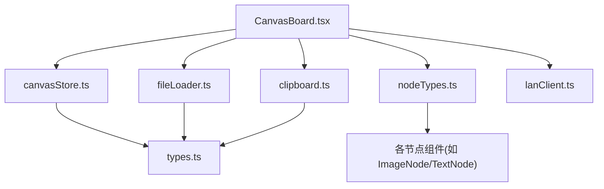
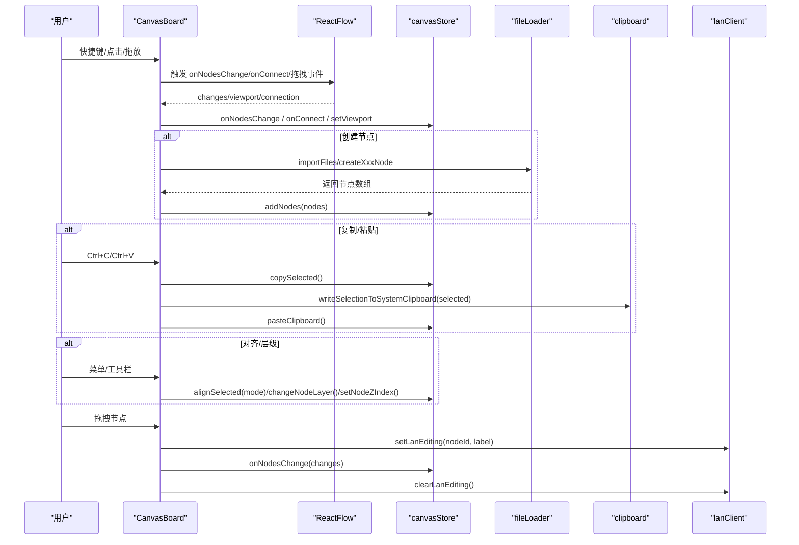
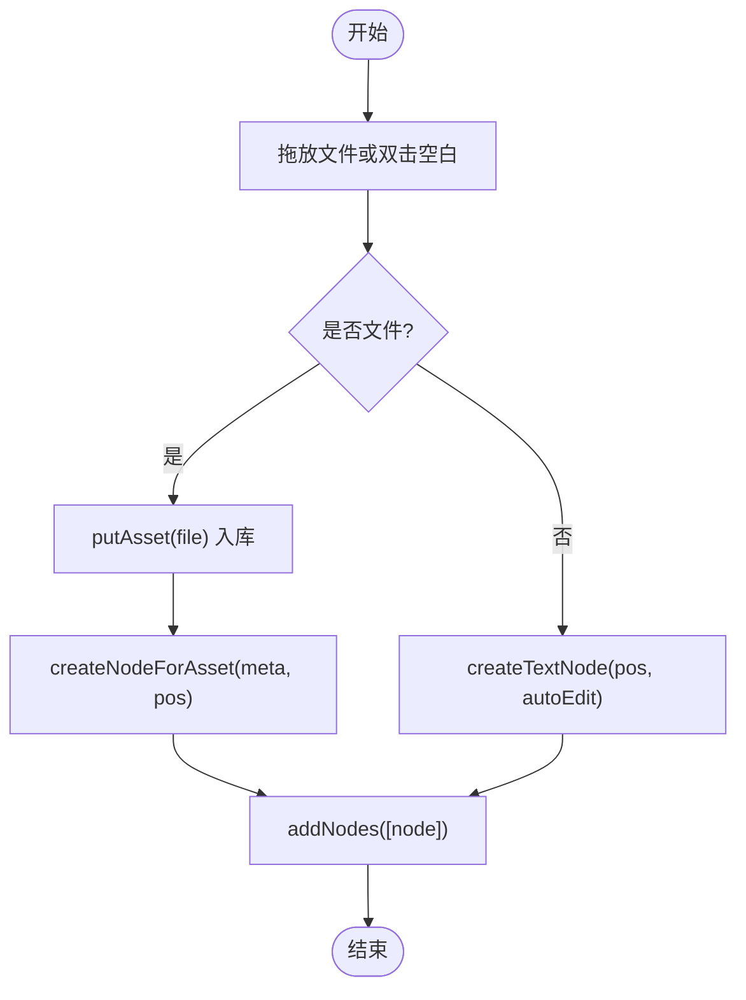
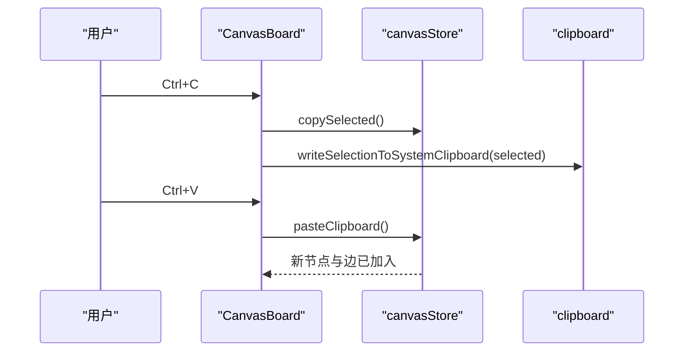
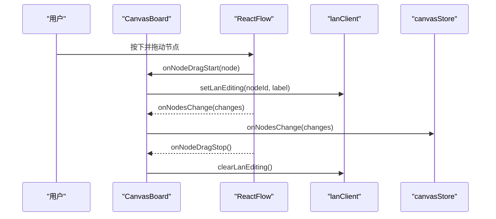
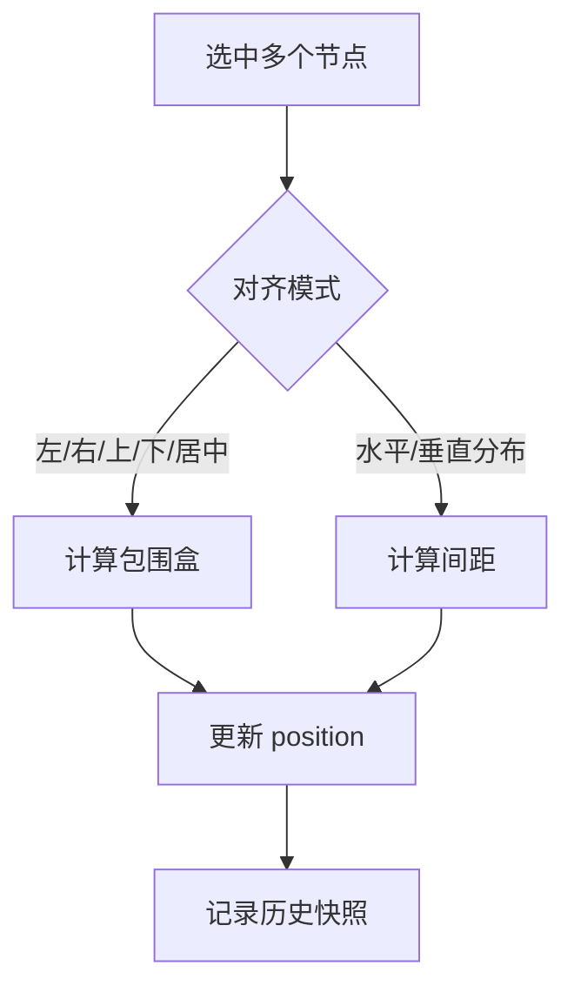
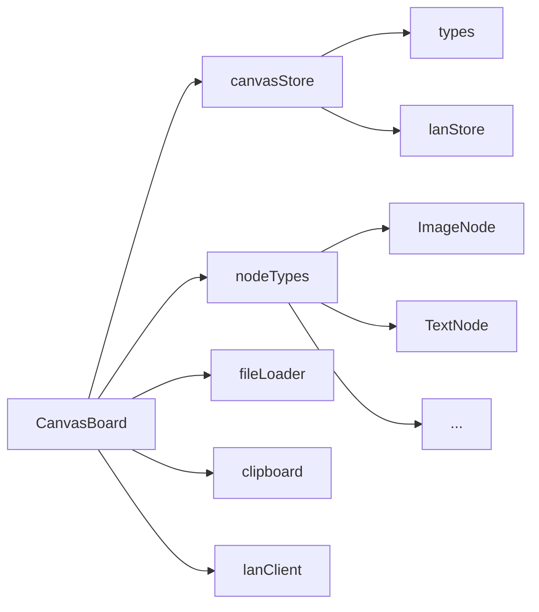

# 节点管理系统

<cite>
**本文引用的文件**
- [src/canvas/CanvasBoard.tsx](file://src/canvas/CanvasBoard.tsx)
- [src/store/canvasStore.ts](file://src/store/canvasStore.ts)
- [src/types.ts](file://src/types.ts)
- [src/canvas/nodes/nodeTypes.ts](file://src/canvas/nodes/nodeTypes.ts)
- [src/io/fileLoader.ts](file://src/io/fileLoader.ts)
- [src/canvas/clipboard.ts](file://src/canvas/clipboard.ts)
- [src/sync/lanClient.ts](file://src/sync/lanClient.ts)
- [src/canvas/nodes/ImageNode.tsx](file://src/canvas/nodes/ImageNode.tsx)
- [src/canvas/nodes/TextNode.tsx](file://src/canvas/nodes/TextNode.tsx)
</cite>

## 目录
1. [简介](#简介)
2. [项目结构](#项目结构)
3. [核心组件](#核心组件)
4. [架构总览](#架构总览)
5. [详细组件分析](#详细组件分析)
6. [依赖关系分析](#依赖关系分析)
7. [性能考虑](#性能考虑)
8. [故障排查指南](#故障排查指南)
9. [结论](#结论)
10. [附录：自定义节点类型开发指南](#附录自定义节点类型开发指南)

## 简介
本文件面向 SuQCanvas 的节点管理系统，系统性说明节点的创建、删除、复制、粘贴、选中与多选、拖拽行为、锁定机制、批量操作以及自定义节点类型的开发方式。文档以代码为依据，提供数据模型、交互流程与架构图示，帮助读者快速理解并扩展节点能力。

## 项目结构
SuQCanvas 将画布与节点管理拆分为多个模块：
- 画布容器与交互：CanvasBoard 负责 ReactFlow 配置、快捷键、工具模式、拖放导入、视图同步等。
- 状态与历史：canvasStore 使用 Zustand 维护节点、边、视口、撤销/重做历史、剪贴板、对齐与层级等。
- 类型定义：types 定义节点数据模型、边样式、媒体类型等。
- 节点类型注册：nodeTypes 集中注册所有内置节点类型。
- 文件导入与节点构造：fileLoader 负责素材入库、生成节点、默认尺寸与元信息。
- 系统剪贴板：clipboard 支持将选中的图片/PSD或文本写入系统剪贴板。
- 局域网协作：lanClient 提供光标广播、编辑锁、远端视口同步等。

图表来源
- [src/canvas/CanvasBoard.tsx:1-120](file://src/canvas/CanvasBoard.tsx#L1-L120)
- [src/store/canvasStore.ts:1-120](file://src/store/canvasStore.ts#L1-L120)
- [src/canvas/nodes/nodeTypes.ts:1-27](file://src/canvas/nodes/nodeTypes.ts#L1-L27)
- [src/io/fileLoader.ts:1-60](file://src/io/fileLoader.ts#L1-L60)
- [src/canvas/clipboard.ts:1-40](file://src/canvas/clipboard.ts#L1-L40)
- [src/types.ts:1-60](file://src/types.ts#L1-L60)

章节来源
- [src/canvas/CanvasBoard.tsx:1-120](file://src/canvas/CanvasBoard.tsx#L1-L120)
- [src/store/canvasStore.ts:1-120](file://src/store/canvasStore.ts#L1-L120)
- [src/canvas/nodes/nodeTypes.ts:1-27](file://src/canvas/nodes/nodeTypes.ts#L1-L27)
- [src/io/fileLoader.ts:1-60](file://src/io/fileLoader.ts#L1-L60)
- [src/canvas/clipboard.ts:1-40](file://src/canvas/clipboard.ts#L1-L40)
- [src/types.ts:1-60](file://src/types.ts#L1-L60)

## 核心组件
- 画布容器 CanvasBoard：绑定 ReactFlow 事件、快捷键、工具模式、拖放导入、视图同步、锁定节点渲染。
- 状态存储 canvasStore：维护 nodes/edges/viewport/history/clipboard，提供 addNodes、duplicateNode、copySelected、pasteClipboard、alignSelected、changeNodeLayer、setNodeZIndex、removeAssets、undo/redo 等方法。
- 类型 types：定义 SuqNodeData（节点数据）、SuqEdgeData（边数据）、媒体种类、对齐与层级模式等。
- 节点类型 nodeTypes：集中注册 image/video/audio/text/markdown/pdf/psd/heading/sticky/shape 等节点类型。
- 文件导入 fileLoader：将文件转为素材资产并创建对应节点，提供 createTextNode/createHeadingNode/createStickyNode/createShapeNode 等工厂方法。
- 系统剪贴板 clipboard：将选中的单个图片/PSD转换为 PNG 写入系统剪贴板，否则导出多行文本。
- 局域网协作 lanClient：提供 isNodeLockedByOther、sendLanCursor、setLanEditing、clearLanEditing 等协作能力。

章节来源
- [src/canvas/CanvasBoard.tsx:120-220](file://src/canvas/CanvasBoard.tsx#L120-L220)
- [src/store/canvasStore.ts:118-246](file://src/store/canvasStore.ts#L118-L246)
- [src/types.ts:66-112](file://src/types.ts#L66-L112)
- [src/canvas/nodes/nodeTypes.ts:14-26](file://src/canvas/nodes/nodeTypes.ts#L14-L26)
- [src/io/fileLoader.ts:165-297](file://src/io/fileLoader.ts#L165-L297)
- [src/canvas/clipboard.ts:114-132](file://src/canvas/clipboard.ts#L114-L132)
- [src/sync/lanClient.ts:1-200](file://src/sync/lanClient.ts#L1-L200)

## 架构总览
下图展示了从用户操作到状态变更、再到 UI 更新的完整链路，包括创建、复制/粘贴、对齐、层级调整、锁定与拖拽。

图表来源
- [src/canvas/CanvasBoard.tsx:112-150](file://src/canvas/CanvasBoard.tsx#L112-L150)
- [src/canvas/CanvasBoard.tsx:210-242](file://src/canvas/CanvasBoard.tsx#L210-L242)
- [src/store/canvasStore.ts:159-246](file://src/store/canvasStore.ts#L159-L246)
- [src/io/fileLoader.ts:186-205](file://src/io/fileLoader.ts#L186-L205)
- [src/canvas/clipboard.ts:114-132](file://src/canvas/clipboard.ts#L114-L132)
- [src/sync/lanClient.ts:1-200](file://src/sync/lanClient.ts#L1-L200)

## 详细组件分析

### 节点数据模型
- 节点类型与数据字段由 types 统一描述：
  - MediaKind：image/video/audio/pdf/psd/markdown/text/file/heading/sticky/shape
  - SuqNodeData：包含 kind、assetId、text/label、尺寸、颜色、字体、对齐、创建者信息等
  - SuqNode = Node<SuqNodeData> & { data: SuqNodeData }
- 节点在 store 中以数组形式存在，每个节点具备 id、type、position、width/height、data、selected、zIndex 等属性。

章节来源
- [src/types.ts:3-27](file://src/types.ts#L3-L27)
- [src/types.ts:66-112](file://src/types.ts#L66-L112)
- [src/store/canvasStore.ts:33-59](file://src/store/canvasStore.ts#L33-L59)

### 节点创建
- 通过 fileLoader.importFiles 将外部文件转为素材资产并创建节点；也支持双击空白处添加文本节点，或通过自定义事件添加标题、便签、形状等。
- 节点位置基于屏幕坐标转换得到，支持偏移避免重叠。
- 新增节点会记录创建者信息与时间戳，便于协作追踪。

图表来源
- [src/canvas/CanvasBoard.tsx:210-242](file://src/canvas/CanvasBoard.tsx#L210-L242)
- [src/io/fileLoader.ts:186-205](file://src/io/fileLoader.ts#L186-L205)
- [src/io/fileLoader.ts:207-297](file://src/io/fileLoader.ts#L207-L297)
- [src/store/canvasStore.ts:159-171](file://src/store/canvasStore.ts#L159-L171)

章节来源
- [src/canvas/CanvasBoard.tsx:210-242](file://src/canvas/CanvasBoard.tsx#L210-L242)
- [src/io/fileLoader.ts:186-205](file://src/io/fileLoader.ts#L186-L205)
- [src/io/fileLoader.ts:207-297](file://src/io/fileLoader.ts#L207-L297)
- [src/store/canvasStore.ts:159-171](file://src/store/canvasStore.ts#L159-L171)

### 节点删除
- 删除由 ReactFlow 的 deleteKeyCode 触发，store 的 onNodesChange 会处理 remove 变更，并自动记录历史快照以便撤销/重做。
- 若删除的是素材资源，可通过 removeAssets 清理关联节点与边。

章节来源
- [src/canvas/CanvasBoard.tsx:336-365](file://src/canvas/CanvasBoard.tsx#L336-L365)
- [src/store/canvasStore.ts:126-145](file://src/store/canvasStore.ts#L126-L145)
- [src/store/canvasStore.ts:275-289](file://src/store/canvasStore.ts#L275-L289)

### 复制与粘贴
- 复制：copySelected 收集 selected 节点，清空 selected/dragging 后存入剪贴板；同时可调用 writeSelectionToSystemClipboard 将图片/文本写入系统剪贴板。
- 粘贴：pasteClipboard 克隆剪贴板内容，重新分配 ID，偏移位置，保持选中，并重建内部连线。

图表来源
- [src/canvas/CanvasBoard.tsx:122-135](file://src/canvas/CanvasBoard.tsx#L122-L135)
- [src/store/canvasStore.ts:205-246](file://src/store/canvasStore.ts#L205-L246)
- [src/canvas/clipboard.ts:114-132](file://src/canvas/clipboard.ts#L114-L132)

章节来源
- [src/canvas/CanvasBoard.tsx:122-135](file://src/canvas/CanvasBoard.tsx#L122-L135)
- [src/store/canvasStore.ts:205-246](file://src/store/canvasStore.ts#L205-L246)
- [src/canvas/clipboard.ts:114-132](file://src/canvas/clipboard.ts#L114-L132)

### 选中状态管理（单选/多选）
- 通过 ReactFlow 的 selectionMode=Partial 与 elementsSelectable 控制选择行为。
- 全选：Ctrl+A 将所有节点标记为 selected。
- 多选：框选或按住 Shift 选择，store 的 onNodesChange 会更新 selected 状态并记录历史。
- 焦点定位：通过自定义事件聚焦某节点，计算其 measured 尺寸并居中视图。

章节来源
- [src/canvas/CanvasBoard.tsx:136-149](file://src/canvas/CanvasBoard.tsx#L136-L149)
- [src/canvas/CanvasBoard.tsx:276-305](file://src/canvas/CanvasBoard.tsx#L276-L305)
- [src/store/canvasStore.ts:126-145](file://src/store/canvasStore.ts#L126-L145)

### 拖拽行为（开始/进行中/结束）
- 拖拽开始：onNodeDragStart 检查是否被其他用户锁定，若未锁定则广播正在编辑该节点。
- 拖拽中：ReactFlow 内部处理移动，store.onNodesChange 接收 changes 并应用。
- 拖拽结束：clearLanEditing 释放编辑锁。
- 节点锁定：CanvasBoard 根据 editing 状态过滤掉被他人编辑的节点，使其不可拖拽/选择。

图表来源
- [src/canvas/CanvasBoard.tsx:66-82](file://src/canvas/CanvasBoard.tsx#L66-L82)
- [src/canvas/CanvasBoard.tsx:336-365](file://src/canvas/CanvasBoard.tsx#L336-L365)
- [src/store/canvasStore.ts:126-145](file://src/store/canvasStore.ts#L126-L145)
- [src/sync/lanClient.ts:1-200](file://src/sync/lanClient.ts#L1-L200)

章节来源
- [src/canvas/CanvasBoard.tsx:66-82](file://src/canvas/CanvasBoard.tsx#L66-L82)
- [src/canvas/CanvasBoard.tsx:336-365](file://src/canvas/CanvasBoard.tsx#L336-L365)
- [src/store/canvasStore.ts:126-145](file://src/store/canvasStore.ts#L126-L145)
- [src/sync/lanClient.ts:1-200](file://src/sync/lanClient.ts#L1-L200)

### 锁定机制（防止其他用户编辑）
- 当某用户在编辑某节点时，会通过 setLanEditing 广播 nodeId 与名称；其他客户端收到后，将该节点标记为 locked。
- CanvasBoard 在渲染时将 locked 节点的 draggable/selectable 设为 false，阻止交互。
- 节点组件内部也可读取编辑锁，例如图片节点在调整大小时显示/隐藏调整手柄。

章节来源
- [src/canvas/CanvasBoard.tsx:62-75](file://src/canvas/CanvasBoard.tsx#L62-L75)
- [src/canvas/nodes/ImageNode.tsx:19-21](file://src/canvas/nodes/ImageNode.tsx#L19-L21)
- [src/sync/lanClient.ts:1-200](file://src/sync/lanClient.ts#L1-L200)

### 批量操作（批量删除/移动/对齐/分布）
- 批量删除：借助 ReactFlow 的多选与 deleteKeyCode，配合 store 的历史快照实现撤销/重做。
- 批量移动：多选后整体拖拽，store 统一应用 changes。
- 对齐与分布：alignSelected 支持左/右/上/下/水平居中/垂直居中/水平分布/垂直分布，按选中节点边界计算新位置。
- 层级调整：changeNodeLayer 支持前移/后移/置顶/置底；setNodeZIndex 精确设置 zIndex。

图表来源
- [src/store/canvasStore.ts:290-361](file://src/store/canvasStore.ts#L290-L361)

章节来源
- [src/store/canvasStore.ts:247-361](file://src/store/canvasStore.ts#L247-L361)

### 撤销/重做与历史记录
- 每次关键操作（添加/删除/连接/对齐/层级/粘贴等）都会触发 snapshotNow 或 scheduleSnapshot，将当前 nodes/edges 推入 past 栈。
- undo/redo 在 past/future 之间切换，限制最大历史条目数，避免内存膨胀。

章节来源
- [src/store/canvasStore.ts:66-107](file://src/store/canvasStore.ts#L66-L107)
- [src/store/canvasStore.ts:362-391](file://src/store/canvasStore.ts#L362-L391)

## 依赖关系分析
- CanvasBoard 依赖 canvasStore 进行状态读写，依赖 nodeTypes 注册节点类型，依赖 fileLoader 创建节点，依赖 clipboard 写入系统剪贴板，依赖 lanClient 协作。
- canvasStore 依赖 types 定义的数据结构，依赖 lanStore 获取协作信息。
- 节点组件依赖 MediaNodeShell、ResizeHandles、useAssetUrl 等通用能力。

图表来源
- [src/canvas/CanvasBoard.tsx:1-120](file://src/canvas/CanvasBoard.tsx#L1-L120)
- [src/store/canvasStore.ts:1-60](file://src/store/canvasStore.ts#L1-L60)
- [src/canvas/nodes/nodeTypes.ts:14-26](file://src/canvas/nodes/nodeTypes.ts#L14-L26)
- [src/io/fileLoader.ts:1-60](file://src/io/fileLoader.ts#L1-L60)
- [src/canvas/clipboard.ts:1-40](file://src/canvas/clipboard.ts#L1-L40)
- [src/sync/lanClient.ts:1-200](file://src/sync/lanClient.ts#L1-L200)

章节来源
- [src/canvas/CanvasBoard.tsx:1-120](file://src/canvas/CanvasBoard.tsx#L1-L120)
- [src/store/canvasStore.ts:1-60](file://src/store/canvasStore.ts#L1-L60)
- [src/canvas/nodes/nodeTypes.ts:14-26](file://src/canvas/nodes/nodeTypes.ts#L14-L26)
- [src/io/fileLoader.ts:1-60](file://src/io/fileLoader.ts#L1-L60)
- [src/canvas/clipboard.ts:1-40](file://src/canvas/clipboard.ts#L1-L40)
- [src/sync/lanClient.ts:1-200](file://src/sync/lanClient.ts#L1-L200)

## 性能考虑
- 历史快照采用防抖合并与上限限制，减少频繁写入带来的性能开销。
- 对齐与分布算法对选中集合进行排序与边界计算，复杂度与选中数量线性相关，适合常规批量规模。
- 图片节点加载完成后自动适配尺寸，避免过大渲染影响性能。
- 系统剪贴板图片转换限制最大边长，防止超大图片导致内存压力。

[本节为通用性能建议，不直接分析具体文件]

## 故障排查指南
- 无法拖拽/选择节点：检查是否被其他用户锁定（editing 中存在该 nodeId），或被 CanvasBoard 过滤为不可交互。
- 复制失败：确认浏览器是否支持 ClipboardItem；若不支持，回退为文本复制。
- 粘贴后连线丢失：确保源节点与目标节点均被复制，store 会重建内部边。
- 对齐异常：确认选中节点数量至少为 2，且具备有效尺寸（width/height/measured）。
- 撤销/重做无效：检查是否在关键操作路径上触发了 snapshotNow/scheduleSnapshot。

章节来源
- [src/canvas/CanvasBoard.tsx:62-75](file://src/canvas/CanvasBoard.tsx#L62-L75)
- [src/canvas/clipboard.ts:99-107](file://src/canvas/clipboard.ts#L99-L107)
- [src/store/canvasStore.ts:228-246](file://src/store/canvasStore.ts#L228-L246)
- [src/store/canvasStore.ts:290-361](file://src/store/canvasStore.ts#L290-L361)
- [src/store/canvasStore.ts:66-107](file://src/store/canvasStore.ts#L66-L107)

## 结论
SuQCanvas 的节点管理系统以 ReactFlow 为基础，结合 Zustand 状态管理与协作能力，提供了完整的节点生命周期操作：创建、删除、复制/粘贴、选中与多选、拖拽、锁定、批量对齐与层级调整、撤销/重做。通过清晰的类型定义与模块化设计，系统易于扩展新的节点类型与业务逻辑。

[本节为总结性内容，不直接分析具体文件]

## 附录：自定义节点类型开发指南
- 注册节点类型：在 nodeTypes 中添加新类型映射，指向你的 React 组件。
- 实现节点组件：
  - 继承 MediaNodeShell 以获得统一的边框、阴影、拖拽与选择外壳。
  - 使用 NodeResizer 或 ResizeHandles 实现尺寸调整，并在调整过程中调用 setLanEditing/clearLanEditing 参与协作。
  - 通过 useCanvasStore.updateNodeData 持久化节点数据。
  - 如需图片类节点，可使用 useAssetUrl 获取资源 URL，并处理加载状态与尺寸适配。
- 数据模型：遵循 types 中 SuqNodeData 约定，确保 kind、assetId、text/label、尺寸、颜色等字段正确设置。
- 工厂方法：在 fileLoader 中提供 createXxxNode 函数，用于快速创建默认样式的节点。
- 快捷键与工具：如需特殊快捷键或工具模式，可在 CanvasBoard 中监听键盘事件并调用 store 方法。

章节来源
- [src/canvas/nodes/nodeTypes.ts:14-26](file://src/canvas/nodes/nodeTypes.ts#L14-L26)
- [src/canvas/nodes/ImageNode.tsx:58-69](file://src/canvas/nodes/ImageNode.tsx#L58-L69)
- [src/canvas/nodes/TextNode.tsx:62-104](file://src/canvas/nodes/TextNode.tsx#L62-L104)
- [src/io/fileLoader.ts:207-297](file://src/io/fileLoader.ts#L207-L297)
- [src/types.ts:66-112](file://src/types.ts#L66-L112)