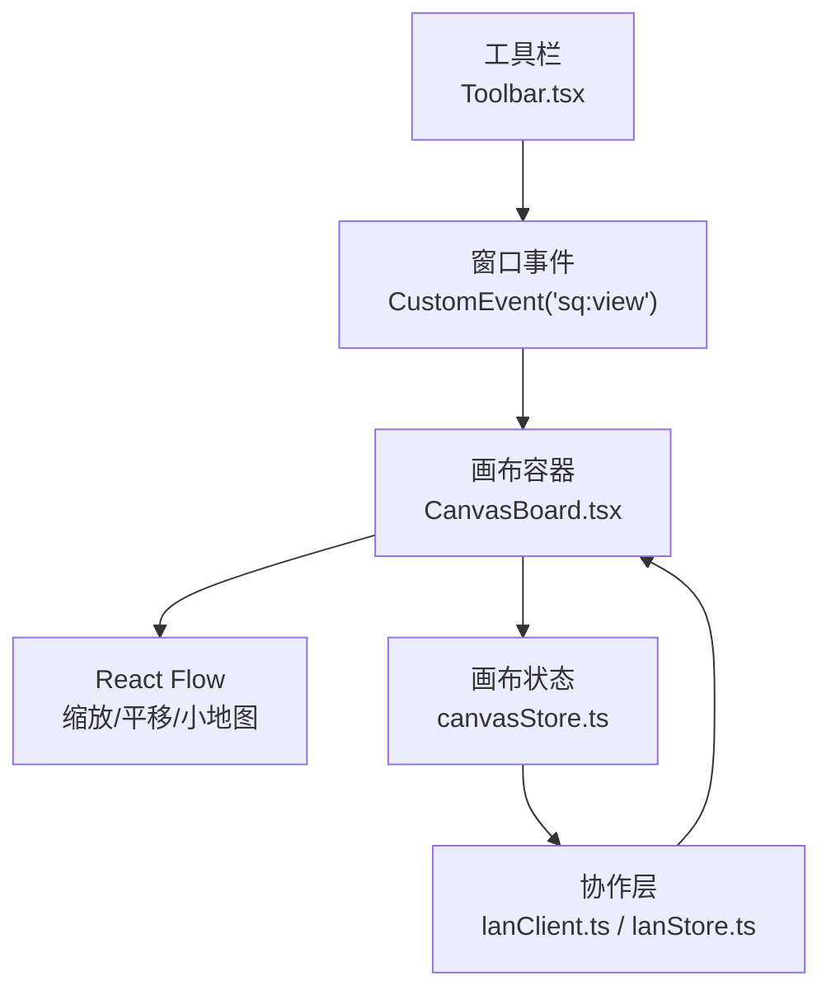
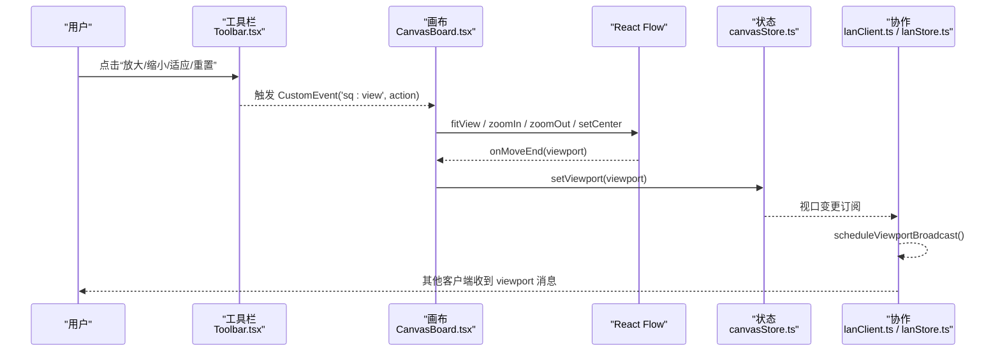
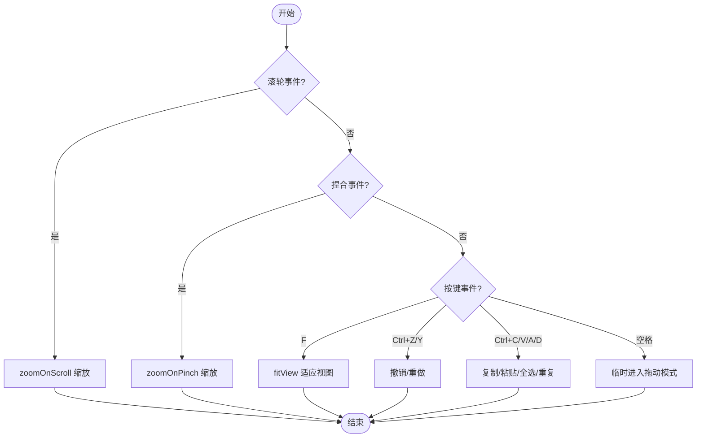
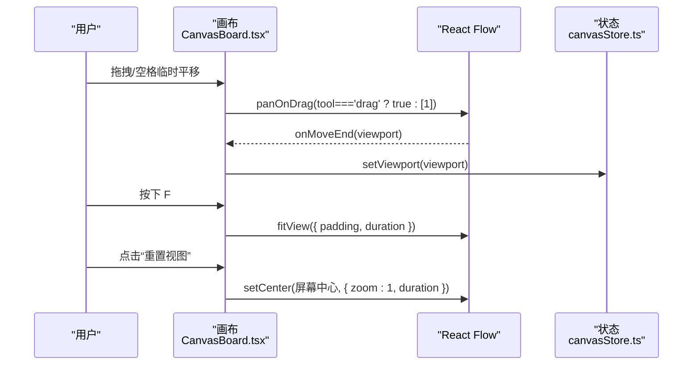
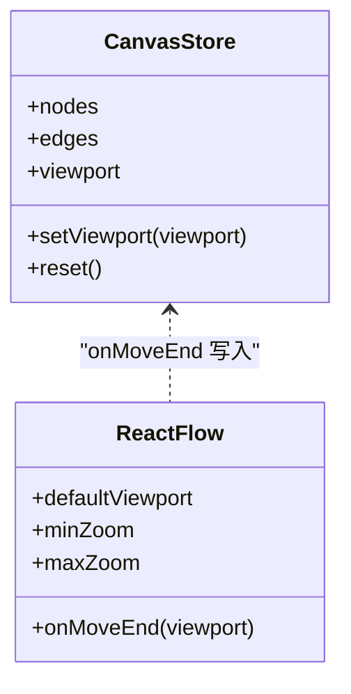
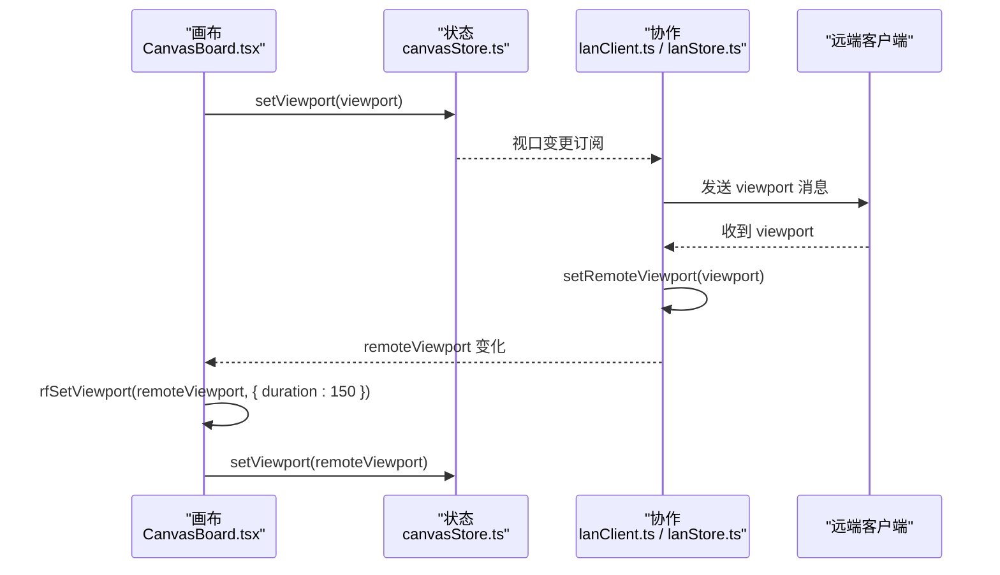
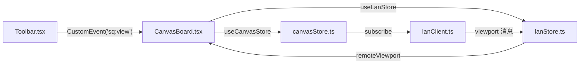

# 视图导航系统

<cite>
**本文引用的文件**
- [CanvasBoard.tsx](file://src/canvas/CanvasBoard.tsx)
- [canvasStore.ts](file://src/store/canvasStore.ts)
- [Toolbar.tsx](file://src/components/Toolbar.tsx)
- [lanClient.ts](file://src/sync/lanClient.ts)
- [lanStore.ts](file://src/store/lanStore.ts)
- [types.ts](file://src/types.ts)
</cite>

## 目录
1. [简介](#简介)
2. [项目结构](#项目结构)
3. [核心组件](#核心组件)
4. [架构总览](#架构总览)
5. [详细组件分析](#详细组件分析)
6. [依赖关系分析](#依赖关系分析)
7. [性能考量](#性能考量)
8. [故障排查指南](#故障排查指南)
9. [结论](#结论)
10. [附录：API 参考与最佳实践](#附录api-参考与最佳实践)

## 简介
本文件为 SuQCanvas 的视图导航系统提供完整文档，覆盖画布缩放、平移、视口状态管理、多用户协作同步、快捷键与小地图等能力。目标是帮助开发者快速理解并扩展视图交互，确保在多人协作场景下视图一致性与流畅体验。

## 项目结构
SuQCanvas 的视图导航由 React Flow 驱动，结合本地状态管理与局域网协作模块实现。关键文件职责如下：
- CanvasBoard.tsx：画布容器与交互入口，配置缩放、平移、双击、拖拽、键盘快捷键、小地图与远端视图跟随。
- canvasStore.ts：画布数据与视口状态（viewport）存储，提供撤销/重做、对齐、复制粘贴等能力。
- Toolbar.tsx：工具栏按钮，触发放大/缩小/适应视图/重置视图等操作。
- lanClient.ts / lanStore.ts：局域网协作，负责视口广播、远端视口接收与跟随、光标与编辑态同步。
- types.ts：类型定义，包含 Viewport 等基础类型。

图表来源
- [CanvasBoard.tsx:336-394](file://src/canvas/CanvasBoard.tsx#L336-L394)
- [Toolbar.tsx:353-371](file://src/components/Toolbar.tsx#L353-L371)
- [canvasStore.ts:392-397](file://src/store/canvasStore.ts#L392-L397)
- [lanClient.ts:701-716](file://src/sync/lanClient.ts#L701-L716)

章节来源
- [CanvasBoard.tsx:336-394](file://src/canvas/CanvasBoard.tsx#L336-L394)
- [Toolbar.tsx:353-371](file://src/components/Toolbar.tsx#L353-L371)
- [canvasStore.ts:392-397](file://src/store/canvasStore.ts#L392-L397)
- [lanClient.ts:701-716](file://src/sync/lanClient.ts#L701-L716)

## 核心组件
- 画布容器（CanvasBoard）
  - 启用滚轮缩放、捏合缩放；禁用默认双击缩放；支持拖拽平移（按工具模式切换）。
  - 监听 onMoveEnd 将视口写入 store；订阅远端视口变化并平滑过渡到本地。
  - 提供键盘快捷键：F 适应视图；空格临时进入拖动模式；V/C/H 切换工具。
  - 集成小地图 MiniMap，支持可拖拽与缩放。
- 状态存储（canvasStore）
  - 维护 nodes/edges/viewport 及历史栈；提供 setViewport/reset 等方法。
- 工具栏（Toolbar）
  - 通过自定义事件 dispatchView 触发放大/缩小/适应/重置。
- 协作层（lanClient / lanStore）
  - 定时广播本地视口；接收远端视口并更新 remoteViewport；根据 followId 决定是否应用远端视图。

章节来源
- [CanvasBoard.tsx:88-102](file://src/canvas/CanvasBoard.tsx#L88-L102)
- [CanvasBoard.tsx:144-150](file://src/canvas/CanvasBoard.tsx#L144-L150)
- [CanvasBoard.tsx:152-193](file://src/canvas/CanvasBoard.tsx#L152-L193)
- [CanvasBoard.tsx:336-394](file://src/canvas/CanvasBoard.tsx#L336-L394)
- [canvasStore.ts:392-397](file://src/store/canvasStore.ts#L392-L397)
- [Toolbar.tsx:90-92](file://src/components/Toolbar.tsx#L90-L92)
- [Toolbar.tsx:353-371](file://src/components/Toolbar.tsx#L353-L371)
- [lanClient.ts:701-716](file://src/sync/lanClient.ts#L701-L716)
- [lanStore.ts:53-89](file://src/store/lanStore.ts#L53-L89)

## 架构总览
视图导航的核心流程包括：
- 输入层：鼠标滚轮/捏合、拖拽、键盘、工具栏按钮。
- 渲染层：React Flow 处理缩放和平移，MiniMap 提供全局概览。
- 状态层：canvasStore 保存 viewport；lanStore 保存 remoteViewport 与协作信息。
- 协作层：lanClient 定时广播本地视口，接收远端视口并应用。

图表来源
- [Toolbar.tsx:90-92](file://src/components/Toolbar.tsx#L90-L92)
- [Toolbar.tsx:353-371](file://src/components/Toolbar.tsx#L353-L371)
- [CanvasBoard.tsx:263-305](file://src/canvas/CanvasBoard.tsx#L263-L305)
- [CanvasBoard.tsx:351-351](file://src/canvas/CanvasBoard.tsx#L351-L351)
- [lanClient.ts:701-716](file://src/sync/lanClient.ts#L701-L716)

## 详细组件分析

### 缩放功能
- 滚轮缩放：启用 zoomOnScroll，允许通过鼠标滚轮缩放画布。
- 捏合缩放：启用 zoomOnPinch，支持触控设备手势缩放。
- 双击缩放：默认关闭 zoomOnDoubleClick，避免与双击添加文本冲突。
- 按钮缩放：工具栏提供放大/缩小按钮；“适应视图”使用 fitView；“重置视图”将中心置中并缩放到 100%。
- 快捷键：F 键触发适应视图；Ctrl+Z/Y 用于撤销/重做；Ctrl+C/V/A/D 用于复制/粘贴/全选/重复节点。

图表来源
- [CanvasBoard.tsx:366-368](file://src/canvas/CanvasBoard.tsx#L366-L368)
- [CanvasBoard.tsx:144-150](file://src/canvas/CanvasBoard.tsx#L144-L150)
- [CanvasBoard.tsx:152-193](file://src/canvas/CanvasBoard.tsx#L152-L193)
- [Toolbar.tsx:353-371](file://src/components/Toolbar.tsx#L353-L371)

章节来源
- [CanvasBoard.tsx:366-368](file://src/canvas/CanvasBoard.tsx#L366-L368)
- [CanvasBoard.tsx:144-150](file://src/canvas/CanvasBoard.tsx#L144-L150)
- [CanvasBoard.tsx:152-193](file://src/canvas/CanvasBoard.tsx#L152-L193)
- [Toolbar.tsx:353-371](file://src/components/Toolbar.tsx#L353-L371)

### 平移操作
- 拖拽平移：根据工具模式决定 panOnDrag 行为；选择模式下框选，拖动模式下平移画布。
- 键盘导航：按住空格临时切换到拖动模式进行平移；松开恢复原工具。
- 自动适配：F 键或工具栏“适应视图”调用 fitView，自动计算合适缩放与中心点。
- 重置视图：工具栏“重置视图”将画布中心对准屏幕中心并缩放到 100%。

图表来源
- [CanvasBoard.tsx:356-359](file://src/canvas/CanvasBoard.tsx#L356-L359)
- [CanvasBoard.tsx:152-193](file://src/canvas/CanvasBoard.tsx#L152-L193)
- [CanvasBoard.tsx:144-150](file://src/canvas/CanvasBoard.tsx#L144-L150)
- [CanvasBoard.tsx:263-305](file://src/canvas/CanvasBoard.tsx#L263-L305)
- [CanvasBoard.tsx:351-351](file://src/canvas/CanvasBoard.tsx#L351-L351)

章节来源
- [CanvasBoard.tsx:356-359](file://src/canvas/CanvasBoard.tsx#L356-L359)
- [CanvasBoard.tsx:152-193](file://src/canvas/CanvasBoard.tsx#L152-L193)
- [CanvasBoard.tsx:144-150](file://src/canvas/CanvasBoard.tsx#L144-L150)
- [CanvasBoard.tsx:263-305](file://src/canvas/CanvasBoard.tsx#L263-L305)
- [CanvasBoard.tsx:351-351](file://src/canvas/CanvasBoard.tsx#L351-L351)

### 视口状态管理
- 当前视口：canvasStore 中的 viewport 字段记录 x/y/zoom。
- 可视区域：由 React Flow 内部计算，onMoveEnd 回调将最新视口回写至 store。
- 初始视口：defaultViewport 设置为 { x: 0, y: 0, zoom: 1 }。
- 最小/最大缩放：MIN_ZOOM=0.05，MAX_ZOOM=8。
- 重置：reset 方法清空画布并将视口恢复到默认值。

图表来源
- [canvasStore.ts:33-59](file://src/store/canvasStore.ts#L33-L59)
- [canvasStore.ts:392-397](file://src/store/canvasStore.ts#L392-L397)
- [CanvasBoard.tsx:351-355](file://src/canvas/CanvasBoard.tsx#L351-L355)

章节来源
- [canvasStore.ts:33-59](file://src/store/canvasStore.ts#L33-L59)
- [canvasStore.ts:392-397](file://src/store/canvasStore.ts#L392-L397)
- [CanvasBoard.tsx:351-355](file://src/canvas/CanvasBoard.tsx#L351-L355)

### 视图同步机制（多用户协作）
- 本地视口广播：当本地视口变化时，scheduleViewportBroadcast 定时发送 viewport 消息。
- 远端视口接收：收到 viewport 消息后，若处于跟随模式（followId），则设置 remoteViewport。
- 应用远端视图：CanvasBoard 订阅 lanStore.remoteViewport，使用 rfSetViewport 平滑过渡到远端视图，同时更新本地 store。
- 防抖与节流：使用 vpTimer 合并多次视口变化，减少网络压力。

图表来源
- [lanClient.ts:701-716](file://src/sync/lanClient.ts#L701-L716)
- [CanvasBoard.tsx:94-102](file://src/canvas/CanvasBoard.tsx#L94-L102)
- [lanStore.ts:53-89](file://src/store/lanStore.ts#L53-L89)

章节来源
- [lanClient.ts:701-716](file://src/sync/lanClient.ts#L701-L716)
- [CanvasBoard.tsx:94-102](file://src/canvas/CanvasBoard.tsx#L94-L102)
- [lanStore.ts:53-89](file://src/store/lanStore.ts#L53-L89)

### 快捷键操作
- 适应视图：F 键触发 fitView。
- 撤销/重做：Ctrl+Z / Ctrl+Shift+Z 或 Ctrl+Y。
- 复制/粘贴/全选/重复：Ctrl+C / Ctrl+V / Ctrl+A / Ctrl+D。
- 工具切换：V 选择 / C 连线 / H 拖动。
- 临时平移：按住空格临时进入拖动模式，松开恢复。

章节来源
- [CanvasBoard.tsx:144-150](file://src/canvas/CanvasBoard.tsx#L144-L150)
- [CanvasBoard.tsx:152-193](file://src/canvas/CanvasBoard.tsx#L152-L193)

### 小地图功能
- 启用方式：在画布内嵌入 MiniMap，配置 pannable 与 zoomable。
- 样式定制：nodeColor、maskColor、bgColor 随主题变化。
- 交互：可在小地图上拖拽与缩放以快速定位。

章节来源
- [CanvasBoard.tsx:387-394](file://src/canvas/CanvasBoard.tsx#L387-L394)

## 依赖关系分析
- CanvasBoard 依赖 React Flow 提供的缩放/平移 API 与事件。
- CanvasBoard 通过 useCanvasStore 读写 viewport，并通过 useLanStore 订阅远端视图。
- Toolbar 通过自定义事件与 CanvasBoard 通信，解耦 UI 与逻辑。
- lanClient 订阅 canvasStore 的变化，定时广播视口；lanStore 集中管理协作状态。

图表来源
- [Toolbar.tsx:90-92](file://src/components/Toolbar.tsx#L90-L92)
- [CanvasBoard.tsx:94-102](file://src/canvas/CanvasBoard.tsx#L94-L102)
- [canvasStore.ts:392-397](file://src/store/canvasStore.ts#L392-L397)
- [lanClient.ts:701-716](file://src/sync/lanClient.ts#L701-L716)
- [lanStore.ts:53-89](file://src/store/lanStore.ts#L53-L89)

章节来源
- [Toolbar.tsx:90-92](file://src/components/Toolbar.tsx#L90-L92)
- [CanvasBoard.tsx:94-102](file://src/canvas/CanvasBoard.tsx#L94-L102)
- [canvasStore.ts:392-397](file://src/store/canvasStore.ts#L392-L397)
- [lanClient.ts:701-716](file://src/sync/lanClient.ts#L701-L716)
- [lanStore.ts:53-89](file://src/store/lanStore.ts#L53-L89)

## 性能考量
- 视口广播节流：使用 vpTimer 合并短时间内的多次视口变化，降低网络负载。
- 平滑动画：rfSetViewport 使用 duration 参数实现平滑过渡，提升用户体验。
- 缩放范围限制：MIN_ZOOM 与 MAX_ZOOM 防止极端缩放导致渲染卡顿。
- 工具模式优化：根据 tool 动态启用/禁用拖拽与选择，减少不必要的事件处理。

[本节为通用指导，不直接分析具体文件]

## 故障排查指南
- 无法缩放：检查 zoomOnScroll/zoomOnPinch 是否启用；确认 MIN_ZOOM/MAX_ZOOM 设置合理。
- 双击无效：确认 zoomOnDoubleClick 已关闭以避免与双击添加文本冲突。
- 平移异常：检查 panOnDrag 配置与当前工具模式；确认未处于连接或选择模式。
- 协作不同步：确认 lanClient 的 scheduleViewportBroadcast 正常执行；检查 followId 与 remoteViewport 是否正确设置。
- 小地图不可用：确认 MiniMap 的 pannable/zoomable 已启用且样式正确。

章节来源
- [CanvasBoard.tsx:366-368](file://src/canvas/CanvasBoard.tsx#L366-L368)
- [CanvasBoard.tsx:356-359](file://src/canvas/CanvasBoard.tsx#L356-L359)
- [CanvasBoard.tsx:387-394](file://src/canvas/CanvasBoard.tsx#L387-L394)
- [lanClient.ts:701-716](file://src/sync/lanClient.ts#L701-L716)

## 结论
SuQCanvas 的视图导航系统基于 React Flow 提供了丰富的缩放与平移能力，并通过 canvasStore 与 lanStore 实现了稳定的状态管理与协作同步。借助工具栏与快捷键，用户可以高效地操作画布；小地图进一步提升了导航效率。建议在扩展新功能时保持对视口状态的统一管理与协作消息的一致性。

[本节为总结性内容，不直接分析具体文件]

## 附录：API 参考与最佳实践

### 视图操作 API
- 适应视图：fitView({ padding, duration })
- 放大/缩小：zoomIn({ duration }), zoomOut({ duration })
- 重置视图：setCenter(centerX, centerY, { zoom, duration })
- 设置视口：setViewport(viewport)
- 获取缩放级别：getZoom()

章节来源
- [CanvasBoard.tsx:263-305](file://src/canvas/CanvasBoard.tsx#L263-L305)
- [CanvasBoard.tsx:351-351](file://src/canvas/CanvasBoard.tsx#L351-L351)
- [canvasStore.ts:392-397](file://src/store/canvasStore.ts#L392-L397)

### 最佳实践
- 统一通过 canvasStore 管理 viewport，避免多处状态不一致。
- 在协作场景中，遵循“本地广播、远端跟随”的原则，避免循环更新。
- 使用节流/防抖合并高频事件（如视口变化、节点移动），提升性能。
- 明确工具模式与交互行为，避免事件冲突（如选择与拖动）。
- 小地图样式应与主题一致，提升视觉一致性。

[本节为通用指导，不直接分析具体文件]