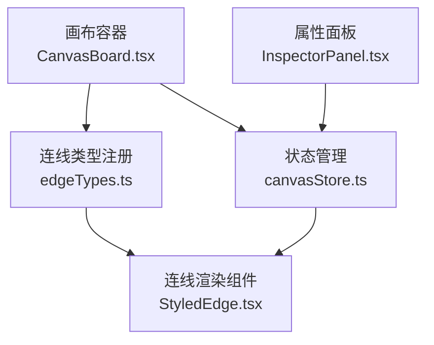
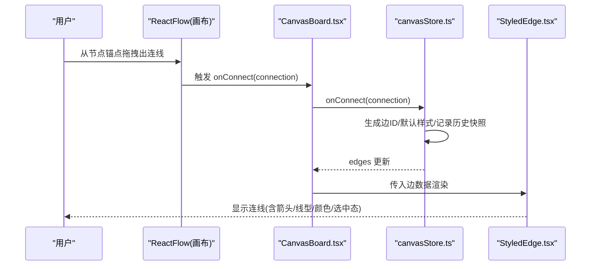
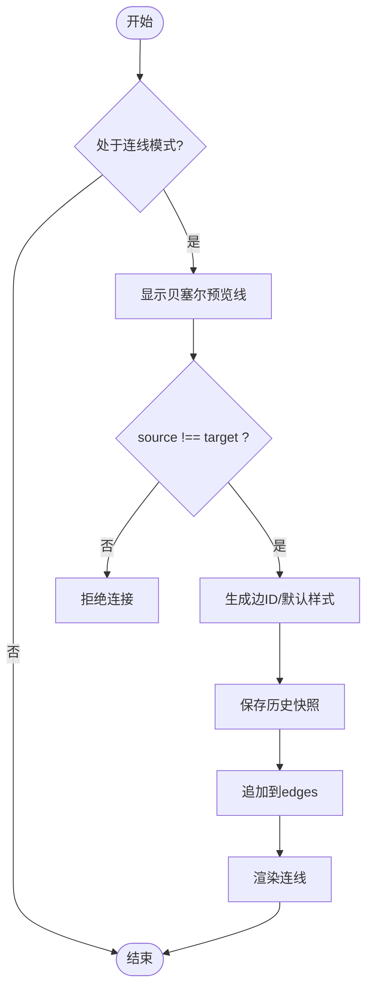
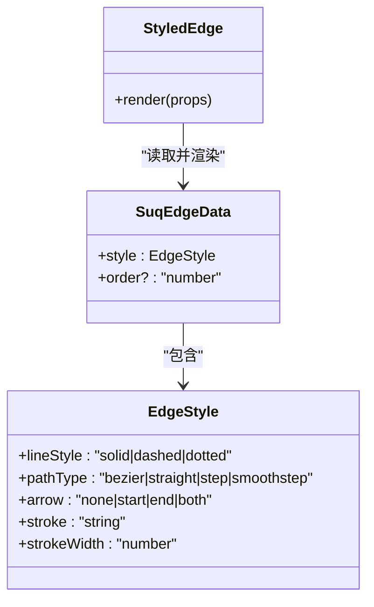
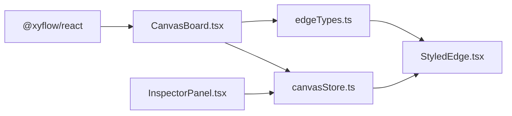

# 连线连接系统

<cite>
**本文引用的文件**
- [CanvasBoard.tsx](file://src/canvas/CanvasBoard.tsx)
- [canvasStore.ts](file://src/store/canvasStore.ts)
- [StyledEdge.tsx](file://src/canvas/edges/StyledEdge.tsx)
- [edgeTypes.ts](file://src/canvas/edges/edgeTypes.ts)
- [types.ts](file://src/types.ts)
- [InspectorPanel.tsx](file://src/components/InspectorPanel.tsx)
</cite>

## 目录
1. [简介](#简介)
2. [项目结构](#项目结构)
3. [核心组件](#核心组件)
4. [架构总览](#架构总览)
5. [详细组件分析](#详细组件分析)
6. [依赖关系分析](#依赖关系分析)
7. [性能考量](#性能考量)
8. [故障排查指南](#故障排查指南)
9. [结论](#结论)
10. [附录：自定义连线样式开发指南](#附录自定义连线样式开发指南)

## 简介
本章节面向 SuQCanvas 的“连线连接系统”，系统性说明连线的创建、预览、数据模型、验证规则、样式定制、选择与删除、交互反馈与动画，以及扩展自定义连线的开发方法。目标是帮助开发者快速理解并安全地扩展连线能力。

## 项目结构
连线系统由以下关键部分组成：
- 画布容器与连线交互配置：负责启用连线模式、实时预览线、校验连接合法性、处理连接完成事件。
- 状态管理：集中维护节点与边集合，处理新增边、更新边数据、撤销/重做等。
- 连线渲染：根据边的样式属性绘制路径、箭头、虚线/点线、选中高亮等。
- 属性面板：提供对连线样式的可视化编辑（线型、路径、箭头、颜色、粗细、播放顺序）。

图表来源
- [CanvasBoard.tsx:336-370](file://src/canvas/CanvasBoard.tsx#L336-L370)
- [canvasStore.ts:118-158](file://src/store/canvasStore.ts#L118-L158)
- [edgeTypes.ts:1-7](file://src/canvas/edges/edgeTypes.ts#L1-L7)
- [StyledEdge.tsx:11-129](file://src/canvas/edges/StyledEdge.tsx#L11-L129)
- [InspectorPanel.tsx:311-471](file://src/components/InspectorPanel.tsx#L311-L471)

章节来源
- [CanvasBoard.tsx:336-370](file://src/canvas/CanvasBoard.tsx#L336-L370)
- [canvasStore.ts:118-158](file://src/store/canvasStore.ts#L118-L158)
- [edgeTypes.ts:1-7](file://src/canvas/edges/edgeTypes.ts#L1-L7)
- [StyledEdge.tsx:11-129](file://src/canvas/edges/StyledEdge.tsx#L11-L129)
- [InspectorPanel.tsx:311-471](file://src/components/InspectorPanel.tsx#L311-L471)

## 核心组件
- 连线交互入口：在画布容器中启用连线模式、设置连线预览样式、限制自连接、绑定 onConnect。
- 连线数据模型：定义边的 ID、源/目标节点、手柄、类型、样式与业务字段（如播放顺序）。
- 连线渲染器：根据样式计算路径、绘制箭头、虚线/点线、选中态高亮、标签（如播放顺序）。
- 属性面板：支持批量修改选中连线的样式，并提供删除操作。

章节来源
- [CanvasBoard.tsx:336-370](file://src/canvas/CanvasBoard.tsx#L336-L370)
- [types.ts:46-107](file://src/types.ts#L46-L107)
- [StyledEdge.tsx:11-129](file://src/canvas/edges/StyledEdge.tsx#L11-L129)
- [InspectorPanel.tsx:311-471](file://src/components/InspectorPanel.tsx#L311-L471)

## 架构总览
连线从用户拖拽到最终落地的完整流程如下：

图表来源
- [CanvasBoard.tsx:336-370](file://src/canvas/CanvasBoard.tsx#L336-L370)
- [canvasStore.ts:146-158](file://src/store/canvasStore.ts#L146-L158)
- [StyledEdge.tsx:11-129](file://src/canvas/edges/StyledEdge.tsx#L11-L129)

## 详细组件分析

### 连线创建与实时预览
- 连线模式与预览线
  - 通过 ReactFlow 的 connectionLineType 与 connectionLineStyle 控制拖拽时的预览曲线与样式。
  - 在连线模式下增大 connectionRadius，便于远距离吸附。
  - 使用 nodesConnectable/connectOnClick 控制是否允许连线。
- 连接校验
  - 使用 isValidConnection 禁止自连接（source !== target）。
- 连接完成
  - onConnect 回调中创建新边，写入默认样式，并立即保存历史快照，再追加到 edges 列表。

图表来源
- [CanvasBoard.tsx:336-370](file://src/canvas/CanvasBoard.tsx#L336-L370)
- [canvasStore.ts:146-158](file://src/store/canvasStore.ts#L146-L158)

章节来源
- [CanvasBoard.tsx:336-370](file://src/canvas/CanvasBoard.tsx#L336-L370)
- [canvasStore.ts:146-158](file://src/store/canvasStore.ts#L146-L158)

### 连线的数据模型
- 边标识与关联
  - id：唯一标识，由统一生成器生成。
  - source/target：源/目标节点 ID。
  - sourceHandle/targetHandle：可选的手柄标识。
  - type：固定为 'styled'，用于路由到自定义渲染器。
- 样式与业务数据
  - data.style：包含 lineStyle（实线/虚线/点线）、pathType（曲线/直线/阶梯/平滑阶梯）、arrow（无/起点/终点/双向）、stroke（颜色）、strokeWidth（粗细）。
  - data.order：音频分叉场景下的播放顺序（越小越先），未设置时按创建顺序。
- 默认样式
  - 默认线型为实线，路径为曲线，箭头为终点，颜色与粗细有预设值。

章节来源
- [types.ts:46-107](file://src/types.ts#L46-L107)
- [canvasStore.ts:146-158](file://src/store/canvasStore.ts#L146-L158)

### 连线的验证规则
- 不允许自连接：在画布层通过 isValidConnection 强制 source !== target。
- 重复连接：当前实现未显式阻止同两端点的重复边；如需去重可在 onConnect 或 store 层增加检查逻辑。
- 手柄匹配：若节点定义了特定手柄，可结合 sourceHandle/targetHandle 进行更细粒度的连接约束（需节点侧配合）。

章节来源
- [CanvasBoard.tsx:336-370](file://src/canvas/CanvasBoard.tsx#L336-L370)

### 连线的样式定制
- 线型
  - 实线/虚线/点线：通过 lineStyle 切换，渲染器据此计算 dasharray 与端点形状。
- 路径类型
  - 曲线/直线/阶梯/平滑阶梯：根据 pathType 调用不同路径计算函数，影响视觉布局。
- 箭头方向
  - 无/起点/终点/双向：通过 markerStart/markerEnd 控制箭头位置。
- 颜色与粗细
  - stroke/strokeWidth：直接映射到 SVG 描边样式。
- 选中态
  - selected 时边框色变为强调色，透明度提升，便于识别。
- 标签
  - 当存在 order 时，在连线中点附近显示数字标签，表示播放顺序。

图表来源
- [types.ts:46-107](file://src/types.ts#L46-L107)
- [StyledEdge.tsx:11-129](file://src/canvas/edges/StyledEdge.tsx#L11-L129)

章节来源
- [StyledEdge.tsx:11-129](file://src/canvas/edges/StyledEdge.tsx#L11-L129)
- [types.ts:46-107](file://src/types.ts#L46-L107)
- [InspectorPanel.tsx:311-471](file://src/components/InspectorPanel.tsx#L311-L471)

### 连线的选择与删除
- 选择
  - 通过 ReactFlow 的部分选择模式，点击连线即可选中；选中后 InspectorPanel 会显示连线属性区。
- 删除
  - 支持键盘 Backspace/Delete 删除选中元素（含连线）。
  - 也可在 InspectorPanel 中点击“删除”按钮移除选中的连线。
- 批量操作
  - 支持多选连线后统一修改样式或删除。

章节来源
- [CanvasBoard.tsx:336-370](file://src/canvas/CanvasBoard.tsx#L336-L370)
- [InspectorPanel.tsx:352-365](file://src/components/InspectorPanel.tsx#L352-L365)

### 动画效果与交互反馈
- 预览线动画
  - 拖拽时以贝塞尔曲线作为预览线，颜色与粗细遵循默认样式，提供即时视觉反馈。
- 选中态反馈
  - 连线被选中时颜色变为强调色，透明度提高，便于定位。
- 标签提示
  - 当存在 order 时，连线中点显示小圆标，鼠标悬停可看到播放顺序提示。
- 历史记录
  - 每次连接成功都会保存一次历史快照，支持撤销/重做，增强操作容错。

章节来源
- [CanvasBoard.tsx:336-370](file://src/canvas/CanvasBoard.tsx#L336-L370)
- [StyledEdge.tsx:11-129](file://src/canvas/edges/StyledEdge.tsx#L11-L129)
- [canvasStore.ts:66-92](file://src/store/canvasStore.ts#L66-L92)

## 依赖关系分析
- 画布容器依赖 ReactFlow 提供的连线能力，并通过 edgeTypes 注入自定义渲染器。
- 状态管理集中维护 edges，onConnect/onEdgesChange 驱动视图更新。
- 渲染器依赖 types 定义的样式枚举与默认值，确保 UI 与数据一致。
- 属性面板通过 store 的 updateEdgeData 将用户修改写回状态。

图表来源
- [CanvasBoard.tsx:336-370](file://src/canvas/CanvasBoard.tsx#L336-L370)
- [canvasStore.ts:118-158](file://src/store/canvasStore.ts#L118-L158)
- [edgeTypes.ts:1-7](file://src/canvas/edges/edgeTypes.ts#L1-L7)
- [StyledEdge.tsx:11-129](file://src/canvas/edges/StyledEdge.tsx#L11-L129)
- [InspectorPanel.tsx:311-471](file://src/components/InspectorPanel.tsx#L311-L471)

章节来源
- [CanvasBoard.tsx:336-370](file://src/canvas/CanvasBoard.tsx#L336-L370)
- [canvasStore.ts:118-158](file://src/store/canvasStore.ts#L118-L158)
- [edgeTypes.ts:1-7](file://src/canvas/edges/edgeTypes.ts#L1-L7)
- [StyledEdge.tsx:11-129](file://src/canvas/edges/StyledEdge.tsx#L11-L129)
- [InspectorPanel.tsx:311-471](file://src/components/InspectorPanel.tsx#L311-L471)

## 性能考量
- 连线数量较多时，建议避免频繁的全量重绘；利用 ReactFlow 的增量变更机制（applyEdgeChanges）已能较好优化。
- 复杂路径（如多段阶梯）会增加计算开销，可根据场景选择合适的 pathType。
- 大量选中操作时，属性面板批量更新样式可减少多次 setState 次数。

[本节为通用指导，不直接分析具体文件]

## 故障排查指南
- 无法建立连接
  - 检查是否处于连线模式（快捷键 C），确认 nodesConnectable/connectOnClick 未被禁用。
  - 检查 isValidConnection 是否误判（例如 source === target 会被拒绝）。
- 连线不可见
  - 确认 edges 数组中包含该边，且 style.stroke 非透明。
  - 检查 StyledEdge 的路径计算是否返回有效字符串。
- 样式不生效
  - 确认 InspectorPanel 的 updateEdgeData 已正确合并样式 patch。
  - 核对 types 中枚举值是否与渲染器分支匹配。
- 删除无效
  - 确认 deleteKeyCode 配置包含 Backspace/Delete。
  - 检查 InspectorPanel 的删除按钮是否正确调用 deleteElements。

章节来源
- [CanvasBoard.tsx:336-370](file://src/canvas/CanvasBoard.tsx#L336-L370)
- [InspectorPanel.tsx:352-365](file://src/components/InspectorPanel.tsx#L352-L365)
- [StyledEdge.tsx:11-129](file://src/canvas/edges/StyledEdge.tsx#L11-L129)

## 结论
SuQCanvas 的连线系统基于 ReactFlow 构建，具备完善的创建、预览、校验、渲染与编辑能力。通过集中化的状态管理与可插拔的渲染器，既保证了易用性，又为扩展提供了清晰边界。建议在需要更强业务约束（如重复连接检测、手柄级校验）时，于 onConnect 或 store 层补充相应逻辑。

[本节为总结性内容，不直接分析具体文件]

## 附录：自定义连线样式开发指南
- 注册自定义连线类型
  - 在 edgeTypes 中声明新的类型键名，并指向你的渲染组件。
- 编写渲染组件
  - 接收 EdgeProps<SuqEdge>，读取 props.data.style 与 props.selected。
  - 根据 pathType 选择路径计算函数，设置 stroke、strokeWidth、dasharray、markerStart/End。
  - 如需标签（如 order），使用 EdgeLabelRenderer 定位到 edgeLabelX/Y。
- 暴露样式配置
  - 在 InspectorPanel 中添加对应控件，调用 updateEdgeData 合并样式 patch。
- 注意事项
  - 保持 types 中枚举与渲染分支一致。
  - 避免在渲染中进行昂贵计算，必要时缓存中间结果。
  - 若引入新样式，请同步更新默认值与面板选项。

章节来源
- [edgeTypes.ts:1-7](file://src/canvas/edges/edgeTypes.ts#L1-L7)
- [StyledEdge.tsx:11-129](file://src/canvas/edges/StyledEdge.tsx#L11-L129)
- [InspectorPanel.tsx:311-471](file://src/components/InspectorPanel.tsx#L311-L471)
- [types.ts:46-107](file://src/types.ts#L46-L107)