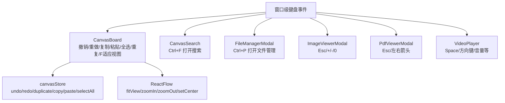
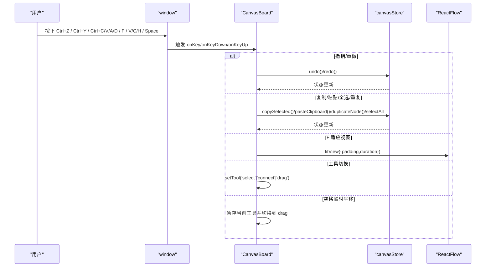
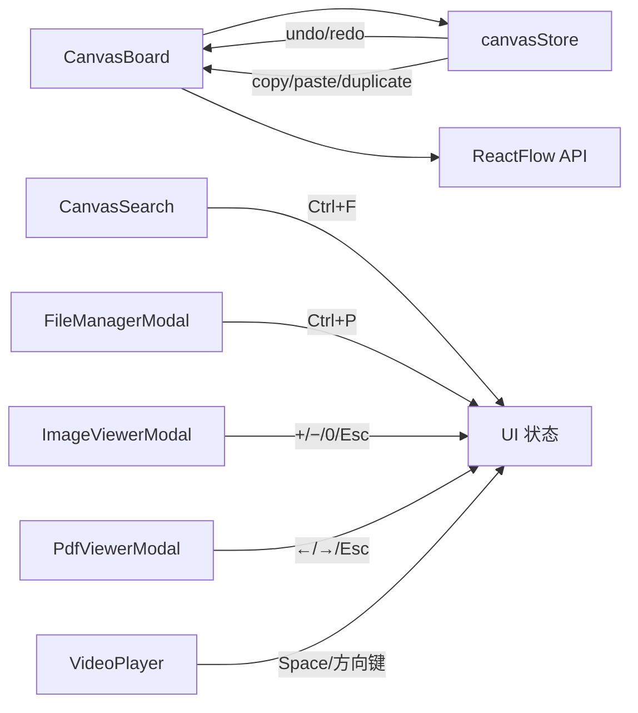

# 键盘快捷键系统

<cite>
**本文引用的文件**
- [CanvasBoard.tsx](file://src/canvas/CanvasBoard.tsx)
- [Toolbar.tsx](file://src/components/Toolbar.tsx)
- [CanvasSearch.tsx](file://src/components/CanvasSearch.tsx)
- [FileManagerModal.tsx](file://src/components/FileManagerModal.tsx)
- [ImageViewerModal.tsx](file://src/components/ImageViewerModal.tsx)
- [PdfViewerModal.tsx](file://src/components/PdfViewerModal.tsx)
- [VideoPlayer.tsx](file://src/components/VideoPlayer.tsx)
- [canvasStore.ts](file://src/store/canvasStore.ts)
</cite>

## 目录
1. [简介](#简介)
2. [项目结构](#项目结构)
3. [核心组件](#核心组件)
4. [架构总览](#架构总览)
5. [详细组件分析](#详细组件分析)
6. [依赖关系分析](#依赖关系分析)
7. [性能考量](#性能考量)
8. [故障排查指南](#故障排查指南)
9. [结论](#结论)
10. [附录：无障碍与最佳实践](#附录：无障碍与最佳实践)

## 简介
本文件系统性梳理 SuQCanvas 的键盘快捷键体系，覆盖画布编辑、视图控制、搜索与文件管理、媒体播放等场景；说明快捷键优先级与冲突处理机制、不同工具模式下的行为差异、可定制性与扩展点、无障碍支持与屏幕阅读器兼容性，以及面向用户的引导策略。

## 项目结构
SuQCanvas 的快捷键实现以“全局监听 + 局部拦截”的方式组织：
- 画布层（CanvasBoard）集中处理撤销/重做、复制/粘贴、全选、重复、适应视图、工具切换、空格临时平移等。
- 搜索面板（CanvasSearch）提供 Ctrl+F 打开搜索并聚焦输入框。
- 文件管理器（FileManagerModal）提供 Ctrl+P 打开文件管理。
- 图片查看器（ImageViewerModal）、PDF 查看器（PdfViewerModal）、视频播放器（VideoPlayer.tsx）各自维护独立快捷键。
- 工具栏（Toolbar）通过按钮标题提示快捷键，辅助用户学习。



图表来源
- [CanvasBoard.tsx:104-193](file://src/canvas/CanvasBoard.tsx#L104-L193)
- [CanvasSearch.tsx:47-60](file://src/components/CanvasSearch.tsx#L47-L60)
- [FileManagerModal.tsx:106-117](file://src/components/FileManagerModal.tsx#L106-L117)
- [ImageViewerModal.tsx:26-38](file://src/components/ImageViewerModal.tsx#L26-L38)
- [PdfViewerModal.tsx:85-94](file://src/components/PdfViewerModal.tsx#L85-L94)
- [VideoPlayer.tsx:374-395](file://src/components/VideoPlayer.tsx#L374-L395)
- [canvasStore.ts:118-399](file://src/store/canvasStore.ts#L118-L399)

章节来源
- [CanvasBoard.tsx:104-193](file://src/canvas/CanvasBoard.tsx#L104-L193)
- [Toolbar.tsx:80-84](file://src/components/Toolbar.tsx#L80-L84)
- [Toolbar.tsx:306-317](file://src/components/Toolbar.tsx#L306-L317)

## 核心组件
- CanvasBoard：注册全局 keydown/keyup，处理撤销/重做、复制/粘贴、全选、重复、F 适应视图、工具切换（V/C/H）、空格临时平移。
- CanvasSearch：注册 Ctrl+F 打开搜索并自动聚焦输入框。
- FileManagerModal：注册 Ctrl+P 打开文件管理，支持 Esc 关闭。
- ImageViewerModal：Esc 关闭，+/= 放大，- 缩小，0 自适应。
- PdfViewerModal：Esc 关闭，左右箭头翻页。
- VideoPlayer：Space 播放/暂停，方向键快进/快退，上下箭头调节音量（在播放器内生效）。
- canvasStore：提供 undo/redo、duplicate、copySelected、pasteClipboard、selectNodes 等能力，被快捷键调用。

章节来源
- [CanvasBoard.tsx:104-193](file://src/canvas/CanvasBoard.tsx#L104-L193)
- [CanvasSearch.tsx:47-60](file://src/components/CanvasSearch.tsx#L47-L60)
- [FileManagerModal.tsx:106-117](file://src/components/FileManagerModal.tsx#L106-L117)
- [ImageViewerModal.tsx:26-38](file://src/components/ImageViewerModal.tsx#L26-L38)
- [PdfViewerModal.tsx:85-94](file://src/components/PdfViewerModal.tsx#L85-L94)
- [VideoPlayer.tsx:374-395](file://src/components/VideoPlayer.tsx#L374-L395)
- [canvasStore.ts:118-399](file://src/store/canvasStore.ts#L118-L399)

## 架构总览
快捷键采用“全局监听 + 条件拦截”的模式：
- 所有关键快捷键均在 window 上监听 keydown/keyup。
- 各模块在进入时注册、退出时移除，避免内存泄漏。
- 文本输入场景（input/textarea/contentEditable）会跳过全局快捷键，保证编辑体验。
- 工具栏按钮通过 title 展示快捷键，形成“可见即所用”的用户引导。



图表来源
- [CanvasBoard.tsx:104-193](file://src/canvas/CanvasBoard.tsx#L104-L193)
- [canvasStore.ts:118-399](file://src/store/canvasStore.ts#L118-L399)

## 详细组件分析

### 画布快捷键（CanvasBoard）
- 撤销/重做
  - Ctrl+Z：撤销（若同时按住 Shift 则执行重做）
  - Ctrl+Shift+Z / Ctrl+Y：重做
- 复制/粘贴/全选/重复
  - Ctrl+C：复制选中节点到内部剪贴板，并写入系统剪贴板
  - Ctrl+V：从内部剪贴板粘贴（保持相对偏移并重建边）
  - Ctrl+A：全选所有节点
  - Ctrl+D：复制选中节点（增量偏移）
- 视图操作
  - F：适应视图（fitView，带 padding 和动画时长）
- 工具切换
  - V：选择工具
  - C：连线工具
  - H：拖动工具
  - 空格（按住）：临时切换到拖动工具用于平移，松开恢复原工具
- 输入检测
  - 当焦点位于 input/textarea/contentEditable 时，上述快捷键不生效，优先保证文本编辑

```mermaid
flowchart TD
Start(["keydown"]) --> CheckInput{"是否处于文本输入?"}
CheckInput --> |是| Ignore["忽略快捷键"]
CheckInput --> |否| CheckKeys{"组合键判断"}
CheckKeys --> |Ctrl+Z| Undo["撤销"]
CheckKeys --> |Ctrl+Y 或 Ctrl+Shift+Z| Redo["重做"]
CheckKeys --> |Ctrl+C| Copy["复制选中"]
CheckKeys --> |Ctrl+V| Paste["粘贴"]
CheckKeys --> |Ctrl+A| SelectAll["全选"]
CheckKeys --> |Ctrl+D| Duplicate["重复选中"]
CheckKeys --> |F| Fit["适应视图"]
CheckKeys --> |V/C/H| SetTool["切换工具"]
CheckKeys --> |Space(按住)| TempPan["临时平移"]
Undo --> End(["结束"])
Redo --> End
Copy --> End
Paste --> End
SelectAll --> End
Duplicate --> End
Fit --> End
SetTool --> End
TempPan --> End
```

图表来源
- [CanvasBoard.tsx:104-193](file://src/canvas/CanvasBoard.tsx#L104-L193)

章节来源
- [CanvasBoard.tsx:104-193](file://src/canvas/CanvasBoard.tsx#L104-L193)
- [canvasStore.ts:118-399](file://src/store/canvasStore.ts#L118-L399)

### 搜索快捷键（CanvasSearch）
- Ctrl+F：打开搜索面板并自动聚焦输入框，支持 Enter 选择结果、方向键导航、Esc 关闭。

章节来源
- [CanvasSearch.tsx:47-60](file://src/components/CanvasSearch.tsx#L47-L60)
- [CanvasSearch.tsx:114-128](file://src/components/CanvasSearch.tsx#L114-L128)

### 文件管理快捷键（FileManagerModal）
- Ctrl+P：打开文件管理器
- Esc：关闭文件管理器

章节来源
- [FileManagerModal.tsx:106-117](file://src/components/FileManagerModal.tsx#L106-L117)

### 图片查看器快捷键（ImageViewerModal）
- Esc：关闭
- + 或 =：放大
- -：缩小
- 0：自适应窗口缩放

章节来源
- [ImageViewerModal.tsx:26-38](file://src/components/ImageViewerModal.tsx#L26-L38)

### PDF 查看器快捷键（PdfViewerModal）
- Esc：关闭
- 左箭头：上一页
- 右箭头：下一页

章节来源
- [PdfViewerModal.tsx:85-94](file://src/components/PdfViewerModal.tsx#L85-L94)

### 视频播放器快捷键（VideoPlayer.tsx）
- Space：播放/暂停
- 左/右方向键：快退/快进
- 上/下方向键：音量增减（在播放器内生效）

章节来源
- [VideoPlayer.tsx:374-395](file://src/components/VideoPlayer.tsx#L374-L395)

### 工具栏提示（Toolbar）
- 工具按钮标题显示快捷键（如“选择 (V)”、“连线 (C)”、“拖动 (H)”）
- 撤销/重做按钮标题显示快捷键（“撤销 (Ctrl+Z)”、“重做 (Ctrl+Shift+Z / Ctrl+Y)”）
- 文件管理按钮标题显示快捷键（“文件管理 (Ctrl+P)”）
- 适应视图按钮标题显示快捷键（“适应视图 (F)”）

章节来源
- [Toolbar.tsx:80-84](file://src/components/Toolbar.tsx#L80-L84)
- [Toolbar.tsx:206-214](file://src/components/Toolbar.tsx#L206-L214)
- [Toolbar.tsx:306-317](file://src/components/Toolbar.tsx#L306-L317)
- [Toolbar.tsx:368-370](file://src/components/Toolbar.tsx#L368-L370)

## 依赖关系分析
- CanvasBoard 依赖 canvasStore 提供的 undo/redo/duplicate/copy/paste/selectAll 等方法。
- CanvasBoard 依赖 ReactFlow 的 fitView/zoomIn/zoomOut/setCenter 进行视图控制。
- 各模态组件（搜索、文件管理、图片/PDF/视频）各自维护独立的快捷键监听，互不干扰。
- 工具栏通过 title 属性向用户暴露快捷键信息，提升可发现性。



图表来源
- [CanvasBoard.tsx:104-193](file://src/canvas/CanvasBoard.tsx#L104-L193)
- [canvasStore.ts:118-399](file://src/store/canvasStore.ts#L118-L399)
- [CanvasSearch.tsx:47-60](file://src/components/CanvasSearch.tsx#L47-L60)
- [FileManagerModal.tsx:106-117](file://src/components/FileManagerModal.tsx#L106-L117)
- [ImageViewerModal.tsx:26-38](file://src/components/ImageViewerModal.tsx#L26-L38)
- [PdfViewerModal.tsx:85-94](file://src/components/PdfViewerModal.tsx#L85-L94)
- [VideoPlayer.tsx:374-395](file://src/components/VideoPlayer.tsx#L374-L395)

## 性能考量
- 快捷键监听均使用 window.addEventListener，并在组件卸载时移除，避免内存泄漏。
- 文本输入场景统一通过 isTypingTarget 检查，减少不必要的分支判断。
- 历史快照采用防抖合并（scheduleSnapshot），降低频繁操作的存储压力。
- 视图变换（fitView/zoomIn/zoomOut）带有动画时长参数，避免瞬时跳转造成视觉抖动。

章节来源
- [CanvasBoard.tsx:104-193](file://src/canvas/CanvasBoard.tsx#L104-L193)
- [canvasStore.ts:66-92](file://src/store/canvasStore.ts#L66-L92)

## 故障排查指南
- 快捷键无效
  - 检查是否处于文本输入状态（input/textarea/contentEditable），此时全局快捷键会被忽略。
  - 确认对应组件已挂载且监听了 keydown/keyup。
- 撤销/重做异常
  - 检查 canvasStore 的 past/future 栈是否正确记录，是否存在重复快照或清空逻辑。
- 工具切换异常
  - 检查 setTool 调用路径，确认未与其他事件冲突。
- 搜索/文件管理无法打开
  - 检查 Ctrl+F/Ctrl+P 监听是否生效，确认 open/close 状态变更正确。

章节来源
- [CanvasBoard.tsx:104-193](file://src/canvas/CanvasBoard.tsx#L104-L193)
- [canvasStore.ts:118-399](file://src/store/canvasStore.ts#L118-L399)
- [CanvasSearch.tsx:47-60](file://src/components/CanvasSearch.tsx#L47-L60)
- [FileManagerModal.tsx:106-117](file://src/components/FileManagerModal.tsx#L106-L117)

## 结论
SuQCanvas 的快捷键系统以清晰的分层与明确的优先级实现了高效的人机交互：
- 全局快捷键集中在画布层，配合输入检测避免冲突。
- 各模态组件拥有专属快捷键，互不干扰。
- 工具栏通过标题提示快捷键，提升可发现性。
- 通过 canvasStore 统一管理撤销/重做、复制/粘贴、重复等操作，确保状态一致性。

## 附录：无障碍与最佳实践

### 支持的快捷键一览
- 文件与编辑
  - Ctrl+C：复制选中节点（含系统剪贴板写入）
  - Ctrl+V：粘贴节点（重建边并保持偏移）
  - Ctrl+A：全选所有节点
  - Ctrl+D：重复选中节点
  - Ctrl+Z：撤销
  - Ctrl+Shift+Z / Ctrl+Y：重做
- 视图
  - F：适应视图
- 工具模式
  - V：选择
  - C：连线
  - H：拖动
  - 空格（按住）：临时平移（松开恢复原工具）
- 搜索与文件管理
  - Ctrl+F：打开搜索并聚焦输入框
  - Ctrl+P：打开文件管理器
- 图片查看器
  - Esc：关闭
  - + 或 =：放大
  - -：缩小
  - 0：自适应窗口
- PDF 查看器
  - Esc：关闭
  - 左/右箭头：上一页/下一页
- 视频播放器
  - Space：播放/暂停
  - 左/右箭头：快退/快进
  - 上/下箭头：音量增减

### 优先级与冲突处理
- 文本输入优先：当焦点位于 input/textarea/contentEditable 时，全局快捷键不生效。
- 模态优先：打开模态（搜索、文件管理、图片/PDF/视频）后，由该模态接管相关快捷键。
- 工具模式影响：V/C/H 切换工具，空格临时平移仅在非输入状态下生效。
- 浏览器默认行为：对常用快捷键调用 preventDefault，避免浏览器默认动作干扰。

### 不同工具模式下的行为差异
- 选择模式（V）：允许选择与拖拽节点，适合编辑。
- 连线模式（C）：便于连接节点，连接半径增大。
- 拖动模式（H）：禁用元素选择与连接，仅允许画布平移。
- 空格临时平移：在任何模式下均可快速平移画布，松开后恢复原工具。

### 可定制性与扩展机制
- 当前快捷键为硬编码绑定，未提供配置项或热重载接口。
- 可扩展建议：
  - 将快捷键映射抽取为配置对象，支持运行时替换。
  - 增加“快捷键冲突检测”，在新增快捷键时提示潜在冲突。
  - 为每个快捷键添加“作用域”（如只在画布有效、或在模态内有效）。

### 无障碍支持与屏幕阅读器兼容性
- 工具栏按钮使用 title 属性标注快捷键，便于屏幕阅读器朗读。
- 搜索输入框具备 aria-label，增强可访问性。
- 建议在后续迭代中为更多交互元素补充 aria-* 属性，以提升全链路无障碍体验。

### 最佳实践与用户引导策略
- 在空画布提示区展示常用快捷键（滚轮缩放、V/C/H、空格平移等），帮助用户快速上手。
- 在工具栏按钮标题中持续显示快捷键，强化记忆。
- 首次使用时可通过轻量引导提示常用快捷键，减少学习成本。
- 对于复杂操作（如多选对齐），在选中多个节点时再显示相关按钮，降低界面噪音。