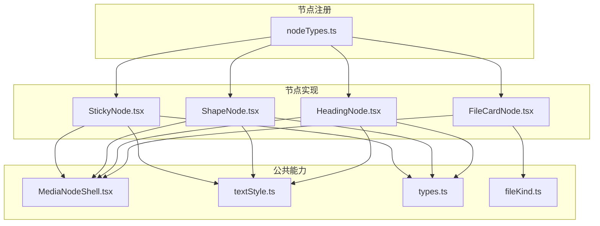
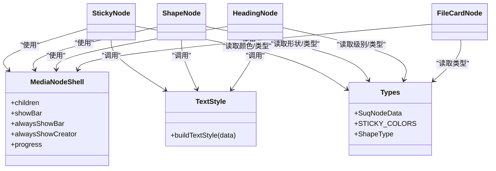
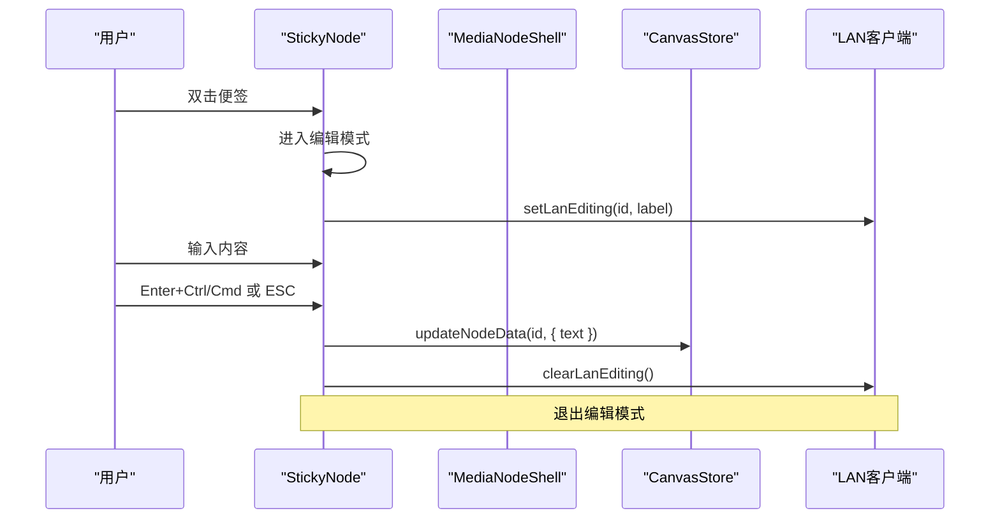
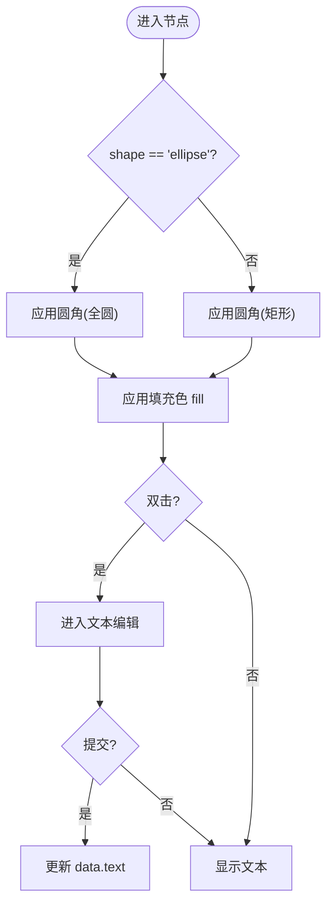
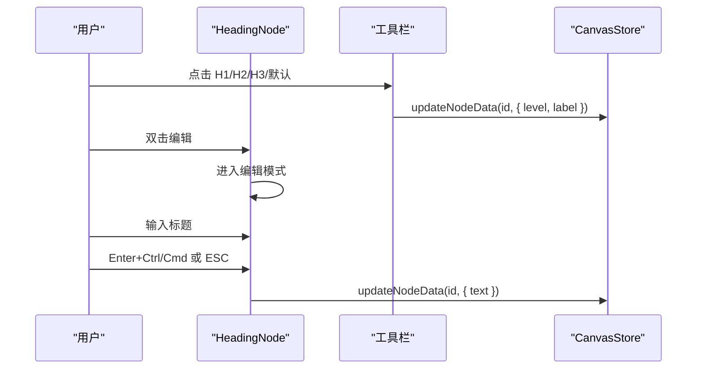
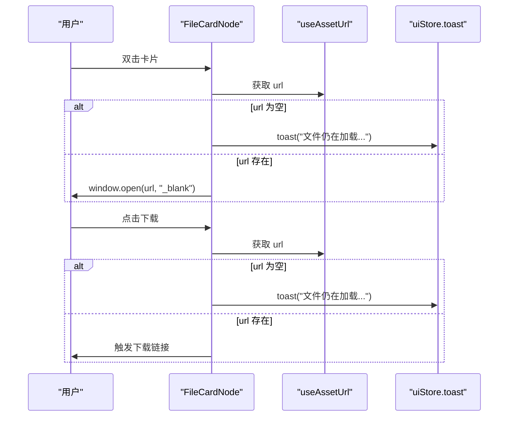
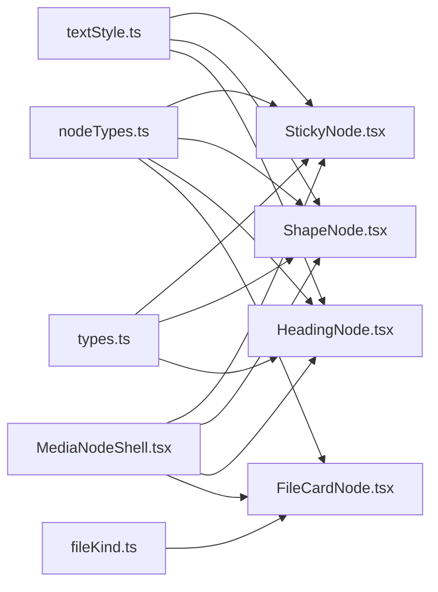

# UI节点

<cite>
**本文引用的文件**
- [StickyNode.tsx](file://src/canvas/nodes/StickyNode.tsx)
- [ShapeNode.tsx](file://src/canvas/nodes/ShapeNode.tsx)
- [HeadingNode.tsx](file://src/canvas/nodes/HeadingNode.tsx)
- [FileCardNode.tsx](file://src/canvas/nodes/FileCardNode.tsx)
- [nodeTypes.ts](file://src/canvas/nodes/nodeTypes.ts)
- [MediaNodeShell.tsx](file://src/canvas/nodes/MediaNodeShell.tsx)
- [textStyle.ts](file://src/canvas/nodes/textStyle.ts)
- [types.ts](file://src/types.ts)
- [fileKind.ts](file://src/media/fileKind.ts)
</cite>

## 目录
1. [简介](#简介)
2. [项目结构](#项目结构)
3. [核心组件](#核心组件)
4. [架构总览](#架构总览)
5. [详细组件分析](#详细组件分析)
6. [依赖关系分析](#依赖关系分析)
7. [性能考虑](#性能考虑)
8. [故障排查指南](#故障排查指南)
9. [结论](#结论)
10. [附录：使用示例与自定义配置](#附录使用示例与自定义配置)

## 简介
本章节面向 UI 节点系列，重点说明以下四类节点的能力与用法：
- StickyNode（便签节点）：彩色便签创建、文本编辑、颜色主题切换、拖拽定位。
- ShapeNode（形状节点）：基础几何图形绘制（矩形、圆形等）、填充色设置、文本居中与样式、尺寸变换。
- HeadingNode（标题节点）：多级标题展示、层级切换、字号调节、文本样式控制。
- FileCardNode（文件卡片节点）：文件图标、名称、大小、类型标识、打开与下载快捷操作。

这些节点均基于统一的 MediaNodeShell 外壳渲染，具备连接点、选中态、协作锁定、进度遮罩等通用能力。

## 项目结构
UI 节点位于 src/canvas/nodes 目录下，通过 nodeTypes.ts 统一注册到 React Flow 的 NodeTypes，便于在画布中按需实例化。各节点共享样式构建工具 textStyle.ts 与通用外壳 MediaNodeShell.tsx。

图表来源
- [nodeTypes.ts:14-26](file://src/canvas/nodes/nodeTypes.ts#L14-L26)
- [StickyNode.tsx:1-85](file://src/canvas/nodes/StickyNode.tsx#L1-L85)
- [ShapeNode.tsx:1-86](file://src/canvas/nodes/ShapeNode.tsx#L1-L86)
- [HeadingNode.tsx:1-124](file://src/canvas/nodes/HeadingNode.tsx#L1-L124)
- [FileCardNode.tsx:1-80](file://src/canvas/nodes/FileCardNode.tsx#L1-L80)
- [MediaNodeShell.tsx:1-151](file://src/canvas/nodes/MediaNodeShell.tsx#L1-L151)
- [textStyle.ts:1-22](file://src/canvas/nodes/textStyle.ts#L1-L22)
- [types.ts:1-112](file://src/types.ts#L1-L112)
- [fileKind.ts:1-24](file://src/media/fileKind.ts#L1-L24)

章节来源
- [nodeTypes.ts:14-26](file://src/canvas/nodes/nodeTypes.ts#L14-L26)

## 核心组件
- StickyNode：支持多色主题、富文本编辑、自动聚焦、回车/ESC 提交、拖拽与缩放手柄。
- ShapeNode：支持矩形与椭圆两种形状、填充色、文本垂直对齐、双击编辑、缩放手柄。
- HeadingNode：支持 H0-H3 四级标题样式、字号滑块、文本样式、编辑时顶部工具栏。
- FileCardNode：显示文件图标、名称、大小；提供打开与下载按钮；加载未完成时提示。

章节来源
- [StickyNode.tsx:10-84](file://src/canvas/nodes/StickyNode.tsx#L10-L84)
- [ShapeNode.tsx:10-85](file://src/canvas/nodes/ShapeNode.tsx#L10-L85)
- [HeadingNode.tsx:17-123](file://src/canvas/nodes/HeadingNode.tsx#L17-L123)
- [FileCardNode.tsx:10-79](file://src/canvas/nodes/FileCardNode.tsx#L10-L79)

## 架构总览
所有节点都继承自 MediaNodeShell，获得统一的边框、连接点、底部标签栏、协作者锁定提示与播放进度遮罩。文本样式由 buildTextStyle 统一生成，确保字体、粗细、斜体、下划线、行高一致。数据模型集中在 types.ts，包含节点数据类型、颜色枚举、形状类型等。

图表来源
- [MediaNodeShell.tsx:32-151](file://src/canvas/nodes/MediaNodeShell.tsx#L32-L151)
- [StickyNode.tsx:10-84](file://src/canvas/nodes/StickyNode.tsx#L10-L84)
- [ShapeNode.tsx:10-85](file://src/canvas/nodes/ShapeNode.tsx#L10-L85)
- [HeadingNode.tsx:17-123](file://src/canvas/nodes/HeadingNode.tsx#L17-L123)
- [FileCardNode.tsx:10-79](file://src/canvas/nodes/FileCardNode.tsx#L10-L79)
- [textStyle.ts:10-21](file://src/canvas/nodes/textStyle.ts#L10-L21)
- [types.ts:1-112](file://src/types.ts#L1-L112)

## 详细组件分析

### StickyNode（便签节点）
功能要点
- 彩色便签：支持黄色、绿色、蓝色、粉色、紫色、灰色主题，背景与边框色来自统一颜色表。
- 文本编辑：双击进入编辑模式，自动聚焦并全选；Enter+Ctrl/Cmd 或 ESC 提交；失焦提交。
- 拖拽定位：作为普通节点可被画布拖拽；选中后出现 ResizeHandles 进行缩放。
- 协作编辑：编辑时上报当前节点为“正在编辑”，离开时清除。

交互流程

图表来源
- [StickyNode.tsx:17-41](file://src/canvas/nodes/StickyNode.tsx#L17-L41)
- [MediaNodeShell.tsx:44-66](file://src/canvas/nodes/MediaNodeShell.tsx#L44-L66)

关键实现要点
- 颜色主题：从 STICKY_COLORS 根据 data.color 选择背景与边框。
- 文本样式：通过 buildTextStyle 应用字体、粗细、斜体、下划线、行高等。
- 垂直对齐：textAlignV 映射为 flex 对齐方式。
- 自动编辑：data.autoEdit 为真时自动进入编辑并重置标志。

章节来源
- [StickyNode.tsx:10-84](file://src/canvas/nodes/StickyNode.tsx#L10-L84)
- [types.ts:26-35](file://src/types.ts#L26-L35)
- [textStyle.ts:4-21](file://src/canvas/nodes/textStyle.ts#L4-L21)

### ShapeNode（形状节点）
功能要点
- 基础形状：rect（圆角矩形）与 ellipse（圆形），通过 data.shape 切换。
- 填充颜色：data.fill 控制背景填充色。
- 文本编辑：双击进入编辑，默认垂直居中对齐。
- 尺寸变换：选中后出现 ResizeHandles 调整宽高。

交互流程

图表来源
- [ShapeNode.tsx:46-82](file://src/canvas/nodes/ShapeNode.tsx#L46-L82)

关键实现要点
- 形状切换：className 动态切换 rounded-lg 与 rounded-full。
- 文本样式：buildTextStyle 统一处理字体与装饰。
- 垂直对齐：默认 middle，可通过 textAlignV 调整。

章节来源
- [ShapeNode.tsx:10-85](file://src/canvas/nodes/ShapeNode.tsx#L10-L85)
- [types.ts:24-24](file://src/types.ts#L24-L24)

### HeadingNode（标题节点）
功能要点
- 多级标题：level 支持 0（默认文本）、1、2、3，对应不同字号与字重。
- 层级切换：编辑时顶部工具栏提供 H0-H3 按钮快速切换。
- 字号调节：内置滑块调节 fontSize（8-72）。
- 文本样式：支持水平/垂直对齐、字体、粗细、斜体、下划线、行高。

交互流程

图表来源
- [HeadingNode.tsx:54-83](file://src/canvas/nodes/HeadingNode.tsx#L54-L83)
- [HeadingNode.tsx:91-118](file://src/canvas/nodes/HeadingNode.tsx#L91-L118)

关键实现要点
- 层级样式：LEVEL_STYLE 映射不同级别的 Tailwind 类名。
- 工具栏：NodeToolbar 仅在编辑时显示，避免干扰。
- 自动编号/目录：当前节点未实现自动编号与目录生成逻辑，可在上层服务按层级遍历节点生成。

章节来源
- [HeadingNode.tsx:10-123](file://src/canvas/nodes/HeadingNode.tsx#L10-L123)
- [types.ts:16-19](file://src/types.ts#L16-L19)

### FileCardNode（文件卡片节点）
功能要点
- 文件信息：显示文件图标、名称（label）、大小（fileSize 格式化）。
- 类型标识：通过媒体类型推断与图标区分。
- 快捷操作：双击或点击“打开”在新窗口打开；点击“下载”触发下载。
- 加载状态：资源 URL 未就绪时提示“文件仍在加载”。

交互流程

图表来源
- [FileCardNode.tsx:15-74](file://src/canvas/nodes/FileCardNode.tsx#L15-L74)

关键实现要点
- 文件大小：formatBytes 将字节转换为 B/KB/MB/GB。
- 资源地址：useAssetUrl 根据 assetId 解析可用 URL。
- 交互防抖：阻止事件冒泡，避免误触画布操作。

章节来源
- [FileCardNode.tsx:10-79](file://src/canvas/nodes/FileCardNode.tsx#L10-L79)
- [fileKind.ts:18-23](file://src/media/fileKind.ts#L18-L23)

## 依赖关系分析
- 节点注册：nodeTypes.ts 将 image/video/audio/pdf/psd/markdown/text/heading/sticky/shape 等节点类型映射到具体组件。
- 样式系统：textStyle.ts 提供 buildTextStyle 与 V_JUSTIFY，被多个节点复用。
- 数据模型：types.ts 定义 SuqNodeData、STICKY_COLORS、ShapeType、HeadingLevelOrNone 等。
- 文件处理：fileKind.ts 提供 detectKind 与 formatBytes，供文件相关节点使用。
- 外壳能力：MediaNodeShell 提供连接点、底部标签、协作者锁定、进度遮罩等通用 UI。

图表来源
- [nodeTypes.ts:14-26](file://src/canvas/nodes/nodeTypes.ts#L14-L26)
- [textStyle.ts:10-21](file://src/canvas/nodes/textStyle.ts#L10-L21)
- [types.ts:1-112](file://src/types.ts#L1-L112)
- [fileKind.ts:1-24](file://src/media/fileKind.ts#L1-L24)
- [MediaNodeShell.tsx:32-151](file://src/canvas/nodes/MediaNodeShell.tsx#L32-L151)

章节来源
- [nodeTypes.ts:14-26](file://src/canvas/nodes/nodeTypes.ts#L14-L26)

## 性能考虑
- 文本渲染：StickyNode/HeadingNode 使用 textarea 编辑，行数自适应，避免大文本导致布局抖动。
- 样式复用：buildTextStyle 集中管理文本样式，减少重复计算。
- 资源加载：FileCardNode 在 URL 未就绪时禁用操作并提示，避免无效请求。
- 协作锁定：MediaNodeShell 检测其他用户编辑锁定，防止并发冲突。
- 节点外壳：统一外壳减少重复代码，提升渲染一致性。

[本节为通用指导，不直接分析具体文件]

## 故障排查指南
- 便签无法编辑：检查是否处于协作锁定状态（MediaNodeShell 会显示锁定提示），或 autoEdit 标志是否正确重置。
- 形状显示异常：确认 data.shape 是否为 rect 或 ellipse；若为其他值，将回退默认样式。
- 标题层级不生效：确认 data.level 是否在 0-3 范围内；编辑时通过工具栏切换。
- 文件无法打开/下载：检查 useAssetUrl 返回的 URL 是否存在；若为空，等待资源加载完成后再试。
- 文本样式不生效：检查 SuqNodeData 中的 fontSize、fontFamily、bold、italic、underline、lineHeight 等字段是否正确设置。

章节来源
- [MediaNodeShell.tsx:44-66](file://src/canvas/nodes/MediaNodeShell.tsx#L44-L66)
- [ShapeNode.tsx:46-82](file://src/canvas/nodes/ShapeNode.tsx#L46-L82)
- [HeadingNode.tsx:54-83](file://src/canvas/nodes/HeadingNode.tsx#L54-L83)
- [FileCardNode.tsx:15-74](file://src/canvas/nodes/FileCardNode.tsx#L15-L74)
- [textStyle.ts:10-21](file://src/canvas/nodes/textStyle.ts#L10-L21)

## 结论
本套 UI 节点以统一外壳与样式体系为基础，提供了便签、形状、标题、文件卡片四类常用可视化元素。它们具备良好的交互性、可扩展性与协作能力，适合在画布场景中快速搭建信息图、思维导图、知识图谱等。对于更高级的需求（如自动编号、目录生成），可在上层服务基于节点层级与文本内容进行扩展。

[本节为总结性内容，不直接分析具体文件]

## 附录：使用示例与自定义配置

- StickyNode（便签）
  - 创建：在画布中添加 sticky 类型节点，设置 color 为 yellow/green/blue/pink/purple/gray。
  - 编辑：双击便签进入编辑，输入内容后按 Enter+Ctrl/Cmd 或 ESC 提交。
  - 样式：通过 SuqNodeData 的 fontSize、fontFamily、bold、italic、underline、lineHeight、textAlign、textAlignV 定制文本样式。
  - 参考路径
    - [StickyNode.tsx:10-84](file://src/canvas/nodes/StickyNode.tsx#L10-L84)
    - [types.ts:26-35](file://src/types.ts#L26-L35)
    - [textStyle.ts:10-21](file://src/canvas/nodes/textStyle.ts#L10-L21)

- ShapeNode（形状）
  - 创建：添加 shape 类型节点，设置 shape 为 rect 或 ellipse，fill 为任意颜色。
  - 编辑：双击进入编辑，文本默认垂直居中。
  - 样式：同文本样式字段；textAlignV 可设置为 top/middle/bottom。
  - 参考路径
    - [ShapeNode.tsx:10-85](file://src/canvas/nodes/ShapeNode.tsx#L10-L85)
    - [types.ts:24-24](file://src/types.ts#L24-L24)

- HeadingNode（标题）
  - 创建：添加 heading 类型节点，设置 level 为 0/1/2/3。
  - 编辑：双击编辑文本；编辑时通过顶部工具栏切换层级与字号。
  - 样式：同文本样式字段；textAlignV 可设置为 top/middle/bottom。
  - 参考路径
    - [HeadingNode.tsx:17-123](file://src/canvas/nodes/HeadingNode.tsx#L17-L123)
    - [types.ts:16-19](file://src/types.ts#L16-L19)

- FileCardNode（文件卡片）
  - 创建：添加 fileCard 类型节点，设置 assetId、label、fileSize。
  - 操作：双击或点击“打开”在新窗口打开；点击“下载”触发下载。
  - 注意：URL 未就绪时会提示“文件仍在加载”，请等待资源加载完成。
  - 参考路径
    - [FileCardNode.tsx:10-79](file://src/canvas/nodes/FileCardNode.tsx#L10-L79)
    - [fileKind.ts:18-23](file://src/media/fileKind.ts#L18-L23)

- 节点注册与外壳
  - 注册：在 nodeTypes.ts 中将节点类型映射到组件。
  - 外壳：MediaNodeShell 提供连接点、底部标签、协作者锁定、进度遮罩等。
  - 参考路径
    - [nodeTypes.ts:14-26](file://src/canvas/nodes/nodeTypes.ts#L14-L26)
    - [MediaNodeShell.tsx:32-151](file://src/canvas/nodes/MediaNodeShell.tsx#L32-L151)