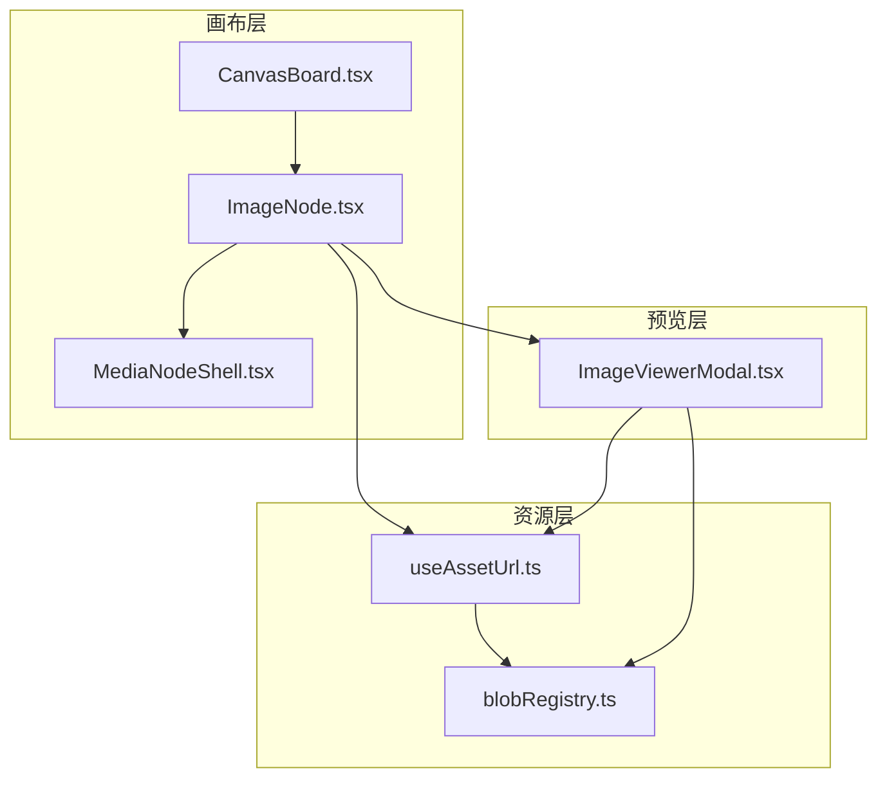
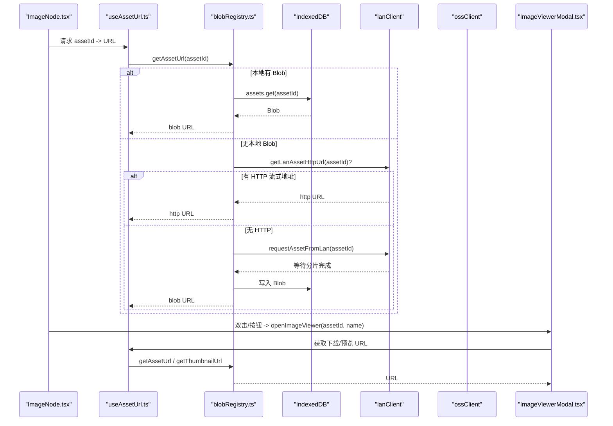
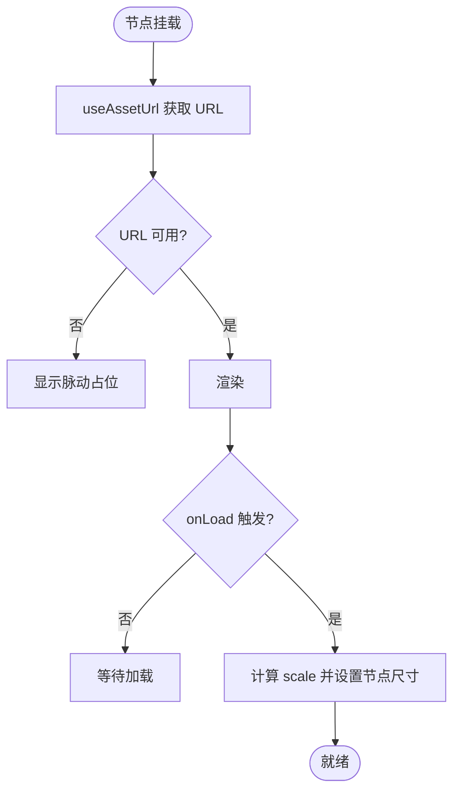
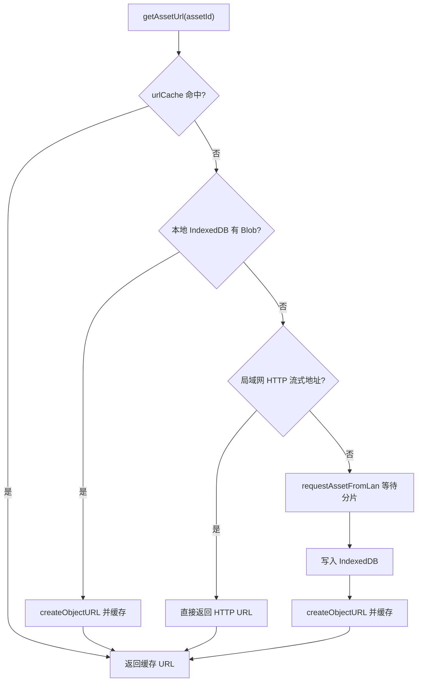
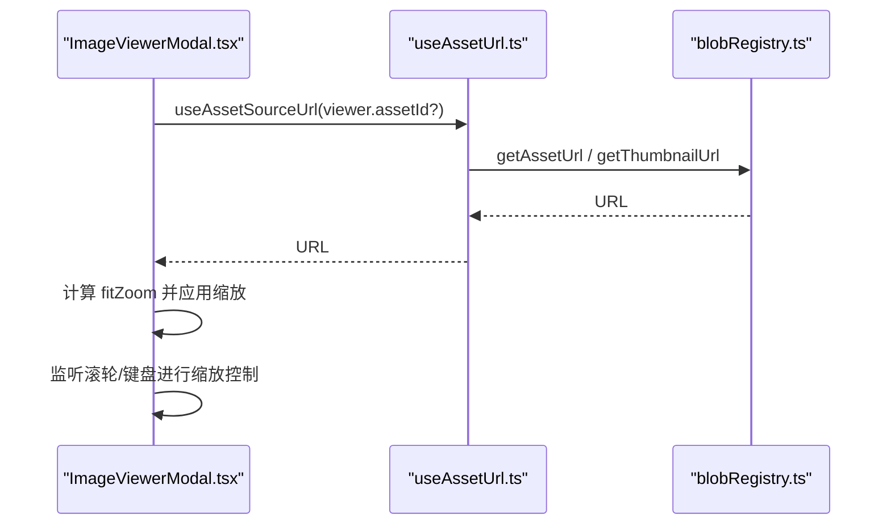
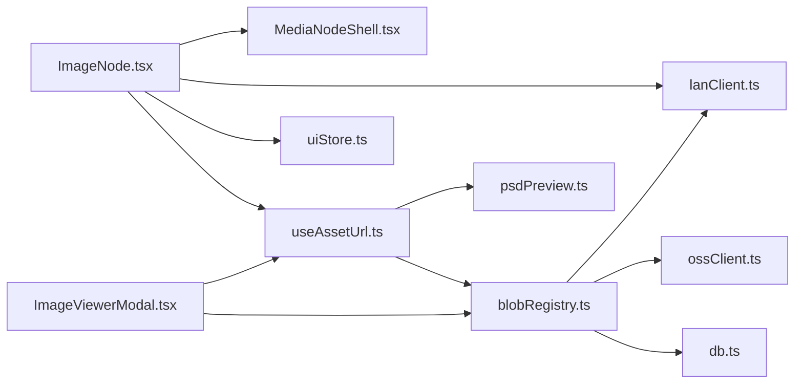

# 图片节点

<cite>
**本文引用的文件**
- [ImageNode.tsx](file://src/canvas/nodes/ImageNode.tsx)
- [MediaNodeShell.tsx](file://src/canvas/nodes/MediaNodeShell.tsx)
- [useAssetUrl.ts](file://src/media/useAssetUrl.ts)
- [blobRegistry.ts](file://src/media/blobRegistry.ts)
- [ImageViewerModal.tsx](file://src/components/ImageViewerModal.tsx)
- [CanvasBoard.tsx](file://src/canvas/CanvasBoard.tsx)
- [types.ts](file://src/types.ts)
</cite>

## 目录
1. [简介](#简介)
2. [项目结构](#项目结构)
3. [核心组件](#核心组件)
4. [架构总览](#架构总览)
5. [详细组件分析](#详细组件分析)
6. [依赖关系分析](#依赖关系分析)
7. [性能考量](#性能考量)
8. [故障排查指南](#故障排查指南)
9. [结论](#结论)
10. [附录：使用示例与最佳实践](#附录使用示例与最佳实践)

## 简介
本章节面向“图片节点”的完整能力说明，涵盖图片加载与缓存、缩放与平移、预览交互、格式支持、资源管理机制 useAssetUrl，以及性能优化建议。该节点基于 React Flow 构建，结合本地 IndexedDB、局域网传输与云端同步，提供稳定高效的图片编辑体验。

## 项目结构
围绕图片节点的关键文件与职责如下：
- ImageNode：图片节点渲染、尺寸自适应、打开大图预览、下载等交互
- MediaNodeShell：媒体节点的通用外壳（边框、连线手柄、选中态、协作锁定提示）
- useAssetUrl / blobRegistry：统一资源 URL 获取与缓存（本地 Blob、局域网 HTTP 流、云端回源）
- ImageViewerModal：全屏图片查看器（缩放、适应窗口、下载、PSD 预览）
- CanvasBoard：画布容器（拖拽、缩放、工具模式、键盘快捷键）
- types：节点数据模型（包含 kind、assetId、label、宽高等）

图表来源
- [CanvasBoard.tsx:1-200](file://src/canvas/CanvasBoard.tsx#L1-L200)
- [ImageNode.tsx:1-126](file://src/canvas/nodes/ImageNode.tsx#L1-L126)
- [MediaNodeShell.tsx:1-151](file://src/canvas/nodes/MediaNodeShell.tsx#L1-L151)
- [useAssetUrl.ts:1-157](file://src/media/useAssetUrl.ts#L1-L157)
- [blobRegistry.ts:1-389](file://src/media/blobRegistry.ts#L1-L389)
- [ImageViewerModal.tsx:1-165](file://src/components/ImageViewerModal.tsx#L1-L165)

章节来源
- [CanvasBoard.tsx:1-200](file://src/canvas/CanvasBoard.tsx#L1-L200)
- [ImageNode.tsx:1-126](file://src/canvas/nodes/ImageNode.tsx#L1-L126)
- [MediaNodeShell.tsx:1-151](file://src/canvas/nodes/MediaNodeShell.tsx#L1-L151)
- [useAssetUrl.ts:1-157](file://src/media/useAssetUrl.ts#L1-L157)
- [blobRegistry.ts:1-389](file://src/media/blobRegistry.ts#L1-L389)
- [ImageViewerModal.tsx:1-165](file://src/components/ImageViewerModal.tsx#L1-L165)
- [types.ts:1-112](file://src/types.ts#L1-L112)

## 核心组件
- 图片节点（ImageNode）
  - 通过 useAssetUrl 获取资源 URL，首次加载时根据自然宽高计算适配尺寸并写入节点维度
  - 双击或右上角按钮打开 ImageViewerModal 进行大图预览
  - 支持 NodeResizer 调整大小；在局域网协作中显示锁定状态
- 媒体外壳（MediaNodeShell）
  - 统一边框、连线手柄、底部信息栏、创建者角标、进度遮罩、协作锁定遮罩
- 资源 URL 钩子（useAssetUrl）
  - 封装 getAssetUrl/getThumbnailUrl，带重试与错误提示
- 资源注册表（blobRegistry）
  - 维护 urlCache/thumbCache，优先本地 IndexedDB，其次局域网 HTTP 流式地址，最后云端回源
- 图片查看器（ImageViewerModal）
  - 支持缩放、适应窗口、键盘快捷键、下载、PSD 预览

章节来源
- [ImageNode.tsx:1-126](file://src/canvas/nodes/ImageNode.tsx#L1-L126)
- [MediaNodeShell.tsx:1-151](file://src/canvas/nodes/MediaNodeShell.tsx#L1-L151)
- [useAssetUrl.ts:1-157](file://src/media/useAssetUrl.ts#L1-L157)
- [blobRegistry.ts:1-389](file://src/media/blobRegistry.ts#L1-L389)
- [ImageViewerModal.tsx:1-165](file://src/components/ImageViewerModal.tsx#L1-L165)

## 架构总览
图片从“资源层”到“展示层”的调用链如下：

图表来源
- [ImageNode.tsx:1-126](file://src/canvas/nodes/ImageNode.tsx#L1-L126)
- [useAssetUrl.ts:1-157](file://src/media/useAssetUrl.ts#L1-L157)
- [blobRegistry.ts:1-389](file://src/media/blobRegistry.ts#L1-L389)
- [ImageViewerModal.tsx:1-165](file://src/components/ImageViewerModal.tsx#L1-L165)

## 详细组件分析

### 图片节点（ImageNode）
- 图片加载与自动适配
  - 监听 img onLoad，读取 naturalWidth/Height，按最大宽高限制计算 scale，设置节点初始尺寸
- 交互行为
  - 双击节点区域或点击“打开图片”按钮，触发 openImageViewer 打开大图查看器
  - 右上角悬浮区提供“打开图片”和“下载图片”操作
  - 使用 NodeResizer 进行自由缩放（不保持纵横比），最小 48px
  - 在局域网协作中，若其他用户正在编辑，节点会被锁定，禁止交互
- 视觉反馈
  - 加载中显示脉动占位图，图片加载完成后淡入
  - 悬停显示操作按钮

图表来源
- [ImageNode.tsx:1-126](file://src/canvas/nodes/ImageNode.tsx#L1-L126)

章节来源
- [ImageNode.tsx:1-126](file://src/canvas/nodes/ImageNode.tsx#L1-L126)
- [MediaNodeShell.tsx:1-151](file://src/canvas/nodes/MediaNodeShell.tsx#L1-L151)

### 资源管理（useAssetUrl + blobRegistry）
- 工作原理
  - useAssetUrl 负责订阅 assetId/version，调用 blobRegistry 的 getAssetUrl/getThumbnailUrl，并在失败时进行有限次重试
  - blobRegistry 维护 urlCache 与 thumbCache，避免重复生成 blob URL
  - 获取主资源的顺序：本地 IndexedDB Blob > 局域网 HTTP 流式地址 > 云端回源下载后落库
  - 获取缩略图的顺序：局域网已同步封面 > 本地记录 thumbnail > 视频抓帧生成 > 兜底拉取全量再抓帧
- 并发与稳定性
  - 封面抓帧限制并发（THUMB_MAX_CONCURRENT），避免阻塞浏览器连接池
  - 对网络不稳定场景提供重试与超时保护
  - 对 PSD 等特殊格式提供 ensurePsdPreview 流程

图表来源
- [blobRegistry.ts:84-126](file://src/media/blobRegistry.ts#L84-L126)
- [useAssetUrl.ts:10-44](file://src/media/useAssetUrl.ts#L10-L44)

章节来源
- [useAssetUrl.ts:1-157](file://src/media/useAssetUrl.ts#L1-L157)
- [blobRegistry.ts:1-389](file://src/media/blobRegistry.ts#L1-L389)

### 图片预览（ImageViewerModal）
- 功能
  - 支持放大/缩小、适应窗口、键盘快捷键（+/-/0/ESC）、鼠标滚轮缩放
  - 下载原始资源或 PSD（针对缩略图模式）
  - 针对 PSD 缩略图，先尝试预览 URL，否则走 ensurePsdPreview 流程
- 缩放策略
  - 限制缩放范围 MIN_ZOOM..MAX_ZOOM，避免极端缩放导致渲染异常
  - 首次加载后根据自然尺寸计算 fitZoom，使图片适应视口

图表来源
- [ImageViewerModal.tsx:1-165](file://src/components/ImageViewerModal.tsx#L1-L165)
- [useAssetUrl.ts:101-127](file://src/media/useAssetUrl.ts#L101-L127)
- [blobRegistry.ts:310-379](file://src/media/blobRegistry.ts#L310-L379)

章节来源
- [ImageViewerModal.tsx:1-165](file://src/components/ImageViewerModal.tsx#L1-L165)

### 画布交互（拖拽、缩放、平移）
- 拖拽移动
  - 基于 React Flow 的节点拖拽；在开始/结束时广播协作编辑状态
- 缩放与平移
  - 画布级缩放范围 MIN_ZOOM..MAX_ZOOM；支持工具栏缩放、快捷键缩放
  - 按住空格临时进入拖动模式以平移画布
- 选择与聚焦
  - 支持多选、复制粘贴、全选、聚焦到某节点并居中视图

章节来源
- [CanvasBoard.tsx:1-200](file://src/canvas/CanvasBoard.tsx#L1-L200)

## 依赖关系分析
- ImageNode 依赖
  - MediaNodeShell：外壳样式与协作锁定
  - useAssetUrl：资源 URL 获取
  - uiStore：打开图片查看器、toast 提示
  - lanClient：协作编辑锁定
- useAssetUrl 依赖
  - blobRegistry：getAssetUrl/getThumbnailUrl
  - psdPreview：PSD 预览生成
  - lanClient：检测局域网连接状态
- blobRegistry 依赖
  - db：IndexedDB 读写
  - ossClient：云端资源下载与缩略图
  - lanClient：局域网资源请求与缩略图同步
- ImageViewerModal 依赖
  - useAssetUrl：获取下载/预览 URL
  - uiStore：关闭查看器、toast

图表来源
- [ImageNode.tsx:1-126](file://src/canvas/nodes/ImageNode.tsx#L1-L126)
- [useAssetUrl.ts:1-157](file://src/media/useAssetUrl.ts#L1-L157)
- [blobRegistry.ts:1-389](file://src/media/blobRegistry.ts#L1-L389)
- [ImageViewerModal.tsx:1-165](file://src/components/ImageViewerModal.tsx#L1-L165)

章节来源
- [ImageNode.tsx:1-126](file://src/canvas/nodes/ImageNode.tsx#L1-L126)
- [useAssetUrl.ts:1-157](file://src/media/useAssetUrl.ts#L1-L157)
- [blobRegistry.ts:1-389](file://src/media/blobRegistry.ts#L1-L389)
- [ImageViewerModal.tsx:1-165](file://src/components/ImageViewerModal.tsx#L1-L165)

## 性能考量
- 资源缓存
  - urlCache 与 thumbCache 减少重复 createObjectURL 与网络请求
  - 本地 IndexedDB 优先，避免重复下载大文件
- 并发控制
  - 封面抓帧限制并发，防止阻塞浏览器连接池
- 懒加载与重试
  - useAssetUrl 对失败场景进行有限次重试，提升弱网稳定性
- 渲染优化
  - 图片节点首次加载仅计算一次尺寸，避免频繁重排
  - 大图查看器限制缩放范围，避免过度缩放导致的性能问题

[本节为通用性能讨论，无需具体文件引用]

## 故障排查指南
- 资源加载失败
  - 现象：toast 提示“资源加载失败”
  - 可能原因：本地无 Blob、局域网未就绪、云端不可达
  - 处理：检查局域网连接、确认资源是否已上传至云端、重试加载
- 封面缺失或黑图
  - 现象：视频缩略图为空或全黑
  - 处理：系统会尝试重新抓帧；若仍失败，检查跨域配置与编码兼容性
- 协作锁定
  - 现象：节点被锁定无法编辑
  - 处理：等待对方结束编辑或刷新协作状态

章节来源
- [useAssetUrl.ts:26-35](file://src/media/useAssetUrl.ts#L26-L35)
- [blobRegistry.ts:310-379](file://src/media/blobRegistry.ts#L310-L379)
- [MediaNodeShell.tsx:141-147](file://src/canvas/nodes/MediaNodeShell.tsx#L141-L147)

## 结论
图片节点通过统一的资源管理与预览机制，实现了稳定的加载、缩放与交互体验。结合本地缓存、局域网流式传输与云端回源，既保证了离线可用性，又提升了多端协作效率。配合合理的并发控制与重试策略，整体性能与鲁棒性良好。

[本节为总结性内容，无需具体文件引用]

## 附录：使用示例与最佳实践
- 插入图片节点
  - 通过导入文件或拖拽方式将图片加入画布，节点会自动计算初始尺寸
- 打开大图预览
  - 双击图片或点击“打开图片”按钮，进入全屏查看器，支持缩放与下载
- 调整图片尺寸
  - 选中节点后使用右下角缩放手柄调整大小；最小尺寸为 48px
- 协作编辑
  - 多人同时编辑时，节点会被锁定，避免冲突；编辑结束后解锁
- 性能优化建议
  - 尽量使用本地已有资源，减少网络请求
  - 避免过多大图同时加载，必要时使用缩略图
  - 合理设置画布缩放级别，避免过度缩放影响性能

[本节为使用指导，无需具体文件引用]