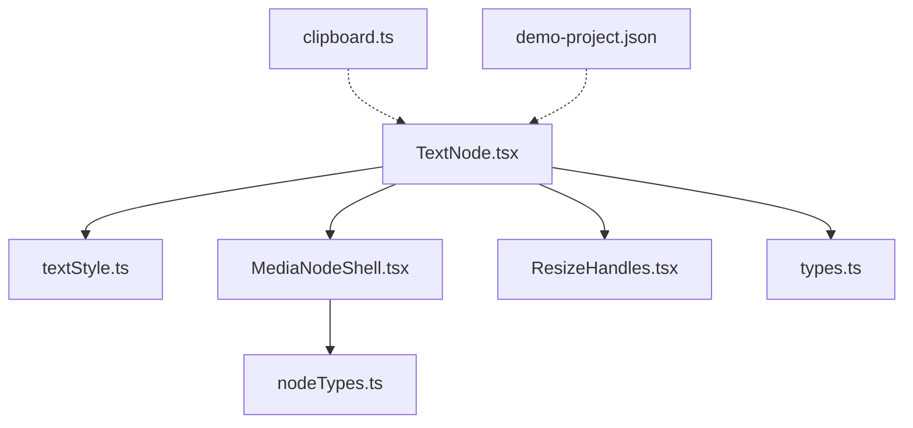
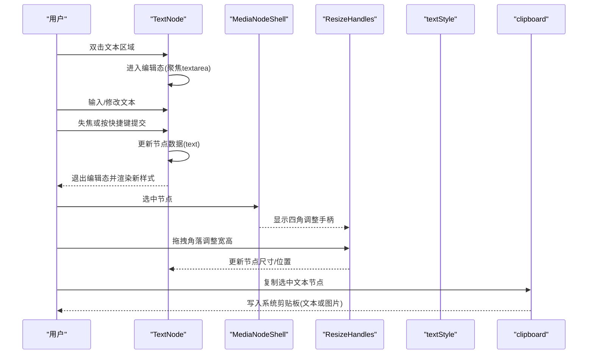
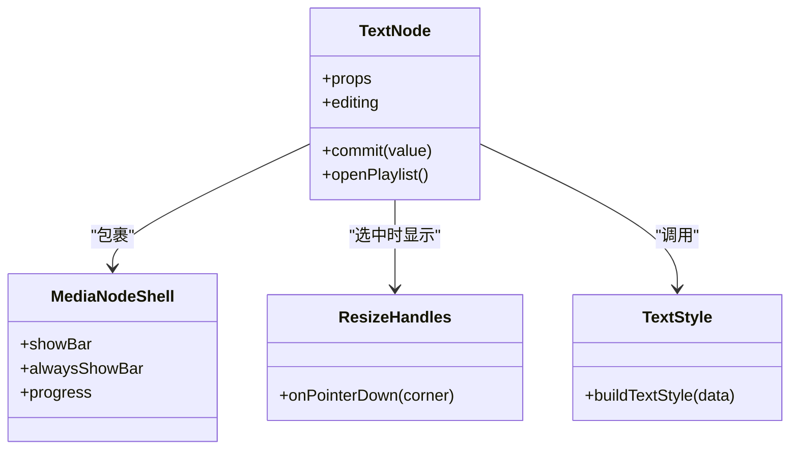
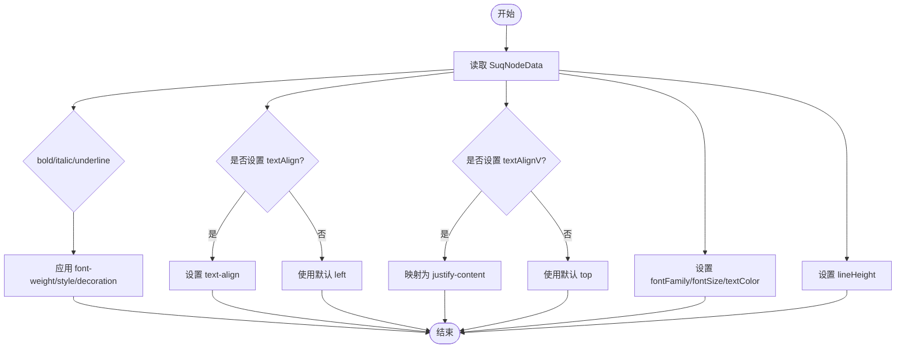
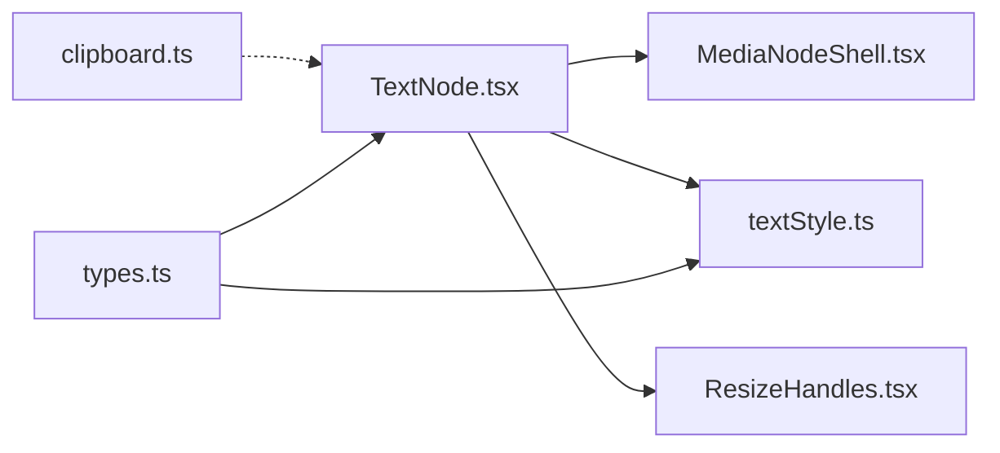

# 文本节点

<cite>
**本文引用的文件**
- [TextNode.tsx](file://src/canvas/nodes/TextNode.tsx)
- [textStyle.ts](file://src/canvas/nodes/textStyle.ts)
- [types.ts](file://src/types.ts)
- [MediaNodeShell.tsx](file://src/canvas/nodes/MediaNodeShell.tsx)
- [ResizeHandles.tsx](file://src/canvas/nodes/ResizeHandles.tsx)
- [nodeTypes.ts](file://src/canvas/nodes/nodeTypes.ts)
- [clipboard.ts](file://src/canvas/clipboard.ts)
- [demo-project.json](file://promo/apple/work/demo-project.json)
</cite>

## 目录
1. [简介](#简介)
2. [项目结构](#项目结构)
3. [核心组件](#核心组件)
4. [架构总览](#架构总览)
5. [详细组件分析](#详细组件分析)
6. [依赖关系分析](#依赖关系分析)
7. [性能考量](#性能考量)
8. [故障排查指南](#故障排查指南)
9. [结论](#结论)
10. [附录：样式配置与使用示例](#附录样式配置与使用示例)

## 简介
本章节面向“文本节点”的完整能力说明，覆盖富文本编辑、文本样式（字体族、字号、字重、颜色、行高、对齐等）、选择与复制粘贴、交互行为（双击编辑、拖拽调整大小、键盘快捷键）以及常见配置场景。该节点基于 ReactFlow 节点体系构建，提供轻量但实用的文本编辑与展示能力，并支持与其他媒体节点协同工作。

## 项目结构
文本节点位于画布节点模块中，围绕以下关键文件组织：
- 节点实现：TextNode.tsx
- 样式构建：textStyle.ts
- 类型定义：types.ts
- 节点外壳与连线手柄：MediaNodeShell.tsx
- 尺寸调整：ResizeHandles.tsx
- 节点类型注册：nodeTypes.ts
- 剪贴板与复制：clipboard.ts
- 示例工程：demo-project.json

图表来源
- [TextNode.tsx:1-107](file://src/canvas/nodes/TextNode.tsx#L1-L107)
- [textStyle.ts:1-22](file://src/canvas/nodes/textStyle.ts#L1-L22)
- [MediaNodeShell.tsx:1-151](file://src/canvas/nodes/MediaNodeShell.tsx#L1-L151)
- [ResizeHandles.tsx:1-118](file://src/canvas/nodes/ResizeHandles.tsx#L1-L118)
- [nodeTypes.ts:1-27](file://src/canvas/nodes/nodeTypes.ts#L1-L27)
- [clipboard.ts:1-132](file://src/canvas/clipboard.ts#L1-L132)
- [demo-project.json:139-172](file://promo/apple/work/demo-project.json#L139-L172)

章节来源
- [TextNode.tsx:1-107](file://src/canvas/nodes/TextNode.tsx#L1-L107)
- [nodeTypes.ts:1-27](file://src/canvas/nodes/nodeTypes.ts#L1-L27)

## 核心组件
- TextNode：负责文本显示、编辑模式切换、样式渲染、歌单联动按钮、编辑状态同步与提交。
- textStyle：根据节点数据生成 CSS 样式对象，包含水平/垂直对齐、字体族、字号、颜色、加粗、斜体、下划线、行高等。
- MediaNodeShell：为所有媒体节点提供统一外壳，包括边框、底部信息栏、创建者角标、协作锁定提示、连接手柄等。
- ResizeHandles：在节点选中时提供四角拖拽以调整宽高，内置最小尺寸限制。
- clipboard：将选中的文本节点内容复制到系统剪贴板（纯文本），或复制图片节点为 PNG。

章节来源
- [TextNode.tsx:13-107](file://src/canvas/nodes/TextNode.tsx#L13-L107)
- [textStyle.ts:4-21](file://src/canvas/nodes/textStyle.ts#L4-L21)
- [MediaNodeShell.tsx:32-151](file://src/canvas/nodes/MediaNodeShell.tsx#L32-L151)
- [ResizeHandles.tsx:35-118](file://src/canvas/nodes/ResizeHandles.tsx#L35-L118)
- [clipboard.ts:8-132](file://src/canvas/clipboard.ts#L8-L132)

## 架构总览
文本节点由 ReactFlow 节点驱动，内部通过 MediaNodeShell 提供通用外壳，结合自定义样式与交互逻辑完成编辑与展示。

图表来源
- [TextNode.tsx:78-103](file://src/canvas/nodes/TextNode.tsx#L78-L103)
- [MediaNodeShell.tsx:53-151](file://src/canvas/nodes/MediaNodeShell.tsx#L53-L151)
- [ResizeHandles.tsx:45-103](file://src/canvas/nodes/ResizeHandles.tsx#L45-L103)
- [clipboard.ts:114-132](file://src/canvas/clipboard.ts#L114-L132)

## 详细组件分析

### TextNode 组件
- 功能要点
  - 编辑模式：默认显示文本；双击进入编辑；失焦或快捷键提交。
  - 自动编辑：支持 autoEdit 标记，首次渲染即进入编辑态并清除标记。
  - 样式应用：通过 buildTextStyle 将 SuqNodeData 映射为 CSSProperties。
  - 垂直对齐：根据 textAlignV 设置 flex 容器的 justify-content。
  - 歌单联动：若文本节点命名了画布歌单且存在出边指向音频首节点，则显示播放按钮。
  - 协作编辑：编辑时上报当前编辑节点，离开编辑时清理。
  - 尺寸调整：选中后显示 ResizeHandles，支持四角拖拽调整宽高。
- 交互行为
  - 双击编辑：双击非编辑态文本区域进入编辑。
  - 键盘快捷键：
    - Escape：取消编辑并提交当前值。
    - Ctrl/Cmd + Enter：提交当前值。
  - 复制粘贴：通过系统剪贴板复制选中文本节点内容为纯文本；图片节点可复制为 PNG。
- 错误处理
  - 歌单未找到或无曲目时不显示播放按钮。
  - 剪贴板写入失败时回退兼容方案或忽略。

章节来源
- [TextNode.tsx:13-107](file://src/canvas/nodes/TextNode.tsx#L13-L107)
- [clipboard.ts:114-132](file://src/canvas/clipboard.ts#L114-L132)

#### 类图（代码级）

图表来源
- [TextNode.tsx:13-107](file://src/canvas/nodes/TextNode.tsx#L13-L107)
- [MediaNodeShell.tsx:32-151](file://src/canvas/nodes/MediaNodeShell.tsx#L32-L151)
- [ResizeHandles.tsx:35-118](file://src/canvas/nodes/ResizeHandles.tsx#L35-L118)
- [textStyle.ts:10-21](file://src/canvas/nodes/textStyle.ts#L10-L21)

### 文本样式配置 textStyle
- 支持的样式属性（来自 SuqNodeData）
  - 水平对齐：textAlign（left | center | right | justify）
  - 垂直对齐：textAlignV（top | middle | bottom）
  - 字体族：fontFamily
  - 字号：fontSize
  - 颜色：textColor
  - 字重：bold（布尔，true 时应用加粗）
  - 斜体：italic（布尔，true 时应用斜体）
  - 下划线：underline（布尔，true 时应用下划线）
  - 行高：lineHeight
- 映射规则
  - 水平对齐直接映射到 CSS text-align。
  - 垂直对齐通过 V_JUSTIFY 映射为 flex 容器的 justify-content。
  - bold/italic/underline 分别映射为 font-weight/font-style/text-decoration。
  - lineHeight 直接映射为行高。

章节来源
- [textStyle.ts:4-21](file://src/canvas/nodes/textStyle.ts#L4-L21)
- [types.ts:66-98](file://src/types.ts#L66-L98)

#### 流程图（样式构建）

图表来源
- [textStyle.ts:10-21](file://src/canvas/nodes/textStyle.ts#L10-L21)

### 交互行为详解
- 双击编辑
  - 在非编辑态双击文本区域进入编辑模式，自动聚焦并全选文本。
  - 编辑区为 textarea，支持多行输入。
- 拖拽调整大小
  - 节点选中时显示四角手柄，支持拖动调整宽高，有最小宽高限制。
- 键盘快捷键
  - Escape：退出编辑并提交。
  - Ctrl/Cmd + Enter：提交当前编辑内容。
- 复制粘贴
  - 复制：选中文本节点时，可将文本内容写入系统剪贴板；若为图片/PSD 节点，则复制为 PNG。
  - 粘贴：由操作系统或目标应用决定，本节点不拦截粘贴事件。

章节来源
- [TextNode.tsx:78-103](file://src/canvas/nodes/TextNode.tsx#L78-L103)
- [ResizeHandles.tsx:45-103](file://src/canvas/nodes/ResizeHandles.tsx#L45-L103)
- [clipboard.ts:114-132](file://src/canvas/clipboard.ts#L114-L132)

### 使用示例与常见配置场景
- 基础文本
  - 设置 kind=text，可选 label、text、fontSize、fontFamily、textColor、textAlign、textAlignV、lineHeight、bold/italic/underline。
- 标题式文本
  - 增大 fontSize，配合 textAlign=center 与 textAlignV=middle，用于居中强调。
- 引用式文本
  - 启用 italic，适当增大 fontSize，配合留白与边框色，形成引用块效果。
- 关键词列表
  - 多行文本，合理设置 lineHeight 提升可读性。
- 与媒体节点组合
  - 文本节点可作为注释、标签或流程说明，通过边连接到图像、视频、音频等节点。

章节来源
- [demo-project.json:139-172](file://promo/apple/work/demo-project.json#L139-L172)

## 依赖关系分析
- 组件耦合
  - TextNode 依赖 MediaNodeShell 提供外壳与协作锁定提示。
  - TextNode 依赖 textStyle 进行样式计算。
  - TextNode 依赖 ResizeHandles 提供尺寸调整。
  - 剪贴板能力由 clipboard.ts 提供，支持文本与图片复制。
- 外部依赖
  - ReactFlow：节点渲染、手柄、视图变换等。
  - 浏览器 API：navigator.clipboard、ClipboardItem、Canvas/PNG 转换。
- 潜在循环依赖
  - 当前结构清晰，未见循环导入。

图表来源
- [TextNode.tsx:1-107](file://src/canvas/nodes/TextNode.tsx#L1-L107)
- [MediaNodeShell.tsx:1-151](file://src/canvas/nodes/MediaNodeShell.tsx#L1-L151)
- [textStyle.ts:1-22](file://src/canvas/nodes/textStyle.ts#L1-L22)
- [ResizeHandles.tsx:1-118](file://src/canvas/nodes/ResizeHandles.tsx#L1-L118)
- [clipboard.ts:1-132](file://src/canvas/clipboard.ts#L1-L132)
- [types.ts:1-112](file://src/types.ts#L1-L112)

章节来源
- [nodeTypes.ts:14-26](file://src/canvas/nodes/nodeTypes.ts#L14-L26)

## 性能考量
- 渲染优化
  - TextNode 使用 memo 包裹，减少不必要的重渲染。
  - 样式通过 useMemo 构建，避免重复计算。
- 交互性能
  - 拖拽调整使用 pointer 事件，实时计算并批量更新节点尺寸与位置。
- 剪贴板
  - 图片复制会进行缩放与编码，注意大图的内存与耗时；已做最大边限制与降级策略。

[本节为通用性能建议，无需特定文件引用]

## 故障排查指南
- 无法进入编辑模式
  - 检查是否被协作锁定（MediaNodeShell 会在其他用户编辑时禁用）。
  - 确认 autoEdit 未被意外设置为 true。
- 样式不生效
  - 检查 SuqNodeData 中对应字段是否正确设置（如 textAlign、fontSize、textColor 等）。
  - 确认外层容器样式未覆盖（例如父级设置了强制样式）。
- 拖拽无效
  - 确保节点处于选中状态，且未被协作锁定。
  - 检查 ResizeHandles 的最小宽高限制是否导致视觉异常。
- 复制失败
  - 浏览器不支持 ClipboardItem 或权限不足时，图片复制可能失败；文本复制通常可用。
  - 若文本为空，不会写入剪贴板。

章节来源
- [MediaNodeShell.tsx:44-66](file://src/canvas/nodes/MediaNodeShell.tsx#L44-L66)
- [ResizeHandles.tsx:81-88](file://src/canvas/nodes/ResizeHandles.tsx#L81-L88)
- [clipboard.ts:90-107](file://src/canvas/clipboard.ts#L90-L107)

## 结论
文本节点提供了简洁高效的文本编辑与展示能力，支持丰富的样式配置与常用交互（双击编辑、拖拽调整、快捷键提交、复制粘贴）。通过与 MediaNodeShell 和 ResizeHandles 的组合，实现了统一的节点外壳与尺寸控制；借助 clipboard 工具，满足跨应用的复制需求。建议在需要结构化表达、标注与说明的场景中使用文本节点，并结合边与其他媒体节点组成可视化流程或灵感板。

[本节为总结，无需特定文件引用]

## 附录：样式配置与使用示例
- 文本样式配置选项（textStyle 相关）
  - 水平对齐：textAlign（left | center | right | justify）
  - 垂直对齐：textAlignV（top | middle | bottom）
  - 字体族：fontFamily
  - 字号：fontSize
  - 颜色：textColor
  - 字重：bold（true 时加粗）
  - 斜体：italic（true 时斜体）
  - 下划线：underline（true 时下划线）
  - 行高：lineHeight
- 使用示例（来自示例工程）
  - 关键词文本：设置 fontSize，多行文本，配合边框色突出。
  - 引用文本：设置较大 fontSize 与 italic，增强引用感。
  - 形状内文本：设置 textAlign=center 与 textAlignV=middle，使文本居中。

章节来源
- [textStyle.ts:4-21](file://src/canvas/nodes/textStyle.ts#L4-L21)
- [demo-project.json:139-172](file://promo/apple/work/demo-project.json#L139-L172)
- [demo-project.json:246-286](file://promo/apple/work/demo-project.json#L246-L286)