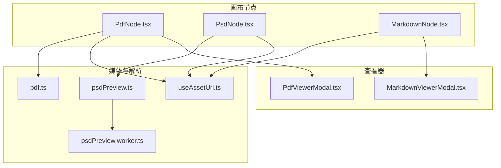
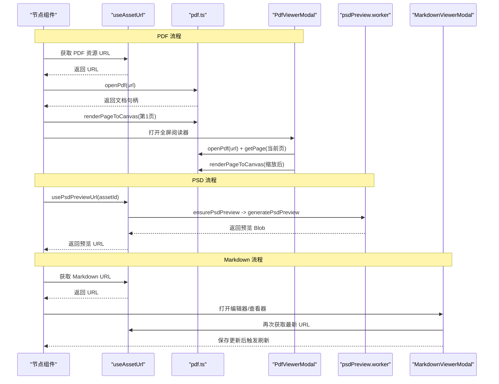
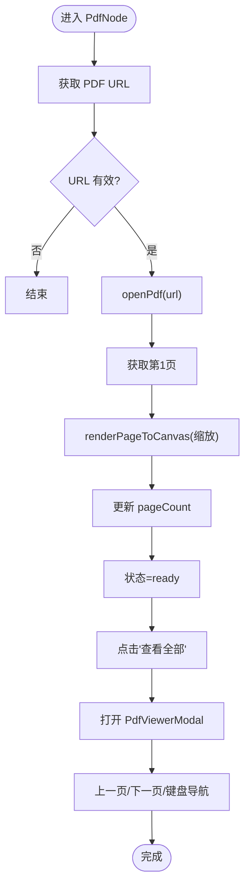
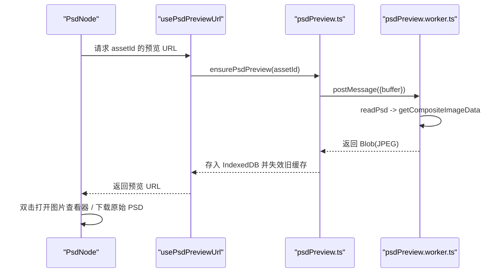
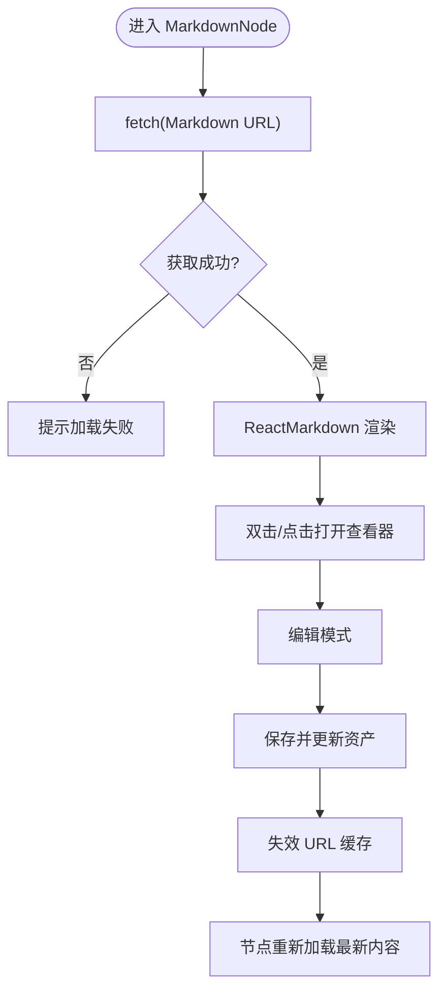
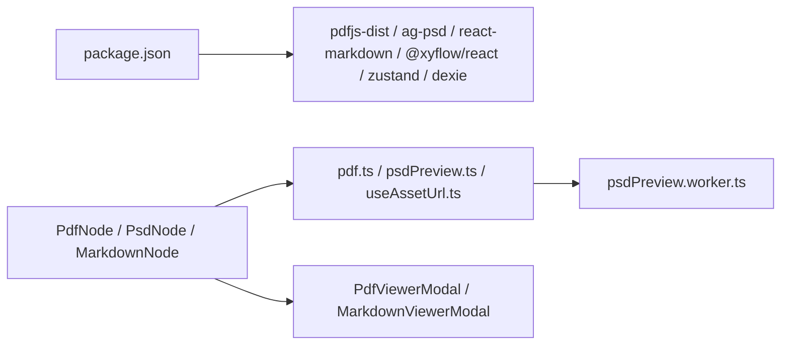

# 文档节点

<cite>
**本文引用的文件**
- [PdfNode.tsx](file://src/canvas/nodes/PdfNode.tsx)
- [PsdNode.tsx](file://src/canvas/nodes/PsdNode.tsx)
- [MarkdownNode.tsx](file://src/canvas/nodes/MarkdownNode.tsx)
- [pdf.ts](file://src/media/pdf.ts)
- [psdPreview.ts](file://src/media/psdPreview.ts)
- [psdPreview.worker.ts](file://src/media/psdPreview.worker.ts)
- [useAssetUrl.ts](file://src/media/useAssetUrl.ts)
- [PdfViewerModal.tsx](file://src/components/PdfViewerModal.tsx)
- [MarkdownViewerModal.tsx](file://src/components/MarkdownViewerModal.tsx)
- [types.ts](file://src/types.ts)
- [index.css](file://src/index.css)
- [package.json](file://package.json)
</cite>

## 目录
1. [简介](#简介)
2. [项目结构](#项目结构)
3. [核心组件](#核心组件)
4. [架构总览](#架构总览)
5. [详细组件分析](#详细组件分析)
6. [依赖关系分析](#依赖关系分析)
7. [性能考量](#性能考量)
8. [故障排查指南](#故障排查指南)
9. [结论](#结论)
10. [附录：使用示例与配置选项](#附录使用示例与配置选项)

## 简介
本章节面向“文档节点”系列，系统性说明三类文档节点的渲染能力与交互方式：
- PDF 节点（PdfNode）：提供 PDF 文件加载、首页缩略预览、打开全屏阅读器进行页面导航。
- PSD 节点（PsdNode）：提供 PSD 文件的异步预览图生成与查看，支持尺寸自适应与下载原始文件。
- Markdown 节点（MarkdownNode）：提供 Markdown 文本的在线加载与渲染，支持编辑与保存，并可通过模态框查看完整内容。

同时说明各文档类型的文件格式支持与兼容性限制，以及在各节点中的使用方式与可配置项。

## 项目结构
文档节点相关代码主要分布在以下位置：
- 画布节点实现：src/canvas/nodes/PdfNode.tsx、PsdNode.tsx、MarkdownNode.tsx
- 媒体与解析工具：src/media/pdf.ts、src/media/psdPreview.ts、src/media/psdPreview.worker.ts、src/media/useAssetUrl.ts
- 全屏查看器：src/components/PdfViewerModal.tsx、src/components/MarkdownViewerModal.tsx
- 类型与样式：src/types.ts、src/index.css
- 构建与依赖：package.json

图表来源
- [PdfNode.tsx:1-90](file://src/canvas/nodes/PdfNode.tsx#L1-L90)
- [PsdNode.tsx:1-125](file://src/canvas/nodes/PsdNode.tsx#L1-L125)
- [MarkdownNode.tsx:1-105](file://src/canvas/nodes/MarkdownNode.tsx#L1-L105)
- [pdf.ts:1-50](file://src/media/pdf.ts#L1-L50)
- [psdPreview.ts:1-62](file://src/media/psdPreview.ts#L1-L62)
- [psdPreview.worker.ts:1-82](file://src/media/psdPreview.worker.ts#L1-L82)
- [useAssetUrl.ts:1-157](file://src/media/useAssetUrl.ts#L1-L157)
- [PdfViewerModal.tsx:1-146](file://src/components/PdfViewerModal.tsx#L1-L146)
- [MarkdownViewerModal.tsx:1-116](file://src/components/MarkdownViewerModal.tsx#L1-L116)

章节来源
- [PdfNode.tsx:1-90](file://src/canvas/nodes/PdfNode.tsx#L1-L90)
- [PsdNode.tsx:1-125](file://src/canvas/nodes/PsdNode.tsx#L1-L125)
- [MarkdownNode.tsx:1-105](file://src/canvas/nodes/MarkdownNode.tsx#L1-L105)
- [pdf.ts:1-50](file://src/media/pdf.ts#L1-L50)
- [psdPreview.ts:1-62](file://src/media/psdPreview.ts#L1-L62)
- [psdPreview.worker.ts:1-82](file://src/media/psdPreview.worker.ts#L1-L82)
- [useAssetUrl.ts:1-157](file://src/media/useAssetUrl.ts#L1-L157)
- [PdfViewerModal.tsx:1-146](file://src/components/PdfViewerModal.tsx#L1-L146)
- [MarkdownViewerModal.tsx:1-116](file://src/components/MarkdownViewerModal.tsx#L1-L116)

## 核心组件
- PdfNode：负责在节点内加载并渲染 PDF 第一页作为缩略图，并提供“查看全部”入口进入全屏 PDF 阅读器。
- PsdNode：负责获取或生成 PSD 预览图，支持双击打开大图查看与下载原始 PSD。
- MarkdownNode：负责拉取 Markdown 文本并在节点中轻量渲染，支持打开编辑器进行编辑与保存。

章节来源
- [PdfNode.tsx:11-89](file://src/canvas/nodes/PdfNode.tsx#L11-L89)
- [PsdNode.tsx:15-124](file://src/canvas/nodes/PsdNode.tsx#L15-L124)
- [MarkdownNode.tsx:12-104](file://src/canvas/nodes/MarkdownNode.tsx#L12-L104)

## 架构总览
下图展示了从节点到媒体资源、再到查看器的整体数据流与控制流。

图表来源
- [PdfNode.tsx:19-62](file://src/canvas/nodes/PdfNode.tsx#L19-L62)
- [PdfViewerModal.tsx:24-83](file://src/components/PdfViewerModal.tsx#L24-L83)
- [pdf.ts:23-49](file://src/media/pdf.ts#L23-L49)
- [useAssetUrl.ts:129-156](file://src/media/useAssetUrl.ts#L129-L156)
- [psdPreview.ts:42-60](file://src/media/psdPreview.ts#L42-L60)
- [psdPreview.worker.ts:41-81](file://src/media/psdPreview.worker.ts#L41-L81)
- [MarkdownViewerModal.tsx:21-58](file://src/components/MarkdownViewerModal.tsx#L21-L58)

## 详细组件分析

### PDF 节点（PdfNode）
- 功能要点
  - 动态导入 pdf 模块，加载 PDF 并获取文档句柄。
  - 自动记录页数并同步到节点数据。
  - 将第一页渲染到节点内的 Canvas，用于快速预览。
  - 提供“查看全部”按钮，调用 UI 存储打开全屏 PDF 阅读器。
- 关键流程
  - 加载阶段：openPdf -> 获取第1页 -> 计算缩放 -> renderPageToCanvas -> 清理页面与句柄。
  - 错误处理：捕获异常并切换为错误状态提示。
  - 生命周期：组件卸载时取消任务、释放页面与文档句柄。
- 交互能力
  - 页面导航：通过全屏阅读器支持上一页/下一页与键盘左右键翻页。
  - 缩放控制：阅读器按固定策略计算缩放比例以适配宽度；节点内缩略图使用基于页面宽度的缩放。
  - 搜索功能：当前实现未包含搜索逻辑。

图表来源
- [PdfNode.tsx:19-62](file://src/canvas/nodes/PdfNode.tsx#L19-L62)
- [PdfViewerModal.tsx:85-94](file://src/components/PdfViewerModal.tsx#L85-L94)
- [pdf.ts:23-49](file://src/media/pdf.ts#L23-L49)

章节来源
- [PdfNode.tsx:11-89](file://src/canvas/nodes/PdfNode.tsx#L11-L89)
- [PdfViewerModal.tsx:1-146](file://src/components/PdfViewerModal.tsx#L1-L146)
- [pdf.ts:1-50](file://src/media/pdf.ts#L1-L50)

### PSD 节点（PsdNode）
- 功能要点
  - 通过 usePsdPreviewUrl 获取或生成 PSD 预览图（JPEG）。
  - 首次加载若无预览，则触发 Worker 解析 PSD 并生成预览，缓存至 IndexedDB。
  - 支持双击打开图片查看器，显示预览图；支持下载原始 PSD。
  - 根据预览图自然尺寸自适应节点宽高，限制最大尺寸。
- 解析与限制
  - 使用 ag-psd 在 Web Worker 中读取 PSD，跳过图层图像数据与链接文件数据，仅合成主图。
  - 限制文档尺寸与像素上限，仅支持 8-bit 通道深度。
  - 生成预览图并进行等比缩放，输出 JPEG。
- 透明度控制
  - 当前实现未提供图层级透明度控制；仅展示合成后的预览图。

图表来源
- [PsdNode.tsx:15-124](file://src/canvas/nodes/PsdNode.tsx#L15-L124)
- [useAssetUrl.ts:129-156](file://src/media/useAssetUrl.ts#L129-L156)
- [psdPreview.ts:42-60](file://src/media/psdPreview.ts#L42-L60)
- [psdPreview.worker.ts:41-81](file://src/media/psdPreview.worker.ts#L41-L81)

章节来源
- [PsdNode.tsx:1-125](file://src/canvas/nodes/PsdNode.tsx#L1-L125)
- [psdPreview.ts:1-62](file://src/media/psdPreview.ts#L1-L62)
- [psdPreview.worker.ts:1-82](file://src/media/psdPreview.worker.ts#L1-L82)
- [useAssetUrl.ts:129-157](file://src/media/useAssetUrl.ts#L129-L157)

### Markdown 节点（MarkdownNode）
- 功能要点
  - 通过 useAssetUrl 获取 Markdown 文本 URL，fetch 文本并截取长度限制。
  - 使用 ReactMarkdown 在节点内进行基础渲染。
  - 双击或点击“打开”按钮进入 MarkdownViewerModal，支持编辑与保存。
  - 保存时更新资产文本并触发 URL 失效，使节点重新加载最新版本。
- 语法与渲染
  - 基于 react-markdown 的标准 Markdown 语法支持。
  - 代码高亮与表格渲染：当前未引入额外插件，依赖默认行为与全局 CSS 样式。
  - 链接处理：默认以浏览器行为打开链接。
- 协作与锁定
  - 支持局域网编辑锁定提示，避免多人同时编辑冲突。

图表来源
- [MarkdownNode.tsx:29-43](file://src/canvas/nodes/MarkdownNode.tsx#L29-L43)
- [MarkdownViewerModal.tsx:21-58](file://src/components/MarkdownViewerModal.tsx#L21-L58)

章节来源
- [MarkdownNode.tsx:1-105](file://src/canvas/nodes/MarkdownNode.tsx#L1-L105)
- [MarkdownViewerModal.tsx:1-116](file://src/components/MarkdownViewerModal.tsx#L1-L116)

## 依赖关系分析
- 外部库
  - pdfjs-dist：PDF 解析与渲染。
  - ag-psd：PSD 解析与合成图提取。
  - react-markdown：Markdown 渲染。
  - @xyflow/react：画布节点框架。
  - zustand：状态管理（UI 存储、画布存储等）。
  - dexie：IndexedDB 封装，用于缓存预览与资产信息。
- 内部模块
  - useAssetUrl：统一资源 URL 获取与重试机制，封装 PSD 预览生成流程。
  - pdf.ts：PDF 打开、关闭与页面渲染封装。
  - psdPreview.ts / worker：PSD 预览生成队列与 Worker 通信。
  - 查看器：PdfViewerModal、MarkdownViewerModal 提供全屏交互。

图表来源
- [package.json:22-35](file://package.json#L22-L35)
- [PdfNode.tsx:1-90](file://src/canvas/nodes/PdfNode.tsx#L1-L90)
- [PsdNode.tsx:1-125](file://src/canvas/nodes/PsdNode.tsx#L1-L125)
- [MarkdownNode.tsx:1-105](file://src/canvas/nodes/MarkdownNode.tsx#L1-L105)
- [pdf.ts:1-50](file://src/media/pdf.ts#L1-L50)
- [psdPreview.ts:1-62](file://src/media/psdPreview.ts#L1-L62)
- [psdPreview.worker.ts:1-82](file://src/media/psdPreview.worker.ts#L1-L82)
- [useAssetUrl.ts:1-157](file://src/media/useAssetUrl.ts#L1-L157)
- [PdfViewerModal.tsx:1-146](file://src/components/PdfViewerModal.tsx#L1-L146)
- [MarkdownViewerModal.tsx:1-116](file://src/components/MarkdownViewerModal.tsx#L1-L116)

章节来源
- [package.json:22-35](file://package.json#L22-L35)

## 性能考量
- PDF
  - 首屏仅渲染第1页，减少初始开销。
  - 阅读器按需加载页面，并在切换时清理上一页面资源。
  - 使用设备像素比提升清晰度，同时限制最大缩放以避免过大渲染。
- PSD
  - 预览生成在 Web Worker 中进行，避免阻塞主线程。
  - 限制文档尺寸与像素上限，防止超大文件导致内存溢出。
  - 仅合成主图，跳过图层图像数据与链接文件数据，降低解析成本。
  - 预览图等比缩放并压缩为 JPEG，减小传输体积。
- Markdown
  - 节点内仅加载并截取一定长度的文本，避免大文件影响渲染。
  - 编辑器与查看器分离，编辑时不直接污染节点渲染。
  - 保存后失效 URL 缓存，确保后续加载最新内容。

[本节为通用性能讨论，不直接分析具体文件]

## 故障排查指南
- PDF 加载失败
  - 检查 PDF 资源 URL 是否可用，确认 BASE_URL 下已复制 pdfjs 资源（cmaps、standard_fonts、wasm）。
  - 查看控制台错误日志，确认 worker 与字体资源路径正确。
  - 参考：[pdf.ts:7-16](file://src/media/pdf.ts#L7-L16)、[PdfNode.tsx:50-53](file://src/canvas/nodes/PdfNode.tsx#L50-L53)。
- PDF 页面渲染失败
  - 检查页面是否存在、viewport 计算是否正常。
  - 参考：[PdfViewerModal.tsx:58-78](file://src/components/PdfViewerModal.tsx#L58-L78)。
- PSD 预览失败
  - 可能原因：文件过大、非 8-bit、无合成图像、Worker 崩溃。
  - 检查限制常量与错误消息，必要时调整 MAX_DOCUMENT_SIDE/MAX_DOCUMENT_PIXELS/MAX_DECODE_MEMORY。
  - 参考：[psdPreview.worker.ts:3-6](file://src/media/psdPreview.worker.ts#L3-L6)、[psdPreview.worker.ts:41-81](file://src/media/psdPreview.worker.ts#L41-L81)、[psdPreview.ts:49-60](file://src/media/psdPreview.ts#L49-L60)。
- Markdown 加载失败
  - 检查网络请求与 CORS，确认 URL 可访问。
  - 参考：[MarkdownNode.tsx:29-43](file://src/canvas/nodes/MarkdownNode.tsx#L29-L43)、[MarkdownViewerModal.tsx:21-33](file://src/components/MarkdownViewerModal.tsx#L21-L33)。

章节来源
- [pdf.ts:7-16](file://src/media/pdf.ts#L7-L16)
- [PdfNode.tsx:50-53](file://src/canvas/nodes/PdfNode.tsx#L50-L53)
- [PdfViewerModal.tsx:58-78](file://src/components/PdfViewerModal.tsx#L58-L78)
- [psdPreview.worker.ts:3-6](file://src/media/psdPreview.worker.ts#L3-L6)
- [psdPreview.worker.ts:41-81](file://src/media/psdPreview.worker.ts#L41-L81)
- [psdPreview.ts:49-60](file://src/media/psdPreview.ts#L49-L60)
- [MarkdownNode.tsx:29-43](file://src/canvas/nodes/MarkdownNode.tsx#L29-L43)
- [MarkdownViewerModal.tsx:21-33](file://src/components/MarkdownViewerModal.tsx#L21-L33)

## 结论
- PDF 节点提供了稳定的首屏预览与全屏阅读器，具备页面导航能力，但尚未集成搜索。
- PSD 节点实现了高效的异步预览生成与查看，适合快速浏览与下载原始文件；不支持图层级透明度控制。
- Markdown 节点支持基础的 Markdown 渲染与编辑保存，代码高亮与表格渲染依赖默认行为与全局样式。
- 三者均通过统一的资源 URL 管理与错误提示机制，保证良好的用户体验与可维护性。

[本节为总结性内容，不直接分析具体文件]

## 附录：使用示例与配置选项

- 文件格式支持与兼容性
  - PDF：依赖 pdfjs-dist，需确保 cmaps、标准字体与 wasm 资源已复制到 BASE_URL/pdfjs/ 目录下。
  - PSD：仅支持 8-bit 通道深度，且文档尺寸与像素数受限于 Worker 中的阈值；超大或非兼容格式将无法生成预览。
  - Markdown：基于 react-markdown，遵循标准 Markdown 语法；代码高亮与表格渲染未引入额外插件。
- 节点数据字段（来自 SuqNodeData）
  - kind：媒体类型标识（image/video/audio/pdf/psd/markdown/text/file/heading/sticky/shape）。
  - assetId：资源 ID，用于获取 URL。
  - label：显示名称，用于文件名与标题。
  - pageCount：PDF 页数，由 PdfNode 自动更新。
  - assetUpdatedAt：Markdown 更新时间戳，用于触发 URL 失效与重新加载。
- 使用示例
  - PDF 节点：创建 kind=pdf 的节点并设置 assetId；节点会自动加载并渲染第一页；点击“查看全部”进入阅读器进行翻页。
  - PSD 节点：创建 kind=psd 的节点并设置 assetId；等待预览生成后可双击查看或下载原始文件。
  - Markdown 节点：创建 kind=markdown 的节点并设置 assetId；节点内显示部分内容；双击或点击“打开”进入编辑器进行编辑与保存。
- 配置选项
  - PDF 阅读器：支持键盘左右键翻页、Esc 关闭；缩放策略为按宽度自适应，最大不超过设定值。
  - PSD 预览：可在 Worker 中调整尺寸与内存限制；当前实现为固定阈值。
  - Markdown 编辑器：支持编辑/预览切换与保存；保存后自动刷新节点内容。

章节来源
- [types.ts:3-14](file://src/types.ts#L3-L14)
- [types.ts:66-98](file://src/types.ts#L66-L98)
- [PdfNode.tsx:36-38](file://src/canvas/nodes/PdfNode.tsx#L36-L38)
- [PdfViewerModal.tsx:85-94](file://src/components/PdfViewerModal.tsx#L85-L94)
- [psdPreview.worker.ts:3-6](file://src/media/psdPreview.worker.ts#L3-L6)
- [MarkdownViewerModal.tsx:43-58](file://src/components/MarkdownViewerModal.tsx#L43-L58)