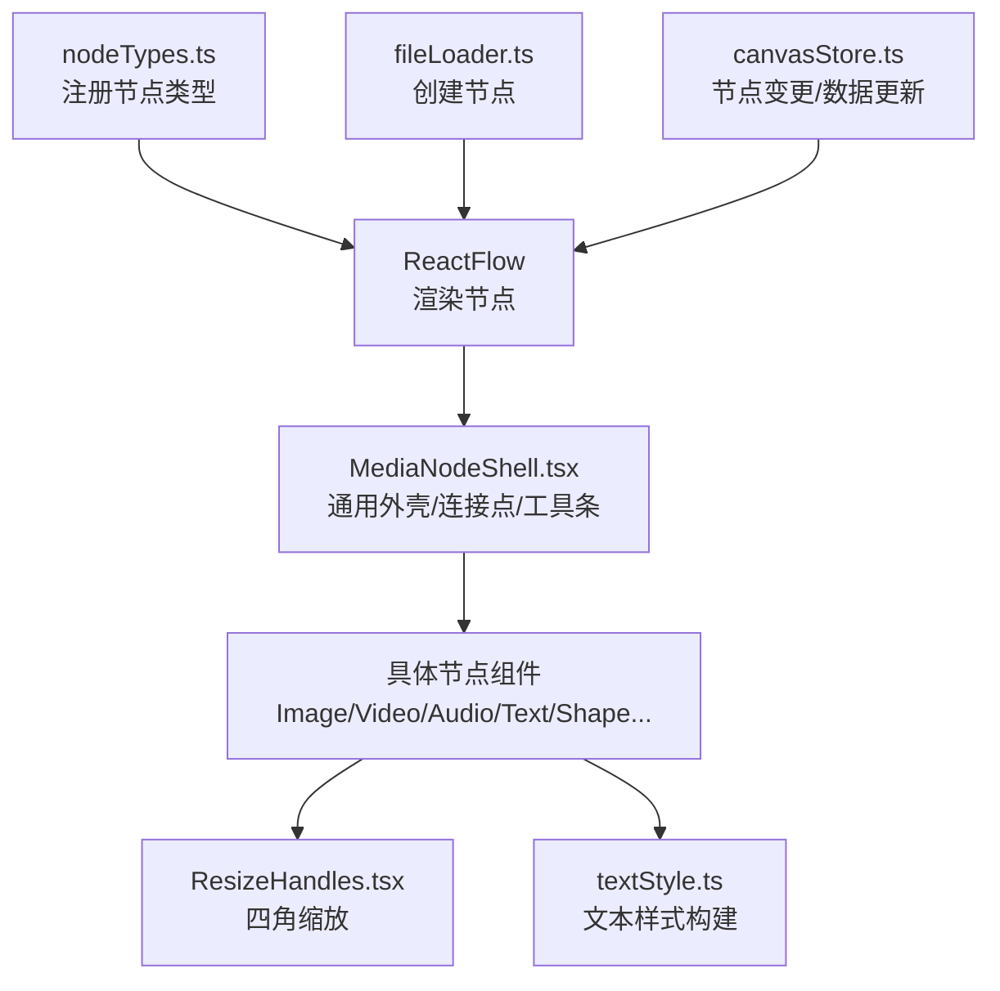
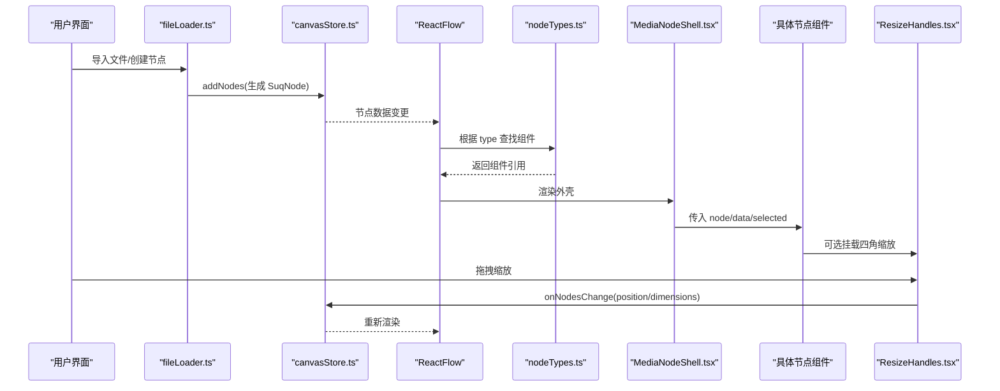
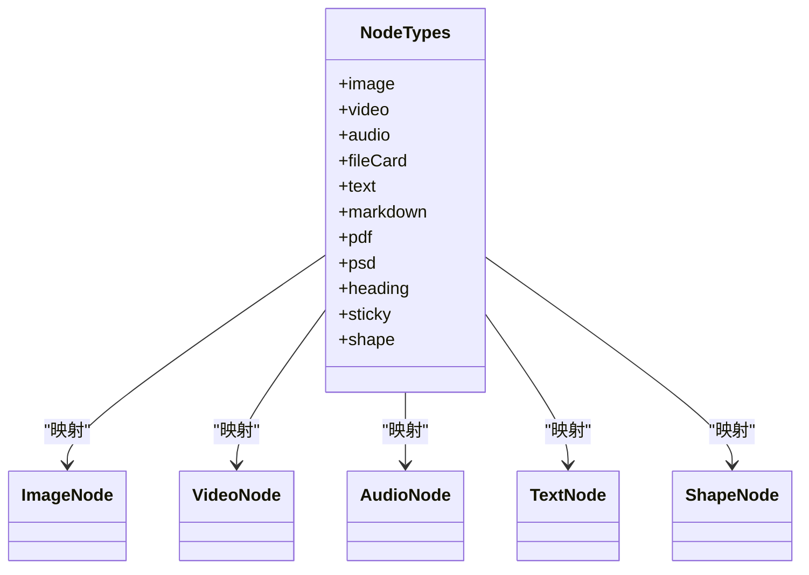
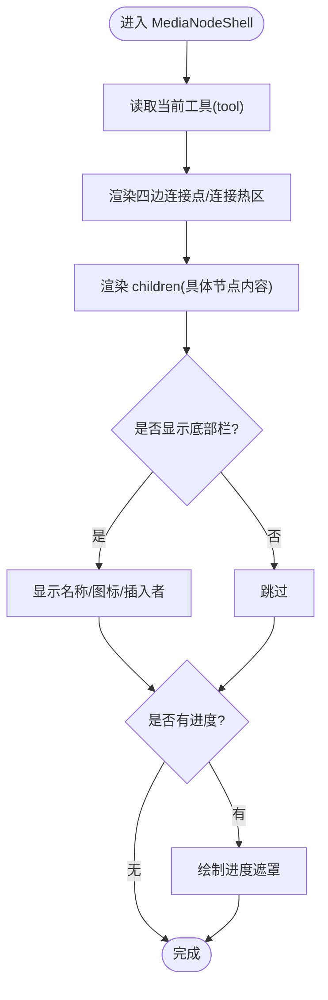
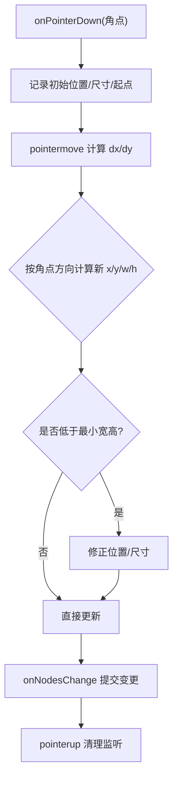
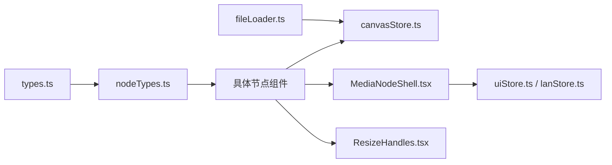

# 节点类型概览

<cite>
**本文引用的文件**
- [src/canvas/nodes/nodeTypes.ts](file://src/canvas/nodes/nodeTypes.ts)
- [src/canvas/nodes/MediaNodeShell.tsx](file://src/canvas/nodes/MediaNodeShell.tsx)
- [src/canvas/nodes/ResizeHandles.tsx](file://src/canvas/nodes/ResizeHandles.tsx)
- [src/types.ts](file://src/types.ts)
- [src/canvas/nodes/ImageNode.tsx](file://src/canvas/nodes/ImageNode.tsx)
- [src/canvas/nodes/VideoNode.tsx](file://src/canvas/nodes/VideoNode.tsx)
- [src/canvas/nodes/AudioNode.tsx](file://src/canvas/nodes/AudioNode.tsx)
- [src/canvas/nodes/TextNode.tsx](file://src/canvas/nodes/TextNode.tsx)
- [src/canvas/nodes/ShapeNode.tsx](file://src/canvas/nodes/ShapeNode.tsx)
- [src/canvas/nodes/textStyle.ts](file://src/canvas/nodes/textStyle.ts)
- [src/io/fileLoader.ts](file://src/io/fileLoader.ts)
- [src/store/canvasStore.ts](file://src/store/canvasStore.ts)
</cite>

## 目录
1. [简介](#简介)
2. [项目结构](#项目结构)
3. [核心组件](#核心组件)
4. [架构总览](#架构总览)
5. [详细组件分析](#详细组件分析)
6. [依赖关系分析](#依赖关系分析)
7. [性能考量](#性能考量)
8. [故障排查指南](#故障排查指南)
9. [结论](#结论)
10. [附录：扩展新节点类型最佳实践](#附录：扩展新节点类型最佳实践)

## 简介
本文件面向 SuQCanvas 的节点类型系统，系统性说明以下主题：
- NodeTypes 注册机制与节点类型体系
- 媒体节点基类 MediaNodeShell 的设计模式与职责边界
- 统一调整手柄 ResizeHandles 的实现原理与交互流程
- 节点的通用属性接口、生命周期管理、事件处理机制
- 如何扩展新的节点类型（组件规范、样式定制、与画布系统集成）
- 节点类型扩展的最佳实践与性能优化建议

## 项目结构
SuQCanvas 将“节点类型”集中在 canvas/nodes 目录下，通过统一的注册表暴露给 ReactFlow。关键组织方式如下：
- 节点类型注册：nodeTypes.ts 集中导出 mediaNodeTypes，将字符串类型名映射到具体节点组件
- 媒体节点壳：MediaNodeShell.tsx 提供通用的外壳、连接点、底部信息栏、进度遮罩、协作锁定提示等
- 统一尺寸调整：ResizeHandles.tsx 提供四角拖拽缩放，统一更新节点位置与尺寸
- 具体节点实现：ImageNode、VideoNode、AudioNode、TextNode、ShapeNode 等基于 Shell 组合业务逻辑
- 类型定义：types.ts 定义 SuqNodeData、MediaKind 等统一数据结构
- 导入与创建：fileLoader.ts 根据资源元数据创建节点并注入画布
- 状态与变更：canvasStore.ts 提供 onNodesChange、updateNodeData 等能力

图表来源
- [src/canvas/nodes/nodeTypes.ts:14-26](file://src/canvas/nodes/nodeTypes.ts#L14-L26)
- [src/canvas/nodes/MediaNodeShell.tsx:20-44](file://src/canvas/nodes/MediaNodeShell.tsx#L20-L44)
- [src/canvas/nodes/ResizeHandles.tsx:35-103](file://src/canvas/nodes/ResizeHandles.tsx#L35-L103)
- [src/canvas/nodes/textStyle.ts:10-21](file://src/canvas/nodes/textStyle.ts#L10-L21)
- [src/io/fileLoader.ts:165-182](file://src/io/fileLoader.ts#L165-L182)
- [src/store/canvasStore.ts:33-59](file://src/store/canvasStore.ts#L33-L59)

章节来源
- [src/canvas/nodes/nodeTypes.ts:1-26](file://src/canvas/nodes/nodeTypes.ts#L1-L26)
- [src/canvas/nodes/MediaNodeShell.tsx:1-151](file://src/canvas/nodes/MediaNodeShell.tsx#L1-L151)
- [src/canvas/nodes/ResizeHandles.tsx:1-118](file://src/canvas/nodes/ResizeHandles.tsx#L1-L118)
- [src/types.ts:1-112](file://src/types.ts#L1-L112)
- [src/io/fileLoader.ts:165-182](file://src/io/fileLoader.ts#L165-L182)
- [src/store/canvasStore.ts:33-59](file://src/store/canvasStore.ts#L33-L59)

## 核心组件
- 节点类型注册器（mediaNodeTypes）
  - 将字符串类型名映射到具体节点组件，供 ReactFlow 渲染使用
  - 新增节点类型时仅需在此处注册并实现对应组件
- 媒体节点壳（MediaNodeShell）
  - 负责：边框与背景、选中态、悬停态、底部名称栏、插入者标识、播放进度遮罩、协作锁定提示
  - 内置四条边的 Handle 连接点，支持连线模式下的边热区
  - 在工具切换时调用 useUpdateNodeInternals 刷新内部测量，保证连接热区生效
- 统一调整手柄（ResizeHandles）
  - 四角拖拽缩放，计算 dx/dy 并同步更新节点 position 与 dimensions
  - 最小宽高约束，避免过小导致不可用
  - 通过 canvasStore.onNodesChange 批量提交变更

章节来源
- [src/canvas/nodes/nodeTypes.ts:14-26](file://src/canvas/nodes/nodeTypes.ts#L14-L26)
- [src/canvas/nodes/MediaNodeShell.tsx:13-105](file://src/canvas/nodes/MediaNodeShell.tsx#L13-L105)
- [src/canvas/nodes/ResizeHandles.tsx:5-103](file://src/canvas/nodes/ResizeHandles.tsx#L5-L103)

## 架构总览
下图展示了从“资源导入”到“节点渲染与交互”的端到端流程，以及各层职责。

图表来源
- [src/io/fileLoader.ts:165-182](file://src/io/fileLoader.ts#L165-L182)
- [src/store/canvasStore.ts:33-59](file://src/store/canvasStore.ts#L33-L59)
- [src/canvas/nodes/nodeTypes.ts:14-26](file://src/canvas/nodes/nodeTypes.ts#L14-L26)
- [src/canvas/nodes/MediaNodeShell.tsx:20-44](file://src/canvas/nodes/MediaNodeShell.tsx#L20-L44)
- [src/canvas/nodes/ResizeHandles.tsx:45-103](file://src/canvas/nodes/ResizeHandles.tsx#L45-L103)

## 详细组件分析

### 节点类型注册机制（NodeTypes）
- 作用：集中维护“类型名 -> 组件”的映射，便于 ReactFlow 按 type 渲染
- 扩展方式：新增一个节点组件后，在 mediaNodeTypes 中增加键值对即可
- 与类型系统的关系：类型名需与 types.ts 中的 MediaKind 或业务约定保持一致

图表来源
- [src/canvas/nodes/nodeTypes.ts:14-26](file://src/canvas/nodes/nodeTypes.ts#L14-L26)

章节来源
- [src/canvas/nodes/nodeTypes.ts:1-26](file://src/canvas/nodes/nodeTypes.ts#L1-L26)

### 媒体节点基类 MediaNodeShell
- 设计模式：容器/装饰器模式，为所有媒体类节点提供一致的外壳行为
- 主要职责：
  - 统一边框、背景、选中态、悬停态
  - 四条边的 Handle 连接点，支持连线模式的热区
  - 底部名称栏与插入者标识
  - 播放进度遮罩（用于音频等需要展示进度的场景）
  - 协作锁定提示（当其他用户正在编辑该节点时禁用交互）
- 生命周期要点：
  - 工具切换时触发 useUpdateNodeInternals，确保连接热区范围正确
  - 通过 selected/hovered 控制 UI 显隐
  - progress 参数驱动进度遮罩宽度变化

图表来源
- [src/canvas/nodes/MediaNodeShell.tsx:13-105](file://src/canvas/nodes/MediaNodeShell.tsx#L13-L105)
- [src/canvas/nodes/MediaNodeShell.tsx:109-147](file://src/canvas/nodes/MediaNodeShell.tsx#L109-L147)

章节来源
- [src/canvas/nodes/MediaNodeShell.tsx:1-151](file://src/canvas/nodes/MediaNodeShell.tsx#L1-L151)

### 统一调整手柄 ResizeHandles
- 交互流程：
  - 按下四角之一记录初始位置与尺寸
  - 移动过程中计算 dx/dy，按角点方向更新 x/y/w/h
  - 应用最小宽高限制，必要时反向调整位置
  - 通过 onNodesChange 同时提交 position 与 dimensions 变更
- 复杂度与性能：
  - 每次 pointermove 仅做常数时间计算与一次 store 更新
  - 使用 screenToFlowPosition 保证缩放/平移下坐标正确
- 适用场景：文本、形状等可自由调整尺寸的节点

图表来源
- [src/canvas/nodes/ResizeHandles.tsx:45-103](file://src/canvas/nodes/ResizeHandles.tsx#L45-L103)

章节来源
- [src/canvas/nodes/ResizeHandles.tsx:1-118](file://src/canvas/nodes/ResizeHandles.tsx#L1-L118)

### 节点通用属性接口（SuqNodeData）
- 关键字段：
  - kind：节点种类（image/video/audio/pdf/psd/markdown/text/file/heading/sticky/shape）
  - assetId/label/mime/fileSize：资源标识与元信息
  - width/height/borderColor/backgroundColor：外观与尺寸
  - textAlign/textAlignV/fontSize/fontFamily/textColor/bold/italic/underline/lineHeight：文本样式
  - createdById/createdByName/createdAt：插入者追踪
  - coverAssetId/pageCount/autoEdit/level/color/shape/fill 等：特定节点扩展字段
- 用途：跨节点统一的数据契约，支撑编辑器、搜索、导入导出、播放器联动等功能

章节来源
- [src/types.ts:3-107](file://src/types.ts#L3-L107)

### 生命周期管理与事件处理
- 资源加载与自适应尺寸：
  - 图片/视频/PDF/PSD 等在首次加载完成后，依据自然尺寸与最大限制计算节点宽高并写入
- 编辑状态与协作：
  - 文本/形状等节点在编辑时设置局域网锁定，防止冲突
  - MediaNodeShell 在非自身编辑时阻止指针事件穿透，保障协作一致性
- 播放进度：
  - 音频节点根据当前播放曲目与时长计算进度，以遮罩形式展示
- 事件冒泡与防抖：
  - 按钮与链接使用 stopPropagation 避免干扰节点拖拽
  - 工具切换时刷新节点内部测量，避免连接热区异常

章节来源
- [src/canvas/nodes/ImageNode.tsx:27-56](file://src/canvas/nodes/ImageNode.tsx#L27-L56)
- [src/canvas/nodes/VideoNode.tsx:30-49](file://src/canvas/nodes/VideoNode.tsx#L30-L49)
- [src/canvas/nodes/AudioNode.tsx:26-33](file://src/canvas/nodes/AudioNode.tsx#L26-L33)
- [src/canvas/nodes/MediaNodeShell.tsx:48-66](file://src/canvas/nodes/MediaNodeShell.tsx#L48-L66)

### 典型节点实现要点
- 图片节点：加载完成后按比例缩放至最大宽高，支持打开大图与下载
- 视频节点：仅显示封面缩略图与播放按钮，点击打开全屏播放器，避免在画布内嵌播放器影响交互
- 音频节点：与播放器状态联动，展示当前曲目进度；双击进入专用播放器页
- 文本节点：支持自动进入编辑、歌单标题识别与快捷播放、四角缩放
- 形状节点：矩形/椭圆填充色，居中或顶部对齐文本，支持四角缩放

章节来源
- [src/canvas/nodes/ImageNode.tsx:15-126](file://src/canvas/nodes/ImageNode.tsx#L15-L126)
- [src/canvas/nodes/VideoNode.tsx:18-88](file://src/canvas/nodes/VideoNode.tsx#L18-L88)
- [src/canvas/nodes/AudioNode.tsx:18-126](file://src/canvas/nodes/AudioNode.tsx#L18-L126)
- [src/canvas/nodes/TextNode.tsx:13-107](file://src/canvas/nodes/TextNode.tsx#L13-L107)
- [src/canvas/nodes/ShapeNode.tsx:10-86](file://src/canvas/nodes/ShapeNode.tsx#L10-L86)

## 依赖关系分析
- 节点类型注册依赖 types.ts 的 MediaKind 与 SuqNodeData
- 节点组件依赖 canvasStore 进行数据持久化与变更广播
- MediaNodeShell 依赖 uiStore 获取当前工具，lanStore 获取协作锁定状态
- ResizeHandles 依赖 react-flow 的 screenToFlowPosition 与 canvasStore 的 onNodesChange
- fileLoader 根据资源元数据创建节点并注入画布

图表来源
- [src/types.ts:66-107](file://src/types.ts#L66-L107)
- [src/canvas/nodes/nodeTypes.ts:14-26](file://src/canvas/nodes/nodeTypes.ts#L14-L26)
- [src/canvas/nodes/MediaNodeShell.tsx:8-11](file://src/canvas/nodes/MediaNodeShell.tsx#L8-L11)
- [src/canvas/nodes/ResizeHandles.tsx:1-3](file://src/canvas/nodes/ResizeHandles.tsx#L1-L3)
- [src/io/fileLoader.ts:165-182](file://src/io/fileLoader.ts#L165-L182)
- [src/store/canvasStore.ts:33-59](file://src/store/canvasStore.ts#L33-L59)

章节来源
- [src/types.ts:1-112](file://src/types.ts#L1-L112)
- [src/canvas/nodes/nodeTypes.ts:1-26](file://src/canvas/nodes/nodeTypes.ts#L1-L26)
- [src/canvas/nodes/MediaNodeShell.tsx:1-151](file://src/canvas/nodes/MediaNodeShell.tsx#L1-L151)
- [src/canvas/nodes/ResizeHandles.tsx:1-118](file://src/canvas/nodes/ResizeHandles.tsx#L1-L118)
- [src/io/fileLoader.ts:165-182](file://src/io/fileLoader.ts#L165-L182)
- [src/store/canvasStore.ts:33-59](file://src/store/canvasStore.ts#L33-L59)

## 性能考量
- 懒加载与按需渲染
  - 视频节点不内嵌播放器，仅在打开播放器时拉取完整资源，降低画布负载
  - 图片/视频/PDF/PSD 等资源首次加载后才计算并设置节点尺寸，避免重复重排
- 渲染优化
  - 节点组件普遍使用 memo 包裹，减少不必要的重渲染
  - MediaNodeShell 在工具切换时仅刷新必要内部测量
- 交互节流
  - 拖拽缩放过程中仅提交必要的 position/dimensions 变更，避免多余状态更新
- 资源体积控制
  - 导入时对超大文件进行拦截与提示，防止内存压力

[本节为通用指导，无需列出具体文件来源]

## 故障排查指南
- 连接热区无效
  - 检查是否在工具切换后触发了 useUpdateNodeInternals
  - 确认 MediaNodeShell 的四边 Handle 已正确渲染
- 协作锁定导致无法操作
  - 检查 lanStore 中是否存在其他用户的 editing 记录
  - 确认节点组件是否正确阻止了事件穿透
- 节点尺寸异常
  - 检查 onLoad 回调是否执行，fittedRef 是否被重复设置
  - 确认 ResizeHandles 的最小宽高约束是否符合预期
- 文本样式不生效
  - 检查 buildTextStyle 的参数 data 是否包含所需字段
  - 确认 textAlign/textAlignV/fontSize 等字段是否正确写入节点数据

章节来源
- [src/canvas/nodes/MediaNodeShell.tsx:48-66](file://src/canvas/nodes/MediaNodeShell.tsx#L48-L66)
- [src/canvas/nodes/ImageNode.tsx:27-56](file://src/canvas/nodes/ImageNode.tsx#L27-L56)
- [src/canvas/nodes/ResizeHandles.tsx:81-92](file://src/canvas/nodes/ResizeHandles.tsx#L81-L92)
- [src/canvas/nodes/textStyle.ts:10-21](file://src/canvas/nodes/textStyle.ts#L10-L21)

## 结论
SuQCanvas 的节点类型系统通过“集中注册 + 统一外壳 + 标准数据契约”的方式，实现了高内聚、低耦合的可扩展架构。MediaNodeShell 抽象出通用外壳与协作体验，ResizeHandles 提供一致的尺寸调整能力，配合 types.ts 的统一数据模型，使得新增节点类型成本低、复用度高。结合懒加载、memo 与合理的状态更新策略，系统在交互流畅性与性能之间取得良好平衡。

[本节为总结性内容，无需列出具体文件来源]

## 附录：扩展新节点类型最佳实践
- 组件开发规范
  - 新建节点组件，使用 memo 包裹，接收 NodeProps<SuqNode>
  - 使用 MediaNodeShell 作为外层容器，保持边框、底部栏、连接点等行为一致
  - 如需文本样式，使用 textStyle.ts 的 buildTextStyle 与 V_JUSTIFY
  - 如支持尺寸调整，可在选中态挂载 ResizeHandles
- 样式定制方法
  - 通过 data.borderColor/backgroundFillColor 等字段控制外观
  - 使用 Tailwind 类名与 CSS 变量统一风格
- 与画布系统集成
  - 在 nodeTypes.ts 中注册新类型
  - 在 fileLoader.ts 的 PLACEHOLDER_SIZE/KIND_TO_TYPE 中补充默认尺寸与类型映射
  - 通过 canvasStore.updateNodeData/onNodesChange 更新节点数据与尺寸
- 最佳实践
  - 资源加载完成后一次性计算并设置节点尺寸，避免多次重排
  - 大媒体采用封面/缩略图占位，实际资源按需加载
  - 编辑态与协作态明确分离，及时释放锁定与监听
  - 对高频事件（如拖拽）进行合理节流与批处理

章节来源
- [src/canvas/nodes/nodeTypes.ts:14-26](file://src/canvas/nodes/nodeTypes.ts#L14-L26)
- [src/canvas/nodes/MediaNodeShell.tsx:20-44](file://src/canvas/nodes/MediaNodeShell.tsx#L20-L44)
- [src/canvas/nodes/textStyle.ts:10-21](file://src/canvas/nodes/textStyle.ts#L10-L21)
- [src/io/fileLoader.ts:165-182](file://src/io/fileLoader.ts#L165-L182)
- [src/store/canvasStore.ts:33-59](file://src/store/canvasStore.ts#L33-L59)