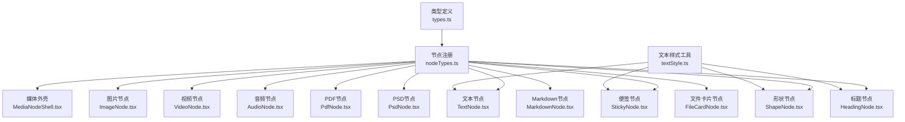
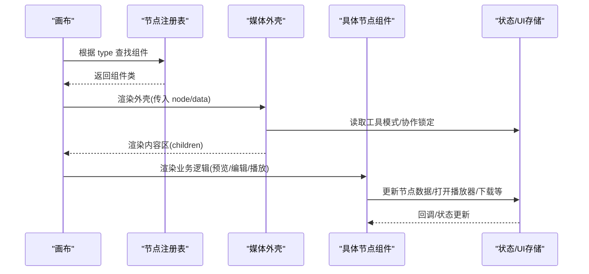
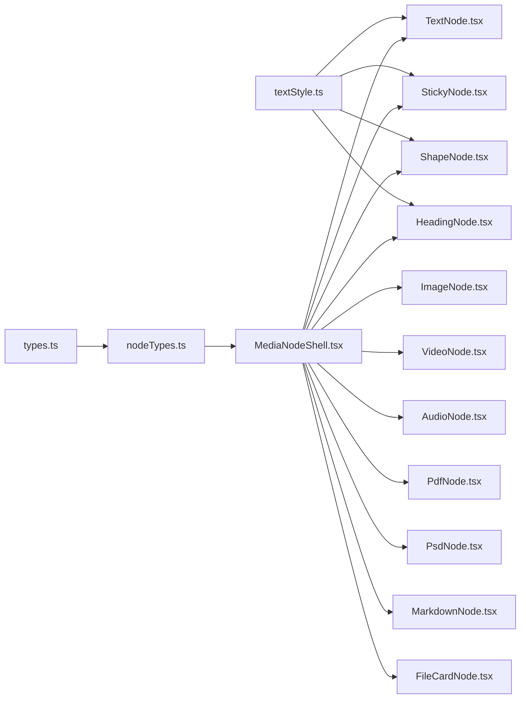

# 节点类型系统

<cite>
**本文引用的文件**
- [nodeTypes.ts](file://src/canvas/nodes/nodeTypes.ts)
- [MediaNodeShell.tsx](file://src/canvas/nodes/MediaNodeShell.tsx)
- [types.ts](file://src/types.ts)
- [TextNode.tsx](file://src/canvas/nodes/TextNode.tsx)
- [ImageNode.tsx](file://src/canvas/nodes/ImageNode.tsx)
- [VideoNode.tsx](file://src/canvas/nodes/VideoNode.tsx)
- [AudioNode.tsx](file://src/canvas/nodes/AudioNode.tsx)
- [PdfNode.tsx](file://src/canvas/nodes/PdfNode.tsx)
- [PsdNode.tsx](file://src/canvas/nodes/PsdNode.tsx)
- [MarkdownNode.tsx](file://src/canvas/nodes/MarkdownNode.tsx)
- [StickyNode.tsx](file://src/canvas/nodes/StickyNode.tsx)
- [ShapeNode.tsx](file://src/canvas/nodes/ShapeNode.tsx)
- [HeadingNode.tsx](file://src/canvas/nodes/HeadingNode.tsx)
- [FileCardNode.tsx](file://src/canvas/nodes/FileCardNode.tsx)
- [textStyle.ts](file://src/canvas/nodes/textStyle.ts)
</cite>

## 目录
1. [简介](#简介)
2. [项目结构](#项目结构)
3. [核心组件](#核心组件)
4. [架构总览](#架构总览)
5. [详细组件分析](#详细组件分析)
6. [依赖关系分析](#依赖关系分析)
7. [性能考量](#性能考量)
8. [故障排查指南](#故障排查指南)
9. [结论](#结论)
10. [附录：扩展新节点类型与配置选项](#附录：扩展新节点类型与配置选项)

## 简介
本文件系统化梳理 SuQCanvas 的节点类型体系，覆盖 10 种内置节点类型及其特性、通用属性与自定义属性、生命周期管理、交互行为，并提供扩展新节点类型的实践指南。每种节点均基于统一的 MediaNodeShell 外壳渲染，具备一致的边框、连接点、底部信息栏、创作者角标与局域网协作锁定提示等能力。

## 项目结构
- 节点注册中心：集中声明所有节点类型并映射到具体组件。
- 节点外壳：统一封装边框、连接手柄、底部栏、创作者标识、进度遮罩与协作锁定提示。
- 类型定义：集中描述节点数据字段、媒体种类、样式枚举等。
- 文本样式工具：提供统一的文字排版样式构建方法。

图表来源
- [nodeTypes.ts:14-26](file://src/canvas/nodes/nodeTypes.ts#L14-L26)
- [MediaNodeShell.tsx:20-30](file://src/canvas/nodes/MediaNodeShell.tsx#L20-L30)
- [types.ts:3-14](file://src/types.ts#L3-L14)
- [textStyle.ts:10-21](file://src/canvas/nodes/textStyle.ts#L10-L21)

章节来源
- [nodeTypes.ts:1-27](file://src/canvas/nodes/nodeTypes.ts#L1-L27)
- [MediaNodeShell.tsx:1-151](file://src/canvas/nodes/MediaNodeShell.tsx#L1-L151)
- [types.ts:1-112](file://src/types.ts#L1-L112)
- [textStyle.ts:1-22](file://src/canvas/nodes/textStyle.ts#L1-L22)

## 核心组件
- 节点注册表：将字符串类型键（如 image、video、audio、pdf、psd、markdown、text、heading、sticky、shape、fileCard）映射到对应 React 组件，供画布引擎识别与渲染。
- 媒体外壳：为所有节点提供统一外观与交互基础，包括四边连接手柄、选中态高亮、底部名称栏、创作者角标、播放进度遮罩、协作锁定提示等。
- 类型系统：通过 MediaKind、SuqNodeData 等类型约束节点数据字段，确保各节点在数据层的一致性。
- 文本样式：提供字体、字号、粗细、斜体、下划线、行高、对齐方式等统一构建函数。

章节来源
- [nodeTypes.ts:14-26](file://src/canvas/nodes/nodeTypes.ts#L14-L26)
- [MediaNodeShell.tsx:20-30](file://src/canvas/nodes/MediaNodeShell.tsx#L20-L30)
- [types.ts:3-14](file://src/types.ts#L3-L14)
- [types.ts:66-98](file://src/types.ts#L66-L98)
- [textStyle.ts:10-21](file://src/canvas/nodes/textStyle.ts#L10-L21)

## 架构总览
节点类型系统采用“注册 + 外壳 + 业务组件”的分层设计：
- 注册层：集中维护类型到组件的映射，便于扩展与维护。
- 外壳层：统一处理边框、连接点、底部栏、创作者标识、协作锁定与进度遮罩。
- 业务层：各节点实现自身的数据加载、预览、交互逻辑。

图表来源
- [nodeTypes.ts:14-26](file://src/canvas/nodes/nodeTypes.ts#L14-L26)
- [MediaNodeShell.tsx:40-51](file://src/canvas/nodes/MediaNodeShell.tsx#L40-L51)

## 详细组件分析

### 文本节点（富文本编辑）
- 功能要点
  - 双击进入编辑模式，支持多行文本；失焦或快捷键提交保存。
  - 可自动进入编辑（autoEdit），并在首次渲染后关闭该标记。
  - 若该文本节点命名了画布歌单（通过出边指向音频首节点），非编辑态显示“歌单”按钮，点击可打开音乐播放器。
  - 使用统一文本样式构建器控制字体、字号、对齐、加粗、斜体、下划线、行高等。
- 关键交互
  - 编辑态时触发局域网协作锁定，退出编辑释放。
  - 选择态显示尺寸调整手柄。
- 常用数据字段
  - text、label、textAlign、textAlignV、fontSize、fontFamily、textColor、bold、italic、underline、lineHeight、autoEdit
- 参考路径
  - [文本节点实现:1-107](file://src/canvas/nodes/TextNode.tsx#L1-L107)
  - [文本样式构建:10-21](file://src/canvas/nodes/textStyle.ts#L10-L21)

章节来源
- [TextNode.tsx:13-107](file://src/canvas/nodes/TextNode.tsx#L13-L107)
- [textStyle.ts:10-21](file://src/canvas/nodes/textStyle.ts#L10-L21)

### 图片节点（预览和缩放）
- 功能要点
  - 使用资源 URL 进行缩略图展示，加载完成后按最大宽高限制自适应节点尺寸。
  - 双击或悬浮按钮打开大图查看器；支持下载原图。
  - 选择态显示尺寸调整手柄；协作模式下禁止调整。
- 关键交互
  - 加载占位与淡入过渡；下载与打开操作需等待资源就绪。
- 常用数据字段
  - assetId、label
- 参考路径
  - [图片节点实现:1-126](file://src/canvas/nodes/ImageNode.tsx#L1-L126)

章节来源
- [ImageNode.tsx:15-126](file://src/canvas/nodes/ImageNode.tsx#L15-L126)

### 视频节点（播放控制）
- 功能要点
  - 画布内仅展示封面缩略图与播放按钮，不内嵌播放器以避免指针抢占。
  - 双击或点击播放按钮打开全屏播放器页面；按需拉取完整视频。
  - 根据缩略图自然尺寸自适应节点大小。
- 关键交互
  - 打开播放器页；封面加载完成即适配尺寸。
- 常用数据字段
  - assetId、label
- 参考路径
  - [视频节点实现:1-88](file://src/canvas/nodes/VideoNode.tsx#L1-L88)

章节来源
- [VideoNode.tsx:18-88](file://src/canvas/nodes/VideoNode.tsx#L18-L88)

### 音频节点（频谱可视化）
- 功能要点
  - 节点内显示专辑封面与播放控件；当前曲目播放时显示进度条遮罩。
  - 单击切换播放/暂停；双击打开专用播放器页面（流式连播顺序沿用画布连线）。
  - 支持下载音频文件。
- 关键交互
  - 与全局播放器状态联动；文件管理器打开时避免弹出干扰提示。
- 常用数据字段
  - assetId、coverAssetId、label
- 参考路径
  - [音频节点实现:1-126](file://src/canvas/nodes/AudioNode.tsx#L1-L126)

章节来源
- [AudioNode.tsx:18-126](file://src/canvas/nodes/AudioNode.tsx#L18-L126)

### PDF节点（文档预览）
- 功能要点
  - 动态加载 PDF 库，渲染第一页至 canvas；记录总页数。
  - 提供“查看全部”按钮跳转至 PDF 查看器。
  - 加载失败时显示错误提示。
- 关键交互
  - 懒加载 PDF 模块；卸载时清理页面与实例。
- 常用数据字段
  - assetId、label、pageCount
- 参考路径
  - [PDF节点实现:1-90](file://src/canvas/nodes/PdfNode.tsx#L1-L90)

章节来源
- [PdfNode.tsx:11-90](file://src/canvas/nodes/PdfNode.tsx#L11-L90)

### PSD节点（图层查看）
- 功能要点
  - 生成并展示 PSD 预览图；双击打开预览查看器；支持下载原始 PSD。
  - 根据预览图自然尺寸自适应节点大小；协作锁定下禁止调整。
- 关键交互
  - 预览生成中显示占位；协作锁定提示。
- 常用数据字段
  - assetId、label
- 参考路径
  - [PSD节点实现:1-125](file://src/canvas/nodes/PsdNode.tsx#L1-L125)

章节来源
- [PsdNode.tsx:15-125](file://src/canvas/nodes/PsdNode.tsx#L15-L125)

### Markdown节点（渲染显示）
- 功能要点
  - 拉取 Markdown 源文本，截取一定长度在节点内渲染；双击打开 Markdown 查看器。
  - 支持下载源文件；协作锁定下禁止调整。
- 关键交互
  - 加载失败提示；协作锁定提示。
- 常用数据字段
  - assetId、assetUpdatedAt、label
- 参考路径
  - [Markdown节点实现:1-105](file://src/canvas/nodes/MarkdownNode.tsx#L1-L105)

章节来源
- [MarkdownNode.tsx:12-105](file://src/canvas/nodes/MarkdownNode.tsx#L12-L105)

### 便签节点（颜色主题）
- 功能要点
  - 支持多种背景色主题；双击编辑文本；失焦或快捷键提交保存。
  - 使用统一文本样式控制排版。
- 关键交互
  - 编辑态触发协作锁定；选择态显示尺寸调整手柄。
- 常用数据字段
  - color、text、label、textAlign、textAlignV、fontSize、fontFamily、textColor、bold、italic、underline、lineHeight、autoEdit
- 参考路径
  - [便签节点实现:1-85](file://src/canvas/nodes/StickyNode.tsx#L1-L85)
  - [便签颜色映射](file://src/types.ts:28-35)

章节来源
- [StickyNode.tsx:10-85](file://src/canvas/nodes/StickyNode.tsx#L10-L85)
- [types.ts:28-35](file://src/types.ts#L28-L35)

### 形状节点（几何图形）
- 功能要点
  - 支持矩形与椭圆两种形状；填充色可配置；双击编辑内部文字。
  - 使用统一文本样式控制排版。
- 关键交互
  - 编辑态触发协作锁定；选择态显示尺寸调整手柄。
- 常用数据字段
  - shape、fill、text、label、textAlign、textAlignV、fontSize、fontFamily、textColor、bold、italic、underline、lineHeight、autoEdit
- 参考路径
  - [形状节点实现:1-86](file://src/canvas/nodes/ShapeNode.tsx#L1-L86)

章节来源
- [ShapeNode.tsx:10-86](file://src/canvas/nodes/ShapeNode.tsx#L10-L86)

### 标题节点（层级结构）
- 功能要点
  - 支持默认与 H1-H3 标题层级；编辑态顶部工具栏可切换层级与字号。
  - 使用统一文本样式控制排版。
- 关键交互
  - 编辑态触发协作锁定；选择态显示尺寸调整手柄。
- 常用数据字段
  - level、text、label、textAlign、textAlignV、fontSize、fontFamily、textColor、bold、italic、underline、lineHeight、autoEdit
- 参考路径
  - [标题节点实现:1-124](file://src/canvas/nodes/HeadingNode.tsx#L1-L124)

章节来源
- [HeadingNode.tsx:17-124](file://src/canvas/nodes/HeadingNode.tsx#L17-L124)

### 文件卡片节点（文件信息）
- 功能要点
  - 以卡片形式展示文件名与文件大小；双击或按钮在新窗口打开文件；支持下载。
  - 文件未就绪时给出提示。
- 常用数据字段
  - assetId、label、fileSize
- 参考路径
  - [文件卡片节点实现:1-80](file://src/canvas/nodes/FileCardNode.tsx#L1-L80)

章节来源
- [FileCardNode.tsx:10-80](file://src/canvas/nodes/FileCardNode.tsx#L10-L80)

## 依赖关系分析
- 节点注册与渲染
  - 节点类型由注册表集中导出，画布根据 type 匹配组件。
- 外壳与业务解耦
  - 所有节点通过 MediaNodeShell 获得统一边框、连接点、底部栏、协作锁定与进度遮罩。
- 类型与样式
  - types.ts 定义 MediaKind、SuqNodeData 等，约束节点数据结构。
  - textStyle.ts 提供统一文本样式构建，被文本/便签/形状/标题节点复用。

图表来源
- [types.ts:3-14](file://src/types.ts#L3-L14)
- [nodeTypes.ts:14-26](file://src/canvas/nodes/nodeTypes.ts#L14-L26)
- [textStyle.ts:10-21](file://src/canvas/nodes/textStyle.ts#L10-L21)
- [MediaNodeShell.tsx:20-30](file://src/canvas/nodes/MediaNodeShell.tsx#L20-L30)

章节来源
- [types.ts:1-112](file://src/types.ts#L1-L112)
- [nodeTypes.ts:1-27](file://src/canvas/nodes/nodeTypes.ts#L1-L27)
- [textStyle.ts:1-22](file://src/canvas/nodes/textStyle.ts#L1-L22)
- [MediaNodeShell.tsx:1-151](file://src/canvas/nodes/MediaNodeShell.tsx#L1-L151)

## 性能考量
- 懒加载与按需渲染
  - PDF 节点动态导入 PDF 库，仅在需要时加载；卸载时及时清理页面与实例，降低内存占用。
- 资源体积优化
  - 视频节点仅加载封面缩略图，完整视频在打开播放器时才拉取，减少画布初始负载。
  - 图片/PSD 节点根据自然尺寸与最大宽高限制计算节点尺寸，避免过大渲染。
- 协作与交互优化
  - 协作锁定避免多人同时编辑导致的冲突；编辑态才触发锁定，减少不必要的 UI 阻塞。
- 进度遮罩
  - 音频节点以轻量遮罩展示播放进度，不影响主内容渲染。

[本节为通用性能建议，不直接分析具体文件]

## 故障排查指南
- 资源未就绪
  - 图片/视频/文件卡片在资源未加载完成时，打开或下载会提示稍后重试。确认资源 ID 正确且网络可达。
- PDF 渲染失败
  - PDF 节点加载失败时会显示错误提示；检查 PDF 链接有效性及权限。
- Markdown 加载失败
  - 拉取 Markdown 源失败会提示错误；检查 URL 与跨域策略。
- 协作锁定
  - 当其他用户正在编辑某节点时，会出现锁定提示；等待对方结束编辑后再操作。
- 播放器相关
  - 音频节点双击打开播放器页面；若文件管理器已打开，避免重复弹窗干扰。

章节来源
- [ImageNode.tsx:31-37](file://src/canvas/nodes/ImageNode.tsx#L31-L37)
- [PdfNode.tsx:50-53](file://src/canvas/nodes/PdfNode.tsx#L50-L53)
- [MarkdownNode.tsx:37-39](file://src/canvas/nodes/MarkdownNode.tsx#L37-L39)
- [MediaNodeShell.tsx:141-147](file://src/canvas/nodes/MediaNodeShell.tsx#L141-L147)

## 结论
SuQCanvas 的节点类型系统通过“注册 + 外壳 + 业务组件”的分层架构，实现了高度一致的外观与交互体验，同时保持各节点业务的独立性与可扩展性。借助统一的类型定义与文本样式工具，新增节点类型成本低、集成简单。协作锁定与懒加载机制进一步提升了多人与大资源的稳定性与性能。

[本节为总结性内容，不直接分析具体文件]

## 附录：扩展新节点类型与配置选项

### 如何扩展新的节点类型
- 步骤概览
  1. 创建节点组件：继承 MediaNodeShell 的外壳能力，实现自身的预览、编辑与交互逻辑。
  2. 注册节点类型：在节点注册表中添加新的类型键与组件映射。
  3. 定义数据字段：在 SuqNodeData 中补充必要的自定义字段（如 kind、assetId、label 等已有字段，或新增业务字段）。
  4. 可选：复用 textStyle.ts 提供的文本样式构建函数，保证视觉一致性。
  5. 可选：接入全局播放器/查看器/下载等能力，遵循现有交互约定。
- 注意事项
  - 协作锁定：编辑态调用 setLanEditing，退出编辑调用 clearLanEditing。
  - 尺寸调整：如需尺寸拖拽，结合 NodeResizer 或 ResizeHandles，并在协作锁定下禁用。
  - 资源加载：对大资源采用懒加载与占位提示，提升用户体验。
  - 错误处理：对资源加载失败提供友好提示。

章节来源
- [nodeTypes.ts:14-26](file://src/canvas/nodes/nodeTypes.ts#L14-L26)
- [MediaNodeShell.tsx:40-51](file://src/canvas/nodes/MediaNodeShell.tsx#L40-L51)
- [types.ts:66-98](file://src/types.ts#L66-L98)
- [textStyle.ts:10-21](file://src/canvas/nodes/textStyle.ts#L10-L21)

### 通用属性与自定义属性
- 通用属性（来自 SuqNodeData）
  - kind：媒体种类（image/video/audio/pdf/psd/markdown/text/file/heading/sticky/shape）
  - assetId：资源 ID
  - label：节点名称/标签
  - fileSize：文件大小（字节）
  - mime：MIME 类型
  - width/height：节点尺寸
  - borderColor/backgroundColor：边框与背景色
  - pageCount：PDF 页数
  - autoEdit：是否自动进入编辑
  - textAlign/textAlignV/fontSize/fontFamily/textColor/bold/italic/underline/lineHeight：文本样式
  - createdById/createdByName/createdAt：创建者信息
  - coverAssetId：音频专辑图资源 ID
  - assetUpdatedAt：资源更新时间戳
- 自定义属性
  - 可在节点组件中读取 data 中的任意字段，用于业务逻辑与渲染。
  - 建议在 types.ts 中补充类型定义，提高类型安全。

章节来源
- [types.ts:66-98](file://src/types.ts#L66-L98)

### 节点生命周期管理
- 挂载阶段
  - 解析资源 URL，必要时懒加载外部模块（如 PDF）。
  - 根据资源自然尺寸计算节点尺寸（图片/视频/PSD）。
- 运行阶段
  - 监听用户交互（双击、点击、键盘事件），触发相应动作（打开查看器、播放、下载）。
  - 编辑态时设置协作锁定，退出编辑释放。
- 卸载阶段
  - 清理异步任务与资源（如 PDF 页面与实例）。
  - 清除协作锁定状态。

章节来源
- [PdfNode.tsx:19-62](file://src/canvas/nodes/PdfNode.tsx#L19-L62)
- [ImageNode.tsx:27-56](file://src/canvas/nodes/ImageNode.tsx#L27-L56)
- [VideoNode.tsx:31-49](file://src/canvas/nodes/VideoNode.tsx#L31-L49)
- [PsdNode.tsx:40-57](file://src/canvas/nodes/PsdNode.tsx#L40-L57)

### 节点交互行为
- 编辑交互
  - 文本/便签/形状/标题节点支持双击进入编辑，失焦或快捷键提交保存。
- 媒体交互
  - 图片：打开大图查看器、下载原图。
  - 视频：打开全屏播放器。
  - 音频：播放/暂停、打开播放器页面、下载音频。
  - PDF：预览第一页、打开完整查看器。
  - PSD：预览图层、下载原始文件。
  - Markdown：渲染片段、打开完整查看器、下载源文件。
  - 文件卡片：打开文件、下载文件。
- 协作交互
  - 编辑态设置锁定，其他用户看到“正在操作”提示；协作锁定下禁止调整尺寸。

章节来源
- [TextNode.tsx:23-45](file://src/canvas/nodes/TextNode.tsx#L23-L45)
- [StickyNode.tsx:17-36](file://src/canvas/nodes/StickyNode.tsx#L17-L36)
- [ShapeNode.tsx:17-36](file://src/canvas/nodes/ShapeNode.tsx#L17-L36)
- [HeadingNode.tsx:24-43](file://src/canvas/nodes/HeadingNode.tsx#L24-L43)
- [ImageNode.tsx:31-37](file://src/canvas/nodes/ImageNode.tsx#L31-L37)
- [VideoNode.tsx:25-28](file://src/canvas/nodes/VideoNode.tsx#L25-L28)
- [AudioNode.tsx:34-70](file://src/canvas/nodes/AudioNode.tsx#L34-L70)
- [PdfNode.tsx:77-84](file://src/canvas/nodes/PdfNode.tsx#L77-L84)
- [PsdNode.tsx:28-38](file://src/canvas/nodes/PsdNode.tsx#L28-L38)
- [MarkdownNode.tsx:20-27](file://src/canvas/nodes/MarkdownNode.tsx#L20-L27)
- [FileCardNode.tsx:15-21](file://src/canvas/nodes/FileCardNode.tsx#L15-L21)
- [MediaNodeShell.tsx:141-147](file://src/canvas/nodes/MediaNodeShell.tsx#L141-L147)

### 使用示例与配置选项（按节点）
- 文本节点
  - 配置：text、label、textAlign、textAlignV、fontSize、fontFamily、textColor、bold、italic、underline、lineHeight、autoEdit
  - 用法：双击编辑；若命名了歌单，显示“歌单”按钮播放。
  - 参考路径：[文本节点:13-107](file://src/canvas/nodes/TextNode.tsx#L13-L107)
- 图片节点
  - 配置：assetId、label
  - 用法：双击打开大图；悬浮按钮下载原图。
  - 参考路径：[图片节点:15-126](file://src/canvas/nodes/ImageNode.tsx#L15-L126)
- 视频节点
  - 配置：assetId、label
  - 用法：双击或点击播放按钮打开播放器。
  - 参考路径：[视频节点:18-88](file://src/canvas/nodes/VideoNode.tsx#L18-L88)
- 音频节点
  - 配置：assetId、coverAssetId、label
  - 用法：单击播放/暂停；双击打开播放器页面；下载音频。
  - 参考路径：[音频节点:18-126](file://src/canvas/nodes/AudioNode.tsx#L18-L126)
- PDF节点
  - 配置：assetId、label、pageCount
  - 用法：预览第一页；点击“查看全部”打开查看器。
  - 参考路径：[PDF节点:11-90](file://src/canvas/nodes/PdfNode.tsx#L11-L90)
- PSD节点
  - 配置：assetId、label
  - 用法：预览图层；下载原始 PSD。
  - 参考路径：[PSD节点:15-125](file://src/canvas/nodes/PsdNode.tsx#L15-L125)
- Markdown节点
  - 配置：assetId、assetUpdatedAt、label
  - 用法：渲染片段；双击打开查看器；下载源文件。
  - 参考路径：[Markdown节点:12-105](file://src/canvas/nodes/MarkdownNode.tsx#L12-L105)
- 便签节点
  - 配置：color、text、label、文本样式字段、autoEdit
  - 用法：双击编辑；选择主题色。
  - 参考路径：[便签节点:10-85](file://src/canvas/nodes/StickyNode.tsx#L10-L85)、[颜色映射:28-35](file://src/types.ts#L28-L35)
- 形状节点
  - 配置：shape、fill、text、label、文本样式字段、autoEdit
  - 用法：选择矩形或椭圆；填充色；双击编辑文字。
  - 参考路径：[形状节点:10-86](file://src/canvas/nodes/ShapeNode.tsx#L10-L86)
- 标题节点
  - 配置：level、text、label、文本样式字段、autoEdit
  - 用法：编辑态切换层级与字号；双击编辑文字。
  - 参考路径：[标题节点:17-124](file://src/canvas/nodes/HeadingNode.tsx#L17-L124)
- 文件卡片节点
  - 配置：assetId、label、fileSize
  - 用法：双击或按钮打开文件；下载文件。
  - 参考路径：[文件卡片节点:10-80](file://src/canvas/nodes/FileCardNode.tsx#L10-L80)

章节来源
- [TextNode.tsx:13-107](file://src/canvas/nodes/TextNode.tsx#L13-L107)
- [ImageNode.tsx:15-126](file://src/canvas/nodes/ImageNode.tsx#L15-L126)
- [VideoNode.tsx:18-88](file://src/canvas/nodes/VideoNode.tsx#L18-L88)
- [AudioNode.tsx:18-126](file://src/canvas/nodes/AudioNode.tsx#L18-L126)
- [PdfNode.tsx:11-90](file://src/canvas/nodes/PdfNode.tsx#L11-L90)
- [PsdNode.tsx:15-125](file://src/canvas/nodes/PsdNode.tsx#L15-L125)
- [MarkdownNode.tsx:12-105](file://src/canvas/nodes/MarkdownNode.tsx#L12-L105)
- [StickyNode.tsx:10-85](file://src/canvas/nodes/StickyNode.tsx#L10-L85)
- [ShapeNode.tsx:10-86](file://src/canvas/nodes/ShapeNode.tsx#L10-L86)
- [HeadingNode.tsx:17-124](file://src/canvas/nodes/HeadingNode.tsx#L17-L124)
- [FileCardNode.tsx:10-80](file://src/canvas/nodes/FileCardNode.tsx#L10-L80)
- [types.ts:28-35](file://src/types.ts#L28-L35)