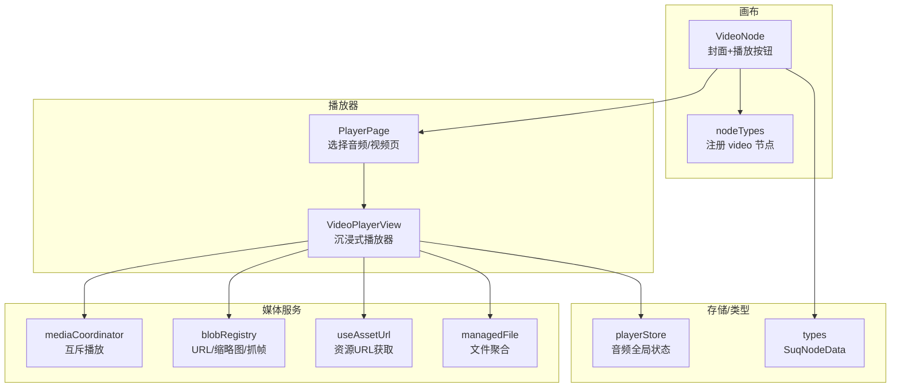
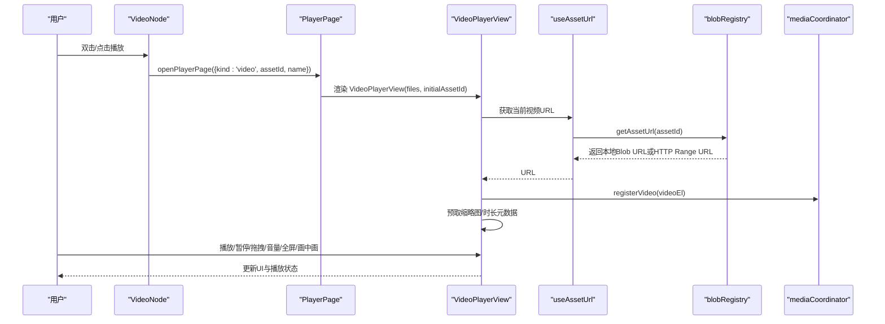
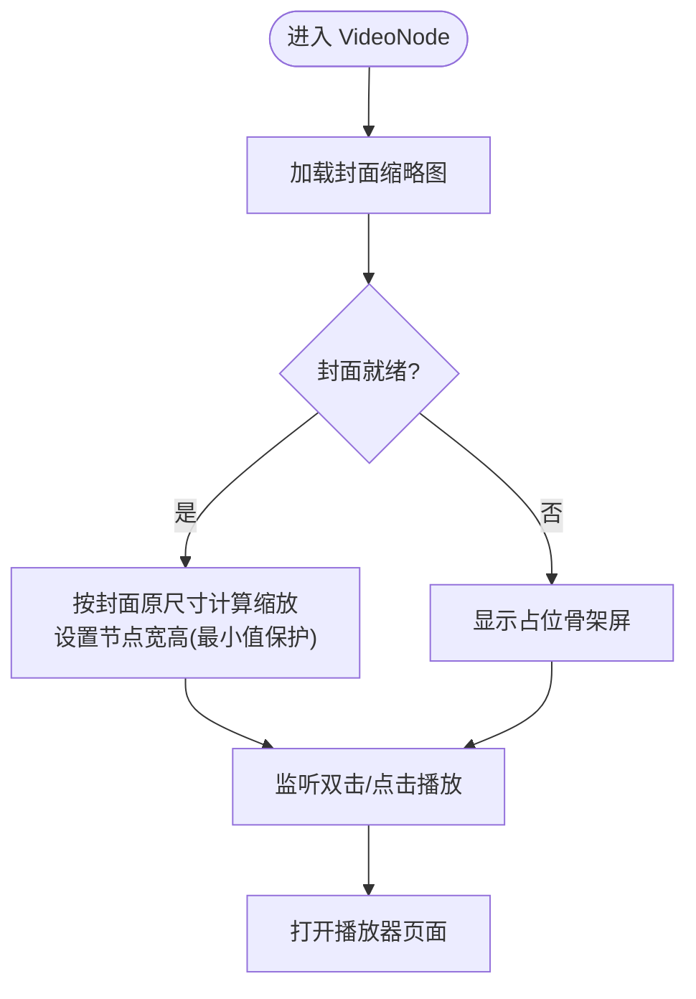
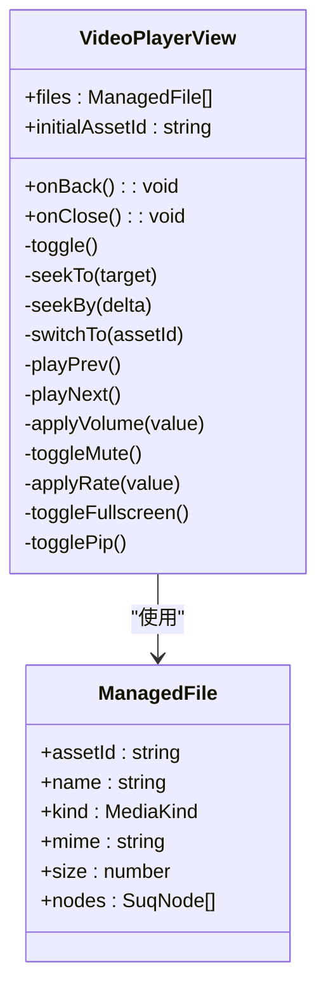
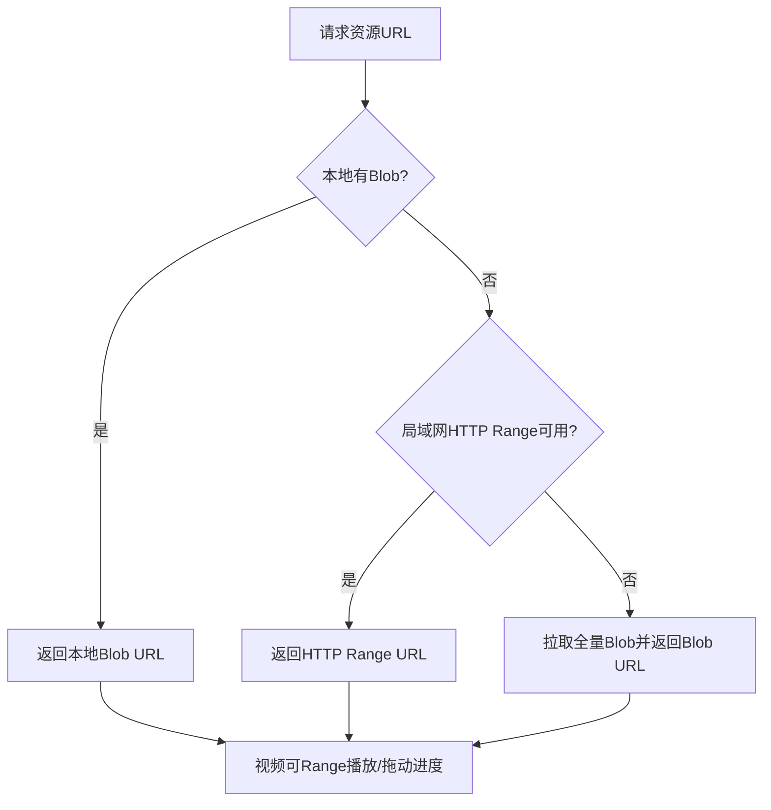
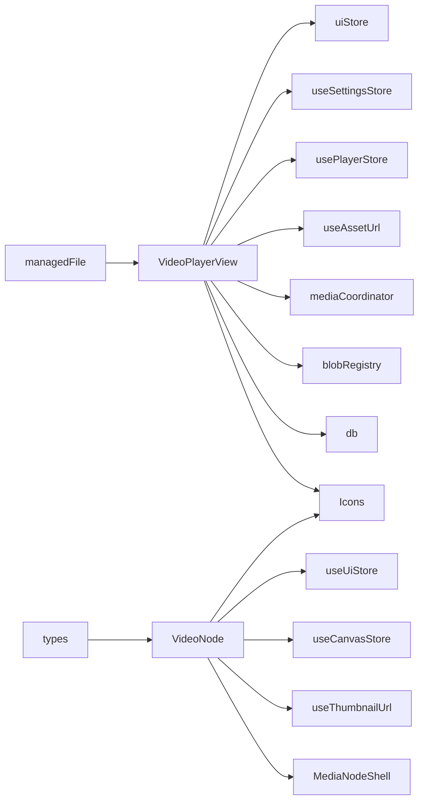

# 视频节点

<cite>
**本文引用的文件**
- [VideoNode.tsx](file://src/canvas/nodes/VideoNode.tsx)
- [VideoPlayer.tsx](file://src/components/VideoPlayer.tsx)
- [nodeTypes.ts](file://src/canvas/nodes/nodeTypes.ts)
- [mediaCoordinator.ts](file://src/media/mediaCoordinator.ts)
- [blobRegistry.ts](file://src/media/blobRegistry.ts)
- [useAssetUrl.ts](file://src/media/useAssetUrl.ts)
- [managedFile.ts](file://src/media/managedFile.ts)
- [playerStore.ts](file://src/store/playerStore.ts)
- [PlayerPage.tsx](file://src/components/PlayerPage.tsx)
- [types.ts](file://src/types.ts)
</cite>

## 目录
1. [简介](#简介)
2. [项目结构](#项目结构)
3. [核心组件](#核心组件)
4. [架构总览](#架构总览)
5. [详细组件分析](#详细组件分析)
6. [依赖关系分析](#依赖关系分析)
7. [性能考量](#性能考量)
8. [故障排查指南](#故障排查指南)
9. [结论](#结论)
10. [附录：配置与使用示例](#附录配置与使用示例)

## 简介
本章节面向“视频节点”的完整能力说明，覆盖画布上的 VideoNode 展示与交互、全屏沉浸式播放器 VideoPlayerView 的功能特性（播放控制、进度条、音量、倍速、全屏、画中画、列表导航）、资源加载策略（本地缓存、局域网 HTTP Range 流式拉取、云端回退）、封面缩略图生成与缓存、以及错误处理与用户体验优化。文档同时给出配置项说明与使用示例，帮助快速集成与排障。

## 项目结构
围绕视频功能的关键文件组织如下：
- 画布节点层：VideoNode 负责在画布上显示封面与播放按钮，双击或点击打开播放器页面。
- 播放器视图层：VideoPlayerView 提供沉浸式播放界面，包含自定义控制栏、进度拖拽、音量调节、倍速、全屏、画中画、视频列表等。
- 媒体协调层：mediaCoordinator 保证同一时刻仅一个视频元素播放；blobRegistry 管理资源 URL、缩略图抓取与缓存；useAssetUrl 封装资源 URL 获取与重试。
- 数据与状态：managedFile 聚合画布节点与素材记录；playerStore 管理音频全局状态（视频页内独立状态）；types 定义节点数据类型。
- 页面路由：PlayerPage 根据当前播放器类型渲染 Audio 或 Video 播放器页面。

图表来源
- [VideoNode.tsx:1-88](file://src/canvas/nodes/VideoNode.tsx#L1-L88)
- [VideoPlayer.tsx:58-800](file://src/components/VideoPlayer.tsx#L58-L800)
- [nodeTypes.ts:1-27](file://src/canvas/nodes/nodeTypes.ts#L1-L27)
- [mediaCoordinator.ts:1-25](file://src/media/mediaCoordinator.ts#L1-L25)
- [blobRegistry.ts:84-126](file://src/media/blobRegistry.ts#L84-L126)
- [useAssetUrl.ts:10-44](file://src/media/useAssetUrl.ts#L10-L44)
- [managedFile.ts:1-39](file://src/media/managedFile.ts#L1-L39)
- [playerStore.ts:1-298](file://src/store/playerStore.ts#L1-L298)
- [types.ts:66-106](file://src/types.ts#L66-L106)

章节来源
- [VideoNode.tsx:1-88](file://src/canvas/nodes/VideoNode.tsx#L1-L88)
- [VideoPlayer.tsx:58-800](file://src/components/VideoPlayer.tsx#L58-L800)
- [nodeTypes.ts:1-27](file://src/canvas/nodes/nodeTypes.ts#L1-L27)
- [mediaCoordinator.ts:1-25](file://src/media/mediaCoordinator.ts#L1-L25)
- [blobRegistry.ts:84-126](file://src/media/blobRegistry.ts#L84-L126)
- [useAssetUrl.ts:10-44](file://src/media/useAssetUrl.ts#L10-L44)
- [managedFile.ts:1-39](file://src/media/managedFile.ts#L1-L39)
- [playerStore.ts:1-298](file://src/store/playerStore.ts#L1-L298)
- [types.ts:66-106](file://src/types.ts#L66-L106)

## 核心组件
- VideoNode：画布中的视频节点，不内嵌原生播放器以避免指针抢占影响拖拽；显示封面缩略图与播放按钮；双击或点击打开全屏播放器页面；根据封面原尺寸自适应节点宽高。
- VideoPlayerView：沉浸式播放器，支持播放/暂停、快退/快进、进度条拖拽、音量调节、静音切换、倍速播放、上一集/下一集、全屏、画中画、下载、键盘快捷键、右侧视频列表搜索与筛选。
- mediaCoordinator：全局媒体互斥，确保同一时刻最多一个视频元素播放，避免多实例冲突。
- blobRegistry：资源 URL 获取（优先本地 Blob，其次局域网 HTTP Range 流式地址，最后兜底全量拉取），缩略图抓取与缓存，并发控制与跨源安全处理。
- useAssetUrl：封装资源 URL 获取与重试机制，适配局域网传输等待场景。
- managedFile：将画布节点与素材记录聚合为可管理的文件列表，供播放器渲染列表与元信息。
- playerStore：全局音频播放器状态（视频播放器内部独立状态，但关闭时恢复音频悬浮窗可见性）。
- PlayerPage：根据当前播放器类型渲染对应播放器页面。

章节来源
- [VideoNode.tsx:13-88](file://src/canvas/nodes/VideoNode.tsx#L13-L88)
- [VideoPlayer.tsx:53-800](file://src/components/VideoPlayer.tsx#L53-L800)
- [mediaCoordinator.ts:1-25](file://src/media/mediaCoordinator.ts#L1-L25)
- [blobRegistry.ts:84-126](file://src/media/blobRegistry.ts#L84-L126)
- [useAssetUrl.ts:10-44](file://src/media/useAssetUrl.ts#L10-L44)
- [managedFile.ts:17-39](file://src/media/managedFile.ts#L17-L39)
- [playerStore.ts:163-298](file://src/store/playerStore.ts#L163-L298)
- [PlayerPage.tsx:62-100](file://src/components/PlayerPage.tsx#L62-L100)

## 架构总览
视频播放从画布节点到播放器页面的关键流程：
- 用户在画布双击 VideoNode 或点击播放按钮，调用 UI 状态打开播放器页面。
- PlayerPage 根据 kind=video 渲染 VideoPlayerView，并传入 files（由 managedFile 聚合）与 initialAssetId。
- VideoPlayerView 通过 useAssetUrl 获取当前视频的 URL（可能来自本地 Blob 或局域网 HTTP Range 流式地址）。
- 视频元素注册到 mediaCoordinator，实现互斥播放；同时批量预取缩略图与时长元数据。
- 用户交互（播放/暂停、进度拖拽、音量、倍速、全屏、画中画、列表切换）驱动播放器状态更新与底层 HTMLMediaElement 操作。

图表来源
- [VideoNode.tsx:25-28](file://src/canvas/nodes/VideoNode.tsx#L25-L28)
- [PlayerPage.tsx:62-100](file://src/components/PlayerPage.tsx#L62-L100)
- [VideoPlayer.tsx:58-183](file://src/components/VideoPlayer.tsx#L58-L183)
- [useAssetUrl.ts:10-44](file://src/media/useAssetUrl.ts#L10-L44)
- [blobRegistry.ts:84-126](file://src/media/blobRegistry.ts#L84-L126)
- [mediaCoordinator.ts:1-25](file://src/media/mediaCoordinator.ts#L1-L25)

## 详细组件分析

### VideoNode：画布视频节点
- 展示封面缩略图与播放按钮，不内嵌播放器以避免指针事件冲突。
- 双击或点击播放按钮打开全屏播放器页面。
- 根据封面图片自然尺寸计算缩放比例，设置节点宽高，保持最小尺寸限制。
- 使用 MediaNodeShell 包裹，统一节点外壳行为。

图表来源
- [VideoNode.tsx:30-49](file://src/canvas/nodes/VideoNode.tsx#L30-L49)
- [VideoNode.tsx:51-88](file://src/canvas/nodes/VideoNode.tsx#L51-L88)

章节来源
- [VideoNode.tsx:13-88](file://src/canvas/nodes/VideoNode.tsx#L13-L88)

### VideoPlayerView：沉浸式播放器
- 播放控制：播放/暂停、快退/快进、进度条拖拽、时间显示、缓冲进度。
- 音量与静音：滑块调节、键盘上下键、M 键静音切换。
- 倍速：下拉菜单选择预设倍速。
- 全屏与画中画：全屏切换、画中画模式（浏览器支持检测与提示）。
- 列表导航：上一集/下一集、右侧列表搜索过滤、自动定位初始视频。
- 键盘快捷键：空格播放/暂停、左右箭头快退快进、上下箭头音量、F 全屏、L 列表、Esc 退出。
- 下载：下载当前视频文件。
- 主题：早晚主题切换。
- 自动播放：首次进入或切换视频后尝试自动播放，失败静默处理。
- 互斥播放：注册到 mediaCoordinator，与其他视频元素互斥。

图表来源
- [VideoPlayer.tsx:58-183](file://src/components/VideoPlayer.tsx#L58-L183)
- [managedFile.ts:4-11](file://src/media/managedFile.ts#L4-L11)

章节来源
- [VideoPlayer.tsx:53-800](file://src/components/VideoPlayer.tsx#L53-L800)
- [managedFile.ts:17-39](file://src/media/managedFile.ts#L17-L39)

### 媒体协调与资源加载
- mediaCoordinator：维护视频元素集合，任一元素触发 play 时暂停其他同类型元素，实现互斥播放。
- blobRegistry：
  - getAssetUrl：优先本地 Blob URL，其次局域网 HTTP Range 流式地址（边下边播、可拖动进度），最后兜底全量拉取。
  - getThumbnailUrl：批量预取缩略图，支持跨源抓取、黑帧检测与重试、并发限制、缓存与失效。
  - ensureVideoThumbnail：通过创建隐藏 video 元素抓取画面，必要时 fallback 到全量 Blob 再抓帧。
- useAssetUrl：封装 URL 获取与重试逻辑，适配局域网传输等待场景，失败时提示。

图表来源
- [blobRegistry.ts:84-126](file://src/media/blobRegistry.ts#L84-L126)
- [useAssetUrl.ts:10-44](file://src/media/useAssetUrl.ts#L10-L44)

章节来源
- [mediaCoordinator.ts:1-25](file://src/media/mediaCoordinator.ts#L1-L25)
- [blobRegistry.ts:84-126](file://src/media/blobRegistry.ts#L84-L126)
- [blobRegistry.ts:128-239](file://src/media/blobRegistry.ts#L128-L239)
- [blobRegistry.ts:310-379](file://src/media/blobRegistry.ts#L310-L379)
- [useAssetUrl.ts:10-44](file://src/media/useAssetUrl.ts#L10-L44)

### 播放状态管理与错误处理
- 播放状态：playing、time、duration、buffered、volume、muted、rate、fullscreen、pip、controlsVisible、listOpen、rateMenuOpen、query、seekDragging、dragTime。
- 错误处理：
  - 资源加载失败：useAssetUrl 捕获异常并 toast 提示；缩略图抓取失败跳过或重试。
  - 画中画不支持：toast 提示当前浏览器不支持画中画。
  - 下载失败：toast 提示下载失败。
  - 自动播放失败：静默 catch，避免阻塞。
- 互斥播放：mediaCoordinator 确保同一时刻仅一个视频元素播放。

章节来源
- [VideoPlayer.tsx:166-183](file://src/components/VideoPlayer.tsx#L166-L183)
- [VideoPlayer.tsx:284-293](file://src/components/VideoPlayer.tsx#L284-L293)
- [VideoPlayer.tsx:461-475](file://src/components/VideoPlayer.tsx#L461-L475)
- [blobRegistry.ts:310-379](file://src/media/blobRegistry.ts#L310-L379)
- [mediaCoordinator.ts:1-25](file://src/media/mediaCoordinator.ts#L1-L25)

### 交互行为
- 点击播放/暂停：视频区域点击切换播放/暂停；底部控制栏播放按钮同样生效。
- 拖拽调整大小：VideoNode 根据封面原尺寸自适应节点宽高；拖拽节点本身由画布框架处理（VideoNode 中禁用图片拖拽避免干扰）。
- 时间轴跳转：进度条支持指针拖拽与键盘方向键微调；拖拽过程中实时预览时间，松开后跳转。
- 列表切换：上一集/下一集、右侧列表点击切换；搜索过滤名称与创建者。
- 全屏与画中画：全屏切换；画中画模式切换（支持检测与提示）。
- 键盘快捷键：空格、左右箭头、上下箭头、M、F、L、Esc。

章节来源
- [VideoNode.tsx:51-88](file://src/canvas/nodes/VideoNode.tsx#L51-L88)
- [VideoPlayer.tsx:196-250](file://src/components/VideoPlayer.tsx#L196-L250)
- [VideoPlayer.tsx:426-458](file://src/components/VideoPlayer.tsx#L426-L458)
- [VideoPlayer.tsx:374-424](file://src/components/VideoPlayer.tsx#L374-L424)

### 字幕支持
- 当前代码未实现字幕轨道加载与显示逻辑（无 track 元素或字幕相关 UI）。如需支持，可在 video 元素中添加 track 标签并在 UI 中提供字幕开关与样式控制。

[本节为概念性说明，不直接分析具体文件]

## 依赖关系分析
- VideoNode 依赖：
  - MediaNodeShell：节点外壳。
  - useThumbnailUrl：封面缩略图 URL。
  - useCanvasStore：节点变更（dimensions）。
  - useUiStore：打开播放器页面。
  - Icons：播放图标。
- VideoPlayerView 依赖：
  - Icons：各类控制图标。
  - db：数据库访问（下载文件名）。
  - blobRegistry：资源 URL 与缩略图。
  - mediaCoordinator：互斥播放。
  - useAssetUrl：资源 URL。
  - usePlayerStore：音频播放器状态（用于隐藏/恢复音频悬浮窗）。
  - useSettingsStore：主题切换。
  - uiStore：toast 提示。
- 数据流：
  - managedFile 聚合节点与素材记录，供播放器渲染列表。
  - types 定义节点数据结构（kind、assetId、label、mime 等）。

图表来源
- [VideoNode.tsx:1-88](file://src/canvas/nodes/VideoNode.tsx#L1-L88)
- [VideoPlayer.tsx:1-800](file://src/components/VideoPlayer.tsx#L1-L800)
- [managedFile.ts:1-39](file://src/media/managedFile.ts#L1-L39)
- [types.ts:66-106](file://src/types.ts#L66-L106)

章节来源
- [VideoNode.tsx:1-88](file://src/canvas/nodes/VideoNode.tsx#L1-L88)
- [VideoPlayer.tsx:1-800](file://src/components/VideoPlayer.tsx#L1-L800)
- [managedFile.ts:1-39](file://src/media/managedFile.ts#L1-L39)
- [types.ts:66-106](file://src/types.ts#L66-L106)

## 性能考量
- 懒加载大文件：画布节点不内嵌播放器，仅在打开播放器时按需拉取视频资源，避免画布卡顿。
- 流式播放：局域网 HTTP Range 支持边下边播与拖动进度，减少内存与磁盘压力。
- 缩略图并发控制：抓帧并发上限为 2，避免多个隐藏 video 同时 seek 占用连接池导致播放阻塞。
- 封面缓存：缩略图 URL 与 Blob 缓存，避免重复抓取；局域网同步封面优先，减少解码开销。
- 自动播放失败静默处理：避免阻塞主流程。
- 主题与 UI 性能：全屏时控制栏随鼠标移动显示/隐藏，减少常驻渲染开销。

章节来源
- [blobRegistry.ts:20-39](file://src/media/blobRegistry.ts#L20-L39)
- [blobRegistry.ts:310-379](file://src/media/blobRegistry.ts#L310-L379)
- [VideoPlayer.tsx:350-372](file://src/components/VideoPlayer.tsx#L350-L372)

## 故障排查指南
- 资源加载失败：
  - 检查 useAssetUrl 的重试逻辑与 toast 提示；确认局域网连接与资源是否就绪。
  - 若为局域网资源，确认服务器已推送 asset-http 与 asset-thumb。
- 缩略图生成失败：
  - 检查跨源 CORS 头（Access-Control-Allow-Origin）；确认服务器允许匿名跨源请求。
  - 黑帧检测可能导致多次重试，关注 tryCapture 与 onseeked 回调。
- 画中画不支持：
  - 浏览器不支持时 toast 提示；建议升级浏览器或使用全屏模式。
- 下载失败：
  - 检查数据库记录是否存在；确认 URL 可访问。
- 互斥播放冲突：
  - 确认 mediaCoordinator 正确注册视频元素；检查是否有多个视频元素同时播放。

章节来源
- [useAssetUrl.ts:10-44](file://src/media/useAssetUrl.ts#L10-L44)
- [blobRegistry.ts:128-239](file://src/media/blobRegistry.ts#L128-L239)
- [VideoPlayer.tsx:284-293](file://src/components/VideoPlayer.tsx#L284-L293)
- [VideoPlayer.tsx:461-475](file://src/components/VideoPlayer.tsx#L461-L475)
- [mediaCoordinator.ts:1-25](file://src/media/mediaCoordinator.ts#L1-L25)

## 结论
VideoNode 与 VideoPlayerView 共同构成了完整的视频节点解决方案：画布节点轻量展示与交互，播放器页面提供丰富的控制与体验。通过资源懒加载、流式播放、缩略图缓存与并发控制，系统在性能与可用性之间取得平衡。未来可扩展字幕支持、更多编码格式兼容与更精细的错误恢复策略。

[本节为总结性内容，不直接分析具体文件]

## 附录：配置与使用示例

### 视频节点配置选项
- 节点数据（SuqNodeData）：
  - kind: 'video'
  - assetId: 资源 ID
  - label: 显示名称（默认“视频”）
  - mime: 媒体类型（如 video/mp4）
  - fileSize: 文件大小
  - width/height: 节点尺寸（可由封面自适应）
- 播放器页面参数：
  - files: 视频文件列表（ManagedFile[]）
  - initialAssetId: 初始播放视频 ID
  - onBack/onClose: 返回/关闭回调

章节来源
- [types.ts:66-106](file://src/types.ts#L66-L106)
- [managedFile.ts:4-11](file://src/media/managedFile.ts#L4-L11)
- [PlayerPage.tsx:62-100](file://src/components/PlayerPage.tsx#L62-L100)

### 使用示例
- 在画布添加视频节点：
  - 设置 node.type = 'video'
  - 设置 data.kind = 'video'
  - 设置 data.assetId 指向已有资源
  - 可选设置 data.label、data.mime、data.fileSize
- 双击节点或点击播放按钮：
  - 打开 PlayerPage，渲染 VideoPlayerView
  - 自动加载封面与资源 URL
  - 支持播放控制、进度拖拽、音量调节、倍速、全屏、画中画、列表导航
- 键盘快捷键：
  - 空格：播放/暂停
  - 左右箭头：快退/快进
  - 上下箭头：音量调节
  - M：静音切换
  - F：全屏切换
  - L：列表显示/隐藏
  - Esc：退出全屏/列表/菜单或关闭播放器

章节来源
- [VideoNode.tsx:25-28](file://src/canvas/nodes/VideoNode.tsx#L25-L28)
- [VideoPlayer.tsx:374-424](file://src/components/VideoPlayer.tsx#L374-L424)
- [PlayerPage.tsx:62-100](file://src/components/PlayerPage.tsx#L62-L100)

### 支持的格式与编码
- 容器格式：基于浏览器原生 <video> 支持，常见包括 MP4、WebM、OGG。
- 编码格式：取决于浏览器与平台解码能力（如 H.264、VP9、AV1 等）。
- 资源来源：本地 Blob、局域网 HTTP Range 流式地址、云端回退。
- 注意：不同浏览器对编解码器支持存在差异，建议在目标环境中测试兼容性。

章节来源
- [blobRegistry.ts:84-126](file://src/media/blobRegistry.ts#L84-L126)
- [VideoPlayer.tsx:587-607](file://src/components/VideoPlayer.tsx#L587-L607)