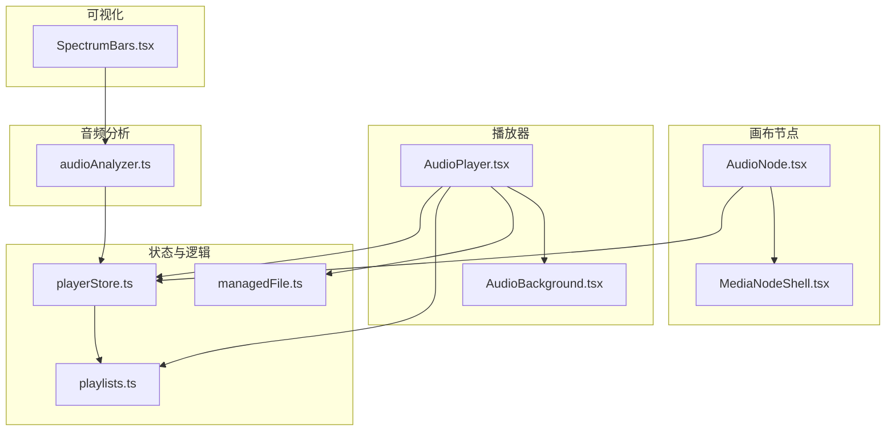
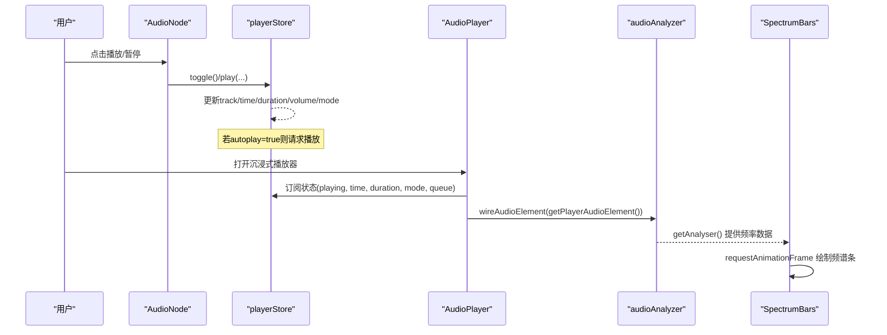
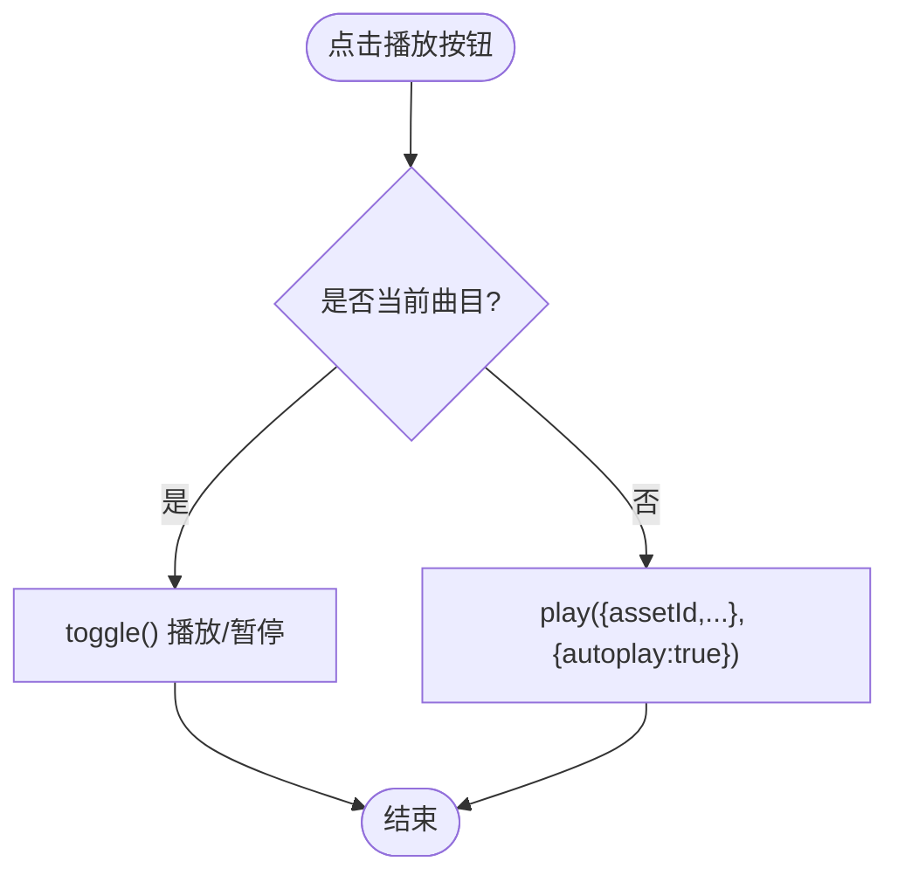
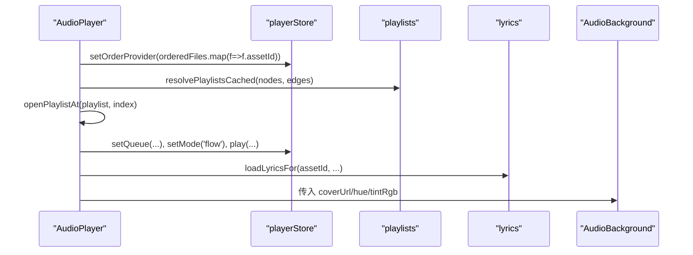
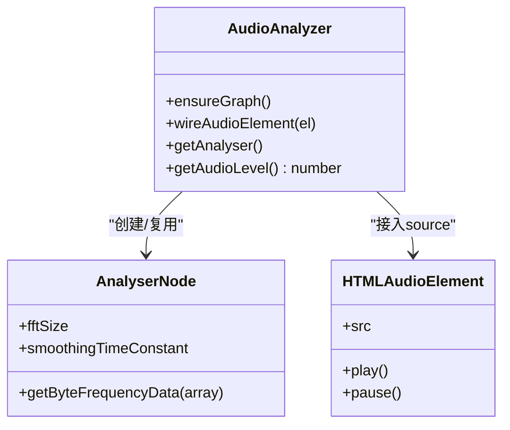
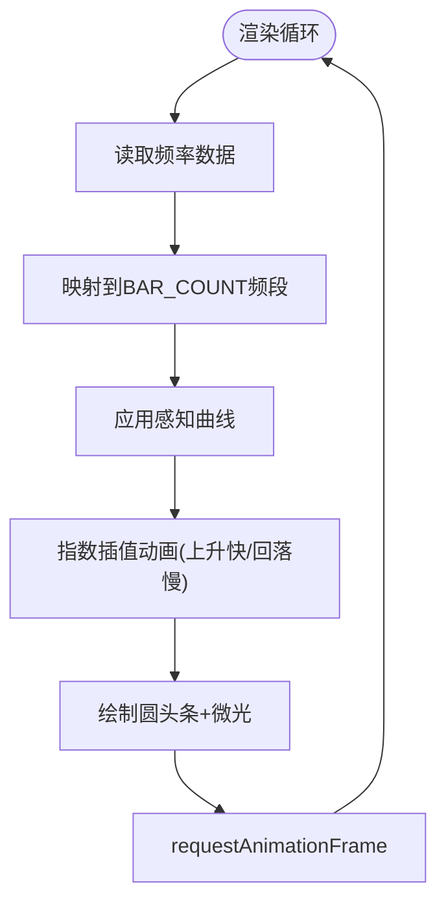
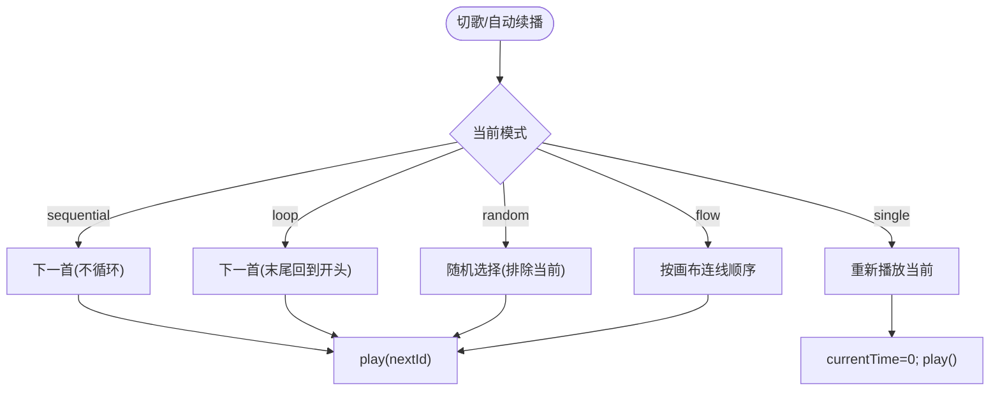
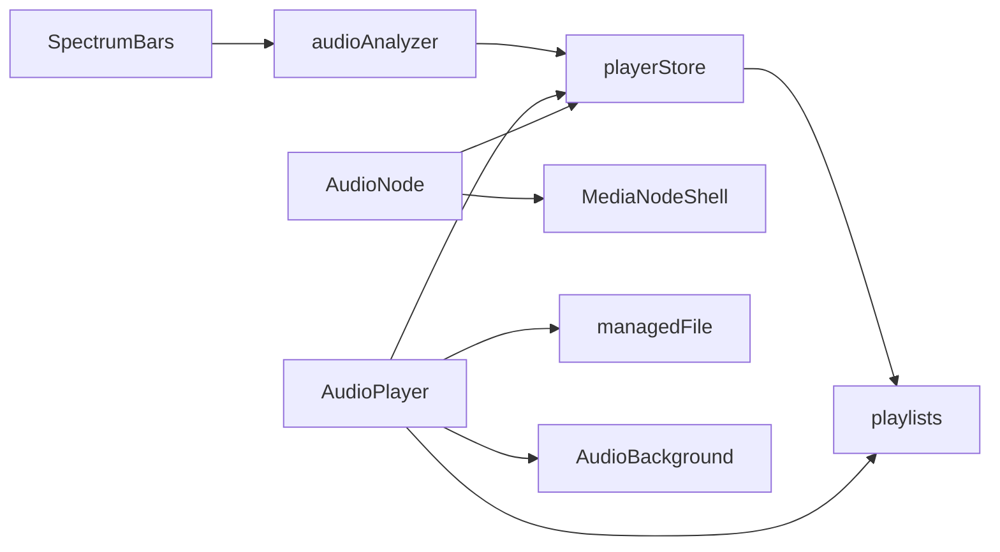

# 音频节点

<cite>
**本文引用的文件**
- [AudioNode.tsx](file://src/canvas/nodes/AudioNode.tsx)
- [MediaNodeShell.tsx](file://src/canvas/nodes/MediaNodeShell.tsx)
- [AudioPlayer.tsx](file://src/components/AudioPlayer.tsx)
- [audioAnalyzer.ts](file://src/media/audioAnalyzer.ts)
- [SpectrumBars.tsx](file://src/components/SpectrumBars.tsx)
- [playerStore.ts](file://src/store/playerStore.ts)
- [playlists.ts](file://src/media/playlists.ts)
- [managedFile.ts](file://src/media/managedFile.ts)
- [AudioBackground.tsx](file://src/components/AudioBackground.tsx)
</cite>

## 目录
1. [简介](#简介)
2. [项目结构](#项目结构)
3. [核心组件](#核心组件)
4. [架构总览](#架构总览)
5. [详细组件分析](#详细组件分析)
6. [依赖关系分析](#依赖关系分析)
7. [性能考量](#性能考量)
8. [故障排查指南](#故障排查指南)
9. [结论](#结论)
10. [附录：使用示例与配置选项](#附录使用示例与配置选项)

## 简介
本章节面向“音频节点”的完整能力说明，涵盖以下目标：
- 音频加载与控制：从画布节点触发播放、暂停、下载、进入沉浸式播放器。
- 频谱可视化分析：基于 Web Audio API 的实时频率数据获取与渲染。
- 播放列表管理：基于画布连线解析歌单顺序，支持顺序、随机、列表循环、单曲循环、流式播放。
- 循环播放模式：不同模式的切换与行为差异。
- 音频分析器 audioAnalyzer：将当前 <audio> 元素接入 AnalyserNode，提供频率数据与音量级。
- 播放器组件 AudioPlayer：播放控制界面、进度显示、音量调节、歌词与专辑背景。
- 频谱可视化组件 SpectrumBars：音频数据渲染、动画效果、性能优化。
- 使用示例与配置选项：如何在画布中插入音频节点并配置播放行为。

## 项目结构
围绕音频能力的核心文件组织如下：
- 画布节点层：AudioNode（音频节点）、MediaNodeShell（媒体节点外壳）
- 播放器层：AudioPlayer（沉浸式播放器）、AudioBackground（背景封面与渐变）
- 音频分析层：audioAnalyzer（Web Audio 分析器封装）
- 可视化层：SpectrumBars（频谱条）
- 状态与逻辑层：playerStore（全局播放引擎）、playlists（画布连线解析歌单）、managedFile（文件元信息）

**图表来源**
- [AudioNode.tsx:18-70](file://src/canvas/nodes/AudioNode.tsx#L18-L70)
- [MediaNodeShell.tsx:32-151](file://src/canvas/nodes/MediaNodeShell.tsx#L32-L151)
- [AudioPlayer.tsx:142-170](file://src/components/AudioPlayer.tsx#L142-L170)
- [audioAnalyzer.ts:1-59](file://src/media/audioAnalyzer.ts#L1-L59)
- [SpectrumBars.tsx:1-120](file://src/components/SpectrumBars.tsx#L1-L120)
- [playerStore.ts:1-116](file://src/store/playerStore.ts#L1-L116)
- [playlists.ts:1-179](file://src/media/playlists.ts#L1-L179)
- [managedFile.ts:1-39](file://src/media/managedFile.ts#L1-L39)

**章节来源**
- [AudioNode.tsx:18-70](file://src/canvas/nodes/AudioNode.tsx#L18-L70)
- [MediaNodeShell.tsx:32-151](file://src/canvas/nodes/MediaNodeShell.tsx#L32-L151)
- [AudioPlayer.tsx:142-170](file://src/components/AudioPlayer.tsx#L142-L170)
- [audioAnalyzer.ts:1-59](file://src/media/audioAnalyzer.ts#L1-L59)
- [SpectrumBars.tsx:1-120](file://src/components/SpectrumBars.tsx#L1-L120)
- [playerStore.ts:1-116](file://src/store/playerStore.ts#L1-L116)
- [playlists.ts:1-179](file://src/media/playlists.ts#L1-L179)
- [managedFile.ts:1-39](file://src/media/managedFile.ts#L1-L39)

## 核心组件
- 音频节点 AudioNode：在画布中展示音频卡片，支持播放/暂停、下载、双击进入沉浸式播放器；显示当前曲目的进度遮罩。
- 播放器 AudioPlayer：沉浸式全屏播放器，提供队列、搜索、排序、播放模式切换、歌词、专辑背景、键盘快捷键等。
- 音频分析器 audioAnalyzer：单例 Web Audio 上下文与分析器，将当前 <audio> 元素接入 AnalyserNode，提供频率数据与归一化音量级。
- 频谱条 SpectrumBars：Canvas 绘制 44 根圆头条，随音乐节奏跳动，颜色跟随封面主色相，具备上升快回落慢的动画曲线与微光效果。
- 播放引擎 playerStore：全局唯一播放状态机，负责加载、播放、暂停、跳转、切歌、模式切换、队列管理等。
- 歌单 playlists：基于画布连线解析命名文本节点指向的音频链，生成稳定一致的播放顺序。
- 文件 managedFile：聚合资产与节点信息，过滤 MP3 文件用于播放器列表。

**章节来源**
- [AudioNode.tsx:18-70](file://src/canvas/nodes/AudioNode.tsx#L18-L70)
- [AudioPlayer.tsx:142-170](file://src/components/AudioPlayer.tsx#L142-L170)
- [audioAnalyzer.ts:1-59](file://src/media/audioAnalyzer.ts#L1-L59)
- [SpectrumBars.tsx:1-120](file://src/components/SpectrumBars.tsx#L1-L120)
- [playerStore.ts:1-116](file://src/store/playerStore.ts#L1-L116)
- [playlists.ts:1-179](file://src/media/playlists.ts#L1-L179)
- [managedFile.ts:1-39](file://src/media/managedFile.ts#L1-L39)

## 架构总览
整体数据流与控制流如下：
- 用户在画布点击音频节点 → 调用 playerStore.play() → 设置 track 并加载 URL → 通过 GlobalPlayer 的 <audio> 发声。
- 播放器打开时注册 orderProvider，使 next/prev/自动续播基于当前列表或画布连线顺序。
- 频谱与背景通过 audioAnalyzer 读取 AnalyserNode 的频率数据，驱动 SpectrumBars 与 AudioBackground 动画。
- 歌单由 playlists 模块解析画布连线，保证“流式播放”与“画布自动切歌”的顺序一致。

**图表来源**
- [AudioNode.tsx:34-47](file://src/canvas/nodes/AudioNode.tsx#L34-L47)
- [playerStore.ts:174-209](file://src/store/playerStore.ts#L174-L209)
- [AudioPlayer.tsx:241-248](file://src/components/AudioPlayer.tsx#L241-L248)
- [audioAnalyzer.ts:26-47](file://src/media/audioAnalyzer.ts#L26-L47)
- [SpectrumBars.tsx:28-31](file://src/components/SpectrumBars.tsx#L28-L31)

## 详细组件分析

### 音频节点 AudioNode
- 功能要点
  - 根据当前引擎曲目是否匹配节点 assetId 决定是否显示进度与时间。
  - 点击按钮：若当前就是该曲目则切换播放/暂停；否则以 autoplay=true 播放该曲目。
  - 下载：通过 getAssetUrl 获取资源地址并创建临时 a 标签触发下载。
  - 双击：打开沉浸式播放器页面，并标记为“流式模式”。
  - 进度遮罩：由 MediaNodeShell 渲染，仅展示不可拖动。
- 关键交互路径
  - 播放/暂停：调用 usePlayerStore.getState().toggle() 或 .play(...)
  - 下载：getAssetUrl + db.assets.get + 动态 a 标签
  - 打开播放器：useUiStore.openPlayerPage({ kind: 'audio', assetId, flow: true })

**图表来源**
- [AudioNode.tsx:34-47](file://src/canvas/nodes/AudioNode.tsx#L34-L47)

**章节来源**
- [AudioNode.tsx:18-70](file://src/canvas/nodes/AudioNode.tsx#L18-L70)
- [MediaNodeShell.tsx:109-139](file://src/canvas/nodes/MediaNodeShell.tsx#L109-L139)

### 播放器 AudioPlayer
- 功能要点
  - 歌曲列表：过滤 MP3，支持按标题/导入人排序与关键词搜索。
  - 歌单：从画布解析命名文本节点指向的音频链，支持展开预览与从指定索引起播。
  - 播放模式：顺序、随机、列表循环、单曲循环、流式播放；离开流式即退出队列。
  - 歌词：支持本地 .lrc 与在线歌词源，支持偏移调整与文字颜色模式（自动/浅色/深色）。
  - 专辑背景：收集与当前音频连线的图片作为背景，多张封面每 5 秒轮换。
  - 键盘快捷键：空格播放/暂停、左右快退快进、上下音量、L 喜欢。
  - 进度与音量：seekTo/seekBy、setVolume、muted。
- 重要流程
  - 打开时注册 orderProvider，使导航基准为当前列表或画布连线顺序。
  - 从画布歌单入口进入时设置队列并按歌单顺序起播。
  - 悬浮窗入口在播放器已打开时切换到目标歌曲。

**图表来源**
- [AudioPlayer.tsx:241-248](file://src/components/AudioPlayer.tsx#L241-L248)
- [AudioPlayer.tsx:337-352](file://src/components/AudioPlayer.tsx#L337-L352)
- [AudioPlayer.tsx:491-515](file://src/components/AudioPlayer.tsx#L491-L515)
- [AudioPlayer.tsx:558-598](file://src/components/AudioPlayer.tsx#L558-L598)

**章节来源**
- [AudioPlayer.tsx:142-170](file://src/components/AudioPlayer.tsx#L142-L170)
- [AudioPlayer.tsx:377-419](file://src/components/AudioPlayer.tsx#L377-L419)
- [AudioPlayer.tsx:491-515](file://src/components/AudioPlayer.tsx#L491-L515)
- [AudioPlayer.tsx:558-598](file://src/components/AudioPlayer.tsx#L558-L598)

### 音频分析器 audioAnalyzer
- 工作原理
  - 单例 AudioContext + AnalyserNode，FFT 大小 512，平滑常数 0.5 提升响应灵敏度。
  - wireAudioElement：将当前 <audio> 元素接入 MediaElementSourceNode，连接至 AnalyserNode 再输出到 destination。
  - getAnalyser：返回共享的 AnalyserNode 供可视化读取频率数据。
  - getAudioLevel：计算归一化音量级（0..1），用于波纹幅度等视觉反馈。
- 注意事项
  - 每个 <audio> 元素只接入一次（WeakSet 去重）。
  - 某些环境不支持时静默降级，不影响动画。

**图表来源**
- [audioAnalyzer.ts:8-20](file://src/media/audioAnalyzer.ts#L8-L20)
- [audioAnalyzer.ts:26-47](file://src/media/audioAnalyzer.ts#L26-L47)
- [audioAnalyzer.ts:49-59](file://src/media/audioAnalyzer.ts#L49-L59)

**章节来源**
- [audioAnalyzer.ts:1-59](file://src/media/audioAnalyzer.ts#L1-L59)

### 频谱可视化 SpectrumBars
- 实现要点
  - Canvas 绘制 44 根圆头条，宽度与间距根据容器尺寸与 DPR 自适应。
  - 频率采样：从 AnalyserNode 取 frequencyBinCount 数据，映射到 BAR_COUNT 个频段。
  - 感知曲线：对幅度进行幂次变换增强中小频段的可见度。
  - 动画曲线：上升快（系数 12）、回落慢（系数 8），保持自然律动。
  - 颜色与微光：颜色基于封面主色相 hue，高度较大时绘制半透明外发光。
  - 静音/暂停基线：保留最低高度，避免完全消失。
  - 性能优化：ResizeObserver 监听尺寸变化；requestAnimationFrame 节流；dpr 上限 2；仅在必要时重绘。

**图表来源**
- [SpectrumBars.tsx:33-112](file://src/components/SpectrumBars.tsx#L33-L112)

**章节来源**
- [SpectrumBars.tsx:1-120](file://src/components/SpectrumBars.tsx#L1-L120)

### 播放列表管理与循环模式
- 歌单解析规则
  - 命名文本节点（无入边、恰好一条出边指向音频）作为歌单名。
  - 从首节点沿“音频→音频”出边做 DFS 先序遍历，分叉处按边 order 升序，未设置 order 的排在后面，再按创建顺序稳定排序。
  - 环/重复节点只遍历一次，同一 assetId 在歌单中只保留第一次出现。
  - 非音频节点不穿透，只有音频直连边参与。
- 播放模式
  - sequential：顺序播放
  - loop：列表循环
  - single：单曲循环
  - random：随机播放
  - flow：流式播放（基于画布连线顺序）
- 导航基准
  - 优先使用当前队列（flow 模式）
  - 其次使用播放器列表（打开时注册的 orderProvider）
  - 最后回退到画布连线顺序（linearizeFrom）

**图表来源**
- [playerStore.ts:132-157](file://src/store/playerStore.ts#L132-L157)
- [playerStore.ts:237-259](file://src/store/playerStore.ts#L237-L259)
- [playlists.ts:71-112](file://src/media/playlists.ts#L71-L112)

**章节来源**
- [playlists.ts:1-179](file://src/media/playlists.ts#L1-L179)
- [playerStore.ts:105-157](file://src/store/playerStore.ts#L105-L157)

### 音频播放器组件 AudioPlayer 的功能细化
- 播放控制界面：播放/暂停、上一首/下一首、模式切换、队列面板、搜索与排序。
- 进度显示：基于 currentTime/duration 计算百分比，支持 seekTo/seekBy。
- 音量调节：setVolume、muted，支持键盘上下键微调。
- 歌词与背景：歌词加载与偏移、封面收集与轮换、对比度自适应歌词颜色。
- 键盘快捷键：空格、方向键、L 键。

**章节来源**
- [AudioPlayer.tsx:142-170](file://src/components/AudioPlayer.tsx#L142-L170)
- [AudioPlayer.tsx:377-419](file://src/components/AudioPlayer.tsx#L377-L419)
- [AudioPlayer.tsx:491-515](file://src/components/AudioPlayer.tsx#L491-L515)
- [AudioPlayer.tsx:558-598](file://src/components/AudioPlayer.tsx#L558-L598)

## 依赖关系分析
- AudioNode 依赖 playerStore 控制播放，依赖 MediaNodeShell 渲染外壳与进度遮罩。
- AudioPlayer 依赖 playerStore、playlists、managedFile、AudioBackground、SpectrumBars。
- SpectrumBars 依赖 audioAnalyzer 获取频率数据，依赖 playerStore 获取当前音频元素。
- playerStore 依赖 playlists 解析画布连线顺序，依赖 canvasStore 获取节点/边。
- audioAnalyzer 依赖浏览器 Web Audio API，对不支持的环境静默降级。

**图表来源**
- [AudioNode.tsx:18-70](file://src/canvas/nodes/AudioNode.tsx#L18-L70)
- [AudioPlayer.tsx:142-170](file://src/components/AudioPlayer.tsx#L142-L170)
- [SpectrumBars.tsx:1-31](file://src/components/SpectrumBars.tsx#L1-L31)
- [playerStore.ts:1-116](file://src/store/playerStore.ts#L1-L116)
- [playlists.ts:1-179](file://src/media/playlists.ts#L1-L179)

**章节来源**
- [AudioNode.tsx:18-70](file://src/canvas/nodes/AudioNode.tsx#L18-L70)
- [AudioPlayer.tsx:142-170](file://src/components/AudioPlayer.tsx#L142-L170)
- [SpectrumBars.tsx:1-31](file://src/components/SpectrumBars.tsx#L1-L31)
- [playerStore.ts:1-116](file://src/store/playerStore.ts#L1-L116)
- [playlists.ts:1-179](file://src/media/playlists.ts#L1-L179)

## 性能考量
- 频谱条渲染
  - 使用 requestAnimationFrame 保证流畅动画。
  - ResizeObserver 监听容器尺寸变化，DPR 上限 2 避免过度像素缩放。
  - 指数插值减少抖动，提升视觉稳定性。
- 背景渲染
  - 仅在封面变化、淡入中或尺寸变化时重绘，静态时零开销。
  - 封面轮换采用交叉淡入，避免闪烁。
- 音频分析
  - FFT 大小 512 平衡精度与性能。
  - 平滑常数 0.5 提升可视化响应性。
  - WeakSet 确保每个 <audio> 元素只接入一次，避免重复连接。
- 播放引擎
  - 异步 URL 解析竞态令牌防止快速连续 play() 导致状态错乱。
  - 自动续播逻辑集中处理，避免多处重复判断。

[本节为通用性能讨论，无需特定文件引用]

## 故障排查指南
- 无法播放
  - 检查浏览器是否允许自动播放策略；首次交互后通常可恢复。
  - 确认 <audio> 元素已绑定到 playerStore（bindPlayerAudio）。
- 频谱条不跳动
  - 确认 wireAudioElement 已调用且 getPlayerAudioElement 返回有效元素。
  - 检查 AnalyserNode 是否可用；在不支持的环境中会静默降级。
- 歌词不同步
  - 检查歌词偏移设置是否正确；可在播放器中调整 lyricOffset。
  - 确认歌词源加载成功（本地 .lrc 或在线源）。
- 歌单顺序异常
  - 检查画布连线是否符合规则（音频→音频直连、order 设置、无环）。
  - 查看 playlists 解析结果中的 warnings，定位重复或循环问题。

**章节来源**
- [audioAnalyzer.ts:26-47](file://src/media/audioAnalyzer.ts#L26-L47)
- [playlists.ts:71-112](file://src/media/playlists.ts#L71-L112)
- [AudioPlayer.tsx:491-515](file://src/components/AudioPlayer.tsx#L491-L515)

## 结论
音频节点体系以 playerStore 为核心，串联画布节点、播放器、分析与可视化模块，实现了完整的音频播放体验。通过画布连线解析歌单，保证了“流式播放”的一致性；audioAnalyzer 与 SpectrumBars 提供了直观的频谱可视化；AudioPlayer 提供了丰富的控制与个性化能力。整体设计模块化清晰、扩展性强，适合在可视化画布场景中集成多媒体创作与演示。

[本节为总结性内容，无需特定文件引用]

## 附录：使用示例与配置选项

- 在画布中插入音频节点
  - 插入音频节点并关联资产（assetId）。
  - 可选：设置封面（coverAssetId）、名称（label）、边框色（borderColor）。
  - 双击节点进入沉浸式播放器，默认启用“流式播放”模式。

- 播放控制
  - 点击节点播放/暂停按钮：若当前曲目则切换；否则以 autoplay=true 播放。
  - 在播放器中切换模式：顺序、随机、列表循环、单曲循环、流式播放。
  - 使用键盘快捷键：空格播放/暂停、左右快退快进、上下音量、L 喜欢。

- 歌单配置
  - 创建一个命名文本节点（无入边、恰好一条出边指向音频），作为歌单名。
  - 从首节点开始，用音频节点之间的直连边构建播放顺序。
  - 在分叉处设置边的 order 控制优先级；未设置 order 的边排在后面。

- 频谱可视化
  - 打开播放器后，SpectrumBars 会自动接入当前 <audio> 元素并渲染频谱条。
  - 频谱条颜色随封面主色相变化，具备微光与基线效果。

- 下载与分享
  - 节点或播放器内均可下载当前音频；下载失败会提示错误。

**章节来源**
- [AudioNode.tsx:34-70](file://src/canvas/nodes/AudioNode.tsx#L34-L70)
- [AudioPlayer.tsx:142-170](file://src/components/AudioPlayer.tsx#L142-L170)
- [AudioPlayer.tsx:377-419](file://src/components/AudioPlayer.tsx#L377-L419)
- [playlists.ts:1-179](file://src/media/playlists.ts#L1-L179)
- [SpectrumBars.tsx:1-120](file://src/components/SpectrumBars.tsx#L1-L120)