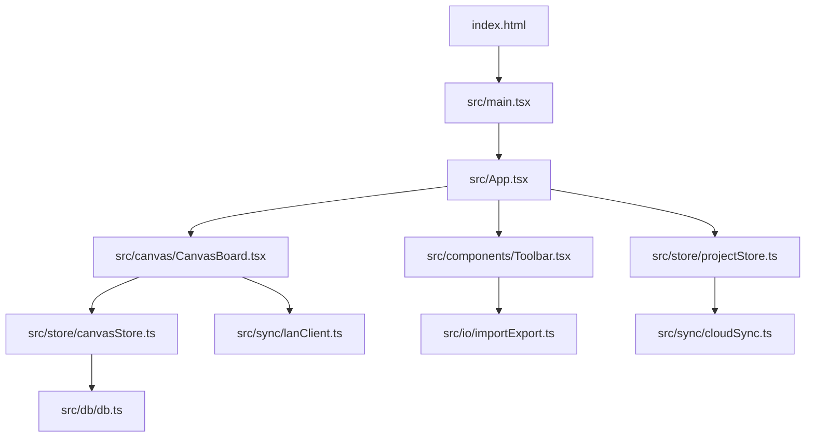
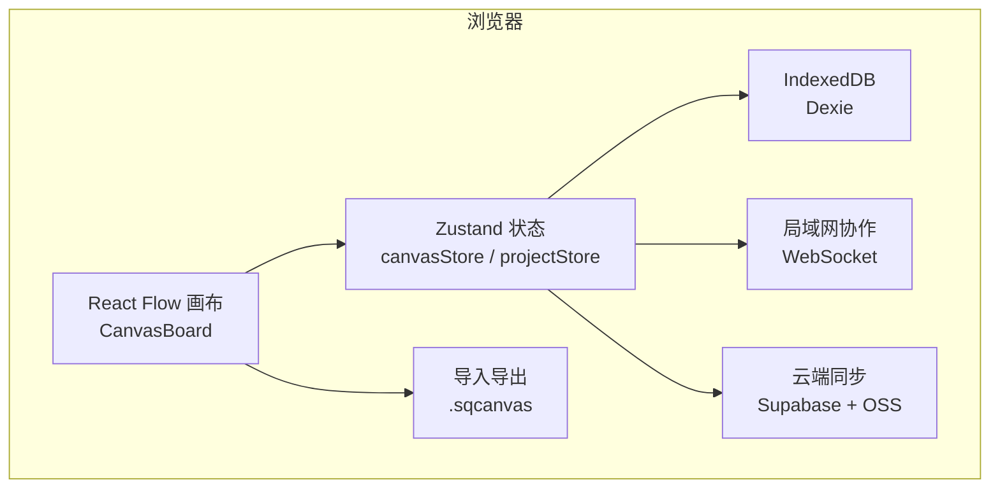
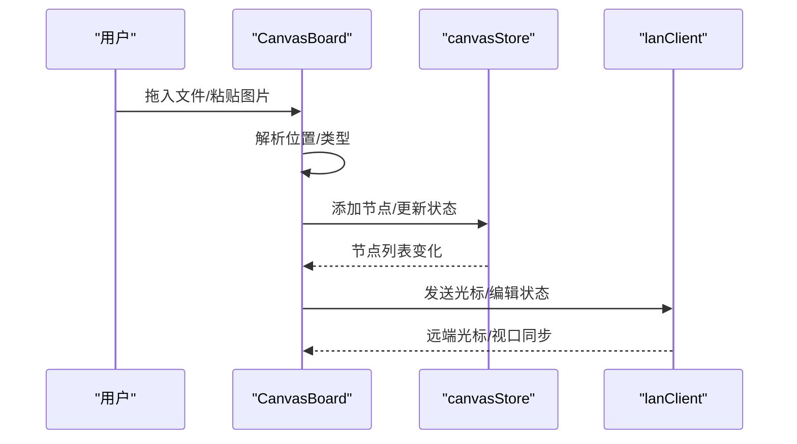
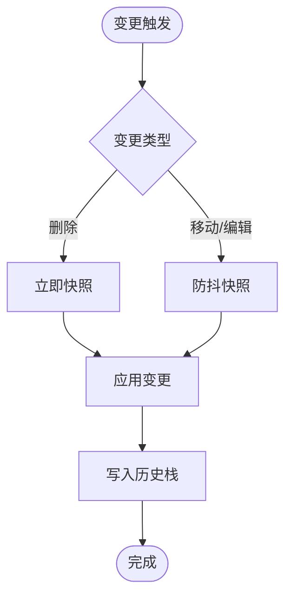
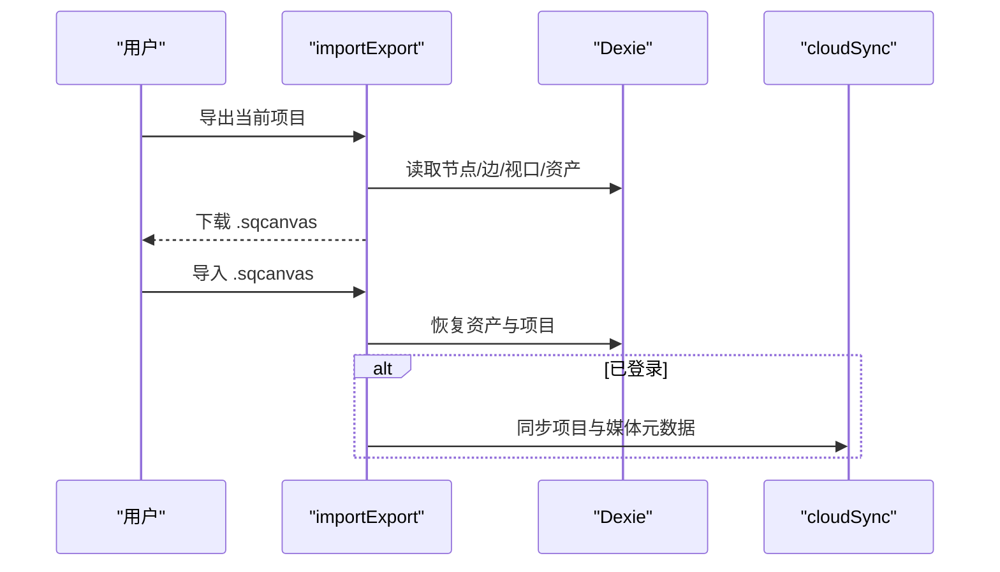
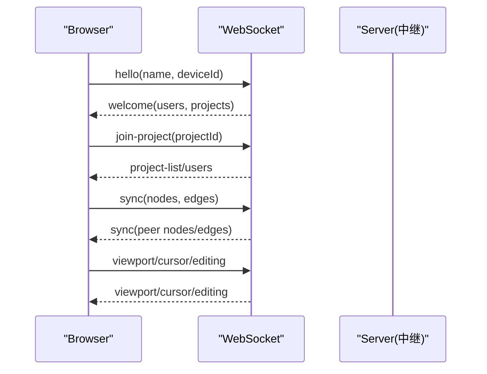
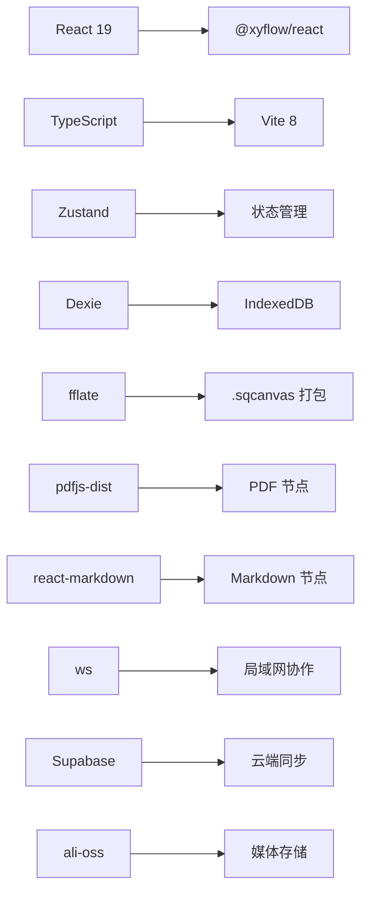

# 项目介绍

<cite>
**本文引用的文件**
- [README.md](file://README.md)
- [package.json](file://package.json)
- [index.html](file://index.html)
- [src/main.tsx](file://src/main.tsx)
- [src/App.tsx](file://src/App.tsx)
- [src/canvas/CanvasBoard.tsx](file://src/canvas/CanvasBoard.tsx)
- [src/store/canvasStore.ts](file://src/store/canvasStore.ts)
- [src/components/Toolbar.tsx](file://src/components/Toolbar.tsx)
- [src/types.ts](file://src/types.ts)
- [src/db/db.ts](file://src/db/db.ts)
- [src/io/importExport.ts](file://src/io/importExport.ts)
- [src/sync/lanClient.ts](file://src/sync/lanClient.ts)
- [src/sync/cloudSync.ts](file://src/sync/cloudSync.ts)
</cite>

## 目录
1. [简介](#简介)
2. [项目结构](#项目结构)
3. [核心组件](#核心组件)
4. [架构总览](#架构总览)
5. [详细组件分析](#详细组件分析)
6. [依赖关系分析](#依赖关系分析)
7. [性能考量](#性能考量)
8. [故障排查指南](#故障排查指南)
9. [结论](#结论)
10. [附录](#附录)

## 简介
SuQCanvas 是一款基于浏览器的无限画布应用，支持将图片、视频、音频、PDF、Markdown、文本等多媒体与文档元素拖拽到同一张画布上，通过连线组织它们之间的关系，并自动保存在本地。它面向设计师、开发者、内容创作者等用户群体，满足多媒体可视化编辑、知识梳理、演示编排、团队协作等场景需求。

核心价值与定位：
- 浏览器端运行，无需安装，开箱即用；支持在线版与局域网协作版两种构建模式。
- 以“无限画布 + 丰富节点类型 + 连线系统”为核心能力，提供直观的可视化编辑体验。
- 数据持久化与可移植：本地 IndexedDB 自动保存，支持导出为 .sqcanvas 项目包，跨设备迁移。
- 实时协作：局域网模式下多人同屏协作，支持光标共享、编辑锁定、视口同步与素材传输。

目标用户与使用场景：
- 设计师：快速拼贴多模态素材，制作情绪板、视觉方案、交互原型。
- 开发者：绘制架构图、流程图、API 关系图，结合代码片段与说明文档进行可视化表达。
- 内容创作者：整理资料、脚本、音视频素材，形成创作工作流与素材库。
- 团队：在同一局域网内协同编辑项目，实时看到彼此光标与变更，提升沟通效率。

技术优势与独特卖点：
- 纯前端实现，零安装门槛；支持深色/白色主题切换与记忆。
- 丰富的节点类型：图片、视频、音频、PDF、Markdown、文本、便签、形状、标题等。
- 强大的连线系统：多种线型、路径、箭头样式，支持批量编辑。
- 数据安全与可移植：IndexedDB 自动保存、项目导出导入、云端可选同步（登录用户）。
- 局域网协作：WebSocket 中继服务，房间级隔离，断线重连与增量同步，大文件分片传输。

发展历程与未来规划：
- 已完成：媒体节点、文本/PDF/Markdown 节点、连线与 Inspector 面板、自动保存、项目管理、导出导入、主题、局域网多人协作与主机持久化。
- 规划中：Word/Excel/PPT 预览、分组/容器、对齐参考线等增强能力。

**章节来源**
- [README.md:1-181](file://README.md#L1-L181)

## 项目结构
项目采用模块化组织方式，围绕“画布渲染、状态管理、存储与同步、UI 组件”分层设计：
- 入口与页面：index.html 挂载 React 根节点，main.tsx 初始化应用，App.tsx 组合全局 UI 与路由逻辑。
- 画布层：CanvasBoard 封装 React Flow 画布、拖放、快捷键、工具模式、协作光标与视图同步。
- 状态层：canvasStore 管理节点/边/视口/历史/剪贴板；projectStore 管理项目生命周期与自动保存；uiStore/settingsStore 管理 UI 与设置。
- 存储层：db.ts 定义 Dexie 表结构与资源清理策略；importExport.ts 负责 .sqcanvas 导入导出。
- 同步层：lanClient.ts 实现局域网协作（WebSocket 消息、分片传输、断线重连、视口/光标/编辑锁）；cloudSync.ts 对接 Supabase 云同步。
- 组件层：Toolbar 提供插入、工具切换、对齐、缩放、主题、导出/导入等；各类查看器与播放器组件。

**图表来源**
- [index.html:1-21](file://index.html#L1-L21)
- [src/main.tsx:1-6](file://src/main.tsx#L1-L6)
- [src/App.tsx:1-74](file://src/App.tsx#L1-L74)
- [src/canvas/CanvasBoard.tsx:1-459](file://src/canvas/CanvasBoard.tsx#L1-L459)
- [src/components/Toolbar.tsx:1-403](file://src/components/Toolbar.tsx#L1-L403)
- [src/store/canvasStore.ts:1-399](file://src/store/canvasStore.ts#L1-L399)
- [src/db/db.ts:1-69](file://src/db/db.ts#L1-L69)
- [src/sync/cloudSync.ts:1-165](file://src/sync/cloudSync.ts#L1-L165)
- [src/sync/lanClient.ts:1-800](file://src/sync/lanClient.ts#L1-L800)
- [src/io/importExport.ts:1-203](file://src/io/importExport.ts#L1-L203)

**章节来源**
- [index.html:1-21](file://index.html#L1-L21)
- [src/main.tsx:1-6](file://src/main.tsx#L1-L6)
- [src/App.tsx:1-74](file://src/App.tsx#L1-L74)
- [src/canvas/CanvasBoard.tsx:1-459](file://src/canvas/CanvasBoard.tsx#L1-L459)
- [src/components/Toolbar.tsx:1-403](file://src/components/Toolbar.tsx#L1-L403)
- [src/store/canvasStore.ts:1-399](file://src/store/canvasStore.ts#L1-L399)
- [src/db/db.ts:1-69](file://src/db/db.ts#L1-L69)
- [src/sync/cloudSync.ts:1-165](file://src/sync/cloudSync.ts#L1-L165)
- [src/sync/lanClient.ts:1-800](file://src/sync/lanClient.ts#L1-L800)
- [src/io/importExport.ts:1-203](file://src/io/importExport.ts#L1-L203)

## 核心组件
- 画布与节点：基于 @xyflow/react 的 React Flow，提供无限画布、缩放平移、框选、双击新建文本、拖放导入、MiniMap、背景网格等能力；节点类型覆盖图片、视频、音频、PDF、Markdown、文本、便签、形状、标题等。
- 连线系统：自定义 StyledEdge，支持实线/虚线/点线、曲线/直线/阶梯/平滑阶梯、箭头方向、颜色与粗细可调，右侧面板支持批量编辑。
- 状态与历史：Zustand 管理画布状态，内置撤销/重做、复制粘贴、对齐分布、层级调整、视口同步。
- 数据持久化：Dexie 封装 IndexedDB，自动保存项目与媒体资源；支持 24 小时孤儿资源回收；导出 .sqcanvas 压缩包，包含项目 JSON 与原始媒体。
- 协作与同步：局域网 WebSocket 中继，房间级隔离，支持光标共享、编辑锁定、视口同步、活动通知、增量同步与显式删除传播；云端可选同步（Supabase + OSS 媒体存储）。

**章节来源**
- [src/canvas/CanvasBoard.tsx:1-459](file://src/canvas/CanvasBoard.tsx#L1-L459)
- [src/store/canvasStore.ts:1-399](file://src/store/canvasStore.ts#L1-L399)
- [src/types.ts:1-112](file://src/types.ts#L1-L112)
- [src/db/db.ts:1-69](file://src/db/db.ts#L1-L69)
- [src/io/importExport.ts:1-203](file://src/io/importExport.ts#L1-L203)
- [src/sync/lanClient.ts:1-800](file://src/sync/lanClient.ts#L1-L800)
- [src/sync/cloudSync.ts:1-165](file://src/sync/cloudSync.ts#L1-L165)

## 架构总览
SuQCanvas 的整体架构由“前端画布 + 状态管理 + 存储 + 同步”构成，支持在线版与局域网协作版双构建模式。

**图表来源**
- [src/canvas/CanvasBoard.tsx:1-459](file://src/canvas/CanvasBoard.tsx#L1-L459)
- [src/store/canvasStore.ts:1-399](file://src/store/canvasStore.ts#L1-L399)
- [src/store/projectStore.ts:1-230](file://src/store/projectStore.ts#L1-L230)
- [src/db/db.ts:1-69](file://src/db/db.ts#L1-L69)
- [src/io/importExport.ts:1-203](file://src/io/importExport.ts#L1-L203)
- [src/sync/lanClient.ts:1-800](file://src/sync/lanClient.ts#L1-L800)
- [src/sync/cloudSync.ts:1-165](file://src/sync/cloudSync.ts#L1-L165)

## 详细组件分析

### 画布与交互（CanvasBoard）
- 无限画布操作：滚轮缩放、中键拖动视角、左键框选、双击空白新建文本、MiniMap、背景网格。
- 工具模式：选择/连线/拖动三种模式，快捷键 V/C/H 切换，空格临时平移。
- 拖放与粘贴：支持从系统拖入文件、Ctrl+V 粘贴图片，自动识别类型并创建对应节点。
- 协作能力：显示协作者光标、编辑锁定（避免冲突）、远端视口跟随、活动通知。
- 主题与样式：根据主题动态调整节点边框色、背景网格颜色。

**图表来源**
- [src/canvas/CanvasBoard.tsx:1-459](file://src/canvas/CanvasBoard.tsx#L1-L459)
- [src/store/canvasStore.ts:1-399](file://src/store/canvasStore.ts#L1-L399)
- [src/sync/lanClient.ts:1-800](file://src/sync/lanClient.ts#L1-L800)

**章节来源**
- [src/canvas/CanvasBoard.tsx:1-459](file://src/canvas/CanvasBoard.tsx#L1-L459)

### 状态管理与历史（canvasStore）
- 节点/边变更：applyNodeChanges/applyEdgeChanges 高效更新，删除时立即落盘快照。
- 撤销/重做：历史栈限制 50 条，防抖合并快照，支持清空历史。
- 复制粘贴：结构化克隆选中节点，保持连线关系，重新生成 ID。
- 对齐与分布：支持左右/上下/水平居中/垂直居中/水平分布/垂直分布。
- 层级管理：前移/后移/置顶/置底，zIndex 计算与更新。

**图表来源**
- [src/store/canvasStore.ts:1-399](file://src/store/canvasStore.ts#L1-L399)

**章节来源**
- [src/store/canvasStore.ts:1-399](file://src/store/canvasStore.ts#L1-L399)

### 数据持久化与导入导出（db + importExport）
- 本地存储：assets 与 projects 两张表，支持孤儿资源 24 小时回收。
- 导出：打包项目 JSON 与所有引用媒体（含缩略图）为 .sqcanvas zip。
- 导入：校验格式与版本，恢复媒体与项目，未登录用户仅本地保存，已登录用户同步至云端与 OSS。

**图表来源**
- [src/io/importExport.ts:1-203](file://src/io/importExport.ts#L1-L203)
- [src/db/db.ts:1-69](file://src/db/db.ts#L1-L69)
- [src/sync/cloudSync.ts:1-165](file://src/sync/cloudSync.ts#L1-L165)

**章节来源**
- [src/io/importExport.ts:1-203](file://src/io/importExport.ts#L1-L203)
- [src/db/db.ts:1-69](file://src/db/db.ts#L1-L69)

### 局域网协作（lanClient）
- 连接与会话：支持 ws/wss 地址解析，HTTPS 强制 wss，默认反代路径，自动重连与指数退避。
- 房间机制：按 projectId 隔离，加入/离开房间，广播项目列表与成员信息。
- 画布同步：增量同步节点与边，显式删除传播（sync-del），墓碑机制防止晚到旧快照复活。
- 视口与光标：视口广播与跟随，光标坐标与名称实时共享。
- 素材传输：分片 base64 传输，空闲超时保护，HTTP Range 流式拉取优化视频播放。

**图表来源**
- [src/sync/lanClient.ts:1-800](file://src/sync/lanClient.ts#L1-L800)

**章节来源**
- [src/sync/lanClient.ts:1-800](file://src/sync/lanClient.ts#L1-L800)

### 云端同步（cloudSync）
- 认证与权限：检测是否已登录，未登录不执行云操作。
- 项目与素材：上传/查询项目列表与详情，同步素材元数据与 OSS key。
- 最佳实践：登录后仅云端读写，游客/未登录仅本地读写，互不串通。

**章节来源**
- [src/sync/cloudSync.ts:1-165](file://src/sync/cloudSync.ts#L1-L165)

### 工具栏与插入（Toolbar）
- 插入菜单：文本、标题（多级）、便签（多色）、形状（矩形/椭圆）。
- 工具模式：选择/连线/拖动，快捷键提示与高亮。
- 对齐与分布：多选后一键对齐或均匀分布。
- 视图控制：放大/缩小/重置/适应视图，缩放百分比显示。
- 主题与状态：深色/白色主题切换，保存状态指示。

**章节来源**
- [src/components/Toolbar.tsx:1-403](file://src/components/Toolbar.tsx#L1-L403)

## 依赖关系分析
- 框架与引擎：React 19 + TypeScript + Vite 8；@xyflow/react (React Flow v12) 提供画布能力。
- 状态管理：Zustand 管理画布与项目状态。
- 存储与压缩：Dexie (IndexedDB) + fflate (zip)。
- 媒体处理：pdfjs-dist（PDF 懒加载分包）、react-markdown（Markdown 渲染）、ag-psd（PSD 预览）。
- 协作与云：ws（局域网中继）、Supabase（云数据库与认证）、ali-oss（对象存储）。

**图表来源**
- [package.json:1-52](file://package.json#L1-L52)

**章节来源**
- [package.json:1-52](file://package.json#L1-L52)

## 性能考量
- 画布渲染：React Flow 提供虚拟化与按需渲染，配合 MiniMap 与背景网格提升导航效率。
- 媒体优化：视频离开视口自动卸载，封面抽帧缓存，支持 HTTP Range 流式拉取减少带宽占用。
- 状态更新：历史快照防抖合并，删除即时落盘，避免频繁写盘导致卡顿。
- 协作同步：增量同步与显式删除传播，墓碑机制防止冲突；分片传输与空闲超时保障大文件稳定性。
- 存储清理：孤儿资源 24 小时宽限期，定期回收释放空间。

[本节为通用性能指导，不直接分析具体文件]

## 故障排查指南
- 局域网连接失败：检查中继地址是否为 ws/wss，HTTPS 页面需使用 wss；确认反向代理配置正确（端口、Upgrade、Connection 头）。
- 素材无法加载：确认服务器已暴露 /SuQCanvas/assets/ 反代路径；检查跨域与 CORS 配置。
- 协作不同步：确认双方处于同一项目房间；检查网络延迟与丢包；查看活动通知与错误提示。
- 导出/导入失败：校验 .sqcanvas 文件格式与版本；确保项目 JSON 完整且媒体文件存在。
- 云端同步异常：检查登录状态与 Supabase 配置；查看控制台警告信息定位错误。

**章节来源**
- [src/sync/lanClient.ts:1-800](file://src/sync/lanClient.ts#L1-L800)
- [src/io/importExport.ts:1-203](file://src/io/importExport.ts#L1-L203)
- [src/sync/cloudSync.ts:1-165](file://src/sync/cloudSync.ts#L1-L165)

## 结论
SuQCanvas 以“无限画布 + 多媒体节点 + 连线系统”为核心，结合本地持久化与可选云端同步，提供了轻量、易用、高效的可视化编辑体验。其浏览器端运行、无需安装、实时协作等特性，使其成为设计师、开发者与内容创作者的理想工具。未来将持续完善文档预览、分组容器、对齐参考线等功能，进一步提升生产力与协作体验。

[本节为总结性内容，不直接分析具体文件]

## 附录
- 快速开始：npm install -> npm run dev（在线版）/ npm run dev:lan（局域网版）。
- 构建与部署：支持在线版与局域网版分开构建；局域网版可生成本地一键启动包。
- 快捷键：左键拖动空白框选、中键拖动平移、滚轮缩放、双击空白新建文本、Ctrl+A 全选、Ctrl+D 复制、Ctrl+V 粘贴图片、F 适应视图、Delete/Backspace 删除。
- 许可证：MIT。

**章节来源**
- [README.md:28-181](file://README.md#L28-L181)