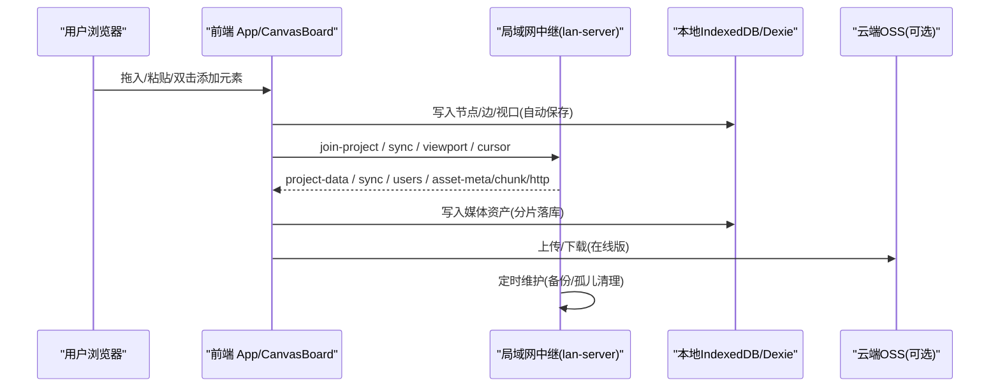
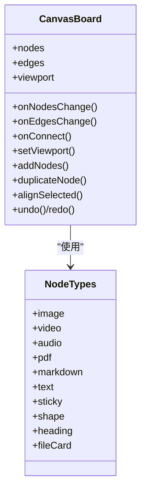
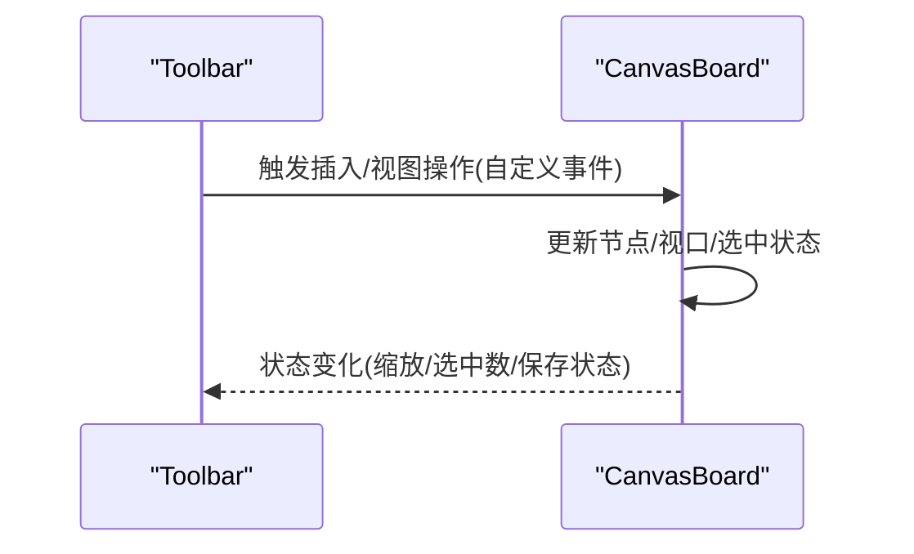
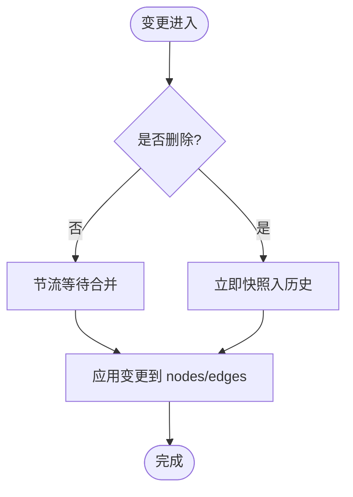
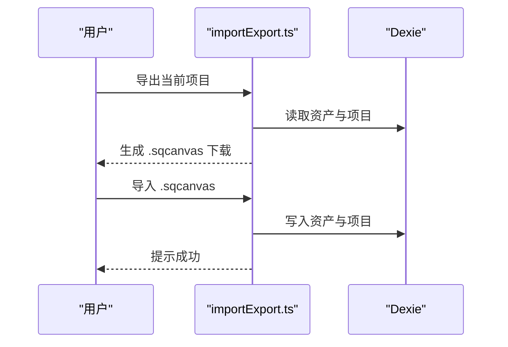
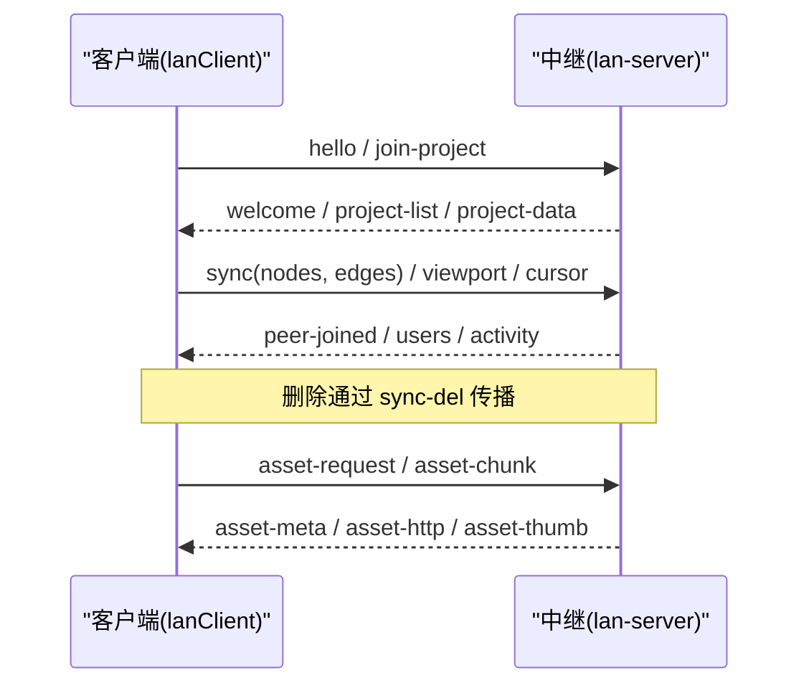
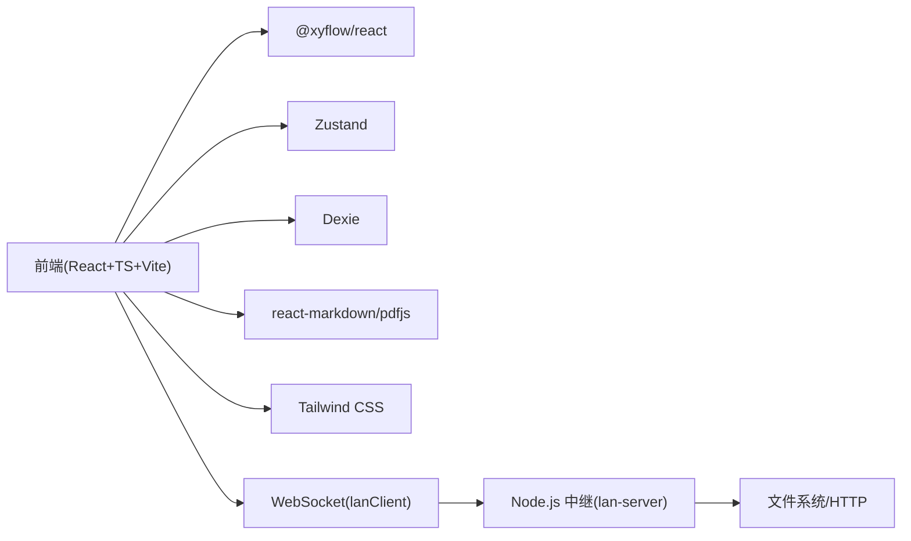

# 项目概述

<cite>
**本文引用的文件**
- [README.md](file://README.md)
- [package.json](file://package.json)
- [vite.config.ts](file://vite.config.ts)
- [src/main.tsx](file://src/main.tsx)
- [src/App.tsx](file://src/App.tsx)
- [src/canvas/CanvasBoard.tsx](file://src/canvas/CanvasBoard.tsx)
- [src/components/Toolbar.tsx](file://src/components/Toolbar.tsx)
- [src/store/canvasStore.ts](file://src/store/canvasStore.ts)
- [src/io/importExport.ts](file://src/io/importExport.ts)
- [src/media/managedFile.ts](file://src/media/managedFile.ts)
- [src/sync/lanClient.ts](file://src/sync/lanClient.ts)
- [server/lan-server.mjs](file://server/lan-server.mjs)
- [src/db/db.ts](file://src/db/db.ts)
</cite>

## 目录
1. [简介](#简介)
2. [项目结构](#项目结构)
3. [核心组件](#核心组件)
4. [架构总览](#架构总览)
5. [详细组件分析](#详细组件分析)
6. [依赖关系分析](#依赖关系分析)
7. [性能考量](#性能考量)
8. [故障排查指南](#故障排查指南)
9. [结论](#结论)
10. [附录：快速开始](#附录快速开始)

## 简介
SuQCanvas 是一款基于浏览器的无限画布应用，支持将图片、视频、音频、PDF、Markdown、文本等多媒体元素拖拽到同一张画布上，通过连线组织关系，并自动保存在本地。它同时提供局域网多人协作能力，可在同一项目中实时同步画布、视口与素材，适合多媒体可视化编辑、知识整理、演示策划等场景。

- 核心价值主张
  - 无限画布：滚轮缩放、中键拖动视角、框选、双击空白新建文本
  - 多媒体即插即用：图片、视频、音频、PDF、Markdown、纯文本、其他格式文件卡片
  - 连线系统：多样式边（实线/虚线/点线）、多种路径（曲线/直线/阶梯/平滑阶梯）、箭头样式、颜色粗细可调
  - 数据安全：IndexedDB 持久化，500ms 自动保存；多项目管理；一键导出 .sqcanvas 项目包
  - 团队协作：局域网中继服务 + WebSocket 实时同步，支持房间级协作、资产流式传输、备份恢复

- 技术栈概览
  - 前端：React 19 + TypeScript + Vite 8，状态管理 Zustand，画布引擎 @xyflow/react (React Flow v12)，样式 Tailwind CSS v4
  - 本地存储：Dexie (IndexedDB) + fflate (zip 打包)
  - 媒体处理：pdfjs-dist（懒加载分包）、react-markdown、psd 预览、歌词解析、播放控制
  - 协作：Node.js 局域网中继服务（ws），HTTP 静态资源与 Range 流式拉取，WebSocket 消息协议
  - 云端可选：Supabase + 阿里云 OSS（在线版）

**章节来源**
- [README.md:1-181](file://README.md#L1-L181)
- [package.json:1-52](file://package.json#L1-L52)

## 项目结构
- 前端源码位于 src/，按职责分层组织：
  - canvas/：画布容器与节点类型定义、自定义边样式
  - components/：工具栏、面板、查看器、播放器、Toast 等 UI 组件
  - store/：Zustand 状态管理（画布、项目、UI、设置、玩家、局域网）
  - db/：Dexie 数据库 schema 与垃圾回收
  - io/：导入导出（.sqcanvas zip）
  - media/：媒体协调、Blob URL 注册表、PDF、PSD、歌词、封面色等
  - sync/：局域网客户端、云同步、OSS 客户端
  - utils/：设备 ID、UUID 等工具
- 服务端位于 server/，提供局域网中继、静态资源托管、资产 HTTP Range 流式拉取、项目与素材持久化、定时维护任务
- 构建配置在 vite.config.ts，开发模式代理 /lan-ws 到本地中继端口

```mermaid
graph TB
subgraph "浏览器端"
A["App.tsx"]
B["CanvasBoard.tsx"]
C["Toolbar.tsx"]
D["store/* (Zustand)"]
E["io/importExport.ts"]
F["media/*"]
G["sync/lanClient.ts"]
end
subgraph "局域网服务器"
S["server/lan-server.mjs"]
end
A --> B
A --> C
B --> D
C --> D
B --> E
B --> F
B --> G
G < --> S
```

**图表来源**
- [src/App.tsx:1-74](file://src/App.tsx#L1-L74)
- [src/canvas/CanvasBoard.tsx:1-459](file://src/canvas/CanvasBoard.tsx#L1-L459)
- [src/components/Toolbar.tsx:1-403](file://src/components/Toolbar.tsx#L1-L403)
- [src/sync/lanClient.ts:1-800](file://src/sync/lanClient.ts#L1-L800)
- [server/lan-server.mjs:1-800](file://server/lan-server.mjs#L1-L800)

**章节来源**
- [README.md:136-150](file://README.md#L136-L150)
- [vite.config.ts:1-21](file://vite.config.ts#L1-L21)

## 核心组件
- 画布与交互
  - CanvasBoard：基于 React Flow 的无限画布，封装拖放、粘贴、快捷键、主题、迷你地图、连线、选中、视图跟随、局域网光标与编辑锁定
  - Toolbar：顶部工具栏，提供插入元素、工具切换（选择/连线/拖动）、撤销重做、对齐分布、缩放、主题切换、导出、导入、文件管理、局域网协作入口
- 状态管理
  - canvasStore：节点/边/视口、历史撤销重做、复制粘贴、层级、对齐、删除关联资源
  - projectStore/uiStore/settingsStore/playerStore/lanStore：项目生命周期、UI 状态、主题设置、播放器、局域网协作状态
- 数据持久化与导入导出
  - importExport：导出为 .sqcanvas（zip），包含项目 JSON 与媒体二进制；导入时解压、写入 IndexedDB、创建项目记录
  - db：Dexie schema（assets/projects），垃圾回收（孤儿素材 24h 清理）
- 媒体与渲染
  - media：媒体协调、Blob URL 注册、PDF 渲染、PSD 预览、歌词、封面色、PipWindow 等
- 协作与同步
  - lanClient：连接中继、加入房间、画布增量同步、视口广播、删除传播（墓碑机制）、素材分片传输、HTTP Range 流式拉取、活动通知
  - lan-server：项目列表、项目保存/删除、资产上传/下载、Range 流式拉取、定时维护（备份过期清理、孤儿素材清理）

**章节来源**
- [src/canvas/CanvasBoard.tsx:1-459](file://src/canvas/CanvasBoard.tsx#L1-L459)
- [src/components/Toolbar.tsx:1-403](file://src/components/Toolbar.tsx#L1-L403)
- [src/store/canvasStore.ts:1-399](file://src/store/canvasStore.ts#L1-L399)
- [src/io/importExport.ts:1-203](file://src/io/importExport.ts#L1-L203)
- [src/db/db.ts:1-68](file://src/db/db.ts#L1-L68)
- [src/sync/lanClient.ts:1-800](file://src/sync/lanClient.ts#L1-L800)
- [server/lan-server.mjs:1-800](file://server/lan-server.mjs#L1-L800)

## 架构总览
SuQCanvas 采用“前端 React + 后端 Node.js 中继”的分层架构：
- 前端负责画布渲染、用户交互、本地持久化（IndexedDB）与协作通信（WebSocket）
- 局域网中继负责房间级协作、项目与素材持久化、HTTP 静态资源与 Range 流式拉取、定时维护
- 可选云端：在线版通过 Supabase 存储项目元数据，OSS 存储媒体大文件，IndexedDB 作为离线缓存



**图表来源**
- [src/App.tsx:1-74](file://src/App.tsx#L1-L74)
- [src/canvas/CanvasBoard.tsx:1-459](file://src/canvas/CanvasBoard.tsx#L1-L459)
- [src/sync/lanClient.ts:1-800](file://src/sync/lanClient.ts#L1-L800)
- [server/lan-server.mjs:1-800](file://server/lan-server.mjs#L1-L800)
- [src/db/db.ts:1-68](file://src/db/db.ts#L1-L68)

## 详细组件分析

### 画布与节点（CanvasBoard 与节点类型）
- 画布能力
  - 基于 React Flow 的无限画布，支持缩放、平移、框选、双击空白新增文本、拖放文件导入、粘贴图片
  - 工具模式：选择(V)、连线(C)、拖动(H)，空格临时平移
  - 迷你地图、背景网格、主题适配
  - 局域网：显示协作者光标、编辑锁定、视图跟随
- 节点类型
  - 图片、视频、音频、PDF、Markdown、纯文本、便签、形状、文件卡片、标题等
  - 节点类型映射由 nodeTypes 集中管理，便于扩展



**图表来源**
- [src/canvas/CanvasBoard.tsx:1-459](file://src/canvas/CanvasBoard.tsx#L1-L459)
- [src/canvas/nodes/nodeTypes.ts:1-26](file://src/canvas/nodes/nodeTypes.ts#L1-L26)

**章节来源**
- [src/canvas/CanvasBoard.tsx:1-459](file://src/canvas/CanvasBoard.tsx#L1-L459)
- [src/canvas/nodes/nodeTypes.ts:1-26](file://src/canvas/nodes/nodeTypes.ts#L1-L26)

### 工具栏与操作（Toolbar）
- 功能要点
  - 插入菜单：文本、标题、便签、形状
  - 工具切换：选择/连线/拖动
  - 撤销/重做、对齐/分布、缩放、适应视图
  - 导出当前项目为 .sqcanvas，导入本地文件
  - 文件管理器、主题切换、局域网协作入口（仅局域网构建）
- 事件分发
  - 通过自定义事件向画布注入节点或执行视图操作



**图表来源**
- [src/components/Toolbar.tsx:1-403](file://src/components/Toolbar.tsx#L1-L403)
- [src/canvas/CanvasBoard.tsx:1-459](file://src/canvas/CanvasBoard.tsx#L1-L459)

**章节来源**
- [src/components/Toolbar.tsx:1-403](file://src/components/Toolbar.tsx#L1-L403)

### 状态管理与历史（canvasStore）
- 数据结构
  - nodes/edges/viewport/past/future/clipboard
- 关键逻辑
  - 防抖快照：对非删除操作进行节流合并，减少历史条目膨胀
  - 删除立即落盘历史：确保可回退删除
  - 复制粘贴：克隆节点与关联边，重新分配 id 与位置
  - 对齐/分布：计算边界与间距，批量更新位置
  - 层级调整：zIndex 排序与移动
  - 删除资源：移除引用了指定 assetId 的节点与边



**图表来源**
- [src/store/canvasStore.ts:1-399](file://src/store/canvasStore.ts#L1-L399)

**章节来源**
- [src/store/canvasStore.ts:1-399](file://src/store/canvasStore.ts#L1-L399)

### 数据持久化与导入导出
- 本地持久化
  - Dexie 管理 assets 与 projects 两张表
  - 垃圾回收：标记孤儿素材，超过 24h 清理
- 导入导出
  - 导出：收集节点/边/视口与所有引用资产，打包为 .sqcanvas（zip）
  - 导入：解压校验、写入 IndexedDB、创建项目记录、在线版同步至云端/OSS



**图表来源**
- [src/io/importExport.ts:1-203](file://src/io/importExport.ts#L1-L203)
- [src/db/db.ts:1-68](file://src/db/db.ts#L1-L68)

**章节来源**
- [src/io/importExport.ts:1-203](file://src/io/importExport.ts#L1-L203)
- [src/db/db.ts:1-68](file://src/db/db.ts#L1-L68)

### 局域网协作（lanClient + lan-server）
- 连接与会话
  - 自动解析 ws/wss 地址，支持相对路径与反向代理
  - 断线自动重连（指数退避），保留已收分片续传
- 房间与同步
  - join-project/leave-project，按房间隔离
  - 画布增量同步：并集合并节点/边，显式删除通过 sync-del 传播，墓碑机制避免晚到旧快照复活
  - 视口广播与跟随，光标广播与编辑锁定
- 素材传输
  - 小文件：分片 base64 经 WebSocket 传输
  - 视频等大文件：优先走 HTTP Range 流式拉取，减少带宽占用
  - 封面预抓帧：上传端抓取，观看端直接显示，无需解码
- 服务器侧
  - 项目列表、保存/删除、备份保留 24h
  - 资产 HTTP 接口支持 Range，CORS 跨域
  - 定时维护：备份过期清理、孤儿素材清理



**图表来源**
- [src/sync/lanClient.ts:1-800](file://src/sync/lanClient.ts#L1-L800)
- [server/lan-server.mjs:1-800](file://server/lan-server.mjs#L1-L800)

**章节来源**
- [src/sync/lanClient.ts:1-800](file://src/sync/lanClient.ts#L1-L800)
- [server/lan-server.mjs:1-800](file://server/lan-server.mjs#L1-L800)

### 媒体与文件管理
- 媒体协调
  - 根据节点 data 中的 assetId 聚合 ManagedFile，统一展示名称、类型、大小、关联节点
  - 音频播放器、视频播放器、PDF 查看器、Markdown 渲染、PSD 预览
- 文件管理
  - 工具栏入口打开文件管理器，支持批量导入、删除、查看引用情况

**章节来源**
- [src/media/managedFile.ts:1-39](file://src/media/managedFile.ts#L1-L39)
- [src/components/Toolbar.tsx:1-403](file://src/components/Toolbar.tsx#L1-L403)

## 依赖关系分析
- 前端依赖
  - React 19 + TypeScript + Vite 8：现代前端工程化
  - @xyflow/react：画布与节点/边渲染
  - Zustand：轻量状态管理
  - Dexie：IndexedDB 封装
  - pdfjs-dist、react-markdown：媒体与文档渲染
  - Tailwind CSS v4：原子化样式
- 服务端依赖
  - Node.js + ws：WebSocket 通信
  - fs/promises、http：静态资源与 Range 流式拉取
  - crypto/os/path/url：路径与安全校验
- 构建与脚本
  - scripts/build.mjs、scripts/package-lan.mjs：构建与打包
  - vite.config.ts：开发代理 /lan-ws 到本地中继



**图表来源**
- [package.json:1-52](file://package.json#L1-L52)
- [vite.config.ts:1-21](file://vite.config.ts#L1-L21)
- [src/sync/lanClient.ts:1-800](file://src/sync/lanClient.ts#L1-L800)
- [server/lan-server.mjs:1-800](file://server/lan-server.mjs#L1-L800)

**章节来源**
- [package.json:1-52](file://package.json#L1-L52)
- [vite.config.ts:1-21](file://vite.config.ts#L1-L21)

## 性能考量
- 画布性能
  - 使用 React Flow 的虚拟渲染与按需更新，配合最小化变更（applyNodeChanges/applyEdgeChanges）
  - 历史快照防抖合并，降低频繁操作的内存与历史膨胀
- 媒体性能
  - 视频优先走 HTTP Range 流式拉取，避免整份下载打满局域网
  - 封面预抓帧，减少重复解码开销
  - 离开视口自动卸载媒体资源（视频）
- 协作性能
  - 增量同步与删除显式传播，避免全量覆盖
  - 分片传输与续传，提升大文件稳定性
  - 活动通知合并，避免刷屏
- 存储性能
  - IndexedDB 以 Blob 存储原文件，减少序列化开销
  - 孤儿素材 24h 宽限期后清理，释放空间

[本节为通用性能讨论，不直接分析具体文件]

## 故障排查指南
- 无法连接局域网中继
  - 检查 ws/wss 地址是否正确，HTTPS 页面需 wss 且通过反向代理
  - 确认防火墙放行 8790 端口或使用反向代理
- 素材无法加载或封面缺失
  - 确认资产 HTTP 接口可访问（/SuQCanvas/assets/<assetId>）
  - 检查 CORS 头与跨域策略
- 协作不同步
  - 检查房间是否一致（projectId）
  - 查看是否有 sync-del 未到达导致残留节点（墓碑窗口期）
- 项目丢失或误删
  - 使用“恢复已删除”查看 24h 内备份并恢复
  - 检查 server/data/backups 目录是否存在对应备份

**章节来源**
- [src/sync/lanClient.ts:1-800](file://src/sync/lanClient.ts#L1-L800)
- [server/lan-server.mjs:1-800](file://server/lan-server.mjs#L1-L800)
- [README.md:62-123](file://README.md#L62-L123)

## 结论
SuQCanvas 以“无限画布 + 多媒体编辑 + 局域网协作”为核心，提供了开箱即用的可视化编辑体验。其前端采用成熟的 React + TypeScript + Vite 生态，结合 React Flow 实现高性能画布；本地持久化保障数据安全与离线可用；局域网中继提供房间级协作与大文件高效传输。对于初学者，它降低了多媒体内容组织的门槛；对于开发者，其模块化设计与清晰的职责划分便于扩展与维护。

[本节为总结性内容，不直接分析具体文件]

## 附录：快速开始
- 安装依赖
  - npm install
- 启动开发模式
  - 在线版：npm run dev
  - 局域网版：npm run dev:lan
- 构建与打包
  - 交互构建：npm run build
  - 仅在线版：npm run build:online
  - 仅局域网版：npm run build:lan
  - 生成本地一键启动包：npm run package:lan
  - 预览生产构建：npm run preview
- 运行局域网中继
  - npm run lan
  - Windows 首次部署放行端口：npm run lan:open
- 部署说明
  - 仅上传 dist-lan 静态文件不够，还需保留 server/、package.json、package-lock.json，并单独启动中继
  - HTTPS 环境建议通过 Nginx 反向代理 /lan-ws 到 ws://127.0.0.1:8790

**章节来源**
- [README.md:28-123](file://README.md#L28-L123)
- [package.json:6-20](file://package.json#L6-L20)
- [vite.config.ts:9-16](file://vite.config.ts#L9-L16)