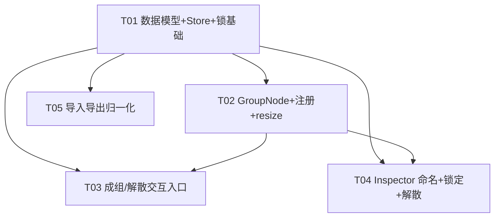

# SuQCanvas 分组/容器（node_grouping）系统架构设计

> 作者：高见远（Gao）· 架构师　|　范围：P0（Must have）可落地设计，P1/P2 仅预留扩展点
> 配套图：`docs/class-diagram.mermaid`、`docs/sequence-diagram.mermaid`

## 结论先行

1. **完全复用 React Flow v12 原生 group node 能力**，不新增任何第三方依赖。`SuqNode` 已是 `Node<SuqNodeData>` 的别名，天然携带 `parentId` / `extent` / 相对 `position` 字段（当前代码未使用，但类型已支持）。
2. **成组 = 建一个 `type:'group'` 的普通节点**，把选中节点改为它的子节点（`parentId` + `position` 转相对坐标 + `extent:'parent'`）。分组在存储、自动保存、导入导出中**就是普通 node**，零额外迁移。
3. **整体移动/连线/缩放由 React Flow 自动处理**：拖父节点子节点联动、边端点实时跟随、子节点 `extent:'parent'` 约束，均为框架内行为；仅「缩放后 clamp 子节点」「解散重算绝对坐标」需手写少量纯函数。
4. **导入导出天然兼容**：`exportProjectToBlob` 已把整个 `nodes` 数组 JSON 序列化，父/子节点的 `parentId`、相对 `position`、`extent` 会原样落盘；导入时加一次 `normalizeGroupHierarchy`（父先于子排序 + 坐标兜底）即完整重建嵌套。
5. **P0 改动集中在 5 个任务、约 9 个文件**：types、groups 工具、canvasStore 动作、GroupNode 组件、GroupToolbar、CanvasBoard 接入、Inspector 分组面板、importExport 归一化、以及配套测试。

---

## 1. 调研结论（必做 4 项）

| # | 调研点 | 现状 | 对设计的影响 |
|---|--------|------|--------------|
| ① | `canvasStore` 节点类型 | `SuqNode = Node<SuqNodeData>`（`types.ts:106`）。`Node` 自带可选 `parentId`、`extent`、`style`、`zIndex`、`width/height`；当前**从未赋值** `parentId/extent`。`position` 对顶层节点是**绝对坐标**，无嵌套先例。 | 无需改类型签名，仅需给 `SuqNodeData` 加 `isGroup` 等可选分组字段；子节点 `position` 采用相对父坐标（React Flow 约定）。 |
| ② | CanvasBoard 框选/多选/拖动 | 框选用 `selectionOnDrag` + `SelectionMode.Partial`（`:357`、`:365`）；`onNodesChange` 直接转 `applyNodeChanges`；`onNodeDragStart/Stop` 仅做 LAN 锁标记。**无 `onSelectionChange`，无右键菜单**。 | 成组入口用 `nodes.filter(n=>n.selected)` 读取当前多选；选框 bbox 用 `useReactFlow().getNodesBounds(selectedIds)` 计算，无需重写框选。 |
| ③ | `.sqcanvas` 序列化 | `exportProjectToBlob` 把 `nodes: SuqNode[]` 原样放进 `project.json` 再 `zipSync`（`importExport.ts:66-75`）；`importProjectFile` 解析后 `loadProject` → `setState({nodes})`（`projectStore.ts:128`）。 | 父/子节点字段已随 JSON 往返。导入仅需补 `normalizeGroupHierarchy`（排序 + 相对坐标合法性兜底）。**无 schema 变更、VERSION 维持 1**。 |
| ④ | 节点外壳 resize 手柄 | `ResizeHandles.tsx` 已存在，被 HeadingNode/ShapeNode/TextNode/StickyNode 在 `selected && !editing` 时挂载，写 `position` + `dimensions` change。 | 分组复用同一 `ResizeHandles` 组件（挂在 GroupNode 内），并追加「缩放后 clamp 子节点」逻辑。 |

**额外发现**：`projectStore.saveNow` 的 500ms 自动保存直接 `db.projects.update({graph:{nodes,edges}})`，nodes 含分组字段即自动持久化；`db.ts` 的 project 表 `graph` 是 `{nodes,edges}` 纯对象，无需改表结构。

---

## 2. 实现方案 + 框架选型

### 2.1 核心方案
- **Group node 模型**：分组即一个 `type:'group'` 的节点，渲染为半透明背景框 + 四角 resize 手柄 +（P1）标签。它自身可被拖动、被嵌套（作为别的 group 的子节点）。
- **Child 模型**：子节点设 `parentId = groupId`、`extent:'parent'`、`position` = 相对父节点左上角的坐标。React Flow v12 会：
  - 把子节点 DOM 嵌套在父节点容器内 → **父在底、子在上的视觉层级自动正确**（无需手动算 zIndex）；
  - 拖父节点时自动带动所有子孙；
  - 子节点拖拽被 `extent:'parent'` 约束在父框内；
  - 连接子节点的边端点随父/子移动实时重算。
- **坐标策略**：仅顶层节点 `position` 为画布绝对坐标；任何有 `parentId` 的节点 `position` 均为相对父坐标。绝对坐标 = 沿祖先链累加 `parent.position + child.position`。

### 2.2 框架选型
| 能力 | 选型 | 说明 |
|------|------|------|
| 分组/嵌套/约束 | **React Flow v12 原生 `parentId`+`extent`** | 已装 `@xyflow/react`，零新增 |
| 状态管理 | **Zustand（`useCanvasStore` 扩展）** | 新增 `groupSelected` / `dissolveGroup` / `deleteGroupWithDescendants` 纯动作，复用既有 `onNodesChange`+`applyNodeChanges` |
| 坐标换算/归一化 | **自写纯函数 `src/canvas/groups.ts`** | 无合适现成库，逻辑集中、可单测 |
| resize | **复用 `ResizeHandles`** | 组件已具备四角拖拽，挂到 GroupNode |
| 导入导出 | **复用 `importExport.ts` + 加归一化** | 序列化已覆盖 |

**无需新增依赖。** 结论：本期 **0 个新 npm 包**。

---

## 3. 文件列表及相对路径（聚焦 P0）

| 文件 | 性质 | 改动要点 |
|------|------|----------|
| `src/types.ts` | **修改** | `SuqNodeData` 增加 `isGroup?: boolean`(P0)、`groupName?: string`(P0 命名)、`locked?: boolean`(本期锁定，默认 false)、`groupColor?: string`(P1 预留)、`groupPadding?: number`(P1)。**不建 `groupCollapsed`（折叠/展开本期不做）**。 |
| `src/canvas/groups.ts` | **新增** | 纯函数工具：坐标换算、bbox 计算、reparent、dissolve、clamp、import 归一化、lock 辅助。 |
| `src/store/canvasStore.ts` | **修改** | 增加 `groupSelected()`、`dissolveGroup(id)`、`deleteGroupWithDescendants(id)`、`getAbsolutePosition(id)`、`setNodeLocked(id, locked)`；内部调用 `groups.ts` / `lanClient`。 |
| `src/sync/lanClient.ts` | **修改** | 新增分组锁定广播/接收（复用 `editing` 通道或独立 lock 事件），默认关闭；供 `setNodeLocked` 调用。 |
| `src/canvas/nodes/GroupNode.tsx` | **新增** | 分组节点渲染：背景框 + `ResizeHandles`（自由缩放，约束子节点 extent，**无等比缩放**）+ `groupName` 标签 + `locked` 时 `draggable:false` 与锁标。 |
| `src/canvas/nodes/nodeTypes.ts` | **修改** | `mediaNodeTypes` 增加 `group: GroupNode` 注册。 |
| `src/canvas/nodes/ResizeHandles.tsx` | **复用（不改）** | GroupNode 直接复用现有四角拖拽；本期不接等比缩放逻辑。 |
| `src/components/GroupToolbar.tsx` | **新增** | 多选（≥2）时浮动「组合」按钮，定位在选框附近；调用 `groupSelected()`。 |
| `src/canvas/CanvasBoard.tsx` | **修改** | 挂载 `GroupToolbar`；加 `onNodeContextMenu` 右键「组合/解散」；`onNodesChange` 对 group/child 的 remove 沿用现有 LAN 锁过滤（自动覆盖）。 |
| `src/components/InspectorPanel.tsx` | **修改** | 选中**单**个 `isGroup` 节点时路由到 `GroupInspectorSection`；多选混合时沿用现有批量编辑。 |
| `src/components/GroupInspectorSection.tsx` | **新增** | 分组专属面板区块：命名输入(`groupName`)、锁定开关(`setNodeLocked`)、解散按钮、尺寸。 |
| `src/components/LockToggle.tsx` | **新增** | 可复用锁开关控件（本期用于分组锁定，未来可复用至单节点）。 |
| `src/io/importExport.ts` | **修改** | `importProjectFile` 在 `setState` 前调用 `normalizeGroupHierarchy(nodes)`；导出无需改动（已原样序列化）。 |
| `src/io/importExport.test.ts` | **修改** | 补充分组导入/导出往返用例（含锁定/命名字段）。 |
| `src/canvas/groups.test.ts` | **新增** | 坐标换算、reparent、dissolve、clamp、normalize 单元测试。 |

---

## 4. 数据结构和接口

详见 `docs/class-diagram.mermaid`。要点：

### 4.1 节点数据扩展（`types.ts`）
```ts
export interface SuqNodeData extends Record<string, unknown> {
  kind: MediaKind
  // ... 现有字段保持不变 ...
  // —— 新增分组字段（本期范围）——
  isGroup?: boolean          // P0：true 表示这是一个分组容器节点
  groupName?: string         // P0：分组命名（用户决策并入；仅附加字段，不改存储结构）
  locked?: boolean           // 本期：分组锁定，默认 false（由 P2 提升，本期交付）
  groupColor?: string        // P1：背景色/边框（视排期，不强制并入 P0）
  groupPadding?: number      // P1：包络内边距，默认 24
  // 注意：groupCollapsed 本期不做（折叠/展开留后续迭代），不进类型
}
// SuqNode 已是 Node<SuqNodeData>，自带 parentId / extent / style，无需改签名
```

### 4.2 分组工具接口（`src/canvas/groups.ts`）
```ts
export interface Box { x: number; y: number; w: number; h: number }

/** 节点的画布绝对坐标（沿祖先链累加） */
export function computeAbsolutePosition(node: SuqNode, byId: Map<string, SuqNode>): XYPosition
/** 收集某分组的所有后代 id（含嵌套） */
export function collectDescendantIds(groupId: string, nodes: SuqNode[]): Set<string>
/** 仅直接子节点 id */
export function getDirectChildIds(parentId: string, nodes: SuqNode[]): string[]
/** 选中节点包围盒（绝对坐标） */
export function computeSelectionBoundingBox(ids: string[], nodes: SuqNode[]): Box
/** 把若干节点重挂到新分组下，position 转为相对 groupAbsPos */
export function reparentToGroup(children: SuqNode[], groupId: string, groupAbsPos: XYPosition): SuqNode[]
/** 解散：直接子节点重指父级（顶层或上层组），绝对坐标保留 */
export function dissolveGroup(group: SuqNode, newParentId: string | undefined, nodes: SuqNode[]): SuqNode[]
/** 缩放后把 extent:'parent' 子节点 clamp 到父框内 */
export function clampChildrenToParent(groupId: string, size: { w: number; h: number }, nodes: SuqNode[]): SuqNode[]
/** 导入归一化：父先于子排序 + 相对坐标兜底 */
export function normalizeGroupHierarchy(nodes: SuqNode[]): SuqNode[]
```

### 4.3 Store 新增动作（`canvasStore.ts`）
```ts
groupSelected(): void                       // 把当前多选节点成组
dissolveGroup(groupId: string): void        // 解散指定分组
deleteGroupWithDescendants(groupId: string): void  // 连同子孙一起删除（复用 ReactFlow deleteElements）
getAbsolutePosition(id: string): XYPosition // 供 UI/缩放使用
setNodeLocked(id: string, locked: boolean): void   // 本期：分组锁定（默认 false），同步广播 LAN
```
- `groupSelected` 内部：取 `selected` 且非 group 自身的节点 → 计算 bbox → 构造 group 节点（`zIndex:0`，`style.width/height` 来自 bbox，`data.isGroup=true`，`parentId` 取选中节点的共同父级或 `undefined`）→ `reparentToGroup` → 一次性 `setNodes`。
- `dissolveGroup` 内部：`computeAbsolutePosition(group)` → 对每个直接子 `dissolveGroup(...)` 重设 `parentId`/`position` → 移除 group 节点 → 一次性 `setNodes`。更深后代 parentId/相对坐标不变，整体位置自然保留。
- `setNodeLocked` 内部：`updateNodeData(id, { locked })` + `lanClient.broadcastLock(id, locked)`；接收端经 `onLockChange` 把节点置为 `draggable:false`、显示锁标。默认 `locked=false`。
- 成组/解散/锁定动作均走 `snapshotNow(set,get)` 接入既有撤销/重做历史（与 `addNodes` 一致）。

### 4.4 Inspector 分组属性接口（P0）
选中单个 `isGroup` 节点时展示：`尺寸（宽/高 数字输入，回写 `style`+`dimensions`）`、`解散分组按钮`、`层级` 沿用现有区块；`groupName/groupColor` 在 P1 才渲染（此处预留占位分支）。

---

## 5. 程序调用流程

详见 `docs/sequence-diagram.mermaid`（含 5 个关键时序：成组、解散、整体移动、缩放、导入重建）。摘要：

- **成组**：`GroupToolbar.onGroup → Store.groupSelected → GroupUtils(computeSelectionBoundingBox + reparentToGroup) → setNodes → ReactFlow 渲染包络框`。
- **解散**：`InspectorPanel.解散 → Store.dissolveGroup → GroupUtils(computeAbsolutePosition + dissolveGroup) → setNodes(remove+position)`；**edges 不动，端点自动重算**。
- **整体移动**：纯 React Flow 行为 —— 拖父 → `onNodesChange(position)` → `applyNodeChanges` → 子孙 + 边端点自动跟随。
- **整体缩放**：`GroupNode.resize → onNodesChange(dimensions) → GroupUtils.clampChildrenToParent → 子节点约束在父框`。
- **导入重建**：`importProjectFile → normalizeGroupHierarchy → loadProject/setState → ReactFlow 按 parentId 重建嵌套`。

---

## 6. 任务列表（最终版，含依赖，按实现顺序）

> 约束：≤5 个任务、每任务 ≥3 个文件、按依赖排序、尽量只依赖 T01。范围已按用户决策锁定（命名并入 P0、锁定由 P2 提升本期、折叠不做、整体缩放无等比、背景色留 P1、快捷键留 P2）。

| Task | 名称 | 级别 | 源文件（≥3） | 依赖 |
|------|------|------|--------------|------|
| **T01** | 分组数据模型 + 状态/锁基础（基础设施层） | **P0** | `src/types.ts`、`src/store/canvasStore.ts`、`src/canvas/groups.ts`、`src/sync/lanClient.ts` | — |
| **T02** | GroupNode 渲染 + 节点注册 + resize（无等比） | **P0** | `src/canvas/nodes/GroupNode.tsx`、`src/canvas/nodes/nodeTypes.ts`、`src/canvas/nodes/ResizeHandles.tsx` | T01 |
| **T03** | 成组/解散交互入口（浮动工具条 + 右键菜单） | **P0** | `src/components/GroupToolbar.tsx`、`src/canvas/CanvasBoard.tsx`、`src/store/uiStore.ts` | T01, T02 |
| **T04** | Inspector 分组面板（命名 P0 + 锁定开关 本期 + 解散） | **P0** | `src/components/InspectorPanel.tsx`、`src/components/GroupInspectorSection.tsx`、`src/components/LockToggle.tsx` | T01, T02 |
| **T05** | 导入导出兼容 + 嵌套重建归一化（含单测） | **P0** | `src/io/importExport.ts`、`src/io/importExport.test.ts`、`src/canvas/groups.test.ts` | T01 |

**任务级别说明（对应决策）**
- 命名（`groupName`）→ **P0**（T01 字段 + T02 标签 + T04 输入）
- 整体缩放 → **P0**（T02：`extent:'parent'` 约束子节点，**不接等比缩放**）
- 锁定（`locked`）→ **本期交付**（由 P2 提升）：T01 `setNodeLocked`+`lanClient` 广播、T02 锁态展示、T04 `LockToggle` 开关；**默认关闭**
- 交互入口（成组/解散）→ **P0**（T03）
- 导入导出兼容 → **P0**（T05）
- 折叠/展开 → **本期不做**（已从类型与任务中移除）
- 背景色（`groupColor`）→ **P1**（类型预留，不强制并入 P0）
- 快捷键 Ctrl+G / Ctrl+Shift+G → **P2**（不在本期任务）

依赖图（Mermaid）：


---

## 7. 依赖包列表

**本期新增依赖：无。**

沿用现有栈：React 19 / TypeScript / Vite 8 / Zustand / Dexie / `@xyflow/react`(v12) / Tailwind v4 / fflate。分组功能 100% 基于 React Flow v12 原生 `parentId`+`extent` 能力实现。

---

## 8. 共享知识（跨文件约定）

1. **相对 ↔ 绝对坐标换算规则**
   - 顶层节点 `position` = 画布绝对坐标。
   - 子节点 `position` = 相对其父节点左上角的坐标。
   - 绝对坐标 = `parent.position + child.position`，沿祖先链递归累加（见 `computeAbsolutePosition`）。
   - **统一通过 `groups.ts` 的换算函数操作，禁止在组件里手写坐标加减**。

2. **`parentId` / `extent` 维护时机**
   - 仅 `groupSelected`（写入）与 `dissolveGroup`（清除/重指）修改 `parentId`/`extent`；其余拖动/缩放**不**改这两个字段。
   - 子节点 `extent` 必须设为 `'parent'`，否则不被框约束。
   - 分组节点自身 `parentId` 仅在「嵌套成组」时设置（指向其上层组），顶层组 `parentId = undefined`。

3. **`zIndex` 约定**
   - 分组节点 `zIndex = 0`；React Flow v12 会把子节点 DOM 嵌套进父容器，**父在底、子在上的视觉层级由 DOM 顺序保证**，无需为分组重算 zIndex。
   - 现有 `changeNodeLayer` / `setNodeZIndex` 仅作用于同级兄弟，分组内成员沿用之即可。

4. **resize 手柄接入现有外壳的方式**
   - `GroupNode` 内部在 `selected && !editing`（沿用 `MediaNodeShell`/各节点既有条件）时挂载 `<ResizeHandles nodeId={id} />`。
   - 缩放写 `{type:'dimensions', dimensions:{width,height}}` + 必要时 `position`，与 `ResizeHandles.tsx` 现有写法一致；随后调 `clampChildrenToParent` 保证子节点不出框。

5. **导入时嵌套重建顺序**
   - `normalizeGroupHierarchy` 必须**先输出所有父节点、再输出其子节点**（React Flow 要求父在数组中先出现；虽 v12 通常能容错，排序可消除偶发渲染错位）。
   - 相对坐标合法性兜底：若某子节点 `parentId` 指向不存在的节点，则降级为顶层（`parentId=undefined`、坐标视为绝对），避免“孤儿节点”渲染异常。
   - `VERSION` 维持 `1`，分组字段作为 node 属性自然向后兼容旧文件（旧文件无 `parentId`/`isGroup`，解析后即为普通节点）。

6. **删除权限（LAN）**
   - 沿用既有 `handleNodesChange` 中对 `lockedNodeIds` 的过滤：被他人锁定的节点不会产生 `remove` change；`deleteGroupWithDescendants` 走 `useReactFlow().deleteElements({nodes:[group, ...descendants]})`，自然受同一过滤保护。

7. **分组锁定（本期，默认关闭）**
   - 字段：`SuqNodeData.locked?: boolean`，默认 `false`（不在 P0 初始成组时置 true，需用户在 Inspector 主动开启）。
   - 开启后：GroupNode 设 `draggable:false` 且显示锁标；`setNodeLocked` 同步调用 `lanClient.broadcastLock(id, true)`，协作者端经 `onLockChange` 将节点置为只读、不响应拖动/缩放/删除（复用现有 LAN `editing`/锁过滤通道）。
   - 锁定仅作用于分组整体；组内子节点随之不可整体拖动（但子节点自身的独立编辑权限仍由各自 LAN 锁决定，不在本期强制约束）。
   - 解锁：`setNodeLocked(id, false)` + 广播，恢复原交互。

8. **撤销/重做**
   - `groupSelected` / `dissolveGroup` / `deleteGroupWithDescendants` / `setNodeLocked` 均先 `snapshotNow(set,get)` 再 `setNodes`，与 `addNodes` 行为一致，纳入 500ms 防抖历史。

---

## 9. 范围决策结论（已按用户拍板锁定，无需再议）

| 议题 | 用户决策 | 对本期架构的影响 |
|------|----------|------------------|
| **P1 分组命名/标签** | **做，并入 P0** | `groupName?: string` 附加字段 + GroupNode 标签 + Inspector 输入；不改存储结构。已在 T01/T02/T04 落地 |
| **P2 折叠/展开** | **本期不做** | 类型不建 `groupCollapsed`；任务列表不含折叠实现；后续迭代可无迁移追加 |
| **整体缩放** | **resize 约束子节点（`extent:'parent`），不做等比缩放** | T02 复用 `ResizeHandles` 自由缩放 + `clampChildrenToParent`；等比缩放逻辑明确不实现 |
| **锁定** | **做，默认关闭，由 P2 提升本期交付** | `locked?: boolean` 字段 + `setNodeLocked` + `lanClient.broadcastLock` + `LockToggle`；默认 `false`。已在 T01/T02/T04 落地 |
| **P1 背景色（视觉样式）** | **维持 P1，视排期，不强制并入 P0** | `groupColor?` 仅类型预留，本期不渲染 |
| **快捷键 Ctrl+G / Ctrl+Shift+G** | **维持 P2** | 不在本期任务；`groupSelected`/`dissolveGroup` 已可被任意入口调用，后续接键位成本极低 |

**两项确认结论（用户/主理人关注）**
1. **是否仍零新增依赖？** —— 是。本期全部基于已装载的 React Flow v12 原生 `parentId`+`extent`、现有 Zustand、现有 `lanClient`（锁定复用既有 LAN 通道）实现，**无新增 npm 包**。
2. **是否 `.sqcanvas` 与 Dexie 零 schema 变更？** —— 是。分组/命名/锁定均为 `SuqNodeData` 上的**可选附加字段**，随 node 对象在 `project.json` 的 `nodes` 数组中原样序列化；Dexie `projects` 表 `graph={nodes,edges}` 结构不变、无迁移；`importExport.ts` 的 `VERSION` 维持 `1`。

---

## 附录：关键风险与对策
- **R1 缩放时子节点跑出框**：用 `clampChildrenToParent` 在 group resize 后主动 clamp（React Flow 的 `extent` 只在“拖拽子节点”时约束，不约束“父缩放”）。
- **R2 导入祖先顺序错乱**：`normalizeGroupHierarchy` 排序父先于子 + 孤儿降级。
- **R3 解散后连线丢失**：解散只改 node 的 `parentId`/`position`，**完全不动 edges**，端点由 React Flow 按新节点位置自动重算，连线天然保留。
- **R4 删除组漏删子孙**：`deleteGroupWithDescendants` 显式收集 `collectDescendantIds` 一并删除，并删相关 edges。
